# Fish World Game Data Handbook

English | [简体中文](gamedata-zh.md)

> All values extracted from decompiled Udon IL bytecode — these are the actual in-game constants and formulas.

---

## Table of Contents

1. [World Environment System](#1-world-environment-system)
2. [Fish System](#2-fish-system)
3. [Fishing Mechanics](#3-fishing-mechanics)
4. [Equipment System](#4-equipment-system)
5. [Enchantment System](#5-enchantment-system)
6. [Buff System](#6-buff-system)
7. [Sea Events](#7-sea-events)
8. [Boat System](#8-boat-system)
9. [Pet System](#9-pet-system)
10. [Player Progression](#10-player-progression)
11. [Economy](#11-economy)
12. [Items & Redeem Codes](#12-items--redeem-codes)
13. [NPC & Quest System](#13-npc--quest-system)
14. [Dynamic Music System](#14-dynamic-music-system)
15. [Technical Systems](#15-technical-systems)
16. [Theoretical Optimal Builds](#16-theoretical-optimal-builds)
17. [Hidden Content & Unimplemented Data](#17-hidden-content--unimplemented-data)

---

## 1. World Environment System

### 1.1 Day/Night Cycle

**Source:** `DayNightCycle`

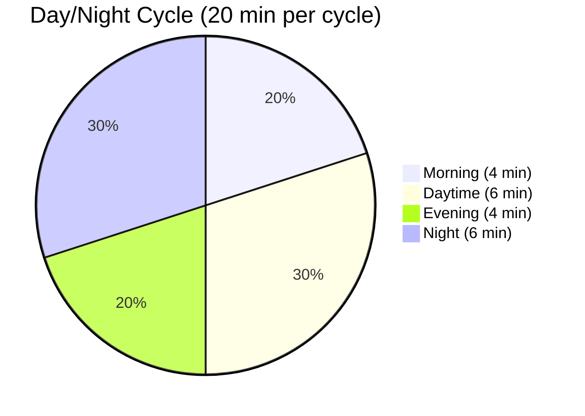
```mermaid
pie title Day/Night Cycle (20 min per cycle)
    "Morning (4 min)" : 4
    "Daytime (6 min)" : 6
    "Evening (4 min)" : 4
    "Night (6 min)" : 6
```

| Parameter      | Value                    |
| -------------- | ------------------------ |
| Full cycle     | 1200 s (20 minutes)      |
| Daytime length | 10 minutes (50%)         |
| Night length   | 10 minutes (50%)         |
| Initial time   | 0.25 (starts at morning) |
| Midnight angle | 90°                      |

### 1.2 Weather & Biomes

**Source:** `BiomeWeatherManager`

#### Global Weather Parameters

| Parameter               | Value             |
| ----------------------- | ----------------- |
| Weather change interval | 120 s (2 minutes) |
| Moonrain probability    | 15% (each night)  |
| Atmosphere transition   | 10 s              |
| Audio transition        | 5 s               |

#### Biome Definitions

| Biome | Name     | Radius | Priority |
| ----- | -------- | ------ | -------- |
| 0     | DESERT   | 426.5  | 50       |
| 1     | TROPICAL | 1296.0 | 0        |
| 2     | SWAMP    | 309.92 | 50       |

#### Weather Weights by Biome

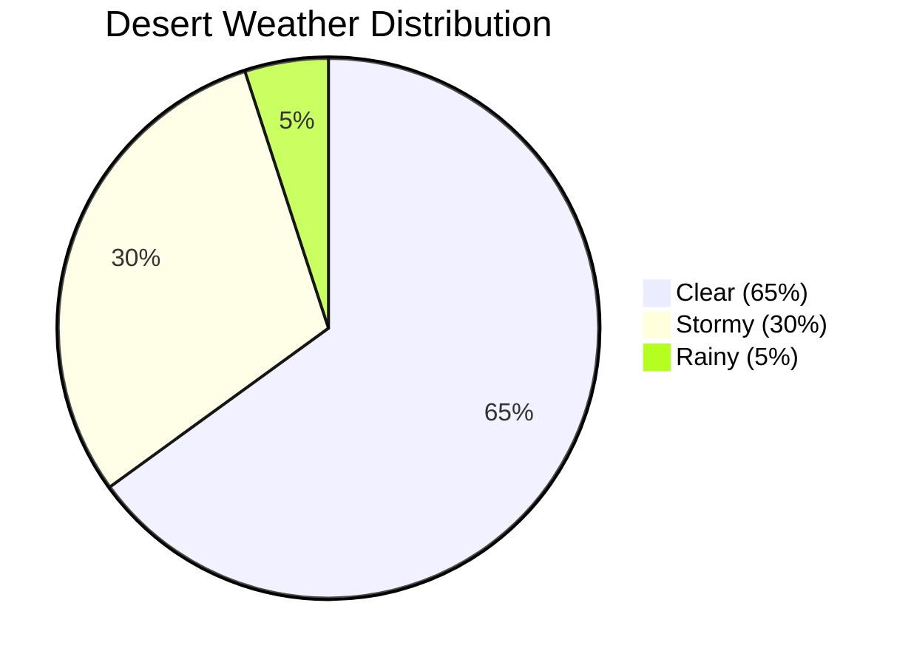
```mermaid
pie title Desert Weather Distribution
    "Clear (65%)" : 65
    "Stormy (30%)" : 30
    "Rainy (5%)" : 5
```

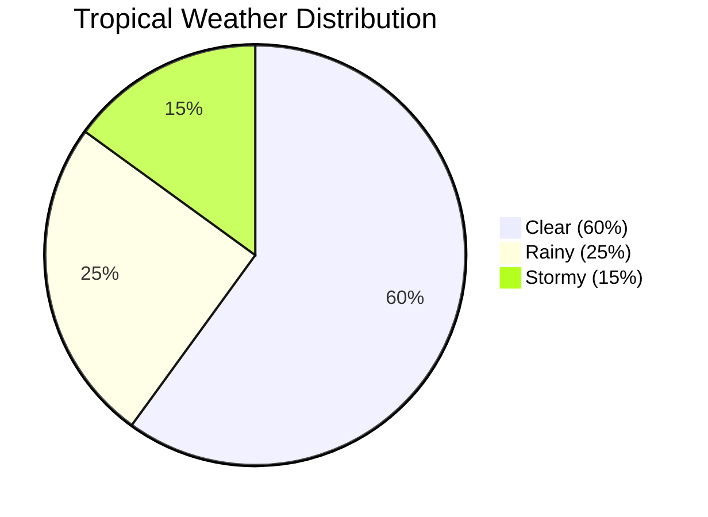
```mermaid
pie title Tropical Weather Distribution
    "Clear (60%)" : 60
    "Rainy (25%)" : 25
    "Stormy (15%)" : 15
```

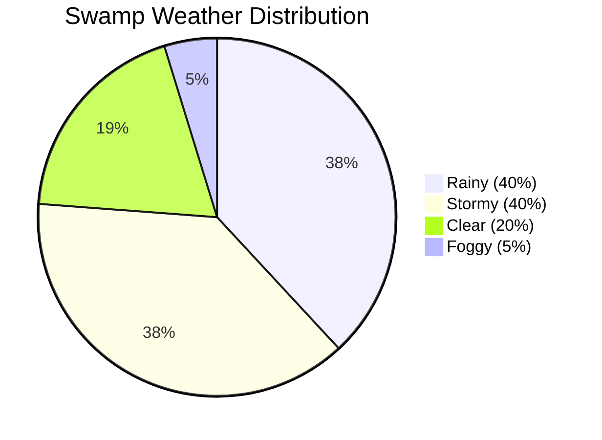
```mermaid
pie title Swamp Weather Distribution
    "Rainy (40%)" : 40
    "Stormy (40%)" : 40
    "Clear (20%)" : 20
    "Foggy (5%)" : 5
```

**Default weather** (outside biomes): Clear 50 / Stormy 25 / Rainy 25

### 1.3 Fishing Zones

**Source:** `ZoneManager` (11 zone instances)

#### Zone Hierarchy

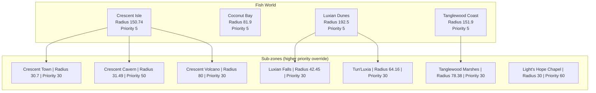
```mermaid
flowchart TD
    subgraph World["Fish World"]
        CI["Crescent Isle\nRadius 150.74\nPriority 5"]
        CB["Coconut Bay\nRadius 81.9\nPriority 5"]
        LD["Luxian Dunes\nRadius 192.5\nPriority 5"]
        SW["Tanglewood Coast\nRadius 151.9\nPriority 5"]
    end
    subgraph SubZones["Sub-zones (higher priority override)"]
        CT["Crescent Town | Radius 30.7 | Priority 30"]
        CC["Crescent Cavern | Radius 31.49 | Priority 50"]
        CV["Crescent Volcano | Radius 80 | Priority 30"]
        LF["Luxian Falls | Radius 42.45 | Priority 30"]
        TL["Tun'Luxia | Radius 64.16 | Priority 30"]
        TM["Tanglewood Marshes | Radius 78.38 | Priority 30"]
        CH["Light's Hope Chapel | Radius 30 | Priority 60"]
    end
    CI --> CT & CC & CV
    LD --> LF & TL
    SW --> TM
```

#### Zone Water Types

| Zone                        | Water Type              | Fish                  |
| --------------------------- | ----------------------- | --------------------- |
| Crescent Isle / Coconut Bay | Saltwater               | Salt fish + Universal |
| Crescent Cavern             | Freshwater              | Freshwater fish       |
| **Crescent Volcano**        | **Lava**                | **13 lava fish**      |
| Luxian Dunes / Falls        | Fresh + Salt            | Mixed fish            |
| **Tanglewood Marshes**      | **Swamp**               | **12 swamp fish**     |
| Light's Hope Chapel         | Indoor (hidden weather) | Special               |

---

## 2. Fish System

**Source:** `FishDatabase` (134 fish species)

### 2.1 Rarity & Spawn Probabilities

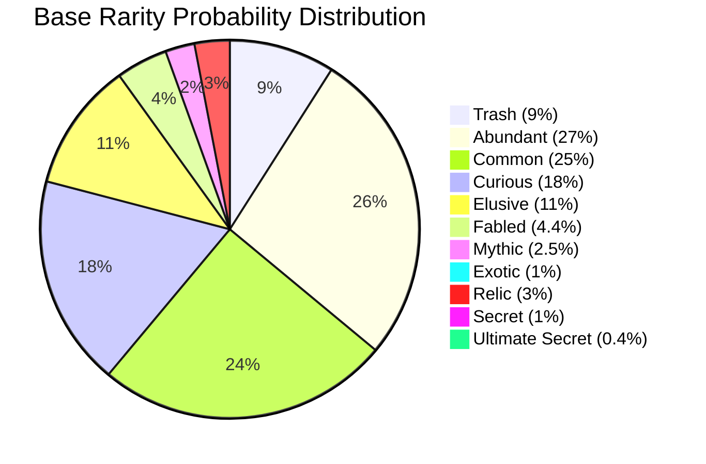
```mermaid
pie title Base Rarity Probability Distribution
    "Trash (9%)" : 9
    "Abundant (27%)" : 27
    "Common (25%)" : 25
    "Curious (18%)" : 18
    "Elusive (11%)" : 11
    "Fabled (4.4%)" : 4.4
    "Mythic (2.5%)" : 2.5
    "Exotic (1%)" : 1
    "Relic (3%)" : 3
    "Secret (1%)" : 1
    "Ultimate Secret (0.4%)" : 0.4
```

| Rarity          | Base Prob | Luck Power | Note                       |
| --------------- | --------- | ---------- | -------------------------- |
| Trash           | 9%        | −1.0       | Less common with more luck |
| Abundant        | 27%       | −0.8       | Most common tier           |
| Common          | 25%       | −0.1       |                            |
| Curious         | 18%       | +0.35      |                            |
| Elusive         | 11%       | +0.6       |                            |
| Fabled          | 4.4%      | +0.7       |                            |
| Mythic          | 2.5%      | +0.6       |                            |
| Exotic          | 1%        | +0.6       |                            |
| Relic           | 3%        | +0.1       | Drops enchantment relics   |
| Secret          | 1%        | +2.0       | Strongly luck-dependent    |
| Ultimate Secret | 0.4%      | +1.9       | Most luck-dependent tier   |

**Luck Power**: Positive = more likely with higher luck; Negative = less likely with higher luck. Uses **pure linear scaling** (no sigmoid).

> 📈 **Rarity Probability vs Luck Multiplier Curve** (X: luck multiplier 0~10×, Y: normalized probability)
>
> 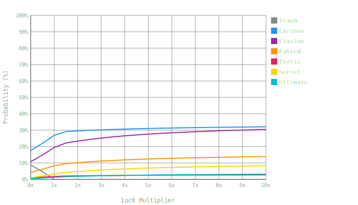

#### Rarity Selection Flow

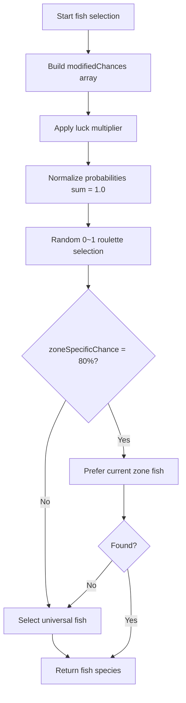
```mermaid
flowchart TD
    A[Start fish selection] --> B[Build modifiedChances array]
    B --> C[Apply luck multiplier]
    C --> D[Normalize probabilities sum = 1.0]
    D --> E[Random 0~1 roulette selection]
    E --> F{zoneSpecificChance = 80%?}
    F -->|Yes| G[Prefer current zone fish]
    F -->|No| H[Select universal fish]
    G --> I{Found?}
    I -->|No| H
    H --> J[Return fish species]
    I -->|Yes| J
```

### 2.2 Zone Priority & Spawn Conditions

- **Zone-specific chance = 80%** — 80% of the time, fish from the current zone are prioritized
- Selection order: Zone fish → Universal fish → Open-sea fish (fallback)

| Property                | Description              |
| ----------------------- | ------------------------ |
| `canSpawnInFreshwater`  | Can spawn in freshwater  |
| `canSpawnInSaltwater`   | Can spawn in saltwater   |
| `canSpawnInSwampwater`  | Can spawn in swamp water |
| `canSpawnInLava`        | Can spawn in lava        |
| `canSpawnInDay / Night` | Day/night restriction    |
| `allowedZoneIDs[]`      | Zone whitelist           |
| `forbiddenZoneIDs[]`    | Zone blacklist           |

### 2.3 Time/Weather Preferences (Value Bonus)

Each fish can have preferred time periods and weather; matching grants a **×2 value bonus**:

- Time: `prefersMorning`, `prefersDay`, `prefersEvening`, `prefersNight`
- Weather: `prefersClear`, `prefersRainy`, `prefersStormy`, `prefersFoggy`, `prefersMoonrain`, `prefersStarfog`, `prefersSkybloom`

### 2.4 Fish Modifier System

**Source:** `FishModifierManager`

#### Base Modifier Probabilities

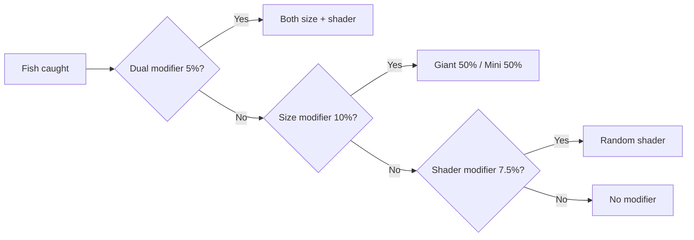
```mermaid
flowchart LR
    A[Fish caught] --> B{Dual modifier 5%?}
    B -->|Yes| C[Both size + shader]
    B -->|No| D{Size modifier 10%?}
    D -->|Yes| E[Giant 50% / Mini 50%]
    D -->|No| F{Shader modifier 7.5%?}
    F -->|Yes| G[Random shader]
    F -->|No| H[No modifier]
```

| Parameter       | Probability |
| --------------- | ----------- |
| Size modifier   | 10%         |
| Shader modifier | 7.5%        |
| Dual modifier   | 5%          |
| Giant vs Mini   | 50:50       |

#### Shader Value Multipliers

| ID  | Shader Name     | Value Mult |
| --- | --------------- | ---------- |
| 2   | Albino          | 1.5×       |
| 3   | Shiny           | 2.0×       |
| 4   | Golden          | 3.0×       |
| 5   | Ghastly         | 1.5×       |
| 6   | Blessed         | 3.0×       |
| 7   | Cursed          | 1.1×       |
| 8   | Radioactive     | 3.0×       |
| 9   | MissingShader   | 1.5×       |
| 10  | Sandy           | 1.2×       |
| 11  | **Holographic** | **5.0×**   |
| 12  | Burning         | 4.0×       |
| 13  | Rainbow         | 3.0×       |
| 14  | Stone           | 1.3×       |
| 15  | Zebra           | 1.3×       |
| 16  | Tiger           | 1.6×       |
| 17  | Camo            | 1.8×       |
| 18  | Electric        | 4.0×       |
| 19  | **Static**      | **5.0×**   |
| 20  | Void            | 2.0×       |
| 21  | Frozen          | 2.0×       |
| 22  | Shadow          | 2.0×       |
| 23  | Negative        | 1.5×       |
| 24  | Galaxy          | 3.0×       |

**Giant size** multiplier: 1.5×. Final value = size mult × shader mult (multiplicative stacking).

### 2.5 Rare & Special Fish Catalog

#### Ultimate Secret Fish (Rarity 10 — Highest Tier)

| Fish Name           | ID  | Diff | Price Range       | Max Weight | Water |
| ------------------- | --- | ---- | ----------------- | ---------- | ----- |
| **Catfish Emperor** | 125 | 5    | $38,500 ~ $49,500 | 750 kg     | All   |
| **Crab of Duality** | 134 | 5    | $31,500 ~ $40,500 | 350 kg     | All   |

#### Secret Fish (Rarity 9)

| Fish Name             | ID  | Price Range       | Max Weight | Water | Special      |
| --------------------- | --- | ----------------- | ---------- | ----- | ------------ |
| **Wabubu Fish**       | 74  | $13,995 ~ $17,460 | 2 kg       | All   | —            |
| **Steve**             | 116 | $13,995 ~ $17,460 | 3.5 kg     | All   | —            |
| **Ragtime Frog**      | 117 | $13,995 ~ $17,460 | 3.5 kg     | Swamp | Prefers rain |
| **Decimated Fih**     | 121 | $13,995 ~ $17,460 | 4 kg       | All   | —            |
| **Luxian Camelshark** | 128 | $17,105 ~ $21,340 | 9,000 kg   | Salt  | —            |

#### Exotic Fish (Rarity 7)

| Fish Name               | ID  | Price Range       | Max Weight | Water      | Special                  |
| ----------------------- | --- | ----------------- | ---------- | ---------- | ------------------------ |
| **Hellmaw Grouper**     | 68  | $7,868 ~ $11,735  | 2,000 kg   | **Lava**   | Most valuable lava fish  |
| **Abyssal Serpentfish** | 85  | $7,880 ~ $11,753  | 3,100 kg   | Salt+Swamp | **Night only**           |
| **Baby Megalodon**      | 86  | $9,587 ~ $14,300  | 120,000 kg | Salt       | Heaviest fish            |
| **Celestial Whitefin**  | 87  | $7,862 ~ $11,726  | 1,500 kg   | Salt       | —                        |
| **Shellonodon**         | 88  | $8,472 ~ $12,636  | 40,000 kg  | Salt       | —                        |
| **Spineback Ray**       | 89  | $7,914 ~ $11,804  | 6,000 kg   | Salt       | —                        |
| **Dreadshell Colossus** | 100 | $8,542 ~ $12,740  | 50,000 kg  | **Swamp**  | Most valuable swamp fish |
| **Dragonfly Fish**      | 126 | $7,845 ~ $11,701  | 70 kg      | Fresh      | —                        |
| **Royal Bananafish**    | 132 | $7,844 ~ $11,700  | 9 kg       | Fresh      | —                        |
| **Three-Headed Salmon** | 123 | $7,844 ~ $11,700  | 20 kg      | Salt       | —                        |

#### Fabled Fish (Rarity 6)

| Fish Name           | ID  | Price Range      | Max Weight | Water    | Special        |
| ------------------- | --- | ---------------- | ---------- | -------- | -------------- |
| Giant Squid         | 33  | $3,837 ~ $8,634  | 512 kg     | Salt     | —              |
| Great White Shark   | 40  | $4,378 ~ $9,851  | 1,457 kg   | Salt     | —              |
| Ancient Warriorfish | 119 | $3,600 ~ $8,100  | 10 kg      | Fresh    | —              |
| Venomous Watcher    | 120 | $3,600 ~ $8,100  | 10 kg      | Swamp    | **Night only** |
| Blind Bladefish     | 122 | $3,600 ~ $8,100  | 10 kg      | Fresh    | **Night only** |
| Armored Brutefish   | 124 | $3,628 ~ $8,162  | 60 kg      | Salt     | —              |
| Igneous Stingray    | 129 | $4,400 ~ $9,900  | 1,500 kg   | **Lava** | —              |
| Red Demonfish       | 130 | $3,767 ~ $8,475  | 400 kg     | **Lava** | —              |
| Red Dartfin         | 131 | $3,608 ~ $8,117  | 25 kg      | Salt     | —              |
| Humpback Gar        | 133 | $3,660 ~ $8,235  | 110 kg     | Salt     | —              |

#### Lava-Exclusive Fish (13 species)

Only catchable in the lava at **Crescent Volcano**:

| Fish Name           | ID  | Rarity | Max Price   | Max Weight |
| ------------------- | --- | ------ | ----------- | ---------- |
| Flame Guppy         | 67  | 1      | $21         | 0.3 kg     |
| Magma Carp          | 70  | 1      | $21         | 3 kg       |
| Ashscale Trout      | 63  | 2      | $32         | 6 kg       |
| Basalt Eel          | 64  | 2      | $30         | 3 kg       |
| Cinderfin           | 65  | 3      | $63         | 2 kg       |
| Obsidian Fish       | 72  | 3      | $65         | 2.5 kg     |
| Crystal Pike        | 66  | 4      | $166        | 10 kg      |
| Molten Angler       | 71  | 4      | $168        | 15 kg      |
| Ifrit Barracuda     | 69  | 5      | $1,776      | 25 kg      |
| Pyrite Snapper      | 73  | 5      | $1,792      | 20 kg      |
| Igneous Stingray    | 129 | 6      | $9,900      | 1,500 kg   |
| Red Demonfish       | 130 | 6      | $8,475      | 400 kg     |
| **Hellmaw Grouper** | 68  | **7**  | **$11,735** | 2,000 kg   |

#### Swamp-Exclusive Fish (12 species)

Only catchable in the **Tanglewood** region:

| Fish Name                 | ID  | Rarity | Max Price   | Max Weight | Special        |
| ------------------------- | --- | ------ | ----------- | ---------- | -------------- |
| Bluegill Sunfish          | 96  | 1      | $21         | 2 kg       | —              |
| Mudskipper                | 103 | 1      | $150        | 1 kg       | —              |
| Bowfin                    | 97  | 2      | $32         | 3 kg       | —              |
| Channel Catfish           | 98  | 2      | $34         | 10 kg      | —              |
| Cottonmouth Snake         | 99  | 3      | $64         | 3 kg       | —              |
| Frog                      | 101 | 3      | $63         | 1 kg       | —              |
| Alligator Snapping Turtle | 94  | 4      | $170        | 100 kg     | —              |
| Soft Shelled Turtle       | 104 | 4      | $150        | 15 kg      | —              |
| American Alligator        | 95  | 5      | $1,849      | 450 kg     | —              |
| Giant Gharial             | 102 | 5      | $1,942      | 100 kg     | —              |
| Venomous Watcher          | 120 | 6      | $8,100      | 10 kg      | **Night only** |
| **Dreadshell Colossus**   | 100 | **7**  | **$12,740** | 50,000 kg  | —              |

#### One-Time Catch & Quest Fish

| Fish Name              | ID  | catchOnce | rewardsQuestItem | Drop Weight      | Special Condition           |
| ---------------------- | --- | --------- | ---------------- | ---------------- | --------------------------- |
| Old Relic Piece        | 90  | ✗         | ✓                | **87** (highest) | All water                   |
| Mossy Relic            | 91  | ✗         | ✓                | 10               | All water                   |
| Powerful Relic         | 92  | ✗         | ✓                | 3                | All water                   |
| Godly Relic            | 93  | ✗         | ✓                | 1                | **Disabled**                |
| **Mysterious Red Gem** | 118 | **✓**     | ✓                | 10               | **Moonrain only**, one-time |

> Relic fish are rarity 8 and share a "relic fish" probability pool (base 3%). Old Relic Piece has drop weight 87 (87/101 ≈ 86%); Godly Relic is disabled. **Mysterious Red Gem** is the only fish requiring specific weather (Moonrain) and can only be caught once.

### 2.6 Top 10 Most Valuable Fish (Theoretical Max Sell Price)

Theoretical max = `max price × Giant(1.5×) × Holographic/Static(5.0×) × Weather/Time pref(2.0×)`

| Rank | Fish Name           | Base Max Price | Theoretical Max | Rarity |
| ---- | ------------------- | -------------- | --------------- | ------ |
| 1    | Catfish Emperor     | $49,500        | **$742,500**    | 10     |
| 2    | Crab of Duality     | $40,500        | **$607,500**    | 10     |
| 3    | Luxian Camelshark   | $21,340        | **$320,100**    | 9      |
| 4    | Wabubu Fish         | $17,460        | **$261,900**    | 9      |
| 5    | Steve               | $17,460        | **$261,900**    | 9      |
| 6    | Ragtime Frog        | $17,460        | **$261,900**    | 9      |
| 7    | Decimated Fih       | $17,460        | **$261,900**    | 9      |
| 8    | Baby Megalodon      | $14,300        | **$214,500**    | 7      |
| 9    | Dreadshell Colossus | $12,740        | **$191,100**    | 7      |
| 10   | Shellonodon         | $12,636        | **$189,540**    | 7      |

---

## 3. Fishing Mechanics

### 3.1 Bite Wait Time

**Source:** `RodController` (hash `6b9c3`) + `EquipmentStatsManager` (hash `1fbef`)

```text
Base wait = Random(13s, 17s)
Attraction % = Min(100, total attraction / 100) → range [0.0, 1.0]
Actual wait = (1.0 - attraction %) × base wait
```

| Attraction | Rate     | Wait Range        | Avg Wait |
| ---------- | -------- | ----------------- | -------- |
| 0          | 0%       | 13 ~ 17 s         | 15 s     |
| 50         | 50%      | 6.5 ~ 8.5 s       | 7.5 s    |
| 100        | 100%     | 0 ~ 0 s (instant) | 0 s      |
| 220        | 100% cap | 0 s (hard cap)    | 0 s      |

> **Attraction buff (potion) effect**: Multiplies raw attraction by ×2 before dividing by 100, hard cap 100%. Effective cap is 50 raw attraction (×2 = 100%).

> 📈 **Bite Wait Time vs Attraction Value** (blue band: max/min wait range, red line marks 100% cap)
>
> 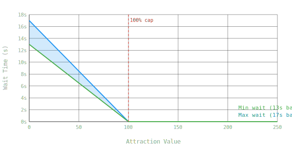

#### Detailed Attraction Rate Formula

```text
Raw total = rod.attraction + line.attraction + bobber.attraction + enchant.attraction + achievement.attraction

If attraction buff active:
    buffValue = 2.0 × rawTotal / 100.0
Else:
    buffValue = rawTotal (float)

percentage = Min(100.0, buffValue)
attractionMultiplier = Max(percentage / 100, 0.0)    → range [0.0, 1.0]
```

### 3.2 Fish Weight Distribution Curve

```text
effectiveMaxWeight = Min(playerMaxWeight, fishSpeciesMaxWeight)
randomValue = Random(0, 1)

If bigCatchRate > threshold:
    curveValue = Sin(randomValue × π/2)         ← sine curve, biased toward large fish
Else:
    normalizedRate = bigCatchRate / 100
    power = Lerp(normalizedRate, constantA, 1.0)
    curveValue = Pow(power, randomValue)          ← power curve distribution

fishWeight = Lerp(curveValue, effectiveMaxWeight, minWeight)
```

> Higher big-catch rate shifts the weight distribution toward max weight. At max big-catch rate, the sine curve dramatically increases large fish probability.

> 📈 **Fish Weight Distribution Curve** (X: random roll 0~100%, Y: fraction of max weight. Different big-catch rates shown)
>
> 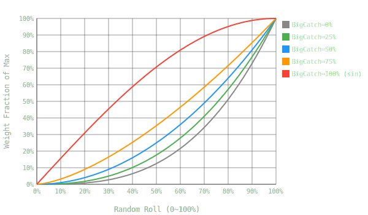

### 3.3 Minigame Difficulty Interpolation

**Source:** `FishingMinigameScript`

All parameters linearly interpolate between "easy (difficulty=0)" and "hard (difficulty=1)" based on the fish's difficulty value:

| Parameter           | Easy  | Hard   | Description                   |
| ------------------- | ----- | ------ | ----------------------------- |
| Target size         | 1.2   | 0.7    | Hit zone width                |
| Direction interval  | 0.5 s | 0.4 s  | Fish direction change freq    |
| Fish ease time      | 1.0 s | 0.19 s | Lower = more agile            |
| Catch speed         | 0.2/s | 0.06/s | Progress bar fill             |
| Lose speed          | 0.1/s | 0.15/s | Progress bar decay            |
| Max lose multiplier | 1×    | 3×     | Accelerates on prolonged miss |

- **Lose acceleration rate** = 0.1 (loss increases over time)

> 📈 **Minigame Difficulty Interpolation Curve** (X: fish difficulty 0=easy 1=hard, Y: parameter values)
>
> 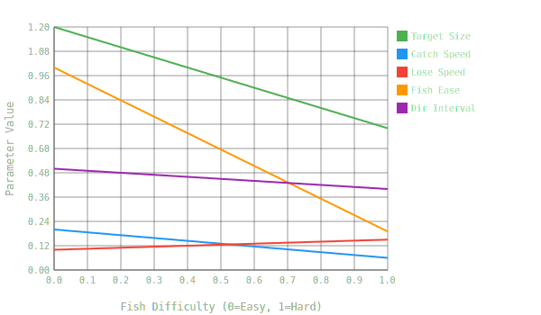

### 3.4 Physics & Controls

| Parameter           | Value |
| ------------------- | ----- |
| Gravity             | 1.25  |
| Player speed        | 3.75  |
| Fish target box     | 0.1   |
| Progress bar height | 2.8   |
| Ready time          | 1.0 s |

### 3.5 VR-Specific Adjustments & Low FPS Assist

| Parameter            | Value            |
| -------------------- | ---------------- |
| VR lose speed mult   | 1.0 (no penalty) |
| VR target size bonus | +0.04            |
| VR trigger threshold | 0.15             |

| Parameter        | Value    | Description              |
| ---------------- | -------- | ------------------------ |
| Trigger FPS      | < 30 FPS | Assist starts below this |
| Max benefit FPS  | 15 FPS   | Maximum assist value     |
| Max bonus        | +0.05    | Added to target size     |
| Fish speed floor | 0.95×    | Low FPS won't over-slow  |

### 3.6 Equipment Stat Effects on Minigame

**Strength** (reduces lose speed):

```text
loseSpeedMultiplier = Clamp(rawStrengthValue, 0.25, 1.0)
```

Higher strength = lower lose speed = easier minigame. Max reduction 75%.

**Expertise** (increases hit zone):

```text
hitZoneMultiplier = Max(expertiseMultiplier, 0.5)
```

Higher expertise = larger hit zone. Minimum floor 0.5× original size.

### 3.7 Beginner Protection

```text
If totalFishCaught < 20:
    Use tutorial mode (larger hit zone, slower fish, lower lose speed)
```

> The **first 20 fish** use tutorial difficulty parameters, then switch to normal. Cannot be retriggered.

### 3.8 Rod Parameters

| Parameter                   | Value   | Description            |
| --------------------------- | ------- | ---------------------- |
| Min bite wait               | 13 s    | `minBiteTime`          |
| Max bite wait               | 17 s    | `maxBiteTime`          |
| Activation cooldown         | 1 s     | Cast interval          |
| Pocket delay                | 1 s     | `pocketDelay`          |
| Max cast distance (display) | 40      | UI display max         |
| Extended distance           | 50      | Actual detection range |
| Splash pitch range          | 0.9~1.1 | Random pitch variation |

---

## 4. Equipment System

### 4.1 Unified Stat Multiplier Formula

All stats use the same normalization formula:

```text
multiplier = (rawTotal / 100.0) + 1.0
```

| Stat       | Raw Value Sources                           | Multiplier Range |
| ---------- | ------------------------------------------- | ---------------- |
| Luck       | Rod + Line + Bobber + Enchant + Achievement | 0.5× ~ 8.67×      |
| Strength   | Rod + Line + Bobber + Enchant               | 1.0× ~ 2.75×     |
| Expertise  | Rod + Line + Bobber + Enchant               | 1.0× ~ 2.65×     |
| Attraction | Rod + Line + Bobber + Enchant + Achievement | 0.0% ~ 100% cap  |
| Big Catch  | Rod + Line + Bobber + Enchant               | 1.0× ~ uncapped  |

### 4.2 Rods (17 types)

| ID  | Name               | Luck    | Str | Exp | Attr   | Big  | Max Weight     | Shop Price       |
| --- | ------------------ | ------- | --- | --- | ------ | ---- | -------------- | ---------------- |
| 0   | Wooden Stick       | −50     | 0   | 0   | 0      | −100 | 5 kg           | —                |
| 1   | Sturdy Wood Rod    | 15      | 0   | 5   | 20     | 0    | 30 kg          | 2,000            |
| 2   | Telescopic Rod     | 10      | 15  | 15  | 10     | 5    | 2,005 kg       | 15,000           |
| 3   | Darkwood Rod       | 30      | 10  | 10  | 30     | 5    | 1,800 kg       | 25,000           |
| 4   | **Rune Steel Rod** | **90**  | 25  | 20  | 30     | 40   | **100,000 kg** | —                |
| 5   | DEBUG Rod          | 0       | 0   | 0   | 0      | 0    | 1 kg           | Hidden           |
| 6   | Sunleaf Rod        | 10      | 5   | 10  | 20     | 15   | 250 kg         | —                |
| 7   | Speedy Rod         | 1       | 5   | 5   | **60** | 0    | 1,500 kg       | 55,000           |
| 8   | Lucky Rod          | **100** | 10  | 5   | 10     | 65   | 1,500 kg       | 75,000           |
| 9   | Toy Rod            | 0       | 0   | 0   | 0      | 0    | 15 kg          | 750              |
| 10  | Alien Rod          | 55      | 10  | 10  | 45     | 30   | 32,000 kg      | —                |
| 11  | Rod of Perpetuity  | 150     | 30  | 30  | 50     | 10   | 500,000 kg     | Level 500 unlock |
| 12  | Rod of the Pharaoh | **222** | 20  | 40  | −10    | 35   | 100,000 kg     | **750,000**      |
| 13  | Slender Rod        | 20      | 10  | 10  | 25     | 20   | 500 kg         | 10,000           |
| 14  | Polished Wood Rod  | 40      | 10  | 10  | 10     | 45   | 500 kg         | 15,000           |
| 15  | Rusty Fang Rod     | 70      | 20  | 20  | 25     | 35   | 35,000 kg      | 250,000          |

### 4.3 Lines (9 types)

| ID  | Name                   | Luck | Str    | Exp    | Attr   | Big | Shop Price |
| --- | ---------------------- | ---- | ------ | ------ | ------ | --- | ---------- |
| 0   | Basic Line             | 0    | 0      | 0      | 0      | 0   | —          |
| 1   | Carbon Fiber Line      | 0    | 7      | 7      | 0      | 0   | 1,000      |
| 2   | **Hair of a Fell God** | 0    | **50** | **50** | **50** | 0   | —          |
| 3   | Lucky Line             | 30   | 0      | 0      | 0      | 0   | 10,000     |
| 4   | Azure Line             | 0    | 0      | 0      | 5      | 0   | 100        |
| 5   | Cerberus Pelt          | 25   | −5     | −15    | 20     | 10  | —          |
| 6   | Heavy Line             | 0    | 10     | 10     | 0      | 10  | 4,000      |
| 7   | Diamond Line           | 25   | 15     | 15     | 10     | 0   | 25,000     |
| 8   | Seasoned Line          | 0    | 0      | 0      | 0      | 30  | 10,000     |

### 4.4 Bobbers (14 types)

| ID  | Name                     | Luck   | Str | Exp | Attr | Big | Shop Price |
| --- | ------------------------ | ------ | --- | --- | ---- | --- | ---------- |
| 0   | Basic Bobber             | 0      | 0   | 0   | 0    | 0   | —          |
| 1   | Blue Bobber              | 5      | 0   | 0   | 0    | 0   | 100        |
| 2   | Cat Bobber               | 5      | 0   | 0   | 0    | 10  | 2,000      |
| 3   | **Lucky Bobber**         | **40** | 0   | 0   | 0    | 0   | 10,000     |
| 7   | DEBUG Bobber             | 0      | 50  | 50  | 50   | 50  | Hidden     |
| 12  | Ornamental Bobber        | 10     | 5   | 0   | 10   | 0   | 10,000     |
| 13  | **Rainbow Slime Bobber** | **30** | 10  | 0   | 10   | 10  | —          |

### 4.5 Special Shop Items

| Item Name              | Price   | Type       | Note                                    |
| ---------------------- | ------- | ---------- | --------------------------------------- |
| Mysterious Alien Juice | 200,000 | Quest item | **Disappears from shop after purchase** |
| Mysterious Blue Gem    | 50,000  | Quest item | **Disappears from shop after purchase** |

---

## 5. Enchantment System

**Source:** `EnchantmentDatabase` (42 enchantments)

### 5.1 Relic Quality → Enchantment Rarity Probabilities

| Relic Quality   | Common | Rare  | Epic  | Legendary | Mythic   |
| --------------- | ------ | ----- | ----- | --------- | -------- |
| Common Relic    | 75.3%  | 18.1% | 5.0%  | 1.5%      | **0.1%** |
| Rare Relic      | 20.8%  | 52.6% | 20.8% | 5.2%      | 0.7%     |
| Epic Relic      | 2.3%   | 22.2% | 62.2% | 11.1%     | 2.2%     |
| Legendary Relic | 5.6%   | 16.7% | 33.3% | 38.9%     | **5.6%** |

### 5.2 Complete Enchantment Data

#### Legendary Enchantments (Rarity 4 — Extremely Rare)

| ID  | Name                         | Luck    | Str    | Exp    | Attr    | Big | Max Weight     | Special Effect |
| --- | ---------------------------- | ------- | ------ | ------ | ------- | --- | -------------- | -------------- |
| 7   | **God's Own Luck**           | **250** | —      | —      | —       | —   | —              | Passive luck   |
| 38  | **Strongest Angler**         | 20      | **85** | **85** | 10      | 20  | **+1,000,000** | —              |
| 30  | **Messenger of the Heavens** | —       | —      | —      | **100** | —   | —              | —              |

#### Epic Enchantments (Rarity 3)

| ID  | Name               | Luck    | Str | Exp | Attr   | Big    | Max Weight | Special Effect         |
| --- | ------------------ | ------- | --- | --- | ------ | ------ | ---------- | ---------------------- |
| 2   | Shiny Hunter       | 80      | —   | —   | —      | —      | —          | +20% shiny shader prob |
| 6   | **Money Maker**    | —       | —   | —   | —      | 20     | —          | **+20% sell price**    |
| 9   | Mutator            | 30      | —   | —   | —      | —      | —          | **Modifier prob ×2**   |
| 10  | BIG BOYS ONLY      | —       | —   | —   | —      | **65** | +100,000   | —                      |
| 11  | Master of Balance  | 20      | 20  | 20  | 20     | 20     | +400       | —                      |
| 17  | **Double Up!!**    | 20      | —   | —   | —      | —      | —          | **25% double catch**   |
| 24  | Luck of the Chosen | **100** | —   | —   | —      | 10     | —          | —                      |
| 34  | **Speed Demon**    | —       | —   | —   | **60** | —      | —          | Speed demon bonus      |
| 39  | Son of Kriptan     | 50      | 10  | 10  | 50     | 50     | +50,000    | Daytime only           |

#### Rare Enchantments (Rarity 2)

| ID  | Name                  | Luck    | Str | Exp | Attr    | Big | Max Weight | Special Effect            |
| --- | --------------------- | ------- | --- | --- | ------- | --- | ---------- | ------------------------- |
| 1   | Mouth-Watering        | —       | —   | —   | 25      | 30  | —          | —                         |
| 4   | **Enlightened**       | —       | —   | 10  | —       | —   | —          | **+35% XP bonus**         |
| 5   | Demon Hunter          | —       | 10  | —   | —       | —   | —          | +15 speed demon bonus     |
| 8   | **Dimensional Line**  | —       | —   | 10  | —       | —   | —          | **30% ignore zone**       |
| 12  | All-Rounder           | 10      | 10  | 10  | 10      | 10  | +100       | —                         |
| 18  | Light-Speed Reels     | —       | —   | —   | **40**  | —   | —          | —                         |
| 25  | Patient               | **100** | —   | —   | **−40** | —   | —          | Trade attraction for luck |
| 37  | Notoriously Big       | —       | —   | —   | —       | 10  | +50,000    | —                         |
| 41  | Luck Sacrifice        | **−60** | —   | —   | **60**  | —   | —          | Trade luck for attraction |
| 42  | **The Night Watcher** | 30      | 10  | 10  | 30      | 30  | +25,000    | Night only                |

#### Common Enchantments (Rarity 1)

| ID  | Name          | Key Stats               | Special Effect    |
| --- | ------------- | ----------------------- | ----------------- |
| 3   | Power Grip    | Str 15 / Exp 15         | —                 |
| 13  | Rain Lover    | Luck 50                 | Active in rain    |
| 14  | Fog Dweller   | Luck 50                 | Active in fog     |
| 15  | Day Walker    | Luck 50                 | Active in daytime |
| 16  | Night Stalker | Attr 35                 | Active at night   |
| 26  | Impatient     | Attr 30 / Luck −30      | —                 |
| 28  | Student       | Exp 5                   | +12% XP           |
| 31  | Undecided     | All stats +5            | —                 |
| 32  | Unstable      | Luck 10/Str −10/Exp −10 | Modifier ×1.5     |
| 36  | Tubby Chaser  | Big 5                   | +1,000 weight     |

#### Basic Enchantments (Rarity 0)

| ID  | Name            | Key Stats                   | Special Effect     |
| --- | --------------- | --------------------------- | ------------------ |
| 19  | Big Catch Boost | Big 10                      | —                  |
| 20  | Speedy          | Attr 10                     | —                  |
| 21  | Expert          | Exp 10                      | —                  |
| 22  | Powerful        | Str 10                      | —                  |
| 23  | Lucky           | Luck 15                     | —                  |
| 27  | Trash Wrangler  | Attr 20 / Luck **−100**     | Lots of trash fish |
| 29  | Curious         | Exp 5                       | +5% XP             |
| 33  | Pocket Watcher  | —                           | **+5% sell price** |
| 35  | Reinforced      | —                           | +400 weight        |
| 40  | Lazy            | Exp 75/Attr **−75**/Luck 10 | No stamina cost    |

### 5.3 Special Effect Trigger Mechanics

| Special Effect   | Trigger Method                              | Parameter             |
| ---------------- | ------------------------------------------- | --------------------- |
| Double Hook      | Each catch rolls `Random(0,1) < prob`       | Prob = 25%            |
| Mutator          | Multiplies base modifier detection prob     | Mult = 2.0×           |
| Dimensional Line | Each cast `Random(0,1) < prob` ignores zone | Prob = 30%            |
| Money Maker      | On sell: `price × (1 + pct/100)`            | Pct = 20%             |
| Pocket Watcher   | On sell: `price × (1 + pct/100)`            | Pct = 5%              |
| Enlightened      | On XP gain: `XP × (1 + pct/100)`            | Pct = 35%             |
| Student          | On XP gain: `XP × (1 + pct/100)`            | Pct = 12%             |
| Curious          | On XP gain: `XP × (1 + pct/100)`            | Pct = 5%              |
| Demon Hunter     | Forces shader = demon shader                | +15 speed demon bonus |
| Shiny Hunter     | Forces shader = shiny shader                | +20% shiny prob       |
| Passive Luck     | Permanently added to luck total             | +250 luck             |
| Speed Demon      | Increases attraction stat                   | +60 attraction        |

### 5.4 Sea Event & Enchantment Stacking

```text
Final modifier prob = sea event modifier mult × enchant modifier mult × base modifier prob
Final luck = sea event luck mult × equipment luck mult × buff mult
Forced shader prob = sea event force chance (85%)
```

| Sea Event Parameter                | Description              |
| ---------------------------------- | ------------------------ |
| `seaEventLuckMultiplier`           | Multiplies combined luck |
| `seaEventModifierChanceMultiplier` | Multiplies modifier prob |
| `seaEventForcedShaderModifier`     | Specifies forced shader  |
| `seaEventForceChance`              | Forced shader apply prob |

---

## 6. Buff System

**Source:** `BuffManager`

### 6.1 Buff Types

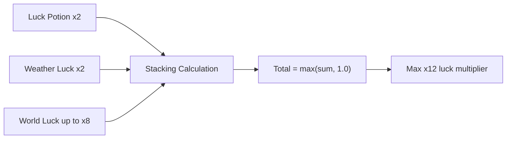
```mermaid
flowchart LR
    A["Luck Potion x2"] --> D["Stacking Calculation"]
    B["Weather Luck x2"] --> D
    C["World Luck up to x8"] --> D
    D --> E["Total = max(sum, 1.0)"]
    E --> F["Max x12 luck multiplier"]
```

| Buff                   | Multiplier       | Duration       | Stacking    |
| ---------------------- | ---------------- | -------------- | ----------- |
| Luck Potion (personal) | 2.0×             | Cumulative     | Time stacks |
| Attraction Buff        | 2.0× (halves CD) | Cumulative     | Time stacks |
| Weather Luck           | 2.0×             | Weather period | Automatic   |

### 6.2 World Luck Buff (Server-Wide, Purchasable)

| Tier | Duration   | Luck Mult |
| ---- | ---------- | --------- |
| T1   | 30 minutes | 2.0×      |
| T2   | 45 minutes | 4.0×      |
| T3   | 90 minutes | 8.0×      |

- Remaining time converts at 50% loss when upgrading
- Purchased via VRC economy system
- Server-wide broadcast sync

### 6.3 Final Combined Luck Formula

```text
Equipment luck = (rod.luck + line.luck + bobber.luck + enchant.luck + achievement.luck) / 100 + 1.0
Pet luck = (petLuckLevel) / 100 + 1.0
buffMultiplier = potionMult(2.0) + worldLuckMult(2/4/8) + weatherLuckMult(2.0)

Final luck = equipment luck × buffMultiplier
Theoretical max = 2 + 8 + 2 = 12× luck
```

> **Note**: Luck power (luckPower) is used to adjust rarity probability distribution. The actual implementation is **purely linear** — no sigmoid smoothing curve.

---

## 7. Sea Events

**Source:** `SeaEventSpawner` + sea event entries

### 7.1 Spawn Parameters

| Parameter              | Value              |
| ---------------------- | ------------------ |
| Max simultaneous       | 2                  |
| Event duration         | 600 s (10 minutes) |
| Event radius           | 15                 |
| Spawn point count      | 6                  |
| Per-point spawn radius | 136.24             |

### 7.2 Event List

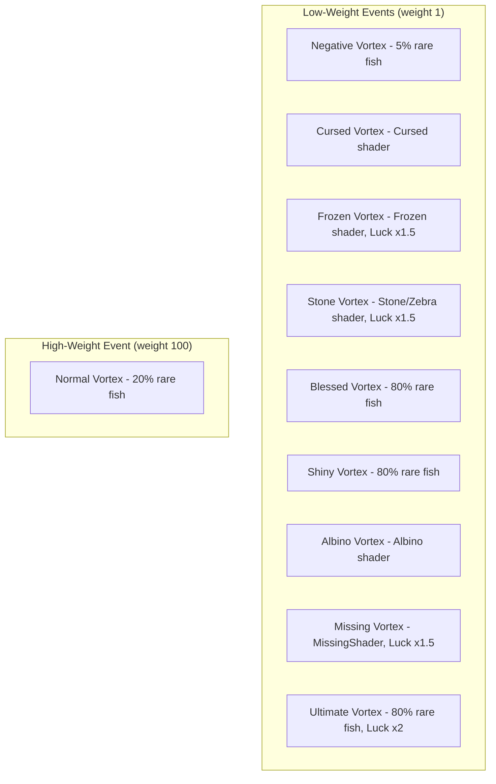
```mermaid
flowchart TD
    subgraph LowWeight["Low-Weight Events (weight 1)"]
        E0["Negative Vortex - 5% rare fish"]
        E1["Cursed Vortex - Cursed shader"]
        E2["Frozen Vortex - Frozen shader, Luck x1.5"]
        E3["Stone Vortex - Stone/Zebra shader, Luck x1.5"]
        E4["Blessed Vortex - 80% rare fish"]
        E5["Shiny Vortex - 80% rare fish"]
        E6["Albino Vortex - Albino shader"]
        E7["Missing Vortex - MissingShader, Luck x1.5"]
        E8["Ultimate Vortex - 80% rare fish, Luck x2"]
    end
    subgraph HighWeight["High-Weight Event (weight 100)"]
        E9["Normal Vortex - 20% rare fish"]
    end
```

**Low-weight events (9 types)**: Weight 1 each, specific shader gives 2× modifier probability, 85% chance to get the designated shader. 3 of them provide 80% rare fish probability.
**High-weight event (1 type)**: Weight 100, no special shader bonus, 20% rare fish probability. This event triggers in the vast majority of cases.

---

## 8. Boat System

**Source:** Boat entries + `BoatController`

### 8.1 Boat Data

| ID  | Name                 | Price         | Speed  | Accel | Turn | Boost      |
| --- | -------------------- | ------------- | ------ | ----- | ---- | ---------- |
| 0   | Surfboard            | 800           | 5      | 2     | 70   | None       |
| 1   | Rowboat              | 3,000         | 5      | 2     | 50   | None       |
| 2   | Dingy                | 30,000        | 10     | 4     | 65   | None       |
| 3   | **Luxury Speedboat** | **1,000,000** | **25** | 5     | 65   | 2.0×/8s CD |
| 4   | Small Yacht          | 200,000       | 20     | 3     | 55   | 1.2×       |
| 5   | Hobbyist Boat        | 15,000        | 8      | 3     | 80   | None       |
| 6   | Canoe                | 2,000         | 5      | 2     | 50   | None       |

**Boat physics**: Water surface height 11.9, buoyancy amplitude 0.06, buoyancy speed 1.0

### 8.2 Boat Skins

**Source:** `BoatSkinDatabase` (33 skins)

#### Surfboard Skins (Boat ID: 0)

| Skin Name         | Price | Special                      |
| ----------------- | ----- | ---------------------------- |
| Default Surfboard | Free  | Default                      |
| Sunset Surfboard  | 500   | —                            |
| Sakura Surfboard  | 750   | —                            |
| Nice Rice Board   | 750   | —                            |
| Prism SurfBoard   | 500   | **Disabled/Not purchasable** |

#### Rowboat Skins (Boat ID: 1)

| Skin Name         | Price | Special                      |
| ----------------- | ----- | ---------------------------- |
| Default Skin      | Free  | Default                      |
| Lifeguard Rowboat | 750   | —                            |
| Gloomy Rowboat    | 750   | —                            |
| Luxury Rowboat    | 1,000 | —                            |
| Prism Rowboat     | 1     | **Disabled/Not purchasable** |

#### Dingy Skins (Boat ID: 2)

| Skin Name          | Price |
| ------------------ | ----- |
| Default Skin       | 500   |
| Aquatic Camo Dingy | 1,250 |
| Pink Tribal Dingy  | 5,000 |
| Speedboat Dingy    | 2,000 |

#### Luxury Speedboat Skins (Boat ID: 3)

| Skin Name                     | Price         | Special             |
| ----------------------------- | ------------- | ------------------- |
| Default Skin                  | Free          | Default             |
| Deep Blue Skin                | 20,000        | —                   |
| Gold and Blue                 | 25,000        | —                   |
| Crusader Skin                 | 35,000        | —                   |
| Purple Menace Skin            | 35,000        | —                   |
| Prism Luxury Speedboat        | 5             | **Disabled**        |
| **Prism Luxury Speedboat v2** | **1,000,000** | Most expensive skin |

#### Small Yacht Skins (Boat ID: 4)

| Skin Name       | Price       |
| --------------- | ----------- |
| Clean (default) | 500         |
| Glacial         | 2,500       |
| Bubblegum Pink  | 5,000       |
| Hot Reels       | 5,000       |
| Fundido         | 8,000       |
| **24K**         | **100,000** |

#### Hobbyist Boat Skins (Boat ID: 5)

| Skin Name          | Price |
| ------------------ | ----- |
| Default Skin       | 500   |
| Stealth Skin       | 1,000 |
| Purple Dragon Skin | 2,500 |
| Red Temple Skin    | 3,000 |

#### Canoe Skins (Boat ID: 6)

| Skin Name        | Price | Special                      |
| ---------------- | ----- | ---------------------------- |
| Default Skin     | Free  | Default                      |
| Beta Tester Skin | 750   | **Disabled/Not purchasable** |

---

## 9. Pet System

**Source:** `PetStats` + `AFKPet` + `PetDatabase`

### 9.1 Pet List

| ID  | Pet Name                 | Rarity            | Default Unlock | Acquisition              |
| --- | ------------------------ | ----------------- | -------------- | ------------------------ |
| 0   | Basic Pet                | 0 (Common)        | ✗              | Unknown                  |
| 1   | **Fishing Frog**         | 0 (Common)        | **✓**          | Default owned            |
| 2   | **Bucket Capybara**      | 1 (Rare)          | ✗              | Daily login Week 1 Day 7 |
| 3   | Fishing Frog Nitro       | 0 (Common)        | ✗              | Discord Nitro reward     |
| 4   | **Lucky Cat (Patreon)**  | **4 (Legendary)** | ✗              | Patreon exclusive        |
| 5   | **Engineer Frog (Beta)** | 3 (Epic)          | ✗              | Beta tester reward       |

### 9.2 Base Parameters & Upgrade System

| Parameter             | Base Value         |
| --------------------- | ------------------ |
| Base fishing interval | 600 s (10 minutes) |
| Base capacity         | 5 fish             |
| Base max weight       | 10 kg              |
| Can catch modifiers   | No                 |

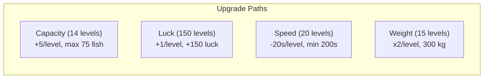
```mermaid
flowchart LR
    subgraph PetUpgrades["Upgrade Paths"]
        A["Capacity (14 levels)\n+5/level, max 75 fish"]
        B["Luck (150 levels)\n+1/level, +150 luck"]
        C["Speed (20 levels)\n-20s/level, min 200s"]
        D["Weight (15 levels)\nx2/level, 300 kg"]
    end
```

| Upgrade    | Max Level | Per Level     | Max Effect        |
| ---------- | --------- | ------------- | ----------------- |
| Capacity   | 14        | +5 fish/lvl   | Total 75 fish     |
| Luck       | 150       | +1/lvl        | +150 luck         |
| Speed      | 20        | −20 s/lvl     | Min 200s interval |
| Max Weight | 15        | ×2 weight/lvl | 300 kg            |

### 9.3 Upgrade Cost Analysis

| Upgrade  | Lv1 → Max       | Total Points | Max Effect                       |
| -------- | --------------- | ------------ | -------------------------------- |
| Capacity | 5 → 75 fish     | 14 pts       | 15× base capacity                |
| Luck     | 0 → +150        | 150 pts      | Equivalent to 75% of Pharaoh Rod |
| Speed    | 600s → 200s     | 20 pts       | 3× fishing frequency             |
| Weight   | 10 → 327,680 kg | 15 pts       | 2^15 × 10 kg                     |

> **Max-level pet theoretical output**: 75 fish × (3600/200) = **up to 1,350 fish per hour** (if capacity allows and continuous AFK)

> 📈 **Pet Upgrade Effect Curve** (each stat's upgrade progress vs effect percentage; note different max levels)
>
> 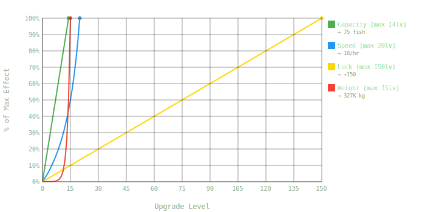

### 9.4 AFK Pet Behavior

| Parameter              | Value |
| ---------------------- | ----- |
| Wander radius          | 0.3   |
| Wander speed           | 0.5   |
| Float amplitude        | 0.1   |
| Animation cull dist    | 25    |
| DEBUG fishing interval | 5 s   |

---

## 10. Player Progression

### 10.1 Level & Experience

**Source:** `PlayerStatsManager` (hash `2baf2`)

| Parameter          | Value        |
| ------------------ | ------------ |
| Level cap          | 1000         |
| XP threshold array | 1001 entries |
| Level-up VFX range | 20 units     |
| XP bar anim speed  | 0.2          |
| Save interval      | 3600 s       |

Uses **binary search** on cumulative XP threshold array to find current level:

```text
Current level start XP = GetTotalXPForLevel(currentLevel)
Required XP = GetXPRequiredForLevel(currentLevel)
XP in level = totalXP − startXP
Progress = Clamp01(XP in level / required XP)
```

### 10.2 Complete XP Threshold Data

#### Early Level XP Requirements (Levels 1-10 exact values)

| Level | 1   | 2   | 3   | 4   | 5   | 6   | 7   | 8   | 9   | 10  |
| ----- | --- | --- | --- | --- | --- | --- | --- | --- | --- | --- |
| XP    | 120 | 140 | 160 | 185 | 210 | 240 | 270 | 305 | 340 | 400 |

#### Segmented XP Thresholds

| Level Range | XP Per Level | Note          |
| ----------- | ------------ | ------------- |
| 1 ~ 10      | 120 ~ 400    | Unique lookup |
| 11 ~ 49     | **650**      | Fixed         |
| 50 ~ 499    | **1,000**    | Fixed         |
| 500 ~ 899   | **2,000**    | Fixed         |
| 900 ~ 1,000 | **4,000**    | Highest fixed |

#### Cumulative XP Milestones

| Level | Cumulative XP | XP at that Level |
| ----- | ------------- | ---------------- |
| 10    | 1,970         | 400              |
| 20    | 8,220         | 650              |
| 50    | 27,720        | 1,000            |
| 100   | 77,720        | 1,000            |
| 200   | 177,720       | 1,000            |
| 500   | 477,720       | 2,000            |
| 1000  | **1,677,720** | 4,000            |

> **Max level (Lv1000) requires 1,677,720 total XP**. At ~40 XP per Ultimate Secret fish, that's roughly 41,943 Ultimate Secret fish.

> 📈 **XP Threshold Curve** (X: level 0~1000, Y: cumulative XP. Red dashed lines mark stage boundaries)
>
> 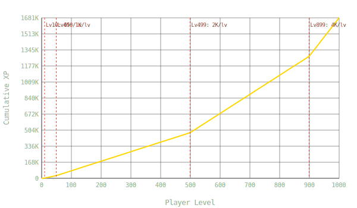

### 10.3 XP Rewards by Rarity

| Rarity          | XP per Fish |
| --------------- | ----------- |
| Trash           | 10          |
| Abundant        | 15          |
| Common          | 15          |
| Curious         | 20          |
| Elusive         | 20          |
| Relic           | 20          |
| Fabled          | 25          |
| Mythic          | 25          |
| Exotic          | 30          |
| Secret          | 35          |
| Ultimate Secret | 40          |

### 10.4 Tracked Statistics (all network-synced)

- `level` — Current level
- `xp` — Cumulative experience
- `money` — Current currency
- `fishCaught` — Total fish caught
- `rareFishCaught` — Rare fish caught count
- `fishSold` — Total fish sold
- `timePlayed` — Play time (seconds)
- `bountiesCompleted` — Bounties completed

### 10.5 Titles & Achievement System

**Source:** `AchievementSystem` (34 titles/achievements)

#### Level Milestone Titles

| Title                 | Requirement    | Luck Bonus | XP Bonus | Gold Bonus |
| --------------------- | -------------- | ---------- | -------- | ---------- |
| Excited!              | Level 10       | 0          | 0        | 0          |
| Expert                | Level 50       | 0          | 0        | 0          |
| Aura Farmer           | Level 100      | 0          | 0        | 0          |
| Fish Fear Me          | Level 200      | 0          | 0        | 0          |
| Straw Hat Pirate!     | Level 500      | 0          | 0        | 0          |
| **God of the Waters** | **Level 1000** | 0          | 0        | 0          |

#### Fishing Milestone Titles

| Title               | Requirement       | XP Bonus     |
| ------------------- | ----------------- | ------------ |
| Apprentice Angler   | 10 fish caught    | 100 XP       |
| Seasoned Angler     | 100 fish caught   | 400 XP       |
| Master Angler       | 500 fish caught   | 800 XP       |
| Ascendant Angler    | 2,000 fish caught | 1,600 XP     |
| Transcendent Angler | 5,000 fish caught | 1,600 XP     |
| **Divine Angler**   | **10,000 fish**   | **1,600 XP** |

#### Selling Milestone Titles

| Title               | Requirement      | Gold Bonus | XP Bonus |
| ------------------- | ---------------- | ---------- | -------- |
| Salesman            | 10 fish sold     | 25         | 25 XP    |
| Sunleaf Affiliate   | 100 fish sold    | 1,000      | 1,000 XP |
| Business Man        | 1,000 fish sold  | 0          | 0        |
| Sunleaf Shareholder | 3,000 fish sold  | 0          | 0        |
| CEO                 | 10,000 fish sold | 0          | 0        |

#### Zone Codex Completion Titles

Completing each zone's fish codex grants a **+15 luck** bonus!

| Title                       | Zone             | Luck Bonus | Gold | XP    |
| --------------------------- | ---------------- | ---------- | ---- | ----- |
| Anubis' Disciple            | Luxian Dunes     | **+15**    | 100  | 50 XP |
| Nuts for Coconuts!          | Coconut Bay      | **+15**    | 100  | 50 XP |
| Ghostbuster                 | Tanglewood       | **+15**    | 100  | 50 XP |
| Patriotic Researcher        | Crescent Isle    | **+15**    | 100  | 50 XP |
| Through the Fire and Flames | Crescent Volcano | **+15**    | 100  | 50 XP |

> **Total**: Completing all 5 zone codexes grants **+75 permanent luck** — one of the most important hidden luck sources in the game.

#### Special Titles

| Title               | Condition                | Reward     | Hidden | Discord Exclusive |
| ------------------- | ------------------------ | ---------- | ------ | ----------------- |
| Bounty Hunter       | Complete 50 bounties     | 5,000 gold | ✗      | ✗                 |
| Honorary Glorpingus | Help Glorpingo find wife | 300 XP     | ✗      | ✓                 |
| Pastrami Enjoyer    | Help Celly find keys     | 300 XP     | ✗      | ✓                 |
| Shield Hero         | Gain Joeblo's approval   | 300 XP     | ✗      | ✓                 |
| Archaeologist       | Help Harrison            | 0          | ✗      | ✓                 |
| Beta Tester         | BETA_PLAYER flag         | 0          | **✓**  | ✗                 |
| Early Supporter     | Early supporter flag     | 0          | **✓**  | ✗                 |
| Supporter           | Supporter flag           | 0          | **✓**  | ✗                 |
| Nitro Booster       | Discord Nitro            | 0          | **✓**  | ✓                 |
| Nitro Addict        | Discord Nitro            | 0          | **✓**  | ✓                 |
| Patreon Baller      | Patreon support          | 0          | **✓**  | ✓                 |
| Patreon Supporter   | Patreon support          | 0          | **✓**  | ✓                 |

---

## 11. Economy

### 11.1 Fish Price Formula

```text
weightFactor = InverseLerp(weight, maxWeight, minWeight)
basePrice = Lerp(weightFactor, maxPrice, minPrice)
finalValue = basePrice × sizeModifier × shaderModifier
```

### 11.2 Value Multiplier Stacking

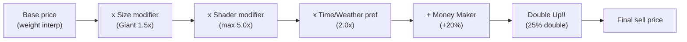
```mermaid
flowchart LR
    A["Base price\n(weight interp)"] --> B["x Size modifier\n(Giant 1.5x)"]
    B --> C["x Shader modifier\n(max 5.0x)"]
    C --> D["x Time/Weather pref\n(2.0x)"]
    D --> E["+ Money Maker\n(+20%)"]
    E --> F["Double Up!!\n(25% double)"]
    F --> G["Final sell price"]
```

**Theoretical maximum value multiplier**:

- Holographic/Static shader: 5.0×
- Giant size: 1.5×
- Time/Weather preference: 2.0×
- **Combined: up to 15× base price** (enchantment bonuses are additive on top)

### 11.3 Daily Rewards

**Source:** `DailyRewardDatabase`

#### Days 1-6 (Weekly)

| Day   | Type     | Reward          |
| ----- | -------- | --------------- |
| Day 1 | Currency | 250 gold        |
| Day 2 | Item     | 2× Luck Potion  |
| Day 3 | Currency | 500 gold        |
| Day 4 | Item     | 2× Relics       |
| Day 5 | Currency | 5,000 gold      |
| Day 6 | Item     | 2× Speed Potion |

#### Day 7 (Weekly Rotation)

| Week   | Reward                    |
| ------ | ------------------------- |
| Week 1 | Bucket Capybara (pet)     |
| Week 2 | Crusader Speedboat (boat) |
| Week 3 | New skin                  |
| Week 4 | New skin                  |
| Week 5 | New skin                  |
| Week 6 | New skin                  |

**Fallback reward** (after all unique rewards claimed): 15 extra fragments + 750 gold

### 11.4 Bounty System

**Source:** `BountyManager` (hash `60b1a`)

| Parameter        | Value               | Description                          |
| ---------------- | ------------------- | ------------------------------------ |
| Daily bounties   | **5**               | 5 bounties per day                   |
| Normal reward    | **1,000 gold**      | First 4 bounties                     |
| Final reward     | **3× Relic Pieces** | 5th bounty (Old Relic Piece)         |
| XP per bounty    | 1 XP                | Each submission                      |
| Blacklisted zone | Crescent_Volcano    | Volcano fish excluded from selection |

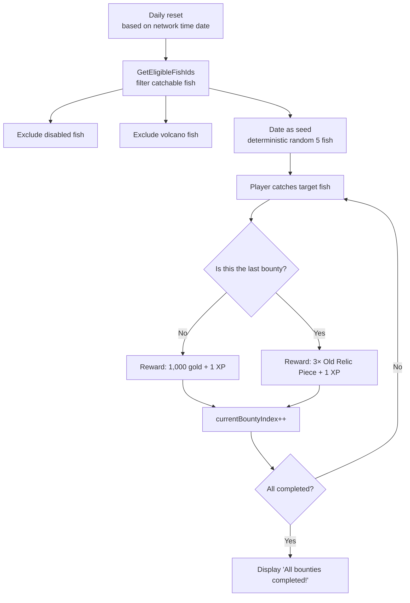
```mermaid
flowchart TD
    A["Daily reset\nbased on network time date"] --> B["GetEligibleFishIds\nfilter catchable fish"]
    B --> C["Exclude disabled fish"]
    B --> D["Exclude volcano fish"]
    B --> E["Date as seed\ndeterministic random 5 fish"]
    E --> F["Player catches target fish"]
    F --> G{Is this the last bounty?}
    G -->|No| H["Reward: 1,000 gold + 1 XP"]
    G -->|Yes| I["Reward: 3× Old Relic Piece + 1 XP"]
    H --> J["currentBountyIndex++"]
    I --> J
    J --> K{All completed?}
    K -->|No| F
    K -->|Yes| L["Display 'All bounties completed!'"]
```

> **Daily bounty theoretical max income**: 4 × 1,000 = 4,000 gold + 3 relic pieces (for enchantment altar) + 5 XP

---

## 12. Items & Redeem Codes

### 12.1 Item System

**Source:** `QuestInventoryManager` (19 item types)

#### Consumables

| ID  | Item Name        | Effect Type             | Duration   | Stack Limit | Description                |
| --- | ---------------- | ----------------------- | ---------- | ----------- | -------------------------- |
| 1   | Fireworks        | No buff (0)             | 30 minutes | 64          | Launch and enjoy fireworks |
| 15  | **Speed Potion** | **Attraction buff (2)** | **30 min** | 64          | Doubles attraction rate    |
| 16  | **Luck Potion**  | **Luck buff (1)**       | **30 min** | 64          | Doubles luck value         |

#### Relics (for Enchantment Altar)

| ID  | Item Name       | Relic Quality | Stack | Description           |
| --- | --------------- | ------------- | ----- | --------------------- |
| 2   | Old Relic Piece | 0 (Common)    | 64    | Faint magical energy  |
| 3   | Mossy Relic     | 2 (Rare)      | 64    | Clear energy seepage  |
| 4   | Powerful Relic  | 3 (Epic)      | 64    | Very strong energy    |
| 5   | Godly Relic     | 4 (Legendary) | 64    | Powerful energy surge |

> Relic quality determines enchantment rarity probability distribution — see Chapter 5.

#### Quest Items (NPC dialogue requirements)

| ID  | Item Name                   | Usage                 | Stackable | Dialogue Req |
| --- | --------------------------- | --------------------- | --------- | ------------ |
| 6   | Paulie's Saw                | Give to NPC Paulie    | ✗         | ✓            |
| 7   | Mysterious Alien Juice      | NPC quest chain       | ✗         | ✓            |
| 8   | Picture of Glorpina         | Give to NPC Glorpingo | ✗         | ✓            |
| 9   | Ghost Skull                 | NPC quest             | ✗         | ✓            |
| 10  | Celly's Keys                | Give to NPC Celly     | ✗         | ✓            |
| 11  | Ancient Guardian's Blessing | Special protection    | ✗         | ✓            |
| 13  | Scrap Metal                 | Trade with NPC Oga    | ✓ (64)    | ✓            |
| 14  | A Prisoner?                 | Needs to be freed     | ✗         | ✓            |
| 17  | Mysterious Green Gem        | Unknown purpose       | ✗         | ✗            |
| 18  | Mysterious Red Gem          | Unknown purpose       | ✗         | ✗            |
| 19  | Mysterious Blue Gem         | Unknown purpose       | ✗         | ✗            |

#### Special Currency

| ID  | Item Name  | Stack Limit | Description                 |
| --- | ---------- | ----------- | --------------------------- |
| 12  | **Pearls** | **100,000** | Special high-value currency |

### 12.2 Redeem Code System

**Source:** `RedeemCodeDatabase` (hash `7b692`) + `RedeemCodeManager` (hash `13af6`)

#### Known Redeem Codes

| Code             | Code ID | Status    | Expiry | Reward                           |
| ---------------- | ------- | --------- | ------ | -------------------------------- |
| **`FISHLAUNCH`** | 1       | ✅ Active | Never  | 3× Speed Potion + 3× Luck Potion |
| **`1MVISITS`**   | 2       | ✅ Active | Never  | 5× Scrap Metal                   |

#### Redeem Code System Mechanics

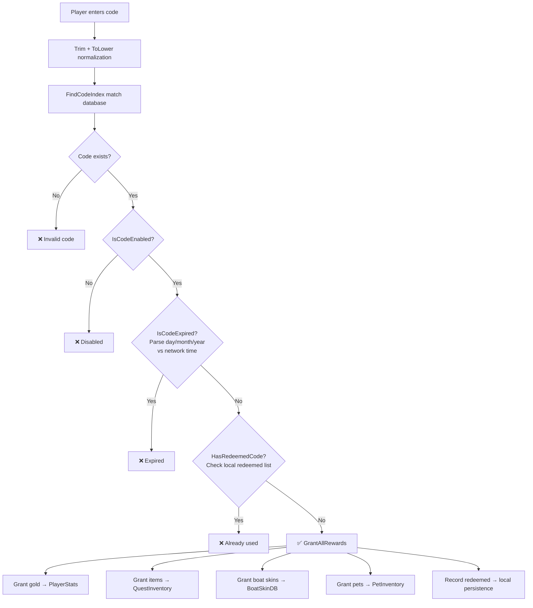
```mermaid
flowchart TD
    A["Player enters code"] --> B["Trim + ToLower normalization"]
    B --> C["FindCodeIndex match database"]
    C --> D{Code exists?}
    D -->|No| E["❌ Invalid code"]
    D -->|Yes| F{IsCodeEnabled?}
    F -->|No| G["❌ Disabled"]
    F -->|Yes| H{IsCodeExpired?\nParse day/month/year\nvs network time}
    H -->|Yes| I["❌ Expired"]
    H -->|No| J{HasRedeemedCode?\nCheck local redeemed list}
    J -->|Yes| K["❌ Already used"]
    J -->|No| L["✅ GrantAllRewards"]
    L --> M["Grant gold → PlayerStats"]
    L --> N["Grant items → QuestInventory"]
    L --> O["Grant boat skins → BoatSkinDB"]
    L --> P["Grant pets → PetInventory"]
    L --> Q["Record redeemed → local persistence"]
```

> **Each redeem code supports**: Gold, up to 2 quest item types (each with quantity), boat skins, and pets. Expiry format is `day/month/year`; empty string = never expires.

---

## 13. NPC & Quest System

**Source:** Program decompilation (`NPCController` / `DialogueSystem` / `DialogueRequirements`)

### 13.1 NPC Character List (42+ NPCs)

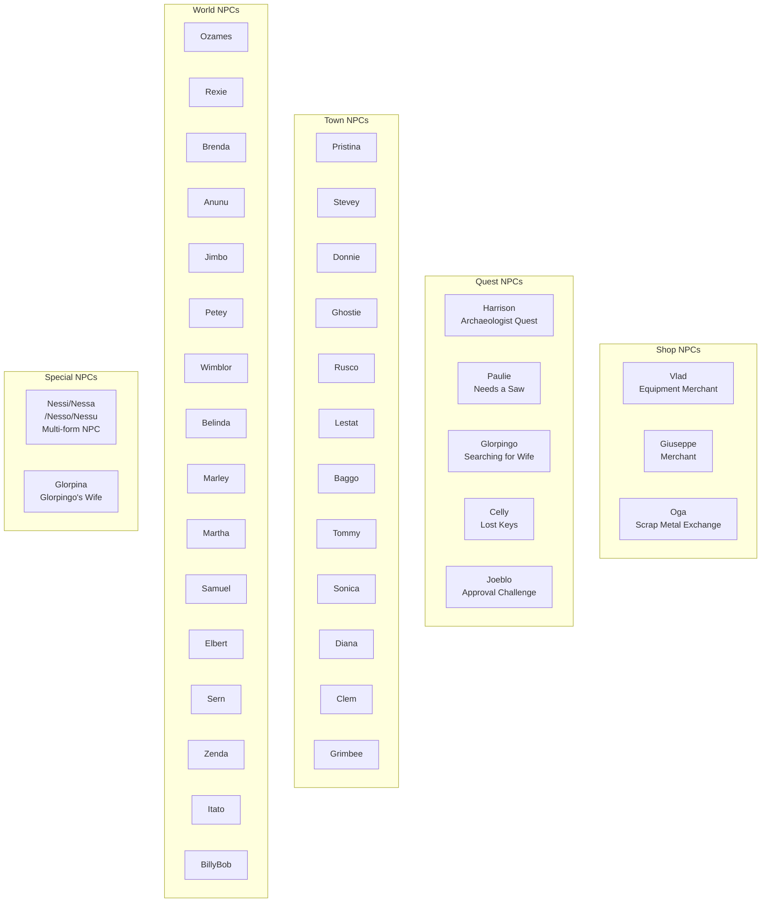
```mermaid
flowchart TD
    subgraph ShopKeepers["Shop NPCs"]
        Vlad["Vlad\nEquipment Merchant"]
        Giuseppe["Giuseppe\nMerchant"]
        Oga["Oga\nScrap Metal Exchange"]
    end
    subgraph QuestNPCs["Quest NPCs"]
        Harrison["Harrison\nArchaeologist Quest"]
        Paulie["Paulie\nNeeds a Saw"]
        Glorpingo["Glorpingo\nSearching for Wife"]
        Celly["Celly\nLost Keys"]
        Joeblo["Joeblo\nApproval Challenge"]
    end
    subgraph TownNPCs["Town NPCs"]
        Pristina & Stevey & Donnie & Ghostie
        Rusco & Lestat & Baggo & Tommy
        Sonica & Diana & Clem & Grimbee
    end
    subgraph WorldNPCs["World NPCs"]
        Ozames & Rexie & Brenda & Anunu
        Jimbo & Petey & Wimblor & Belinda
        Marley & Martha & Samuel & Elbert
        Sern & Zenda & Itato & BillyBob
    end
    subgraph SpecialNPCs["Special NPCs"]
        Nessi["Nessi/Nessa\n/Nesso/Nessu\nMulti-form NPC"]
        Glorpina["Glorpina\nGlorpingo's Wife"]
    end
```

### 13.2 NPC Quest Chains

| Quest Line         | Start NPC | Required Item                 | Reward Title             | XP Reward |
| ------------------ | --------- | ----------------------------- | ------------------------ | --------- |
| Archaeologist Path | Harrison  | Unknown                       | Archaeologist            | —         |
| Wife Search        | Glorpingo | Picture of Glorpina (ID:8)    | Honorary Glorpingus      | 300 XP    |
| Find the Keys      | Celly     | Celly's Keys (ID:10)          | Pastrami Enjoyer         | 300 XP    |
| Repair Tools       | Paulie    | Paulie's Saw (ID:6)           | Paulie's Bobber (reward) | —         |
| Hero's Trial       | Joeblo    | Unknown                       | Shield Hero              | 300 XP    |
| Scrap Exchange     | Oga       | Scrap Metal (ID:13) × N       | Unknown reward           | —         |
| Prisoner Rescue    | Unknown   | A Prisoner? (ID:14)           | Unknown                  | —         |
| Alien Research     | Unknown   | Mysterious Alien Juice (ID:7) | Unlocks Alien Rod?       | —         |

### 13.3 Dialogue System Mechanics

| Parameter        | Value      | Description                                      |
| ---------------- | ---------- | ------------------------------------------------ |
| Typewriter speed | Adjustable | Text displays character by character             |
| Quick skip       | ✓          | Can skip current text animation                  |
| Multi-choice     | ✓          | Dialogue can have multiple options               |
| NPC tracking     | ✓          | NPC head tracks player                           |
| Schedule system  | ✓          | NPCs follow schedules (walk/run/sit)             |
| Busy state       | ✓          | NPCs stop moving and face player during dialogue |

---

## 14. Dynamic Music System

**Source:** `MusicSystem` + `MusicTrack` (24 tracks)

| Track Name       | Weight  | Cooldown | Volume | Type              |
| ---------------- | ------- | -------- | ------ | ----------------- |
| **Church**       | **100** | 0 min    | 0.7    | Zone-specific     |
| **Glorpingo**    | **100** | 0 min    | 0.5    | **Intro track**   |
| **Good Morning** | **100** | 5 min    | 1.0    | **Weather intro** |
| **New Dawn**     | **100** | 5 min    | 1.0    | **Weather intro** |
| **Lavatown**     | **100** | 2 min    | 0.7    | Zone-specific     |
| **Sleepy Town**  | **100** | 5 min    | 0.5    | High weight       |
| **Family**       | **50**  | 5 min    | 0.7    | High weight       |
| **Zen**          | **50**  | 5 min    | 0.7    | High weight       |
| Crescent Harbor  | 10      | 5 min    | 0.5    | Intro track       |
| Lookout Point    | 10      | 5 min    | 0.7    | Intro track       |
| Tun'Luxia        | 10      | 5 min    | 0.7    | Intro track       |
| Atlantis         | 10      | 5 min    | 0.7    | Normal            |
| Backroads        | 10      | 5 min    | 0.5    | Normal            |
| Crescent Town    | 10      | 5 min    | 0.7    | Normal            |
| Dirty Swamp      | 10      | 5 min    | 0.5    | Normal            |
| Fish Rancher     | 10      | 5 min    | 0.5    | Normal            |
| Jermoids         | 10      | 5 min    | 0.5    | Normal            |
| Monkey           | 10      | 5 min    | 0.5    | Normal            |
| New Horizon      | 10      | 5 min    | 0.7    | Normal            |
| Ocean Drift      | 10      | 5 min    | 0.7    | Normal            |
| Panno            | 10      | 5 min    | 0.5    | Normal            |
| Rocko Dongo      | 10      | 5 min    | 0.5    | Normal            |
| Simpleton        | 10      | 5 min    | 0.5    | Normal            |
| Spooky           | 10      | 5 min    | 0.7    | Normal            |

> **Weather intro tracks**: Good Morning and New Dawn trigger at highest priority (100) during weather changes. **Intro tracks** play with priority when a player enters a zone.

---

## 15. Technical Systems

### 15.1 System Architecture Overview

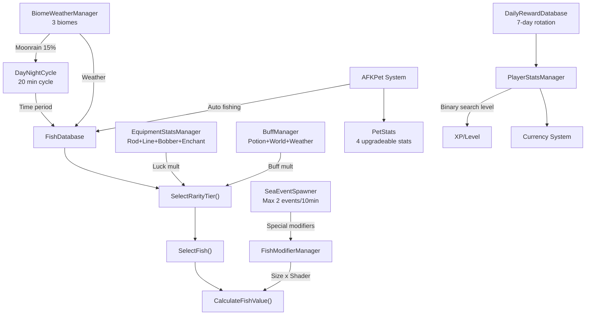
```mermaid
flowchart TD
    FishDB["FishDatabase"] --> Select["SelectRarityTier()"]
    Select --> Fish["SelectFish()"]
    Fish --> Value["CalculateFishValue()"]

    Equip["EquipmentStatsManager\nRod+Line+Bobber+Enchant"] --> |Luck mult| Select
    Buff["BuffManager\nPotion+World+Weather"] --> |Buff mult| Select

    Mod["FishModifierManager"] --> |Size x Shader| Value

    DNC["DayNightCycle\n20 min cycle"] --> |Time period| FishDB
    Weather["BiomeWeatherManager\n3 biomes"] --> |Weather| FishDB
    Weather --> |Moonrain 15%| DNC

    Sea["SeaEventSpawner\nMax 2 events/10min"] --> |Special modifiers| Mod

    Pet["AFKPet System"] --> |Auto fishing| FishDB
    Pet --> PetStats["PetStats\n4 upgradeable stats"]

    Player["PlayerStatsManager"] --> |Binary search level| XP["XP/Level"]
    Player --> Money["Currency System"]

    Daily["DailyRewardDatabase\n7-day rotation"] --> Player
```

### 15.2 Data Persistence System

**Source:** `PlayerStatsManager` (hash `2baf2`) + `PlayerInventoryData` (hash `04a6d`)

#### Player Stats Save Keys

Using VRC PlayerData API integer key-value storage:

| Save Key                 | Content            | Type |
| ------------------------ | ------------------ | ---- |
| `PS_PLAYER_XP`           | Cumulative XP      | int  |
| `PS_PLAYER_MONEY`        | Currency balance   | int  |
| `PS_PLAYER_LEVEL`        | Current level      | int  |
| `PS_FISH_CAUGHT`         | Total fish caught  | int  |
| `PS_RARE_FISH_CAUGHT`    | Rare fish caught   | int  |
| `PS_FISH_SOLD`           | Total fish sold    | int  |
| `PS_TUTORIALS_COMPLETED` | Tutorial progress  | int  |
| `PS_BOUNTIES_COMPLETED`  | Bounties completed | int  |
| `PS_TIME_PLAYED`         | Play time (sec)    | int  |

#### Inventory Data Save

Using JSON-serialized DataDictionary storage:

| Save Key              | Content              |
| --------------------- | -------------------- |
| `INVENTORY_DATA`      | JSON serialized dict |
| `PID_EQUIPPED_ROD`    | Equipped rod ID      |
| `PID_EQUIPPED_LINE`   | Equipped line ID     |
| `PID_EQUIPPED_BOBBER` | Equipped bobber ID   |

**Dictionary internal structure keys:**
`unlockedRods`, `unlockedLines`, `unlockedBobbers`, `unlockedHandles`, `unlockedBoats`, `fishSlots`, `afkPets`, `questItems`, `nfid` (next fish ID counter), `rodEnchants`, `lineEnchants`, `bobberEnchants`

#### Data Recovery Flow

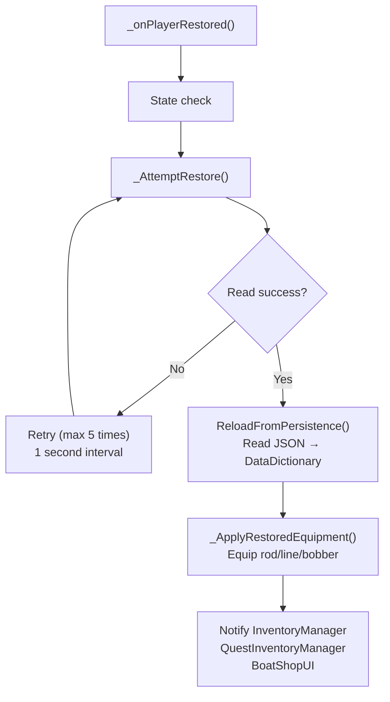
```mermaid
flowchart TD
    A["_onPlayerRestored()"] --> B["State check"]
    B --> C["_AttemptRestore()"]
    C --> D{Read success?}
    D -->|No| E["Retry (max 5 times)\n1 second interval"]
    E --> C
    D -->|Yes| F["ReloadFromPersistence()\nRead JSON → DataDictionary"]
    F --> G["_ApplyRestoredEquipment()\nEquip rod/line/bobber"]
    G --> H["Notify InventoryManager\nQuestInventoryManager\nBoatShopUI"]
```

> **Safety mechanism**: On serialization failure, retains last known good data and logs error. `INVENTORY_WIPE_PENDING` flag can trigger forced reset.

#### Fish Storage Encoding

Each fish stored as DataList format:

```text
[fishId, fishEntryId, fishWeight, combinedModifiers, isLocked]
```

**Modifier encoding algorithm**:

```text
combinedModifiers = sizeModifier × 100 + shaderModifier
Decode:
sizeModifier = combinedModifiers / 100   (integer division)
shaderModifier = combinedModifiers % 100  (modulo)
```

### 15.3 Leaderboard System

**Source:** `LeaderboardManager` (hash `9234a`)

| Parameter      | Value              | Description               |
| -------------- | ------------------ | ------------------------- |
| Sort method    | Level desc         | Higher level ranks first  |
| Tie-breaking   | Alphabetical       | Same level sorted by name |
| Top 3 display  | Gold/Silver/Bronze | Special color markers     |
| Display count  | 8 players          | Top 3 + ranks 4~8         |
| Refresh method | Periodic poll      | `refreshInterval`         |
| Data sync      | VRC network        | Synced arrays             |

**Synced data structure:**

```text
syncedPlayerIds[]      — Player identifiers
syncedPlayerLevels[]   — Player levels
cachedDisplayNames[]   — Cached display names
sortedIndices[]        — Sorted indices (bubble sort)
```

> The leaderboard uses **bubble sort** on `sortedIndices`, ordered by level descending. Supports dynamic updates on player join/leave.

### 15.4 Discord Role Permission System

**Source:** `DiscordRoleManager` (decrypted data)

#### Role Tag System

Decrypted JSON data format: `"VRChat username": "role tags"`

| Tag     | Meaning                | In-Game Privilege                |
| ------- | ---------------------- | -------------------------------- |
| `p`     | **Patreon Supporter**  | Lucky Cat pet, Patreon titles    |
| `n`     | **Nitro Booster**      | Nitro Fishing Frog, Nitro titles |
| `s`     | **Staff**              | Special permissions              |
| `p,n`   | Patreon + Nitro        | Dual rewards                     |
| `p,s,n` | All roles              | Highest privileges               |
| (empty) | Regular Discord member | Basic Discord rewards            |

#### Encrypted Transmission Flow

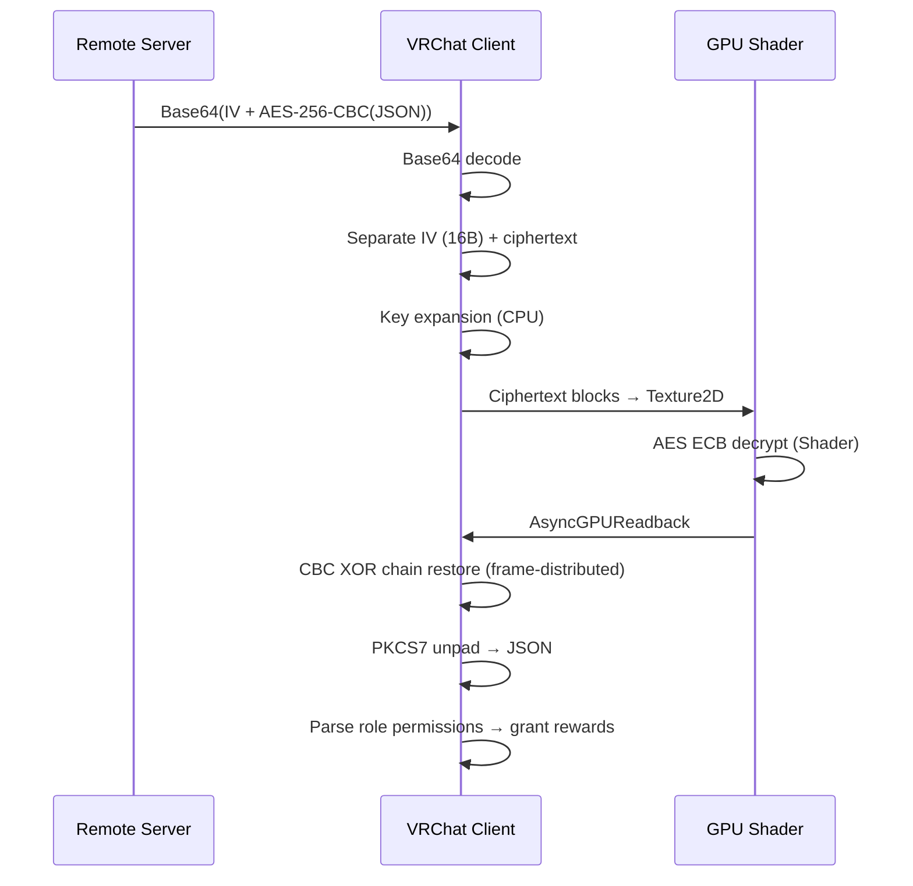
```mermaid
sequenceDiagram
    participant Server as Remote Server
    participant VRC as VRChat Client
    participant GPU as GPU Shader

    Server->>VRC: Base64(IV + AES-256-CBC(JSON))
    VRC->>VRC: Base64 decode
    VRC->>VRC: Separate IV (16B) + ciphertext
    VRC->>VRC: Key expansion (CPU)
    VRC->>GPU: Ciphertext blocks → Texture2D
    GPU->>GPU: AES ECB decrypt (Shader)
    GPU->>VRC: AsyncGPUReadback
    VRC->>VRC: CBC XOR chain restore (frame-distributed)
    VRC->>VRC: PKCS7 unpad → JSON
    VRC->>VRC: Parse role permissions → grant rewards
```

---

## 16. Theoretical Optimal Builds

### 16.1 Maximum Luck Build

| Slot        | Equipment             | Luck Value |
| ----------- | --------------------- | ---------- |
| Rod         | Rod of the Pharaoh    | +222       |
| Line        | Lucky Line            | +30        |
| Bobber      | Lucky Bobber          | +40        |
| Enchantment | God's Own Luck        | +250       |
| Zone Codex  | All 5 zones completed | +75        |
| Pet Luck    | Max level 150         | +150       |
| **Total**   |                       | **+767**   |

**Theoretical maximum luck multiplier with buffs**:

```text
Base luck mult = (767/100) + 1.0 = 8.67×
× Luck Potion(2.0) + World Luck T3(8.0) + Weather Luck(2.0) = +12.0
Total luck mult = 8.67 × 12.0 = extreme linear luck bonus
```

### 16.2 Maximum Attraction Speed Build

| Slot        | Equipment                | Attraction |
| ----------- | ------------------------ | ---------- |
| Rod         | Speedy Rod               | +60        |
| Line        | Hair of a Fell God       | +50        |
| Bobber      | Ornamental Bobber        | +10        |
| Enchantment | Messenger of the Heavens | +100       |
| **Total**   |                          | **+220**   |

### 16.3 Maximum Sell Value Build

| Effect Source                   | Bonus                               |
| ------------------------------- | ----------------------------------- |
| Giant size modifier             | ×1.5                                |
| Holographic/Static shader       | ×5.0                                |
| Time/Weather preference         | ×2.0                                |
| Money Maker enchantment         | +20%                                |
| Pocket Watcher enchantment      | +5%                                 |
| Double Up!! enchantment         | 25% chance to double                |
| **Theoretical max single fish** | **Base price × 15 × 1.25 = 18.75×** |

For the most expensive Catfish Emperor: $49,500 × 15 × 1.25 = **$928,125** (excluding Double Up!! doubling)

### 16.4 Maximum Strength/Expertise Build (Easiest Minigame)

| Slot        | Equipment            | Strength | Expertise |
| ----------- | -------------------- | -------- | --------- |
| Rod         | Rod of Perpetuity    | 30       | 30        |
| Line        | Hair of a Fell God   | 50       | 50        |
| Bobber      | Rainbow Slime Bobber | 10       | 0         |
| Enchantment | Strongest Angler     | 85       | 85        |
| **Total**   |                      | **175**  | **165**   |

---

## 17. Hidden Content & Unimplemented Data

### 17.1 Unimplemented Weather Types

| Weather Type ID | Name         | Status                                                                      |
| --------------- | ------------ | --------------------------------------------------------------------------- |
| 0               | Clear        | ✅ Implemented                                                              |
| 1               | Rainy        | ✅ Implemented                                                              |
| 2               | Stormy       | ✅ Implemented (fish data has `prefersStormy`)                              |
| 3               | Foggy        | ✅ Implemented                                                              |
| 4               | Moonrain     | ✅ Implemented (15% chance at night)                                        |
| 5               | **Starfog**  | ❌ **Not implemented** — `prefersStarfog` field exists but no fish uses it  |
| 6               | **Skybloom** | ❌ **Not implemented** — `prefersSkybloom` field exists but no fish uses it |

> Two weather types (Starfog and Skybloom) have fields in the fish data structure, but currently no fish has these preferences set and weather config has no corresponding entries. These are likely **reserved for future updates**.

### 17.2 Disabled/Hidden Content

| Content                  | Status       | Description                                                 |
| ------------------------ | ------------ | ----------------------------------------------------------- |
| Godly Relic (relic fish) | **Disabled** | ID:93, rarity 8, but enabled=false                          |
| DEBUG Rod                | Hidden       | ID:5, all stats 0, max weight only 1 kg                     |
| DEBUG Bobber             | Hidden       | ID:7, all stats 50 (dev testing)                            |
| Prism boat skins         | **Disabled** | Surfboard/Rowboat/Speedboat each have a disabled Prism skin |
| Beta Tester Canoe Skin   | **Disabled** | Beta testers only                                           |
| Rod of Perpetuity        | Level-locked | Requires **Level 500** and `isUnlockedFromLevel=true`       |

### 17.3 Hidden Titles

The following titles are marked `isHidden: true` and won't appear in the achievement list until conditions are met:

| Title             | Unlock Condition          |
| ----------------- | ------------------------- |
| Beta Tester       | BETA_PLAYER flag set to 1 |
| Early Supporter   | Early supporter flag      |
| Supporter         | Supporter flag            |
| Nitro Booster     | Discord Nitro             |
| Nitro Addict      | Discord Nitro             |
| Patreon Baller    | Patreon support           |
| Patreon Supporter | Patreon support           |

### 17.4 Interesting Findings in the Data

1. **Catfish Emperor's name** — "Catfish" is a pun (catfish = a type of fish, also means deceiving someone online)
2. **"Decimated Fih"** — Most likely an **intentional misspelling** of "Decimated Fish" as an easter egg
3. **"Steve"** — A rarity 9 Secret fish with an extremely plain name, likely a tribute to someone
4. **Rod of the Pharaoh** has **−10 attraction** — The only high-end rod that **reduces** attraction speed, designed as a high-luck but slow trade-off
5. **Baby Megalodon** max weight **120,000 kg** — One of the heaviest fish in the game, far exceeding the real megalodon
6. **Rod of Perpetuity** and **Rod of the Pharaoh** both require **Level 500** to unlock, but not via auto-unlock — Pharaoh Rod must be purchased from the shop for 750,000 gold
7. **Moonrain** is the only special weather with a fish preference — **Mysterious Red Gem** can only be caught during Moonrain and is a one-time catch
