# Fish World Game Data Handbook

English | [简体中文](gamedata-zh.md)

> All values are extracted from decompiled Udon IL bytecode — these are the actual constants and formulas used in-game.

---

## Table of Contents

1. [Fish Spawning & Rarity System](#1-fish-spawning--rarity-system)
2. [Fishing Minigame Mechanics](#2-fishing-minigame-mechanics)
3. [Fish Modifiers (Shaders & Size)](#3-fish-modifiers-shaders--size)
4. [Weather & Biome System](#4-weather--biome-system)
5. [Day/Night Cycle](#5-daynight-cycle)
6. [Equipment Data](#6-equipment-data)
7. [Enchantment System](#7-enchantment-system)
8. [Buff System](#8-buff-system)
9. [Sea Events](#9-sea-events)
10. [Boat System](#10-boat-system)
11. [Pet System](#11-pet-system)
12. [XP & Leveling](#12-xp--leveling)
13. [Daily Rewards](#13-daily-rewards)
14. [Economy & Fish Valuation](#14-economy--fish-valuation)
15. [System Architecture Overview](#15-system-architecture-overview)

---

## 1. Fish Spawning & Rarity System

**Source:** `FishDatabase`

### 1.1 Rarity Base Chances

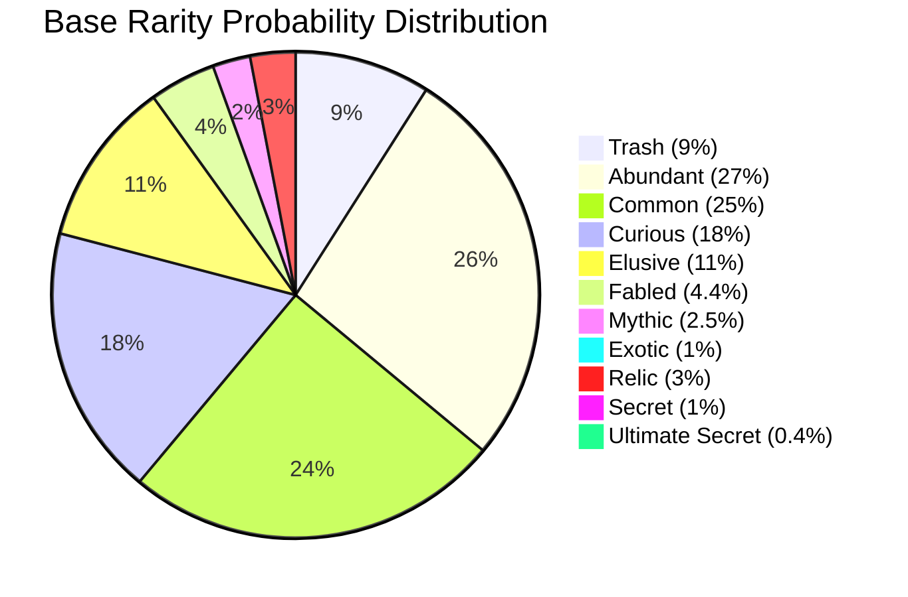

| Rarity          | Base Chance | Luck Power | Description                |
| --------------- | ----------- | ---------- | -------------------------- |
| Trash           | 9%          | −1.0       | Decreases with higher luck |
| Abundant        | 27%         | −0.8       | Most common tier           |
| Common          | 25%         | −0.1       |                            |
| Curious         | 18%         | +0.35      |                            |
| Elusive         | 11%         | +0.6       |                            |
| Fabled          | 4.4%        | +0.7       |                            |
| Mythic          | 2.5%        | +0.6       |                            |
| Exotic          | 1%          | +0.6       |                            |
| Relic           | 3%          | +0.1       | Drops enchantment relics   |
| Secret          | 1%          | +2.0       | Heavily luck-dependent     |
| Ultimate Secret | 0.4%        | +1.9       | Most luck-dependent        |

**Luck Power**: Positive = more frequent with higher luck; Negative = less frequent. Uses sigmoid smoothing to prevent extreme outliers.

### 1.2 Rarity Selection Algorithm

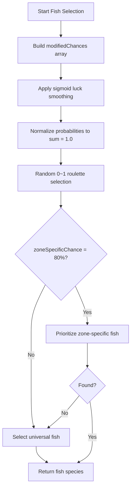

### 1.3 Zone Priority System

- **Zone-specific chance = 80%** — 80% of the time, zone-specific fish are prioritized
- Selection order: zone fish → universal fish → open-sea fish (fallback)

### 1.4 Per-Fish Spawn Conditions

| Property                | Description                   |
| ----------------------- | ----------------------------- |
| `canSpawnInFreshwater`  | Can spawn in freshwater zones |
| `canSpawnInSaltwater`   | Can spawn in saltwater zones  |
| `canSpawnInSwampwater`  | Can spawn in swamp zones      |
| `canSpawnInLava`        | Can spawn in lava zones       |
| `canSpawnInDay / Night` | Day/night restrictions        |
| `allowedZoneIDs[]`      | Zone whitelist                |
| `forbiddenZoneIDs[]`    | Zone blacklist                |

### 1.5 Time/Weather Preferences (Value Bonus)

Each fish can prefer specific times/weather. When matched, the fish receives a **×2 value multiplier**:

- Time: `prefersMorning`, `prefersDay`, `prefersEvening`, `prefersNight`
- Weather: `prefersClear`, `prefersRainy`, `prefersStormy`, `prefersFoggy`, `prefersMoonrain`, `prefersStarfog`, `prefersSkybloom`

---

## 2. Fishing Minigame Mechanics

**Source:** `FishingMinigameScript`

### 2.1 Difficulty-Interpolated Parameters

All values interpolate linearly between easy (difficulty=0) and hard (difficulty=1):

| Parameter                 | Easy  | Hard   | Description                     |
| ------------------------- | ----- | ------ | ------------------------------- |
| Target size               | 1.2   | 0.7    | Hit zone width                  |
| Direction change time     | 0.5 s | 0.4 s  | Fish direction change frequency |
| Fish smooth time          | 1.0 s | 0.19 s | Lower = more agile              |
| Catch speed (fill rate)   | 0.2/s | 0.06/s | Progress bar fill               |
| Lose speed (drain rate)   | 0.1/s | 0.15/s | Progress bar drain              |
| Max lose speed multiplier | 1×    | 3×     | Escalation over time            |

- **Lose speed escalation rate** = 0.1 (drain increases over time)

### 2.2 Physics & Controls

| Parameter          | Value |
| ------------------ | ----- |
| Gravity            | 1.25  |
| Player speed       | 3.75  |
| Fish target hitbox | 0.1   |
| Bar height         | 2.8   |
| Preparation time   | 1.0 s |

### 2.3 VR Adjustments

| Parameter                | Value            |
| ------------------------ | ---------------- |
| VR lose speed multiplier | 1.0 (no penalty) |
| VR target size bonus     | +0.04            |
| VR trigger threshold     | 0.15             |

### 2.4 Low FPS Assist

| Parameter        | Value    | Description                 |
| ---------------- | -------- | --------------------------- |
| Cutoff FPS       | < 30 FPS | Assist kicks in below this  |
| Max benefit FPS  | 15 FPS   | Full assist at this level   |
| Max bonus        | +0.05    | Added to target size        |
| Fish speed floor | 0.95×    | Prevents excessive slowdown |

### 2.5 Equipment Effects on Minigame

- **Strength** → reduces lose speed. Formula: `Clamp(value, 0.25, 1.0)`
- **Expertise** → increases hitbox size. Minimum multiplier = 0.5×
- **Tutorial mode** = first 20 catches

---

## 3. Fish Modifiers (Shaders & Size)

**Source:** `FishModifierManager`

### 3.1 Base Modifier Chances

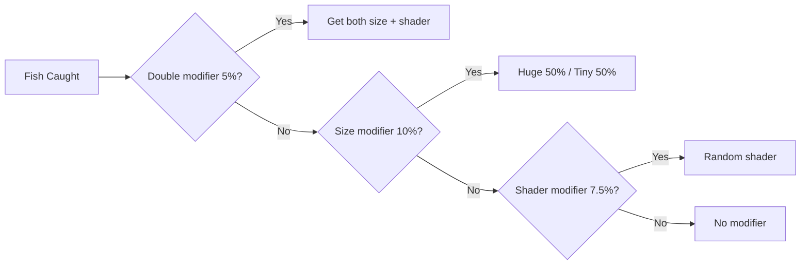

| Parameter       | Chance |
| --------------- | ------ |
| Size modifier   | 10%    |
| Shader modifier | 7.5%   |
| Double modifier | 5%     |
| Huge vs Tiny    | 50:50  |

### 3.2 Shader Value Multipliers

| ID  | Shader Name     | Value Multiplier |
| --- | --------------- | ---------------- |
| 2   | Albino          | 1.5×             |
| 3   | Shiny           | 2.0×             |
| 4   | Golden          | 3.0×             |
| 5   | Ghastly         | 1.5×             |
| 6   | Blessed         | 3.0×             |
| 7   | Cursed          | 1.1×             |
| 8   | Radioactive     | 3.0×             |
| 9   | MissingShader   | 1.5×             |
| 10  | Sandy           | 1.2×             |
| 11  | **Holographic** | **5.0×**         |
| 12  | Burning         | 4.0×             |
| 13  | Rainbow         | 3.0×             |
| 14  | Stone           | 1.3×             |
| 15  | Zebra           | 1.3×             |
| 16  | Tiger           | 1.6×             |
| 17  | Camo            | 1.8×             |
| 18  | Electric        | 4.0×             |
| 19  | **Static**      | **5.0×**         |
| 20  | Void            | 2.0×             |
| 21  | Frozen          | 2.0×             |
| 22  | Shadow          | 2.0×             |
| 23  | Negative        | 1.5×             |
| 24  | Galaxy          | 3.0×             |

**Huge size** multiplier: 1.5×. Final value = size multiplier × shader multiplier (multiplicative stacking).

---

## 4. Weather & Biome System

**Source:** `BiomeWeatherManager`

### 4.1 Global Weather Parameters

| Parameter               | Value           |
| ----------------------- | --------------- |
| Weather change interval | 120 s (2 min)   |
| Moonrain chance         | 15% (per night) |
| Atmospheric transition  | 10 s            |
| Audio transition        | 5 s             |

### 4.2 Biome Definitions

| Biome | Name     | Radius | Priority |
| ----- | -------- | ------ | -------- |
| 0     | DESERT   | 426.5  | 50       |
| 1     | TROPICAL | 1296.0 | 0        |
| 2     | SWAMP    | 309.92 | 50       |

### 4.3 Per-Biome Weather Weights

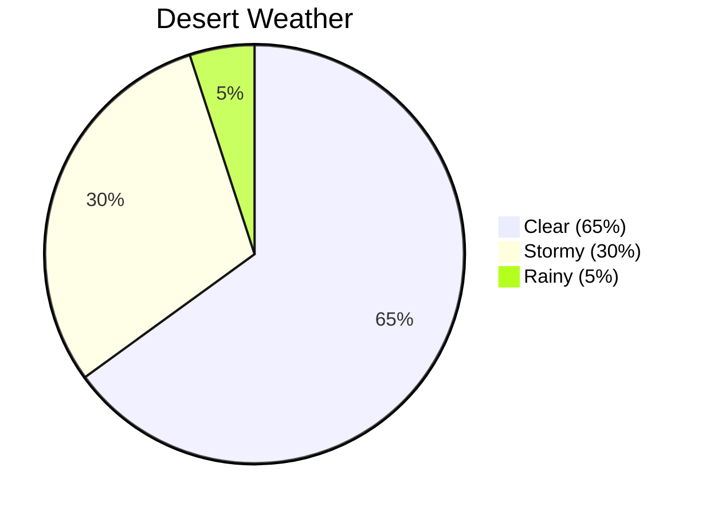

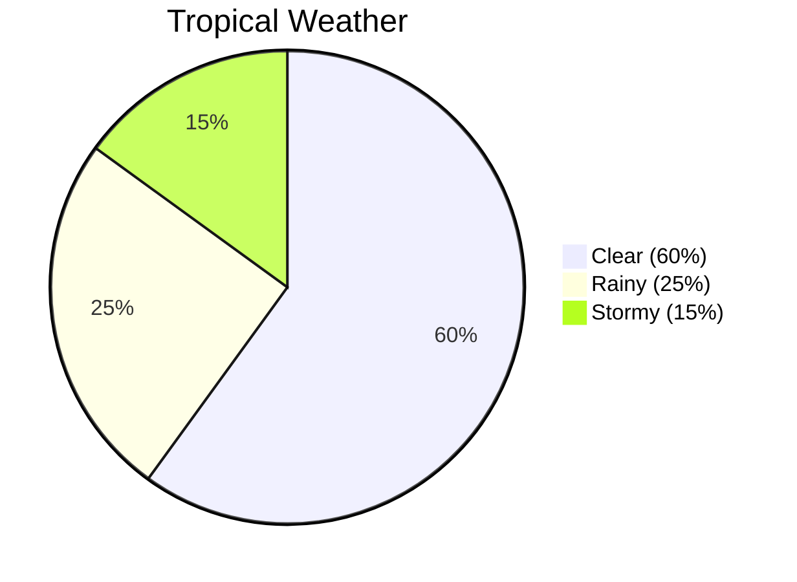

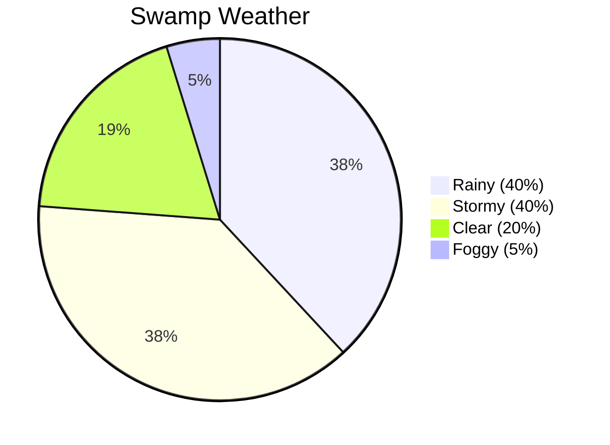

**Default weather** (outside biomes): Clear 50 / Stormy 25 / Rainy 25

---

## 5. Day/Night Cycle

**Source:** `DayNightCycle`

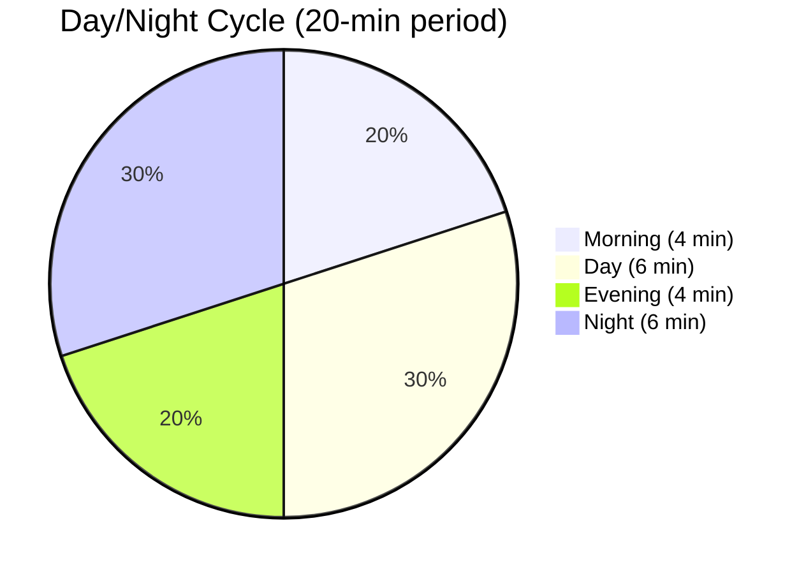

| Parameter      | Value                    |
| -------------- | ------------------------ |
| Full cycle     | 1200 s (20 minutes)      |
| Daytime        | 10 minutes (50%)         |
| Nighttime      | 10 minutes (50%)         |
| Start time     | 0.25 (begins at morning) |
| Midnight angle | 90°                      |

---

## 6. Equipment Data

### 6.1 Rods (17 types)

| ID  | Name               | Luck    | Str | Exp | Attract | BigCatch | Max Weight     |
| --- | ------------------ | ------- | --- | --- | ------- | -------- | -------------- |
| 0   | Stick and String   | −50     | 0   | 0   | 0       | −100     | 5 kg           |
| 1   | Sturdy Wooden Rod  | 15      | 0   | 5   | 20      | 0        | 30 kg          |
| 2   | Telescopic Rod     | 10      | 15  | 15  | 10      | 5        | 2,005 kg       |
| 3   | Darkwood Rod       | 30      | 10  | 10  | 30      | 5        | 1,800 kg       |
| 4   | **Runesteel Rod**  | **90**  | 25  | 20  | 30      | 40       | **100,000 kg** |
| 5   | DEBUG ROD          | 0       | 0   | 0   | 0       | 0        | 1 kg           |
| 6   | Sunleaf Rod        | 10      | 5   | 10  | 20      | 15       | 250 kg         |
| 7   | Speedy Rod         | 20      | 5   | 15  | **65**  | 0        | 1,500 kg       |
| 8   | Fortunate Rod      | **100** | 10  | 5   | 10      | 77       | 1,500 kg       |
| 9   | Toy Rod            | 0       | 0   | 0   | 0       | 0        | 15 kg          |
| 10  | Alien Rod          | 50      | 10  | 5   | 40      | 30       | 32,000 kg      |
| 11  | Rod of Perpetuity  | 150     | 30  | 30  | 50      | 10       | 500,000 kg     |
| 12  | Rod of the Pharaoh | **200** | 20  | 40  | −10     | 30       | 100,000 kg     |
| 13  | Slim Rod           | 20      | 10  | 10  | 25      | 20       | 500 kg         |
| 14  | Polished Wood Rod  | 40      | 10  | 10  | 10      | 45       | 500 kg         |
| 15  | Rustfang Rod       | 70      | 20  | 20  | 25      | 35       | 35,000 kg      |

**Stat formula:** `multiplier = (statValue / 100) + 1.0` (e.g., Luck 100 → 2.0× multiplier)

### 6.2 Lines (9 types)

| ID  | Name                   | Luck | Str    | Exp    | Attract | BigCatch |
| --- | ---------------------- | ---- | ------ | ------ | ------- | -------- |
| 0   | Basic Line             | 0    | 0      | 0      | 0       | 0        |
| 1   | Carbon Line            | 0    | 7      | 7      | 0       | 0        |
| 2   | **Hair of a Fell God** | 0    | **50** | **50** | **50**  | 0        |
| 3   | Lucky Line             | 30   | 0      | 0      | 0       | 0        |
| 4   | Aquamarine Line        | 0    | 0      | 0      | 5       | 0        |
| 5   | Fur of Cerberus        | 25   | −5     | −15    | 20      | 10       |
| 6   | Heavy Duty Line        | 0    | 10     | 10     | 0       | 10       |
| 7   | Diamond Line           | 25   | 15     | 15     | 10      | 0        |
| 8   | Flavored Line          | 0    | 0      | 0      | 0       | 30       |

### 6.3 Bobbers (14 types)

| ID  | Name                     | Luck   | Str | Exp | Attract | BigCatch |
| --- | ------------------------ | ------ | --- | --- | ------- | -------- |
| 0   | Basic Bobber             | 0      | 0   | 0   | 0       | 0        |
| 1   | Blue Bobber              | 5      | 0   | 0   | 0       | 0        |
| 2   | Feline Bobber            | 5      | 0   | 0   | 0       | 10       |
| 3   | **Lucky Bobber**         | **40** | 0   | 0   | 0       | 0        |
| 7   | DEBUG BOBBER             | 0      | 50  | 50  | 50      | 50       |
| 12  | Ornamental Bobber        | 10     | 5   | 0   | 10      | 0        |
| 13  | **Rainbow Slime Bobber** | **30** | 10  | 0   | 10      | 10       |

---

## 7. Enchantment System

**Source:** `EnchantmentDatabase` (42 enchantments)

### 7.1 Relic Quality → Enchantment Rarity Probability

| Relic Quality   | Common | Uncommon | Rare  | Epic  | Legendary |
| --------------- | ------ | -------- | ----- | ----- | --------- |
| Common Relic    | 75.3%  | 18.1%    | 5.0%  | 1.5%  | **0.1%**  |
| Rare Relic      | 20.8%  | 52.6%    | 20.8% | 5.2%  | 0.7%      |
| Epic Relic      | 2.3%   | 22.2%    | 62.2% | 11.1% | 2.2%      |
| Legendary Relic | 5.6%   | 16.7%    | 33.3% | 38.9% | **5.6%**  |

### 7.2 Notable Enchantments

| Name                     | Rarity    | Luck    | Str | Exp | Attract | BigCatch | Special Effect     |
| ------------------------ | --------- | ------- | --- | --- | ------- | -------- | ------------------ |
| God's Own Luck           | Legendary | **250** | —   | —   | —       | —        | Passive luck       |
| Strongest Angler         | Legendary | 20      | 85  | 85  | 10      | 20       | Max weight +1M     |
| Messenger of the Heavens | Legendary | —       | —   | —   | **100** | —        | Max attraction     |
| Son of Kriptan           | Epic      | 50      | 50  | 50  | 50      | 50       | Day-only bonus     |
| Shiny Hunter             | Epic      | 80      | —   | —   | —       | —        | +20% shiny chance  |
| Double Up!!              | Epic      | 20      | —   | —   | —       | —        | 25% double catch   |
| Money Maker              | Epic      | —       | —   | —   | —       | 20       | +20% sell price    |
| Mutator                  | Epic      | 30      | —   | —   | —       | —        | 2× mutation chance |

### 7.3 Special Effect Types

| Type | Name             | Description                    |
| ---- | ---------------- | ------------------------------ |
| 1    | Double Up        | X% chance to double catch      |
| 2    | Mutator          | Mutation chance multiplier     |
| 3    | Dimensional Line | Zone-ignore cast chance        |
| 4    | Pocket Watcher   | Sell price bonus %             |
| 5    | Enlightened      | XP bonus %                     |
| 6/7  | Night/Day Walker | Time-specific bonus            |
| 10   | Speed Demon      | Attraction speed bonus         |
| 11   | Shiny Hunter     | Shiny modifier chance increase |
| 14   | Passive Luck     | Permanent luck bonus           |

---

## 8. Buff System

**Source:** `BuffManager`

### 8.1 Buff Types

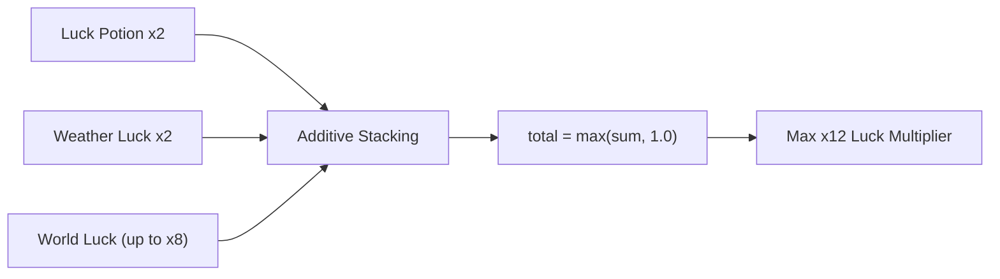

| Buff                   | Multiplier             | Duration             | Stacking        |
| ---------------------- | ---------------------- | -------------------- | --------------- |
| Luck Potion (personal) | 2.0×                   | Additive timer       | Duration stacks |
| Attraction Buff        | 2.0× (halves cooldown) | Additive timer       | Duration stacks |
| Weather Luck           | 2.0×                   | While weather active | Automatic       |

### 8.2 World Luck Buff (Server-wide, Purchasable)

| Tier   | Duration | Luck Multiplier |
| ------ | -------- | --------------- |
| Tier 1 | 30 min   | 2.0×            |
| Tier 2 | 45 min   | 4.0×            |
| Tier 3 | 90 min   | 8.0×            |

- Upgrade carries remaining time with 50% penalty on elapsed
- Purchased via VRC Economy system
- Broadcast to all players

### 8.3 Combined Luck Formula

```text
total_luck = potion(2) + world_tier(2/4/8) + weather(2)
Theoretical max = 2 + 8 + 2 = 12× luck multiplier
```

---

## 9. Sea Events

**Source:** `SeaEventSpawner` + Sea Event entries

### 9.1 Spawner Parameters

| Parameter              | Value          |
| ---------------------- | -------------- |
| Max concurrent events  | 2              |
| Event lifetime         | 600 s (10 min) |
| Event radius           | 15             |
| Spawn point count      | 6              |
| Spawn radius per point | 136.24         |

### 9.2 Event List

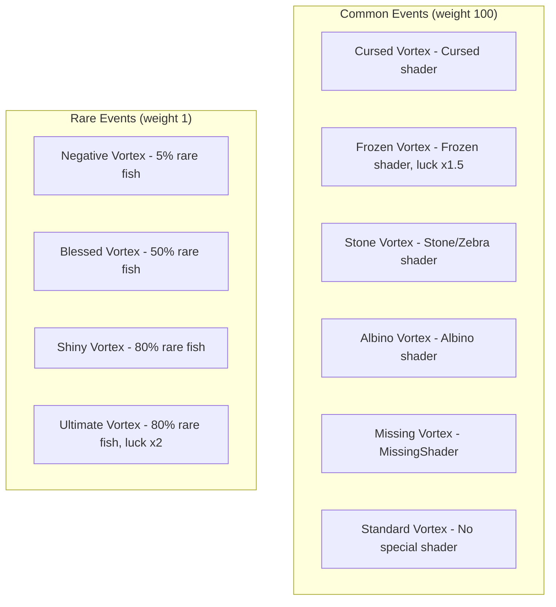

**Common events**: Each forces a specific shader modifier at 2× modifier chance, 85% guarantee.
**Rare events**: Extremely low weight (1 vs 100) but provide 5%–80% rare fish chance.

---

## 10. Boat System

**Source:** Boat entries + `BoatController`

| ID  | Name                 | Price         | Speed  | Accel | Turn | Boost      |
| --- | -------------------- | ------------- | ------ | ----- | ---- | ---------- |
| 0   | Surf Board           | 800           | 5      | 2     | 70   | None       |
| 1   | RowBoat              | 3,000         | 5      | 2     | 50   | None       |
| 2   | Dingy                | 30,000        | 10     | 4     | 65   | None       |
| 3   | **Luxury Speedboat** | **1,000,000** | **25** | 5     | 65   | 2.0×/8s CD |
| 4   | Lil Yacht            | 200,000       | 20     | 3     | 55   | 1.2×       |
| 5   | Enthusiast Boat      | 15,000        | 8      | 3     | 80   | None       |
| 6   | Canoe                | 2,000         | 5      | 2     | 50   | None       |

**Boat physics**: water level 11.9, bobbing amount 0.06, bobbing speed 1.0

---

## 11. Pet System

**Source:** `PetStats` + `AFKPet` + `PetDatabase`

### 11.1 Base Pet Stats

| Parameter               | Value          |
| ----------------------- | -------------- |
| Base catch interval     | 600 s (10 min) |
| Base capacity           | 5 fish         |
| Base max weight         | 10 kg          |
| Can catch modified fish | No             |

### 11.2 Upgrade System

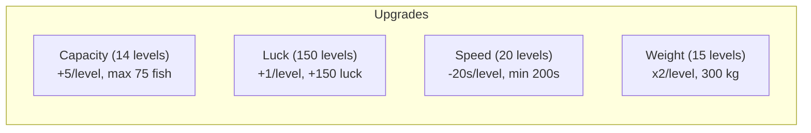

| Upgrade     | Max Level | Per Level       | Max Effect        |
| ----------- | --------- | --------------- | ----------------- |
| Capacity    | 14        | +5 fish/level   | 75 fish total     |
| Luck        | 150       | +1/level        | +150 luck         |
| Catch Speed | 20        | −20 s/level     | Min 200s interval |
| Max Weight  | 15        | ×2 weight/level | 300 kg            |

### 11.3 AFK Pet Behavior

| Parameter               | Value |
| ----------------------- | ----- |
| Wander radius           | 0.3   |
| Wander speed            | 0.5   |
| Bob amount              | 0.1   |
| Animation cull distance | 25    |
| Debug catch interval    | 5 s   |

---

## 12. XP & Leveling

**Source:** `PlayerStatsManager`

### 12.1 Core Parameters

| Parameter               | Value        |
| ----------------------- | ------------ |
| Level cap               | 1000         |
| XP threshold array      | 1001 entries |
| Level-up particle range | 20 units     |
| XP bar animation speed  | 0.2          |
| Save interval           | 3600 s       |

### 12.2 Level Calculation

Uses **binary search** on cumulative XP threshold array.

```text
currentLevelStartXP = GetTotalXPForLevel(currentLevel)
xpNeeded = GetXPRequiredForLevel(currentLevel)
xpInLevel = totalXP − currentLevelStartXP
progress = Clamp01(xpInLevel / xpNeeded)
```

Fallback XP values: 650 / 1,000 / 2,000 / 4,000

### 12.3 Tracked Stats (all network-synced)

- `level` — current level
- `xp` — cumulative XP
- `money` — current currency
- `fishCaught` — total fish caught
- `rareFishCaught` — rare+ fish caught
- `fishSold` — total fish sold
- `timePlayed` — play time (seconds)
- `bountiesCompleted` — bounties completed

---

## 13. Daily Rewards

**Source:** `DailyRewardDatabase`

### 13.1 Weekly Days 1–6

| Day   | Type     | Reward           |
| ----- | -------- | ---------------- |
| Day 1 | Currency | 250 coins        |
| Day 2 | Item     | 2× Luck Potions  |
| Day 3 | Currency | 500 coins        |
| Day 4 | Item     | 2× Relics        |
| Day 5 | Currency | 5,000 coins      |
| Day 6 | Item     | 2× Speed Potions |

### 13.2 Day 7 (Weekly Rotation)

| Week   | Reward                    |
| ------ | ------------------------- |
| Week 1 | Bucket Capybara (Pet)     |
| Week 2 | Crusader Speedboat (Boat) |
| Week 3 | New Skin                  |
| Week 4 | New Skin                  |
| Week 5 | New Skin                  |
| Week 6 | New Skin                  |

**Fallback** (after all unique Day 7 rewards): 15 Bonus Scrap + 750 coins

---

## 14. Economy & Fish Valuation

### 14.1 Fish Price Formula

```text
weightT = InverseLerp(weight, maxWeight, minWeight)
basePrice = Lerp(weightT, maxPrice, minPrice)
finalValue = basePrice × sizeMultiplier × shaderMultiplier
```

### 14.2 Value Multiplier Stacking

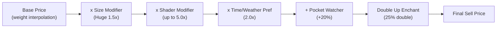

### 14.3 Theoretical Maximum Value Multipliers

- Holographic / Static shader: 5.0×
- Huge size: 1.5×
- Time/weather preference: 2.0×
- **Combined: up to 15× base price** (before enchantment bonuses)

---

## 15. System Architecture Overview

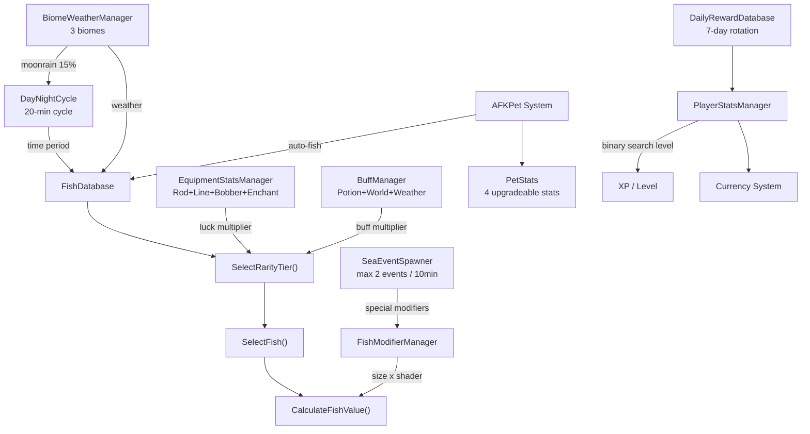

---

## Appendix: Key Constants Quick Reference

| System          | Constant              | Value    | Purpose                    |
| --------------- | --------------------- | -------- | -------------------------- |
| FishDatabase    | zoneSpecificChance    | 80       | Zone fish priority %       |
| FishingMinigame | gravity               | 1.25     | Bar physics                |
| FishingMinigame | playerSpeed           | 3.75     | Player bar speed           |
| DayNightCycle   | cycleDuration         | 1200 s   | Full day/night cycle       |
| Weather         | weatherChangeInterval | 120 s    | Weather roll frequency     |
| Weather         | moonrainChance        | 0.15     | Night moonrain probability |
| SeaEvent        | maxActiveEvents       | 2        | Concurrent events          |
| SeaEvent        | eventLifetime         | 600 s    | Event duration             |
| BuffManager     | luckPotionMultiplier  | 2.0×     | Personal luck potion       |
| BuffManager     | worldLuckTier3        | 8.0×     | Max shared luck            |
| BuffManager     | weatherLuckMultiplier | 2.0×     | Weather luck               |
| Modifiers       | sizeModifierChance    | 10%      | Chance per catch           |
| Modifiers       | shaderModifierChance  | 7.5%     | Chance per catch           |
| Modifiers       | doubleModifierChance  | 5%       | Both mods at once          |
| Pet             | baseCatchInterval     | 600 s    | Base AFK catch time        |
| Pet             | maxCapacity           | 5 (base) | Base fish storage          |
| PlayerStats     | maxLevel              | 1000     | Level cap                  |
