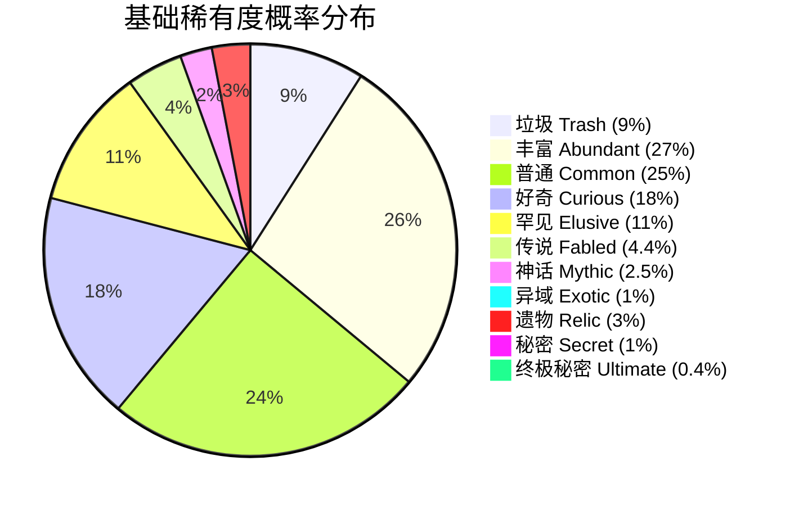
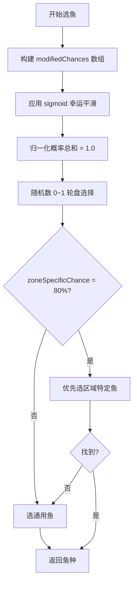
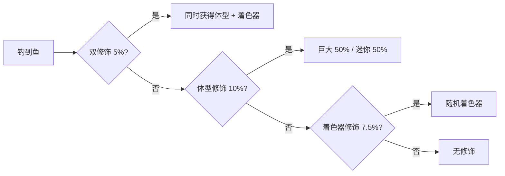
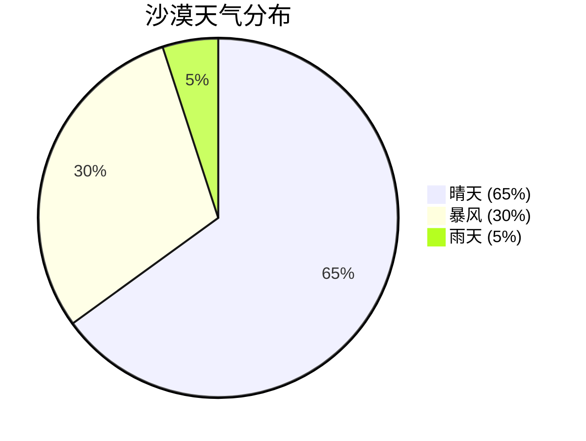
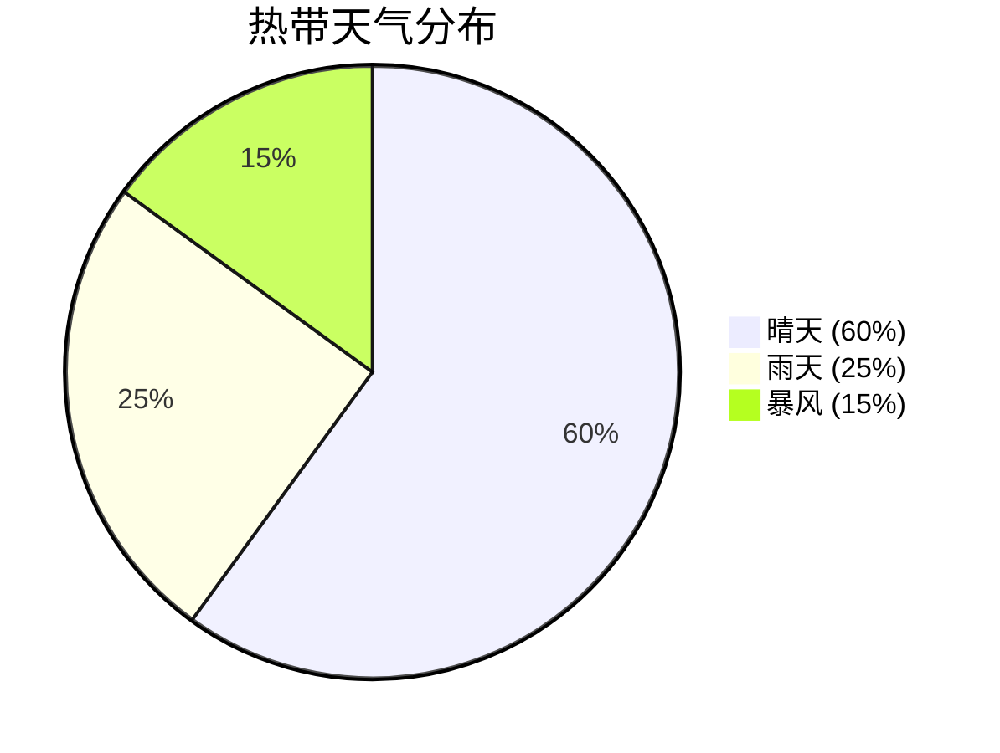
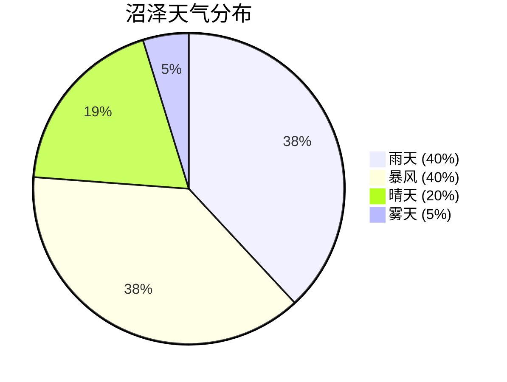
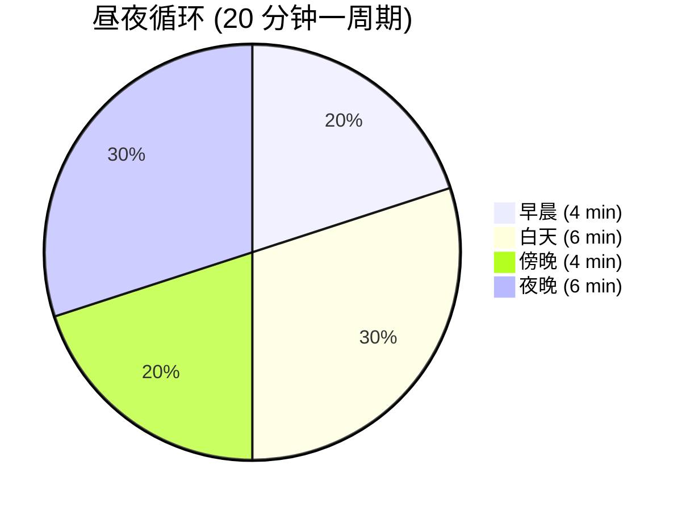
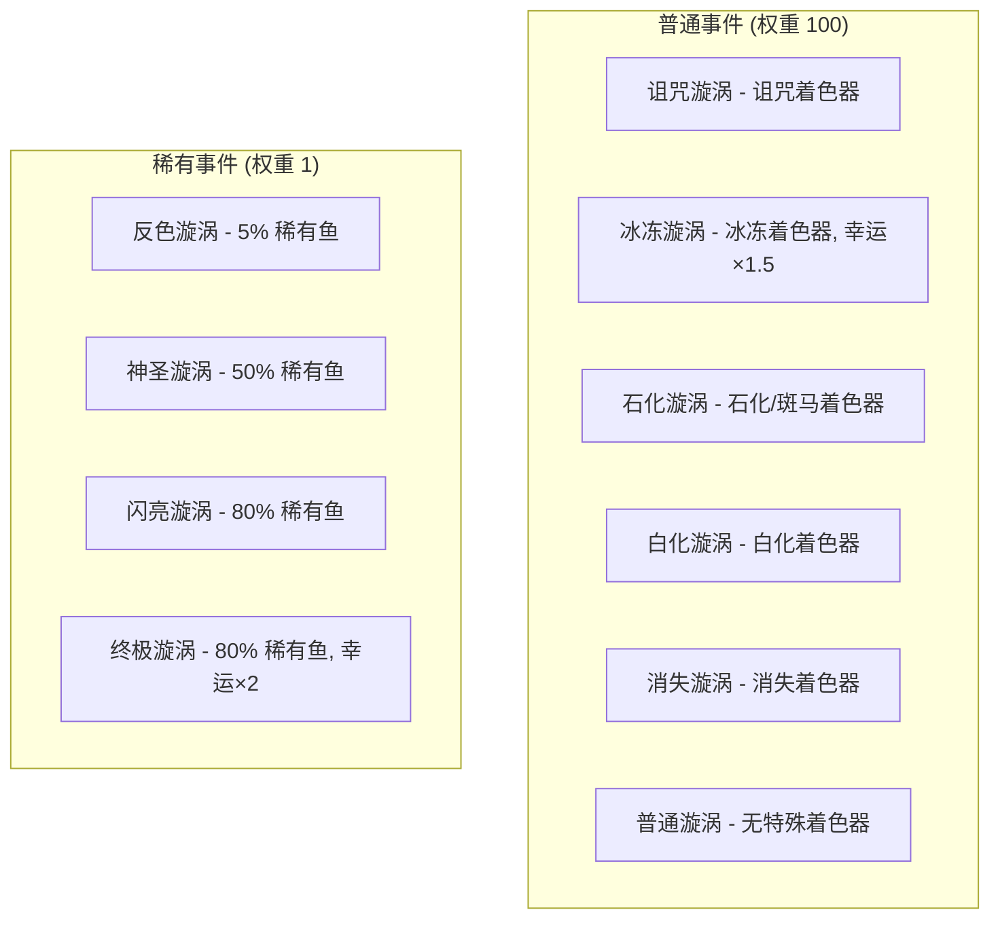
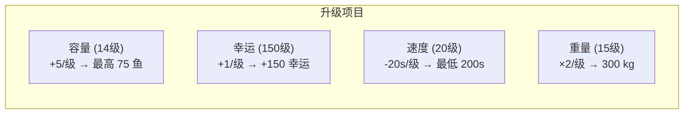
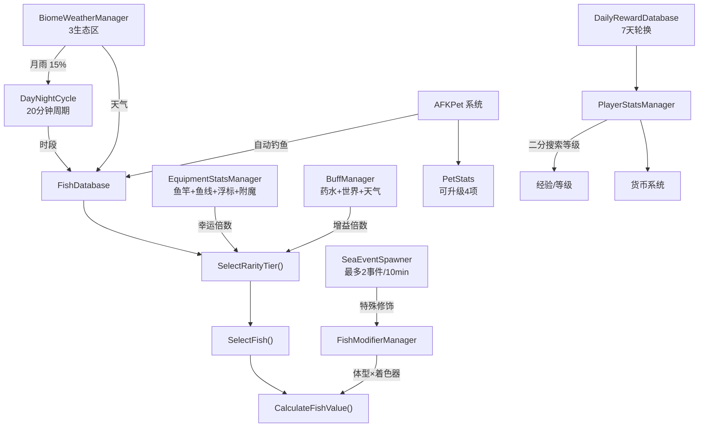

# Fish World 游戏数据手册

> 所有数值均来自 Udon IL 字节码反编译，为游戏内实际使用的常量与公式。

---

## 目录

1. [鱼类生成与稀有度系统](#1-鱼类生成与稀有度系统)
2. [钓鱼小游戏机制](#2-钓鱼小游戏机制)
3. [鱼类变异修饰器](#3-鱼类变异修饰器)
4. [天气与生态区系统](#4-天气与生态区系统)
5. [昼夜循环](#5-昼夜循环)
6. [装备数据](#6-装备数据)
7. [附魔系统](#7-附魔系统)
8. [增益系统](#8-增益系统)
9. [海域事件](#9-海域事件)
10. [船只系统](#10-船只系统)
11. [宠物系统](#11-宠物系统)
12. [等级与经验](#12-等级与经验)
13. [每日奖励](#13-每日奖励)
14. [经济与鱼价计算](#14-经济与鱼价计算)
15. [系统架构总览](#15-系统架构总览)

---

## 1. 鱼类生成与稀有度系统

**来源：** `FishDatabase`

### 1.1 稀有度基础概率



| 稀有度                      | 基础概率 | 幸运力 | 说明           |
| --------------------------- | -------- | ------ | -------------- |
| Trash（垃圾）               | 9%       | −1.0   | 幸运值越高越少 |
| Abundant（丰富）            | 27%      | −0.8   | 最常见         |
| Common（普通）              | 25%      | −0.1   |                |
| Curious（好奇）             | 18%      | +0.35  |                |
| Elusive（罕见）             | 11%      | +0.6   |                |
| Fabled（传说）              | 4.4%     | +0.7   |                |
| Mythic（神话）              | 2.5%     | +0.6   |                |
| Exotic（异域）              | 1%       | +0.6   |                |
| Relic（遗物）               | 3%       | +0.1   | 产出附魔遗物   |
| Secret（秘密）              | 1%       | +2.0   | 强烈受幸运影响 |
| Ultimate Secret（终极秘密） | 0.4%     | +1.9   | 最受幸运影响   |

**幸运力含义**：正值 = 幸运越高出现越多；负值 = 幸运越高出现越少。使用 sigmoid 平滑曲线防止极端值。

### 1.2 稀有度选择流程



### 1.3 区域优先系统

- **区域特定概率 = 80%** — 80% 的时间优先选择当前区域的鱼
- 选择顺序：区域鱼 → 通用鱼 → 外海鱼（兜底）

### 1.4 每条鱼的生成条件

| 属性                    | 说明           |
| ----------------------- | -------------- |
| `canSpawnInFreshwater`  | 可在淡水区生成 |
| `canSpawnInSaltwater`   | 可在咸水区生成 |
| `canSpawnInSwampwater`  | 可在沼泽区生成 |
| `canSpawnInLava`        | 可在岩浆区生成 |
| `canSpawnInDay / Night` | 白天/夜晚限制  |
| `allowedZoneIDs[]`      | 区域白名单     |
| `forbiddenZoneIDs[]`    | 区域黑名单     |

### 1.5 时间/天气偏好（价值加成）

每条鱼可设定偏好时段和天气，匹配时获 **×2 价值加成**：

- 时段：`喜好早晨`、`喜好白天`、`喜好傍晚`、`喜好夜晚`
- 天气：`喜好晴天`、`喜好雨天`、`喜好暴风`、`喜好雾天`、`喜好月雨`、`喜好星雾`、`喜好天花`

---

## 2. 钓鱼小游戏机制

**来源：** `FishingMinigameScript`

### 2.1 难度插值参数

所有参数在「简单（difficulty=0）」和「困难（difficulty=1）」之间按鱼的难度值线性插值：

| 参数         | 简单  | 困难   | 说明           |
| ------------ | ----- | ------ | -------------- |
| 目标大小     | 1.2   | 0.7    | 命中条宽度     |
| 方向改变间隔 | 0.5 s | 0.4 s  | 鱼变向频率     |
| 鱼缓动时间   | 1.0 s | 0.19 s | 越小越灵活     |
| 钓获速度     | 0.2/s | 0.06/s | 进度条填充     |
| 丢失速度     | 0.1/s | 0.15/s | 进度条衰减     |
| 最大丢失倍数 | 1×    | 3×     | 长时间不中加速 |

- **丢失加速率** = 0.1（时间越久丢失越快）

### 2.2 物理与控制

| 参数         | 值    |
| ------------ | ----- |
| 重力         | 1.25  |
| 玩家速度     | 3.75  |
| 鱼目标判定框 | 0.1   |
| 进度条高度   | 2.8   |
| 准备时间     | 1.0 s |

### 2.3 VR 专属调整

| 参数            | 值            |
| --------------- | ------------- |
| VR 丢失速度倍数 | 1.0（无惩罚） |
| VR 目标大小加成 | +0.04         |
| VR 扳机阈值     | 0.15          |

### 2.4 低帧率辅助

| 参数         | 值       | 说明             |
| ------------ | -------- | ---------------- |
| 触发帧率     | < 30 FPS | 低于此值开始辅助 |
| 最大受益帧率 | 15 FPS   | 最大辅助值       |
| 最大加成     | +0.05    | 给目标大小       |
| 鱼速下限     | 0.95×    | 低帧不会过分减速 |

### 2.5 装备对小游戏的影响

- **力量** → 降低丢失速度，公式：`Clamp(value, 0.25, 1.0)`
- **专长** → 增大命中框，最低 0.5×
- **新手保护** = 前 20 次钓鱼使用教程模式

---

## 3. 鱼类变异修饰器

**来源：** `FishModifierManager`

### 3.1 基础变异概率



| 参数         | 概率  |
| ------------ | ----- |
| 体型修饰     | 10%   |
| 着色器修饰   | 7.5%  |
| 双重修饰     | 5%    |
| 巨大 vs 迷你 | 50:50 |

### 3.2 着色器价值倍数

```mermaid
bar title 着色器价值倍数
```

| ID  | 着色器名             | 价值倍数 |
| --- | -------------------- | -------- |
| 2   | 白化 Albino          | 1.5×     |
| 3   | 闪亮 Shiny           | 2.0×     |
| 4   | 金色 Golden          | 3.0×     |
| 5   | 幽灵 Ghastly         | 1.5×     |
| 6   | 神圣 Blessed         | 3.0×     |
| 7   | 诅咒 Cursed          | 1.1×     |
| 8   | 辐射 Radioactive     | 3.0×     |
| 9   | 消失 MissingShader   | 1.5×     |
| 10  | 沙化 Sandy           | 1.2×     |
| 11  | **全息 Holographic** | **5.0×** |
| 12  | 燃烧 Burning         | 4.0×     |
| 13  | 彩虹 Rainbow         | 3.0×     |
| 14  | 石化 Stone           | 1.3×     |
| 15  | 斑马 Zebra           | 1.3×     |
| 16  | 虎纹 Tiger           | 1.6×     |
| 17  | 迷彩 Camo            | 1.8×     |
| 18  | 电击 Electric        | 4.0×     |
| 19  | **静电 Static**      | **5.0×** |
| 20  | 虚空 Void            | 2.0×     |
| 21  | 冰冻 Frozen          | 2.0×     |
| 22  | 暗影 Shadow          | 2.0×     |
| 23  | 反色 Negative        | 1.5×     |
| 24  | 银河 Galaxy          | 3.0×     |

**巨大体型**倍数：1.5×。最终价值 = 体型倍数 × 着色器倍数（乘法叠加）。

---

## 4. 天气与生态区系统

**来源：** `BiomeWeatherManager`

### 4.1 全局天气参数

| 参数         | 值              |
| ------------ | --------------- |
| 天气更替间隔 | 120 s（2 分钟） |
| 月雨概率     | 15%（每个夜晚） |
| 大气过渡时间 | 10 s            |
| 音频过渡时间 | 5 s             |

### 4.2 生态区定义

| 生态区 | 名称          | 半径   | 优先级 |
| ------ | ------------- | ------ | ------ |
| 0      | 沙漠 DESERT   | 426.5  | 50     |
| 1      | 热带 TROPICAL | 1296.0 | 0      |
| 2      | 沼泽 SWAMP    | 309.92 | 50     |

### 4.3 各生态区天气权重







**默认天气**（生态区外）：晴天 50 / 暴风 25 / 雨天 25

---

## 5. 昼夜循环

**来源：** `DayNightCycle`



| 参数     | 值                 |
| -------- | ------------------ |
| 完整周期 | 1200 s（20 分钟）  |
| 白天时长 | 10 分钟（50%）     |
| 夜晚时长 | 10 分钟（50%）     |
| 初始时刻 | 0.25（从早晨开始） |
| 午夜角度 | 90°                |

---

## 6. 装备数据

### 6.1 鱼竿

**来源：** 鱼竿条目（17 种）

| ID  | 名称         | 幸运    | 力量 | 专长 | 吸引   | 大物率 | 最大重量       |
| --- | ------------ | ------- | ---- | ---- | ------ | ------ | -------------- |
| 0   | 木棍钓竿     | −50     | 0    | 0    | 0      | −100   | 5 kg           |
| 1   | 坚固木竿     | 15      | 0    | 5    | 20     | 0      | 30 kg          |
| 2   | 伸缩鱼竿     | 10      | 15   | 15   | 10     | 5      | 2,005 kg       |
| 3   | 暗木鱼竿     | 30      | 10   | 10   | 30     | 5      | 1,800 kg       |
| 4   | **符文钢竿** | **90**  | 25   | 20   | 30     | 40     | **100,000 kg** |
| 5   | DEBUG 鱼竿   | 0       | 0    | 0    | 0      | 0      | 1 kg           |
| 6   | 阳叶鱼竿     | 10      | 5    | 10   | 20     | 15     | 250 kg         |
| 7   | 极速鱼竿     | 20      | 5    | 15   | **65** | 0      | 1,500 kg       |
| 8   | 幸运鱼竿     | **100** | 10   | 5    | 10     | 77     | 1,500 kg       |
| 9   | 玩具鱼竿     | 0       | 0    | 0    | 0      | 0      | 15 kg          |
| 10  | 外星鱼竿     | 50      | 10   | 5    | 40     | 30     | 32,000 kg      |
| 11  | 永恒之竿     | 150     | 30   | 30   | 50     | 10     | 500,000 kg     |
| 12  | 法老之竿     | **200** | 20   | 40   | −10    | 30     | 100,000 kg     |
| 13  | 细长鱼竿     | 20      | 10   | 10   | 25     | 20     | 500 kg         |
| 14  | 打磨木竿     | 40      | 10   | 10   | 10     | 45     | 500 kg         |
| 15  | 锈牙鱼竿     | 70      | 20   | 20   | 25     | 35     | 35,000 kg      |

**属性公式：** `倍率 = (属性值 / 100) + 1.0`（例：幸运 100 → 2.0× 倍率）

### 6.2 鱼线（9 种）

| ID  | 名称         | 幸运 | 力量   | 专长   | 吸引   | 大物率 |
| --- | ------------ | ---- | ------ | ------ | ------ | ------ |
| 0   | 基础鱼线     | 0    | 0      | 0      | 0      | 0      |
| 1   | 碳纤维线     | 0    | 7      | 7      | 0      | 0      |
| 2   | **堕神之发** | 0    | **50** | **50** | **50** | 0      |
| 3   | 幸运鱼线     | 30   | 0      | 0      | 0      | 0      |
| 4   | 碧蓝鱼线     | 0    | 0      | 0      | 5      | 0      |
| 5   | 冥犬皮毛     | 25   | −5     | −15    | 20     | 10     |
| 6   | 重型鱼线     | 0    | 10     | 10     | 0      | 10     |
| 7   | 钻石鱼线     | 25   | 15     | 15     | 10     | 0      |
| 8   | 调味鱼线     | 0    | 0      | 0      | 0      | 30     |

### 6.3 浮标（14 种）

| ID  | 名称               | 幸运   | 力量 | 专长 | 吸引 | 大物率 |
| --- | ------------------ | ------ | ---- | ---- | ---- | ------ |
| 0   | 基础浮标           | 0      | 0    | 0    | 0    | 0      |
| 1   | 蓝色浮标           | 5      | 0    | 0    | 0    | 0      |
| 2   | 猫形浮标           | 5      | 0    | 0    | 0    | 10     |
| 3   | **幸运浮标**       | **40** | 0    | 0    | 0    | 0      |
| 7   | DEBUG 浮标         | 0      | 50   | 50   | 50   | 50     |
| 12  | 装饰浮标           | 10     | 5    | 0    | 10   | 0      |
| 13  | **彩虹史莱姆浮标** | **30** | 10   | 0    | 10   | 10     |

---

## 7. 附魔系统

**来源：** `EnchantmentDatabase`（42 种附魔）

### 7.1 遗物品质 → 附魔稀有度概率

```mermaid
bar title 遗物开出附魔的概率
```

| 遗物品质 | 普通  | 稀有  | 罕见  | 史诗  | 传说     |
| -------- | ----- | ----- | ----- | ----- | -------- |
| 普通遗物 | 75.3% | 18.1% | 5.0%  | 1.5%  | **0.1%** |
| 稀有遗物 | 20.8% | 52.6% | 20.8% | 5.2%  | 0.7%     |
| 史诗遗物 | 2.3%  | 22.2% | 62.2% | 11.1% | 2.2%     |
| 传说遗物 | 5.6%  | 16.7% | 33.3% | 38.9% | **5.6%** |

### 7.2 重要附魔

| 名称         | 稀有度 | 幸运    | 力量 | 专长 | 吸引    | 大物率 | 特殊效果      |
| ------------ | ------ | ------- | ---- | ---- | ------- | ------ | ------------- |
| 神之幸运     | 传说   | **250** | —    | —    | —       | —      | 被动幸运      |
| 最强钓手     | 传说   | 20      | 85   | 85   | 10      | 20     | 最大重量 +1M  |
| 天国信使     | 传说   | —       | —    | —    | **100** | —      | 极限吸引      |
| 克里普坦之子 | 史诗   | 50      | 50   | 50   | 50      | 50     | 白天专属      |
| 闪亮猎手     | 史诗   | 80      | —    | —    | —       | —      | +20% 闪亮概率 |
| 双钩!!       | 史诗   | 20      | —    | —    | —       | —      | 25% 双倍渔获  |
| 赚钱机器     | 史诗   | —       | —    | —    | —       | 20     | +20% 出售价   |
| 变异者       | 史诗   | 30      | —    | —    | —       | —      | 变异概率 ×2   |

### 7.3 特殊效果类型

| 类型 | 名称      | 说明               |
| ---- | --------- | ------------------ |
| 1    | 双钩      | 有 X% 概率双倍渔获 |
| 2    | 变异      | 变异概率乘数       |
| 3    | 次元线    | 无视区域限制概率   |
| 4    | 钱袋      | 出售加价百分比     |
| 5    | 开悟      | 经验加成百分比     |
| 6/7  | 夜行/日行 | 特定时段加成       |
| 10   | 速度恶魔  | 吸引速度加成       |
| 11   | 闪亮猎手  | 闪亮修饰概率增加   |
| 14   | 被动幸运  | 永久幸运加成       |

---

## 8. 增益系统

**来源：** `BuffManager`

### 8.1 增益类型


| 增益             | 倍数             | 持续时间     | 叠加方式 |
| ---------------- | ---------------- | ------------ | -------- |
| 幸运药水（个人） | 2.0×             | 累加计时     | 时间叠加 |
| 吸引增益         | 2.0×（冷却减半） | 累加计时     | 时间叠加 |
| 天气幸运         | 2.0×             | 天气持续时段 | 自动     |

### 8.2 世界幸运增益（全服共享，可购买）

| 等级 | 持续时间 | 幸运倍数 |
| ---- | -------- | -------- |
| 1级  | 30 分钟  | 2.0×     |
| 2级  | 45 分钟  | 4.0×     |
| 3级  | 90 分钟  | 8.0×     |

- 升级时剩余时间按 50% 折损转换
- 通过 VRC 经济系统购买
- 全服同步广播

### 8.3 总幸运公式

```
总幸运倍数 = 药水(2) + 世界等级(2/4/8) + 天气(2)
理论最高 = 2 + 8 + 2 = 12× 幸运
```

---

## 9. 海域事件

**来源：** `SeaEventSpawner` + 海域事件条目

### 9.1 生成参数

| 参数           | 值               |
| -------------- | ---------------- |
| 最大同时事件数 | 2                |
| 事件持续时间   | 600 s（10 分钟） |
| 事件半径       | 15               |
| 生成点数量     | 6                |
| 每点生成半径   | 136.24           |

### 9.2 事件列表



**普通事件**：每种特定着色器 2× 变异概率，85% 获得指定着色器。
**稀有事件**：极低权重（1 vs 100），但提供 5%–80% 稀有鱼概率。

---

## 10. 船只系统

**来源：** 船只条目 + `BoatController`

| ID  | 名称         | 价格          | 速度   | 加速 | 转向 | 加速器     |
| --- | ------------ | ------------- | ------ | ---- | ---- | ---------- |
| 0   | 冲浪板       | 800           | 5      | 2    | 70   | 无         |
| 1   | 划艇         | 3,000         | 5      | 2    | 50   | 无         |
| 2   | 小艇         | 30,000        | 10     | 4    | 65   | 无         |
| 3   | **豪华快艇** | **1,000,000** | **25** | 5    | 65   | 2.0×/8s CD |
| 4   | 小型游艇     | 200,000       | 20     | 3    | 55   | 1.2×       |
| 5   | 爱好者船     | 15,000        | 8      | 3    | 80   | 无         |
| 6   | 独木舟       | 2,000         | 5      | 2    | 50   | 无         |

**船只物理**：水面高度 11.9，浮力幅度 0.06，浮力速度 1.0

---

## 11. 宠物系统

**来源：** `PetStats` + `AFKPet` + `PetDatabase`

### 11.1 基础宠物参数

| 参数         | 值               |
| ------------ | ---------------- |
| 基础钓鱼间隔 | 600 s（10 分钟） |
| 基础容量     | 5 条鱼           |
| 基础最大重量 | 10 kg            |
| 可钓变异鱼   | 否               |

### 11.2 升级系统



| 升级项   | 最大等级 | 每级加成   | 满级效果       |
| -------- | -------- | ---------- | -------------- |
| 容量     | 14       | +5 鱼/级   | 总计 75 鱼     |
| 幸运     | 150      | +1/级      | +150 幸运      |
| 钓鱼速度 | 20       | −20 s/级   | 最低 200s 间隔 |
| 最大重量 | 15       | ×2 重量/级 | 300 kg         |

### 11.3 AFK 宠物行为

| 参数           | 值  |
| -------------- | --- |
| 徘徊半径       | 0.3 |
| 徘徊速度       | 0.5 |
| 浮动幅度       | 0.1 |
| 动画剔除距离   | 25  |
| DEBUG 钓鱼间隔 | 5 s |

---

## 12. 等级与经验

**来源：** `PlayerStatsManager`

### 12.1 基本参数

| 参数           | 值      |
| -------------- | ------- |
| 等级上限       | 1000    |
| 经验阈值数组   | 1001 个 |
| 升级特效范围   | 20 单位 |
| 经验条动画速度 | 0.2     |
| 保存间隔       | 3600 s  |

### 12.2 等级计算方法

使用**二分搜索**在累计经验阈值数组中查找当前等级。

```
当前等级起始经验 = GetTotalXPForLevel(当前等级)
所需经验 = GetXPRequiredForLevel(当前等级)
等级内经验 = 总经验 − 起始经验
进度 = Clamp01(等级内经验 / 所需经验)
```

兜底经验值：650 / 1,000 / 2,000 / 4,000

### 12.3 追踪统计数据（均网络同步）

- `level` — 当前等级
- `xp` — 累计经验
- `money` — 当前货币
- `fishCaught` — 总钓鱼数
- `rareFishCaught` — 稀有鱼钓获数
- `fishSold` — 总出售数
- `timePlayed` — 游戏时长（秒）
- `bountiesCompleted` — 已完成赏金

---

## 13. 每日奖励

**来源：** `DailyRewardDatabase`

### 13.1 每周前6天

| 天数    | 类型 | 奖励        |
| ------- | ---- | ----------- |
| 第 1 天 | 货币 | 250 金币    |
| 第 2 天 | 物品 | 2× 幸运药水 |
| 第 3 天 | 货币 | 500 金币    |
| 第 4 天 | 物品 | 2× 遗物     |
| 第 5 天 | 货币 | 5,000 金币  |
| 第 6 天 | 物品 | 2× 速度药水 |

### 13.2 第 7 天（每周轮换）

| 周次    | 奖励               |
| ------- | ------------------ |
| 第 1 周 | 水桶水豚（宠物）   |
| 第 2 周 | 十字军快艇（船只） |
| 第 3 周 | 新皮肤             |
| 第 4 周 | 新皮肤             |
| 第 5 周 | 新皮肤             |
| 第 6 周 | 新皮肤             |

**兜底奖励**（所有唯一奖励领完后）：15 个额外碎片 + 750 金币

---

## 14. 经济与鱼价计算

### 14.1 鱼价公式

```
重量系数 = InverseLerp(重量, 最大重量, 最小重量)
基础价格 = Lerp(重量系数, 最高价, 最低价)
最终价值 = 基础价格 × 体型倍数 × 着色器倍数
```

### 14.2 价值乘数叠加


### 14.3 理论最大价值倍数

- 全息/静电着色器：5.0×
- 巨大体型：1.5×
- 时间/天气偏好：2.0×
- **合计：最高 15× 基础价格**（附魔加成另算）

---

## 15. 系统架构总览



---

## 附录：关键常量速查表

| 系统       | 常量                  | 值       | 用途             |
| ---------- | --------------------- | -------- | ---------------- |
| 鱼类数据库 | zoneSpecificChance    | 80       | 区域鱼优先概率 % |
| 钓鱼小游戏 | gravity               | 1.25     | 进度条物理       |
| 钓鱼小游戏 | playerSpeed           | 3.75     | 玩家条移速       |
| 昼夜循环   | cycleDuration         | 1200 s   | 完整日夜周期     |
| 天气       | weatherChangeInterval | 120 s    | 天气轮换频率     |
| 天气       | moonrainChance        | 0.15     | 夜间月雨概率     |
| 海域事件   | maxActiveEvents       | 2        | 同时最多事件     |
| 海域事件   | eventLifetime         | 600 s    | 事件持续时间     |
| 增益       | luckPotionMultiplier  | 2.0×     | 个人幸运药水     |
| 增益       | worldLuckTier3        | 8.0×     | 最高世界幸运     |
| 增益       | weatherLuckMultiplier | 2.0×     | 天气幸运         |
| 变异       | sizeModifierChance    | 10%      | 每次钓鱼概率     |
| 变异       | shaderModifierChance  | 7.5%     | 每次钓鱼概率     |
| 变异       | doubleModifierChance  | 5%       | 双重变异概率     |
| 宠物       | baseCatchInterval     | 600 s    | 基础自动钓鱼间隔 |
| 宠物       | maxCapacity           | 5 (基础) | 基础鱼存储       |
| 玩家       | maxLevel              | 1000     | 等级上限         基础鱼存储 |
| 玩家 | maxLevel | 1000 | 等级上限 |
