# Fish World 游戏数据手册

[English](gamedata-en.md) | 简体中文

> 所有数值均从反编译的 Udon IL 字节码中提取 — 这些是游戏内实际使用的常量和公式。

---

## 目录

1. [世界环境系统](#1-世界环境系统)
2. [鱼类系统](#2-鱼类系统)
3. [钓鱼机制](#3-钓鱼机制)
4. [装备系统](#4-装备系统)
5. [附魔系统](#5-附魔系统)
6. [增益系统](#6-增益系统)
7. [海域事件](#7-海域事件)
8. [船只系统](#8-船只系统)
9. [宠物系统](#9-宠物系统)
10. [玩家成长系统](#10-玩家成长系统)
11. [经济系统](#11-经济系统)
12. [物品与兑换码](#12-物品与兑换码)
13. [NPC 与任务系统](#13-npc-与任务系统)
14. [动态音乐系统](#14-动态音乐系统)
15. [技术系统](#15-技术系统)
16. [理论最优装备组合](#16-理论最优装备组合)
17. [隐藏内容与未实装数据](#17-隐藏内容与未实装数据)

---

## 1. 世界环境系统

### 1.1 昼夜循环

**来源：** `DayNightCycle`

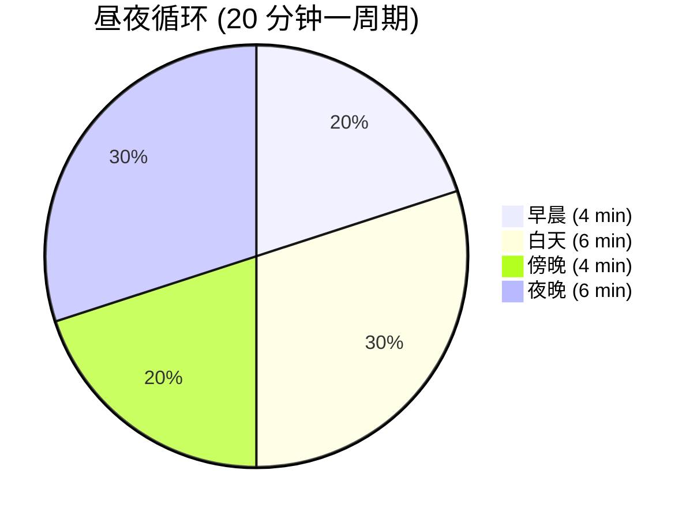

| 参数     | 值                 |
| -------- | ------------------ |
| 完整周期 | 1200 s（20 分钟）  |
| 白天时长 | 10 分钟（50%）     |
| 夜晚时长 | 10 分钟（50%）     |
| 初始时刻 | 0.25（从早晨开始） |
| 午夜角度 | 90°                |

### 1.2 天气与生态区

**来源：** `BiomeWeatherManager`

#### 全局天气参数

| 参数         | 值              |
| ------------ | --------------- |
| 天气更替间隔 | 120 s（2 分钟） |
| 月雨概率     | 15%（每个夜晚） |
| 大气过渡时间 | 10 s            |
| 音频过渡时间 | 5 s             |

#### 生态区定义

| 生态区 | 名称          | 半径   | 优先级 |
| ------ | ------------- | ------ | ------ |
| 0      | 沙漠 DESERT   | 426.5  | 50     |
| 1      | 热带 TROPICAL | 1296.0 | 0      |
| 2      | 沼泽 SWAMP    | 309.92 | 50     |

#### 各生态区天气权重

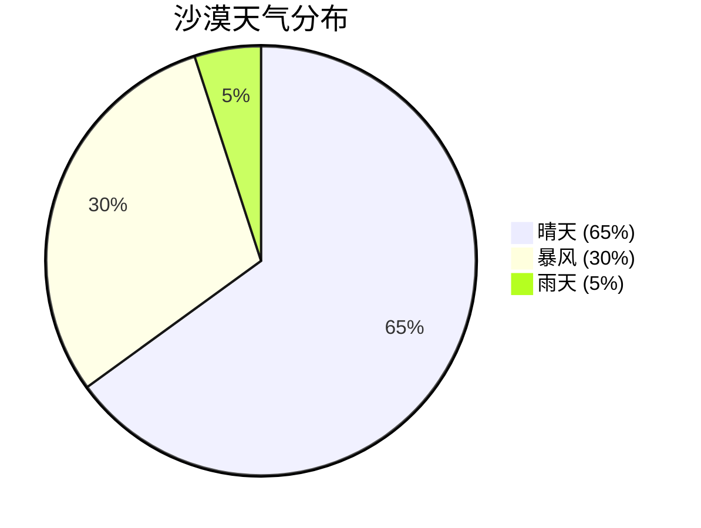

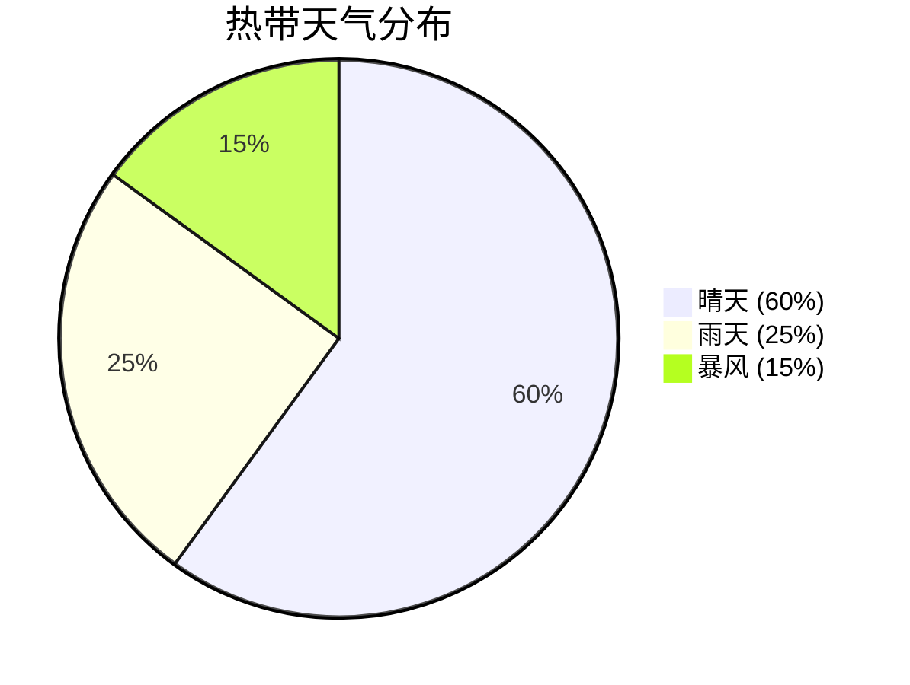

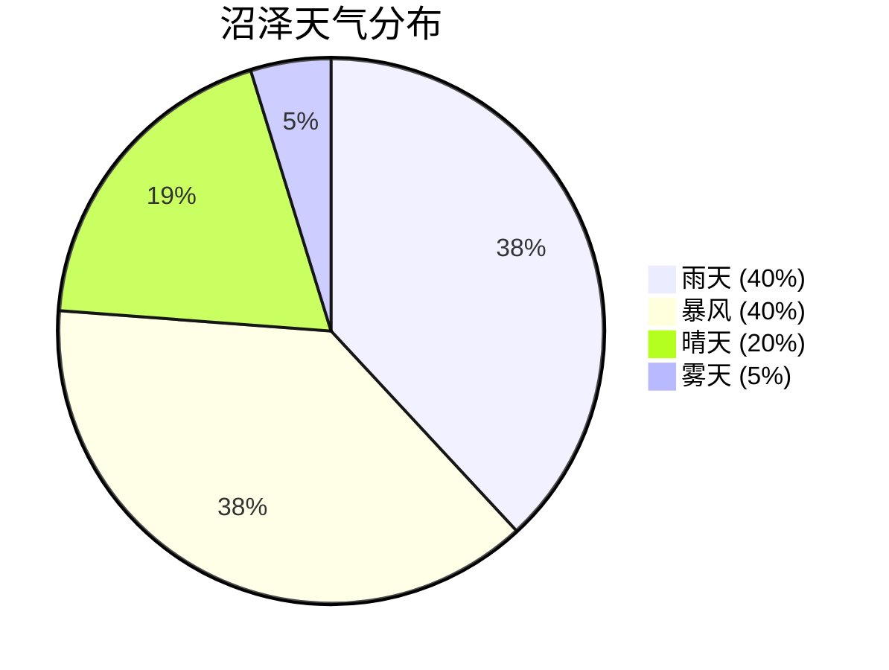

**默认天气**（生态区外）：晴天 50 / 暴风 25 / 雨天 25

### 1.3 钓鱼区域

**来源：** `ZoneManager`（11 个区域实例）

#### 区域层级关系

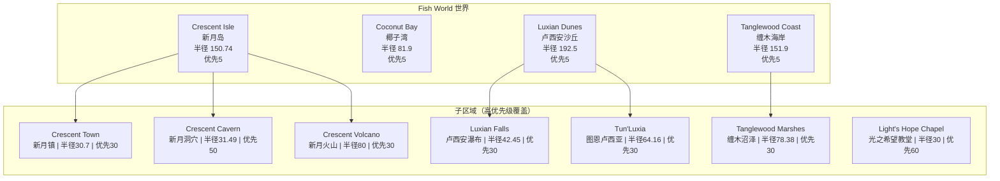

#### 区域水域类型

| 区域                        | 水域类型         | 鱼类            |
| --------------------------- | ---------------- | --------------- |
| Crescent Isle / Coconut Bay | 咸水             | 咸水鱼 + 通用鱼 |
| Crescent Cavern             | 淡水             | 淡水鱼          |
| **Crescent Volcano**        | **岩浆**         | **13 种岩浆鱼** |
| Luxian Dunes / Falls        | 淡水 + 咸水      | 混合鱼          |
| **Tanglewood Marshes**      | **沼泽**         | **12 种沼泽鱼** |
| Light's Hope Chapel         | 室内（隐藏天气） | 特殊            |

---

## 2. 鱼类系统

**来源：** `FishDatabase`（134 种鱼）

### 2.1 稀有度与生成概率

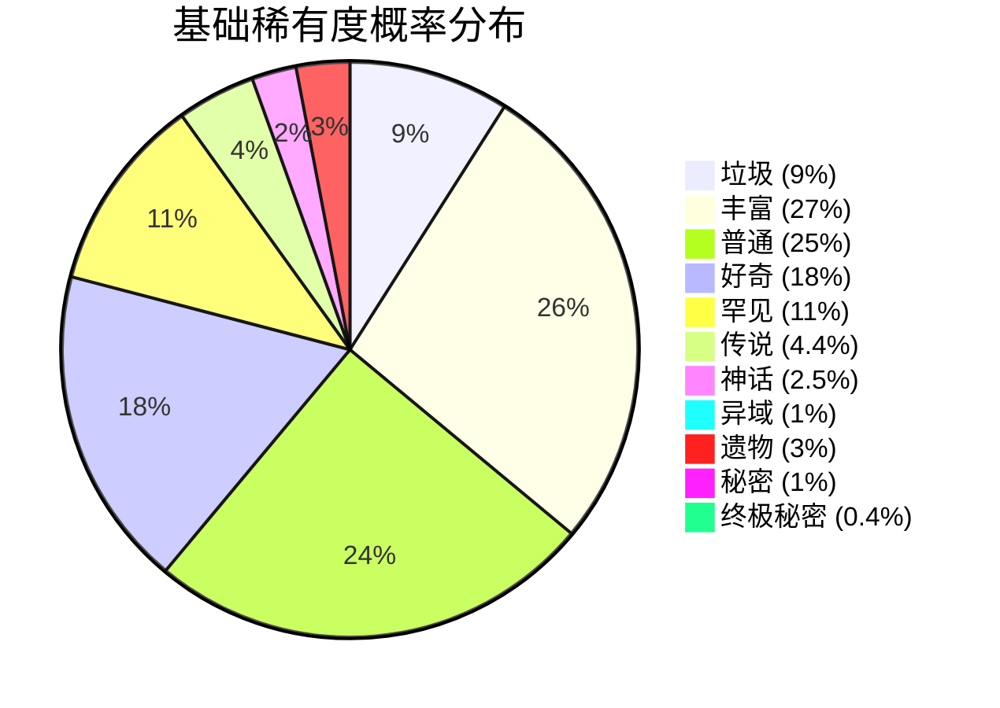

| 稀有度   | 基础概率 | 幸运力 | 说明               |
| -------- | -------- | ------ | ------------------ |
| 垃圾     | 9%       | −1.0   | 幸运越高越少       |
| 丰富     | 27%      | −0.8   | 最常见等级         |
| 普通     | 25%      | −0.1   |                    |
| 好奇     | 18%      | +0.35  |                    |
| 罕见     | 11%      | +0.6   |                    |
| 传说     | 4.4%     | +0.7   |                    |
| 神话     | 2.5%     | +0.6   |                    |
| 异域     | 1%       | +0.6   |                    |
| 遗物     | 3%       | +0.1   | 掉落附魔遗物       |
| 秘密     | 1%       | +2.0   | 强烈受幸运影响     |
| 终极秘密 | 0.4%     | +1.9   | 最受幸运影响的等级 |

**幸运力说明**：正值 = 幸运越高越容易出现；负值 = 幸运越高越少出现。使用**纯线性缩放**（无 sigmoid）。

#### 稀有度选择流程

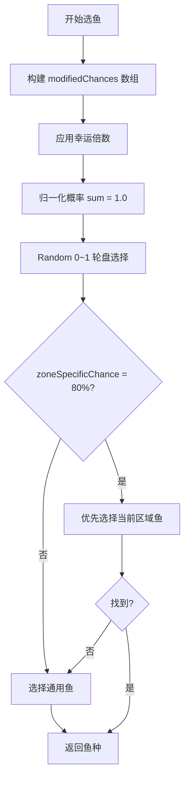

### 2.2 区域优先与生成条件

- **区域特定概率 = 80%** — 80% 的时间优先选择当前区域的鱼
- 选择顺序：区域鱼 → 通用鱼 → 外海鱼（兜底）

| 属性                    | 说明           |
| ----------------------- | -------------- |
| `canSpawnInFreshwater`  | 可在淡水区生成 |
| `canSpawnInSaltwater`   | 可在咸水区生成 |
| `canSpawnInSwampwater`  | 可在沼泽区生成 |
| `canSpawnInLava`        | 可在岩浆区生成 |
| `canSpawnInDay / Night` | 白天/夜晚限制  |
| `allowedZoneIDs[]`      | 区域白名单     |
| `forbiddenZoneIDs[]`    | 区域黑名单     |

### 2.3 时间/天气偏好（价值加成）

每条鱼可设定偏好时段和天气，匹配时获 **×2 价值加成**：

- 时段：`喜好早晨`、`喜好白天`、`喜好傍晚`、`喜好夜晚`
- 天气：`喜好晴天`、`喜好雨天`、`喜好暴风`、`喜好雾天`、`喜好月雨`、`喜好星雾`、`喜好天花`

### 2.4 鱼类变异修饰器

**来源：** `FishModifierManager`

#### 基础变异概率

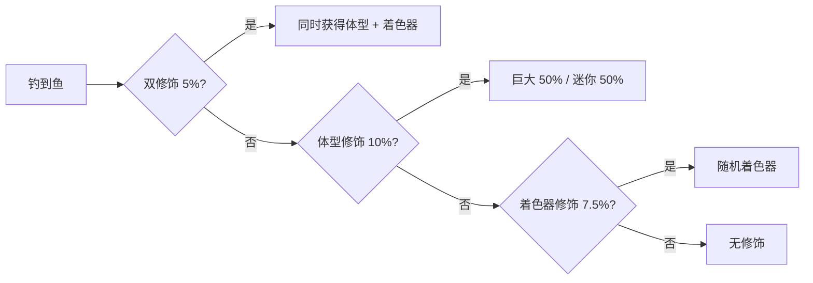

| 参数         | 概率  |
| ------------ | ----- |
| 体型修饰     | 10%   |
| 着色器修饰   | 7.5%  |
| 双重修饰     | 5%    |
| 巨大 vs 迷你 | 50:50 |

#### 着色器价值倍数

| ID  | 着色器名             | 价值倍数 |
| --- | -------------------- | -------- |
| 2   | 白化 Albino          | 1.5×     |
| 3   | 闪亮 Shiny           | 2.0×     |
| 4   | 金色 Golden          | 3.0×     |
| 5   | 幽灵 Ghastly         | 1.5×     |
| 6   | 神圣 Blessed         | 3.0×     |
| 7   | 诅咒 Cursed          | 1.1×     |
| 8   | 辐射 Radioactive     | 3.0×     |
| 9   | 消失 MissingShader   | 1.5×     |
| 10  | 沙化 Sandy           | 1.2×     |
| 11  | **全息 Holographic** | **5.0×** |
| 12  | 燃烧 Burning         | 4.0×     |
| 13  | 彩虹 Rainbow         | 3.0×     |
| 14  | 石化 Stone           | 1.3×     |
| 15  | 斑马 Zebra           | 1.3×     |
| 16  | 虎纹 Tiger           | 1.6×     |
| 17  | 迷彩 Camo            | 1.8×     |
| 18  | 电击 Electric        | 4.0×     |
| 19  | **静电 Static**      | **5.0×** |
| 20  | 虚空 Void            | 2.0×     |
| 21  | 冰冻 Frozen          | 2.0×     |
| 22  | 暗影 Shadow          | 2.0×     |
| 23  | 反色 Negative        | 1.5×     |
| 24  | 银河 Galaxy          | 3.0×     |

**巨大体型**倍数：1.5×。最终价值 = 体型倍数 × 着色器倍数（乘法叠加）。

### 2.5 稀有与特殊鱼类图鉴

#### 终极秘密鱼（稀有度 10 — 最高等级）

| 鱼名                         | ID  | 难度 | 价格范围          | 最大重量 | 水域   |
| ---------------------------- | --- | ---- | ----------------- | -------- | ------ |
| **猫鱼皇帝 Catfish Emperor** | 125 | 5    | $35,000 ~ $45,000 | 750 kg   | 全水域 |
| **二象蟹 Crab of Duality**   | 134 | 5    | $35,000 ~ $45,000 | 350 kg   | 全水域 |

#### 秘密鱼（稀有度 9）

| 鱼名                             | ID  | 价格范围          | 最大重量 | 水域   | 特殊条件 |
| -------------------------------- | --- | ----------------- | -------- | ------ | -------- |
| **瓦布布鱼 Wabubu Fish**         | 74  | $17,100 ~ $21,850 | 2 kg     | 全水域 | —        |
| **史蒂夫 Steve**                 | 116 | $17,100 ~ $21,850 | 3.5 kg   | 全水域 | —        |
| **拉格泰姆蛙 Ragtime Frog**      | 117 | $17,100 ~ $21,850 | 3.5 kg   | 沼泽   | 喜好雨天 |
| **毁灭之鱼 Decimated Fih**       | 121 | $17,100 ~ $21,850 | 4 kg     | 全水域 | —        |
| **卢西安骆鲨 Luxian Camelshark** | 128 | $18,900 ~ $24,150 | 9,000 kg | 咸水   | —        |

#### 异域鱼（稀有度 7 — Exotic）

| 鱼名                             | ID  | 价格范围          | 最大重量   | 水域      | 特殊       |
| -------------------------------- | --- | ----------------- | ---------- | --------- | ---------- |
| **地狱巨石斑 Hellmaw Grouper**   | 68  | $11,416 ~ $15,222 | 2,000 kg   | **岩浆**  | 岩浆最贵鱼 |
| **深渊蛇鱼 Abyssal Serpentfish** | 85  | $11,425 ~ $15,233 | 3,100 kg   | 咸水+沼泽 | **仅夜间** |
| **幼年巨齿鲨 Baby Megalodon**    | 86  | $12,600 ~ $16,800 | 120,000 kg | 咸水      | 最重鱼之一 |
| **天界白鳍 Celestial Whitefin**  | 87  | $11,412 ~ $15,216 | 1,500 kg   | 咸水      | —          |
| **海壳龙 Shellonodon**           | 88  | $11,832 ~ $15,776 | 40,000 kg  | 咸水      | —          |
| **棘背鳐 Spineback Ray**         | 89  | $11,448 ~ $15,264 | 6,000 kg   | 咸水      | —          |
| **恐壳巨像 Dreadshell Colossus** | 100 | $11,880 ~ $15,840 | 50,000 kg  | **沼泽**  | 沼泽最贵鱼 |
| **蜻蜓鱼 Dragonfly Fish**        | 126 | $11,400 ~ $15,201 | 70 kg      | 淡水      | —          |
| **皇家香蕉鱼 Royal Bananafish**  | 132 | $11,400 ~ $15,200 | 9 kg       | 淡水      | —          |
| **三头鲑鱼 Three-Headed Salmon** | 123 | $11,400 ~ $15,200 | 20 kg      | 咸水      | —          |

#### 传说鱼（稀有度 6 — Fabled）

| 鱼名                           | ID  | 价格范围         | 最大重量 | 水域     | 特殊       |
| ------------------------------ | --- | ---------------- | -------- | -------- | ---------- |
| 巨型鱿鱼 Giant Squid           | 33  | $4,898 ~ $9,797  | 512 kg   | 咸水     | —          |
| 大白鲨 Great White Shark       | 40  | $5,236 ~ $10,473 | 1,457 kg | 咸水     | —          |
| 远古战斗鱼 Ancient Warriorfish | 119 | $4,750 ~ $9,500  | 10 kg    | 淡水     | —          |
| 毒液观察者 Venomous Watcher    | 120 | $4,750 ~ $9,500  | 10 kg    | 沼泽     | **仅夜间** |
| 盲刃鱼 Blind Bladefish         | 122 | $4,750 ~ $9,500  | 10 kg    | 淡水     | **仅夜间** |
| 装甲暴鱼 Armored Brutefish     | 124 | $4,767 ~ $9,535  | 60 kg    | 咸水     | —          |
| 火成刺鳐 Igneous Stingray      | 129 | $5,250 ~ $10,500 | 1,500 kg | **岩浆** | —          |
| 红色恶魔鱼 Red Demonfish       | 130 | $4,854 ~ $9,708  | 400 kg   | **岩浆** | —          |
| 红色飞镖鳍 Red Dartfin         | 131 | $4,755 ~ $9,510  | 25 kg    | 咸水     | —          |
| 驼背雀鳝 Humpback Gar          | 133 | $4,787 ~ $9,575  | 110 kg   | 咸水     | —          |

#### 岩浆专属鱼类（13 种）

仅可在 **Crescent Volcano（新月火山）** 的岩浆中钓获：

| 鱼名                           | ID  | 稀有度 | 最高价格    | 最大重量 |
| ------------------------------ | --- | ------ | ----------- | -------- |
| 火焰孔雀鱼 Flame Guppy         | 67  | 1      | $24         | 0.3 kg   |
| 岩浆鲤 Magma Carp              | 70  | 1      | $24         | 3 kg     |
| 灰鳞鳟 Ashscale Trout          | 63  | 2      | $34         | 6 kg     |
| 玄武岩鳗 Basalt Eel            | 64  | 2      | $33         | 3 kg     |
| 煤鳍 Cinderfin                 | 65  | 3      | $71         | 2 kg     |
| 黑曜鱼 Obsidian Fish           | 72  | 3      | $72         | 2.5 kg   |
| 水晶梭鱼 Crystal Pike          | 66  | 4      | $190        | 10 kg    |
| 熔岩钓鱼者 Molten Angler       | 71  | 4      | $191        | 15 kg    |
| 伊弗利特梭鱼 Ifrit Barracuda   | 69  | 5      | $1,914      | 25 kg    |
| 黄铁矿鲷 Pyrite Snapper        | 73  | 5      | $1,922      | 20 kg    |
| 火成刺鳐 Igneous Stingray      | 129 | 6      | $10,500     | 1,500 kg |
| 红色恶魔鱼 Red Demonfish       | 130 | 6      | $9,708      | 400 kg   |
| **地狱巨石斑 Hellmaw Grouper** | 68  | **7**  | **$15,222** | 2,000 kg |

#### 沼泽专属鱼类（12 种）

仅可在 **Tanglewood（缠木海岸/缠木沼泽）** 区域钓获：

| 鱼名                             | ID  | 稀有度 | 最高价格    | 最大重量  | 特殊       |
| -------------------------------- | --- | ------ | ----------- | --------- | ---------- |
| 蓝鳃太阳鱼 Bluegill Sunfish      | 96  | 1      | $24         | 2 kg      | —          |
| 弹涂鱼 Mudskipper                | 103 | 1      | $150        | 1 kg      | —          |
| 弓鳍鱼 Bowfin                    | 97  | 2      | $34         | 3 kg      | —          |
| 沟鲶 Channel Catfish             | 98  | 2      | $35         | 10 kg     | —          |
| 铜头蛇 Cottonmouth Snake         | 99  | 3      | $72         | 3 kg      | —          |
| 青蛙 Frog                        | 101 | 3      | $71         | 1 kg      | —          |
| 鳄鱼龟 Alligator Snapping Turtle | 94  | 4      | $192        | 100 kg    | —          |
| 软壳龟 Soft Shelled Turtle       | 104 | 4      | $150        | 15 kg     | —          |
| 美洲鳄鱼 American Alligator      | 95  | 5      | $1,952      | 450 kg    | —          |
| 巨恒河鳄 Giant Gharial           | 102 | 5      | $1,999      | 100 kg    | —          |
| 毒液观察者 Venomous Watcher      | 120 | 6      | $9,500      | 10 kg     | **仅夜晚** |
| **恐壳巨像 Dreadshell Colossus** | 100 | **7**  | **$15,840** | 50,000 kg | —          |

#### 一次性捕获 & 任务鱼

| 鱼名                              | ID  | catchOnce | rewardsQuestItem | 掉落权重       | 特殊条件               |
| --------------------------------- | --- | --------- | ---------------- | -------------- | ---------------------- |
| 古代遗物碎片 Old Relic Piece      | 90  | ✗         | ✓                | **87**（最高） | 全水域                 |
| 苔藓遗物 Mossy Relic              | 91  | ✗         | ✓                | 10             | 全水域                 |
| 强力遗物 Powerful Relic           | 92  | ✗         | ✓                | 3              | 全水域                 |
| 神圣遗物 Godly Relic              | 93  | ✗         | ✓                | 1              | **已禁用**             |
| **神秘红宝石 Mysterious Red Gem** | 118 | **✓**     | ✓                | 10             | **仅月雨天气**，一次性 |

> 遗物鱼稀有度为 8，共享「遗物鱼」概率池（基础 3%）。其中古代遗物碎片掉落权重 87（占 87/101 ≈ 86%），神圣遗物已被禁用。**神秘红宝石**是唯一需要特定天气（月雨）且只能捕获一次的鱼。

### 2.6 最贵鱼类 Top 10（理论最大售价）

理论最大 = `最高价 × 巨大(1.5×) × 全息/静电(5.0×) × 天气/时段偏好(2.0×)`

| 排名 | 鱼名       | 基础最高价 | 理论最大售价 | 稀有度 |
| ---- | ---------- | ---------- | ------------ | ------ |
| 1    | 猫鱼皇帝   | $45,000    | **$675,000** | 10     |
| 2    | 二象蟹     | $45,000    | **$675,000** | 10     |
| 3    | 卢西安骆鲨 | $24,150    | **$362,250** | 9      |
| 4    | 瓦布布鱼   | $21,850    | **$327,750** | 9      |
| 5    | 史蒂夫     | $21,850    | **$327,750** | 9      |
| 6    | 拉格泰姆蛙 | $21,850    | **$327,750** | 9      |
| 7    | 毁灭之鱼   | $21,850    | **$327,750** | 9      |
| 8    | 幼年巨齿鲨 | $16,800    | **$252,000** | 7      |
| 9    | 恐壳巨像   | $15,840    | **$237,600** | 7      |
| 10   | 海壳龙     | $15,776    | **$236,640** | 7      |

---

## 3. 钓鱼机制

### 3.1 咬钩等待时间

**来源：** `RodController`（哈希 `6b9c3`）+ `EquipmentStatsManager`（哈希 `1fbef`）

```text
基础等待 = Random(13秒, 17秒)
吸引百分比 = Min(100, 装备吸引总值 / 100) → 范围 [0.0, 1.0]
实际等待 = (1.0 - 吸引百分比) × 基础等待
```

| 吸引值 | 吸引倍率 | 等待范围         | 平均等待 |
| ------ | -------- | ---------------- | -------- |
| 0      | 0%       | 13 ~ 17 秒       | 15 秒    |
| 50     | 50%      | 6.5 ~ 8.5 秒     | 7.5 秒   |
| 100    | 100%     | 0 ~ 0 秒（瞬咬） | 0 秒     |
| 225    | 100%上限 | 0 秒（硬上限）   | 0 秒     |

> **吸引增益（药水）效果**：将吸引原始值 ×2 后再除以 100，硬上限 100%。因此有效上限为 50 点原始吸引（×2 = 100%）。

#### 吸引率计算详细公式

```text
原始总值 = 鱼竿.吸引 + 鱼线.吸引 + 浮漂.吸引 + 附魔.吸引 + 成就.吸引

如果 吸引增益激活:
    增益值 = 2.0 × 原始总值 / 100.0
否则:
    增益值 = 原始总值（浮点数）

百分比 = Min(100.0, 增益值)
吸引率倍数 = Max(百分比 / 100, 0.0)    → 范围 [0.0, 1.0]
```

### 3.2 鱼重量分配曲线

```text
有效最大重量 = Min(玩家最大重量, 鱼种最大重量)
随机值 = Random(0, 1)

如果 大物率 > 阈值:
    曲线值 = Sin(随机值 × π/2)         ← 正弦曲线，偏向大鱼
否则:
    归一化率 = 大物率 / 100
    幂 = Lerp(归一化率, 常数A, 1.0)
    曲线值 = Pow(幂, 随机值)          ← 幂曲线分布

鱼重量 = Lerp(曲线值, 有效最大重量, 最小重量)
```

> 大物率越高，重量分布越偏向最大值。满大物率时使用正弦曲线，大幅提升获得大鱼的概率。

### 3.3 小游戏难度插值

**来源：** `FishingMinigameScript`

所有参数在「简单（difficulty=0）」和「困难（difficulty=1）」之间按鱼的难度值线性插值：

| 参数         | 简单  | 困难   | 说明           |
| ------------ | ----- | ------ | -------------- |
| 目标大小     | 1.2   | 0.7    | 命中条宽度     |
| 方向改变间隔 | 0.5 s | 0.4 s  | 鱼变向频率     |
| 鱼缓动时间   | 1.0 s | 0.19 s | 越小越灵活     |
| 钓获速度     | 0.2/s | 0.06/s | 进度条填充     |
| 丢失速度     | 0.1/s | 0.15/s | 进度条衰减     |
| 最大丢失倍数 | 1×    | 3×     | 长时间不中加速 |

- **丢失加速率** = 0.1（时间越久丢失越快）

### 3.4 物理与控制

| 参数         | 值    |
| ------------ | ----- |
| 重力         | 1.25  |
| 玩家速度     | 3.75  |
| 鱼目标判定框 | 0.1   |
| 进度条高度   | 2.8   |
| 准备时间     | 1.0 s |

### 3.5 VR 专属调整与低帧率辅助

| 参数            | 值            |
| --------------- | ------------- |
| VR 丢失速度倍数 | 1.0（无惩罚） |
| VR 目标大小加成 | +0.04         |
| VR 扳机阈值     | 0.15          |

| 参数         | 值       | 说明             |
| ------------ | -------- | ---------------- |
| 触发帧率     | < 30 FPS | 低于此值开始辅助 |
| 最大受益帧率 | 15 FPS   | 最大辅助值       |
| 最大加成     | +0.05    | 给目标大小       |
| 鱼速下限     | 0.95×    | 低帧不会过分减速 |

### 3.6 装备属性对小游戏的影响

**力量**（降低丢失速度）：

```text
丢失速度倍数 = Clamp(原始力量值, 0.25, 1.0)
```

力量越高，丢失速度越低，钓鱼小游戏越简单。最大减免 75%。

**专长**（增大命中框）：

```text
命中框倍数 = Max(专长倍率, 0.5)
```

专长越高，命中框越大。最低保底 0.5× 原始大小。

### 3.7 新手保护机制

```text
如果 总捕鱼数 < 20：
    使用教程模式（更大命中框，更慢鱼移动，更低丢失速度）
```

> **前 20 条鱼**使用教程难度参数，之后切换到正常参数。不可重新触发。

### 3.8 鱼竿参数

| 参数                 | 值      | 说明          |
| -------------------- | ------- | ------------- |
| 最短咬钩等待         | 13 秒   | `minBiteTime` |
| 最长咬钩等待         | 17 秒   | `maxBiteTime` |
| 激活冷却             | 1 秒    | 连续抛竿间隔  |
| 收竿延迟             | 1 秒    | `pocketDelay` |
| 最大抛竿距离（显示） | 40      | UI 显示最大值 |
| 扩展距离             | 50      | 实际检测范围  |
| 溅水音高范围         | 0.9~1.1 | 随机音高变化  |

---

## 4. 装备系统

### 4.1 属性倍率统一公式

所有属性使用相同的归一化公式：

```text
倍率 = (原始总值 / 100.0) + 1.0
```

| 属性   | 原始值来源                       | 倍率范围         |
| ------ | -------------------------------- | ---------------- |
| 幸运   | 鱼竿 + 鱼线 + 浮漂 + 附魔 + 成就 | 0.5× ~ 8.45×     |
| 力量   | 鱼竿 + 鱼线 + 浮漂 + 附魔        | 1.0× ~ 2.75×     |
| 专长   | 鱼竿 + 鱼线 + 浮漂 + 附魔        | 1.0× ~ 2.65×     |
| 吸引   | 鱼竿 + 鱼线 + 浮漂 + 附魔 + 成就 | 0.0% ~ 100% 上限 |
| 大物率 | 鱼竿 + 鱼线 + 浮漂 + 附魔        | 1.0× ~ 无上限    |

### 4.2 鱼竿（17 种）

| ID  | 名称         | 幸运    | 力量 | 专长 | 吸引   | 大物率 | 最大重量       | 商店价格    |
| --- | ------------ | ------- | ---- | ---- | ------ | ------ | -------------- | ----------- |
| 0   | 木棍钓竿     | −50     | 0    | 0    | 0      | −100   | 5 kg           | —           |
| 1   | 坚固木竿     | 15      | 0    | 5    | 20     | 0      | 30 kg          | 2,000       |
| 2   | 伸缩鱼竿     | 10      | 15   | 15   | 10     | 5      | 2,005 kg       | 15,000      |
| 3   | 暗木鱼竿     | 30      | 10   | 10   | 30     | 5      | 1,800 kg       | 25,000      |
| 4   | **符文钢竿** | **90**  | 25   | 20   | 30     | 40     | **100,000 kg** | —           |
| 5   | DEBUG 鱼竿   | 0       | 0    | 0    | 0      | 0      | 1 kg           | 隐藏        |
| 6   | 阳叶鱼竿     | 10      | 5    | 10   | 20     | 15     | 250 kg         | —           |
| 7   | 极速鱼竿     | 20      | 5    | 15   | **65** | 0      | 1,500 kg       | 55,000      |
| 8   | 幸运鱼竿     | **100** | 10   | 5    | 10     | 77     | 1,500 kg       | 75,000      |
| 9   | 玩具鱼竿     | 0       | 0    | 0    | 0      | 0      | 15 kg          | 750         |
| 10  | 外星鱼竿     | 50      | 10   | 5    | 40     | 30     | 32,000 kg      | —           |
| 11  | 永恒之竿     | 150     | 30   | 30   | 50     | 10     | 500,000 kg     | 等级500解锁 |
| 12  | 法老之竿     | **200** | 20   | 40   | −10    | 30     | 100,000 kg     | **750,000** |
| 13  | 细长鱼竿     | 20      | 10   | 10   | 25     | 20     | 500 kg         | 10,000      |
| 14  | 打磨木竿     | 40      | 10   | 10   | 10     | 45     | 500 kg         | 15,000      |
| 15  | 锈牙鱼竿     | 70      | 20   | 20   | 25     | 35     | 35,000 kg      | 250,000     |

### 4.3 鱼线（9 种）

| ID  | 名称         | 幸运 | 力量   | 专长   | 吸引   | 大物率 | 商店价格 |
| --- | ------------ | ---- | ------ | ------ | ------ | ------ | -------- |
| 0   | 基础鱼线     | 0    | 0      | 0      | 0      | 0      | —        |
| 1   | 碳纤维线     | 0    | 7      | 7      | 0      | 0      | 1,000    |
| 2   | **堕神之发** | 0    | **50** | **50** | **50** | 0      | —        |
| 3   | 幸运鱼线     | 30   | 0      | 0      | 0      | 0      | 10,000   |
| 4   | 碧蓝鱼线     | 0    | 0      | 0      | 5      | 0      | 100      |
| 5   | 冥犬皮毛     | 25   | −5     | −15    | 20     | 10     | —        |
| 6   | 重型鱼线     | 0    | 10     | 10     | 0      | 10     | 4,000    |
| 7   | 钻石鱼线     | 25   | 15     | 15     | 10     | 0      | 25,000   |
| 8   | 调味鱼线     | 0    | 0      | 0      | 0      | 30     | 10,000   |

### 4.4 浮标（14 种）

| ID  | 名称               | 幸运   | 力量 | 专长 | 吸引 | 大物率 | 商店价格 |
| --- | ------------------ | ------ | ---- | ---- | ---- | ------ | -------- |
| 0   | 基础浮标           | 0      | 0    | 0    | 0    | 0      | —        |
| 1   | 蓝色浮标           | 5      | 0    | 0    | 0    | 0      | 100      |
| 2   | 猫形浮标           | 5      | 0    | 0    | 0    | 10     | 2,000    |
| 3   | **幸运浮标**       | **40** | 0    | 0    | 0    | 0      | 10,000   |
| 7   | DEBUG 浮标         | 0      | 50   | 50   | 50   | 50     | 隐藏     |
| 12  | 装饰浮标           | 10     | 5    | 0    | 10   | 0      | 10,000   |
| 13  | **彩虹史莱姆浮标** | **30** | 10   | 0    | 10   | 10     | —        |

### 4.5 特殊商品

| 商品名                              | 价格    | 类型     | 说明                 |
| ----------------------------------- | ------- | -------- | -------------------- |
| 神秘外星果汁 Mysterious Alien Juice | 200,000 | 任务物品 | 购买后**从商店消失** |
| 神秘蓝宝石 Mysterious Blue Gem      | 50,000  | 任务物品 | 购买后**从商店消失** |

---

## 5. 附魔系统

**来源：** `EnchantmentDatabase`（42 种附魔）

### 5.1 遗物品质 → 附魔稀有度概率

| 遗物品质 | 普通  | 稀有  | 罕见  | 史诗  | 传说     |
| -------- | ----- | ----- | ----- | ----- | -------- |
| 普通遗物 | 75.3% | 18.1% | 5.0%  | 1.5%  | **0.1%** |
| 稀有遗物 | 20.8% | 52.6% | 20.8% | 5.2%  | 0.7%     |
| 史诗遗物 | 2.3%  | 22.2% | 62.2% | 11.1% | 2.2%     |
| 传说遗物 | 5.6%  | 16.7% | 33.3% | 38.9% | **5.6%** |

### 5.2 完整附魔数据表

#### 传说附魔（稀有度 4 — 极其稀有）

| ID  | 名称                                  | 幸运    | 力量   | 专长   | 吸引    | 大物率 | 最大重量       | 特殊效果 |
| --- | ------------------------------------- | ------- | ------ | ------ | ------- | ------ | -------------- | -------- |
| 7   | **神之幸运** God's Own Luck           | **250** | —      | —      | —       | —      | —              | 被动幸运 |
| 38  | **最强钓手** Strongest Angler         | 20      | **85** | **85** | 10      | 20     | **+1,000,000** | —        |
| 30  | **天国信使** Messenger of the Heavens | —       | —      | —      | **100** | —      | —              | —        |

#### 史诗附魔（稀有度 3）

| ID  | 名称                        | 幸运    | 力量 | 专长 | 吸引   | 大物率 | 最大重量 | 特殊效果            |
| --- | --------------------------- | ------- | ---- | ---- | ------ | ------ | -------- | ------------------- |
| 2   | 闪亮猎手 Shiny Hunter       | 80      | —    | —    | —      | —      | —        | +20% 闪亮着色器概率 |
| 6   | **赚钱机器** Money Maker    | —       | —    | —    | —      | 20     | —        | **+20% 出售价**     |
| 9   | 变异者 Mutator              | 30      | —    | —    | —      | —      | —        | **变异概率 ×2**     |
| 10  | 只要大家伙 BIG BOYS ONLY    | —       | —    | —    | —      | **65** | +100,000 | —                   |
| 11  | 均衡大师 Master of Balance  | 20      | 20   | 20   | 20     | 20     | +400     | —                   |
| 17  | **双钩!!** Double Up!!      | 20      | —    | —    | —      | —      | —        | **25% 双倍渔获**    |
| 24  | 天选之幸 Luck of the Chosen | **100** | —    | —    | —      | 10     | —        | —                   |
| 34  | **速度恶魔** Speed Demon    | —       | —    | —    | **60** | —      | —        | 速度恶魔加成        |
| 39  | 克里普坦之子 Son of Kriptan | 50      | 50   | 50   | 50     | 50     | +50,000  | 白天专属            |

#### 稀有附魔（稀有度 2）

| ID  | 名称                             | 幸运    | 力量 | 专长 | 吸引    | 大物率 | 最大重量 | 特殊效果          |
| --- | -------------------------------- | ------- | ---- | ---- | ------- | ------ | -------- | ----------------- |
| 1   | 垂涎欲滴 Mouth-Watering          | —       | —    | —    | 25      | 30     | —        | —                 |
| 4   | **开悟** Enlightened             | —       | —    | 10   | —       | —      | —        | **+35% 经验加成** |
| 5   | 恶魔猎人 Demon Hunter            | —       | 10   | —    | —       | —      | —        | +15 速度恶魔加成  |
| 8   | **次元线** Dimensional Line      | —       | —    | 10   | —       | —      | —        | **30% 无视区域**  |
| 12  | 全能者 All-Rounder               | 10      | 10   | 10   | 10      | 10     | +100     | —                 |
| 18  | 光速卷线 Light-Speed Reels       | —       | —    | —    | **40**  | —      | —        | —                 |
| 25  | 耐心 Patient                     | **100** | —    | —    | **−40** | —      | —        | 牺牲吸引换幸运    |
| 37  | 出了名的大 Notoriously Big       | —       | —    | —    | —       | 10     | +50,000  | —                 |
| 41  | 幸运献祭 Luck Sacrifice          | **−60** | —    | —    | **60**  | —      | —        | 牺牲幸运换吸引    |
| 42  | **夜间守望者** The Night Watcher | 30      | 30   | 30   | 30      | 30     | +25,000  | 夜间专属          |

#### 普通附魔（稀有度 1）

| ID  | 名称                    | 关键属性               | 特殊效果    |
| --- | ----------------------- | ---------------------- | ----------- |
| 3   | 强力握持 Power Grip     | 力量15/专长15          | —           |
| 13  | 雨之恋人 Rain Lover     | 幸运 50                | 下雨时激活  |
| 14  | 雾中行者 Fog Dweller    | 幸运 50                | 起雾时激活  |
| 15  | 白日行者 Day Walker     | 幸运 50                | 白天激活    |
| 16  | 夜行者 Night Stalker    | 吸引 35                | 夜间激活    |
| 26  | 急躁 Impatient          | 吸引30/幸运−30         | —           |
| 28  | 学生 Student            | 专长 5                 | +12% 经验   |
| 31  | 犹豫不决 Undecided      | 全属性 +5              | —           |
| 32  | 不稳定 Unstable         | 幸运10/力量−10/专长−10 | 变异 ×1.5   |
| 36  | 胖子追逐者 Tubby Chaser | 大物率 5               | +1,000 重量 |

#### 基础附魔（稀有度 0）

| ID  | 名称                      | 关键属性                  | 特殊效果       |
| --- | ------------------------- | ------------------------- | -------------- |
| 19  | 大物加成 Big Catch Boost  | 大物率 10                 | —              |
| 20  | 快速 Speedy               | 吸引 10                   | —              |
| 21  | 专家 Expert               | 专长 10                   | —              |
| 22  | 强力 Powerful             | 力量 10                   | —              |
| 23  | 幸运 Lucky                | 幸运 15                   | —              |
| 27  | 垃圾回收者 Trash Wrangler | 吸引20/幸运**−100**       | 大量垃圾鱼     |
| 29  | 好奇 Curious              | 专长 5                    | +5% 经验       |
| 33  | 口袋观察者 Pocket Watcher | —                         | **+5% 出售价** |
| 35  | 加固 Reinforced           | —                         | +400 重量      |
| 40  | 懒惰 Lazy                 | 专长75/吸引**−75**/幸运10 | 无体力消耗型   |

### 5.3 特殊效果触发机制

| 特殊效果         | 触发方式                               | 参数             |
| ---------------- | -------------------------------------- | ---------------- |
| 双钩 Double Hook | 每次钓鱼时掷骰 `Random(0,1) < 概率`    | 概率 = 25%       |
| 变异提升 Mutator | 乘以变异检测的基础概率                 | 倍数 = 2.0×      |
| 次元线           | 每次抛竿 `Random(0,1) < 概率` 无视区域 | 概率 = 30%       |
| 赚钱机器         | 售鱼时 `价格 × (1 + 百分比/100)`       | 百分比 = 20%     |
| 口袋观察者       | 售鱼时 `价格 × (1 + 百分比/100)`       | 百分比 = 5%      |
| 开悟             | 获取经验时 `XP × (1 + 百分比/100)`     | 百分比 = 35%     |
| 学生             | 获取经验时 `XP × (1 + 百分比/100)`     | 百分比 = 12%     |
| 好奇             | 获取经验时 `XP × (1 + 百分比/100)`     | 百分比 = 5%      |
| 恶魔猎人         | 强制着色器 = 恶魔着色器                | +15 速度恶魔加成 |
| 闪亮猎手         | 强制着色器 = 闪亮着色器                | +20% 闪亮概率    |
| 被动幸运         | 永久添加到幸运总值                     | +250 幸运        |
| 速度恶魔         | 增加吸引统计                           | +60 吸引         |

### 5.4 海域事件与附魔叠加

```text
最终变异概率 = 海域事件变异倍率 × 附魔变异倍率 × 基础变异概率
最终幸运 = 海域事件幸运倍率 × 装备幸运倍率 × buff倍率
强制着色器概率 = 海域事件强制概率（85%）
```

| 海域事件参数                       | 说明               |
| ---------------------------------- | ------------------ |
| `seaEventLuckMultiplier`           | 乘以综合幸运       |
| `seaEventModifierChanceMultiplier` | 乘以变异概率       |
| `seaEventForcedShaderModifier`     | 指定强制着色器     |
| `seaEventForceChance`              | 强制着色器应用概率 |

---

## 6. 增益系统

**来源：** `BuffManager`

### 6.1 增益类型

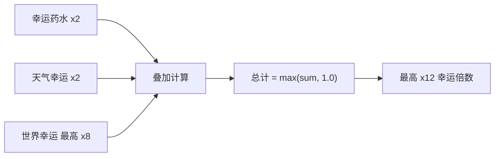

| 增益             | 倍数             | 持续时间     | 叠加方式 |
| ---------------- | ---------------- | ------------ | -------- |
| 幸运药水（个人） | 2.0×             | 累加计时     | 时间叠加 |
| 吸引增益         | 2.0×（冷却减半） | 累加计时     | 时间叠加 |
| 天气幸运         | 2.0×             | 天气持续时段 | 自动     |

### 6.2 世界幸运增益（全服共享，可购买）

| 等级 | 持续时间 | 幸运倍数 |
| ---- | -------- | -------- |
| 1级  | 30 分钟  | 2.0×     |
| 2级  | 45 分钟  | 4.0×     |
| 3级  | 90 分钟  | 8.0×     |

- 升级时剩余时间按 50% 折损转换
- 通过 VRC 经济系统购买
- 全服同步广播

### 6.3 综合幸运最终公式

```text
装备幸运 = (鱼竿.luck + 鱼线.luck + 浮漂.luck + 附魔.luck + 成就.luck) / 100 + 1.0
宠物幸运 = (宠物幸运等级) / 100 + 1.0
buff总倍率 = 药水倍率(2.0) + 世界幸运倍率(2/4/8) + 天气幸运倍率(2.0)

最终幸运 = 装备幸运 × buff总倍率
理论最高 = 2 + 8 + 2 = 12× 幸运
```

> **注意**：幸运力（luckPower）用于调整稀有度概率分布，实际实现为**纯线性**计算，无 sigmoid 平滑曲线。

---

## 7. 海域事件

**来源：** `SeaEventSpawner` + 海域事件条目

### 7.1 生成参数

| 参数           | 值               |
| -------------- | ---------------- |
| 最大同时事件数 | 2                |
| 事件持续时间   | 600 s（10 分钟） |
| 事件半径       | 15               |
| 生成点数量     | 6                |
| 每点生成半径   | 136.24           |

### 7.2 事件列表

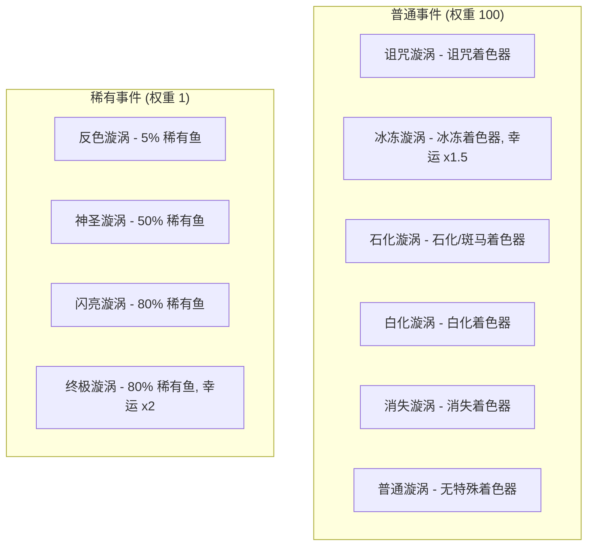

**普通事件**：每种特定着色器 2× 变异概率，85% 获得指定着色器。
**稀有事件**：极低权重（1 vs 100），但提供 5%–80% 稀有鱼概率。

---

## 8. 船只系统

**来源：** 船只条目 + `BoatController`

### 8.1 船只数据

| ID  | 名称         | 价格          | 速度   | 加速 | 转向 | 加速器     |
| --- | ------------ | ------------- | ------ | ---- | ---- | ---------- |
| 0   | 冲浪板       | 800           | 5      | 2    | 70   | 无         |
| 1   | 划艇         | 3,000         | 5      | 2    | 50   | 无         |
| 2   | 小艇         | 30,000        | 10     | 4    | 65   | 无         |
| 3   | **豪华快艇** | **1,000,000** | **25** | 5    | 65   | 2.0×/8s CD |
| 4   | 小型游艇     | 200,000       | 20     | 3    | 55   | 1.2×       |
| 5   | 爱好者船     | 15,000        | 8      | 3    | 80   | 无         |
| 6   | 独木舟       | 2,000         | 5      | 2    | 50   | 无         |

**船只物理**：水面高度 11.9，浮力幅度 0.06，浮力速度 1.0

### 8.2 船只皮肤

**来源：** `BoatSkinDatabase`（33 种皮肤）

#### 冲浪板皮肤（Boat ID: 0）

| 皮肤名                    | 价格 | 特殊                |
| ------------------------- | ---- | ------------------- |
| Default Surfboard（默认） | 免费 | 默认                |
| Sunset Surfboard（日落）  | 500  | —                   |
| Sakura Surfboard（樱花）  | 750  | —                   |
| Nice Rice Board（好米）   | 750  | —                   |
| Prism SurfBoard（棱镜）   | 500  | **已禁用/不可购买** |

#### 划艇皮肤（Boat ID: 1）

| 皮肤名                      | 价格  | 特殊                |
| --------------------------- | ----- | ------------------- |
| Default Skin（默认）        | 免费  | 默认                |
| Lifeguard Rowboat（救生员） | 750   | —                   |
| Gloomy Rowboat（阴郁）      | 750   | —                   |
| Luxury Rowboat（豪华）      | 1,000 | —                   |
| Prism Rowboat（棱镜）       | 1     | **已禁用/不可购买** |

#### 小艇皮肤（Boat ID: 2）

| 皮肤名                         | 价格  |
| ------------------------------ | ----- |
| Default Skin（默认）           | 500   |
| Aquatic Camo Dingy（水域迷彩） | 1,250 |
| Pink Tribal Dingy（粉红部落）  | 5,000 |
| Speedboat Dingy（快艇）        | 2,000 |

#### 豪华快艇皮肤（Boat ID: 3）

| 皮肤名                                  | 价格          | 特殊       |
| --------------------------------------- | ------------- | ---------- |
| Default Skin（默认）                    | 免费          | 默认       |
| Deep Blue Skin（深蓝）                  | 20,000        | —          |
| Gold and Blue（金蓝）                   | 25,000        | —          |
| Crusader Skin（十字军）                 | 35,000        | —          |
| Purple Menace Skin（紫色威胁）          | 35,000        | —          |
| Prism Luxury Speedboat（棱镜）          | 5             | **已禁用** |
| **Prism Luxury Speedboat v2**（棱镜v2） | **1,000,000** | 最贵皮肤   |

#### 小型游艇皮肤（Boat ID: 4）

| 皮肤名                     | 价格        |
| -------------------------- | ----------- |
| Clean（洁净，默认）        | 500         |
| Glacial（冰川）            | 2,500       |
| Bubblegum Pink（泡泡糖粉） | 5,000       |
| Hot Reels（热卷）          | 5,000       |
| Fundido（熔融）            | 8,000       |
| **24K**（24K金）           | **100,000** |

#### 爱好者船皮肤（Boat ID: 5）

| 皮肤名                     | 价格  |
| -------------------------- | ----- |
| Default Skin（默认）       | 500   |
| Stealth Skin（隐身）       | 1,000 |
| Purple Dragon Skin（紫龙） | 2,500 |
| Red Temple Skin（赤庙）    | 3,000 |

#### 独木舟皮肤（Boat ID: 6）

| 皮肤名                          | 价格 | 特殊                |
| ------------------------------- | ---- | ------------------- |
| Default Skin（默认）            | 免费 | 默认                |
| Beta Tester Skin（Beta 测试者） | 750  | **已禁用/不可购买** |

---

## 9. 宠物系统

**来源：** `PetStats` + `AFKPet` + `PetDatabase`

### 9.1 宠物列表

| ID  | 宠物名                               | 稀有度        | 默认解锁 | 获取方式           |
| --- | ------------------------------------ | ------------- | -------- | ------------------ |
| 0   | Basic Pet（基础宠物）                | 0（普通）     | ✗        | 未知               |
| 1   | **Fishing Frog**（钓鱼蛙）           | 0（普通）     | **✓**    | 默认拥有           |
| 2   | **Bucket Capybara**（水桶水豚）      | 1（稀有）     | ✗        | 每日登录第1周第7天 |
| 3   | Fishing Frog Nitro（Nitro 钓鱼蛙）   | 0（普通）     | ✗        | Discord Nitro 奖励 |
| 4   | **Lucky Cat (Patreon)**（招财猫）    | **4（传说）** | ✗        | Patreon 支持者独占 |
| 5   | **Engineer Frog (Beta)**（工程师蛙） | 3（史诗）     | ✗        | Beta 测试者奖励    |

### 9.2 基础参数与升级系统

| 参数         | 基础值           |
| ------------ | ---------------- |
| 基础钓鱼间隔 | 600 s（10 分钟） |
| 基础容量     | 5 条鱼           |
| 基础最大重量 | 10 kg            |
| 可钓变异鱼   | 否               |

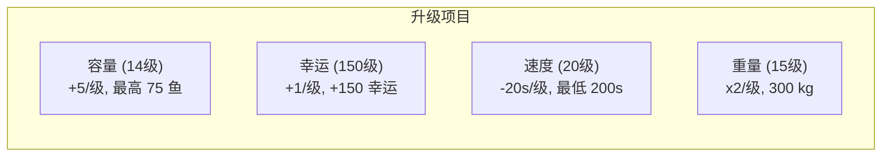

| 升级项   | 最大等级 | 每级加成   | 满级效果       |
| -------- | -------- | ---------- | -------------- |
| 容量     | 14       | +5 鱼/级   | 总计 75 鱼     |
| 幸运     | 150      | +1/级      | +150 幸运      |
| 钓鱼速度 | 20       | −20 s/级   | 最低 200s 间隔 |
| 最大重量 | 15       | ×2 重量/级 | 300 kg         |

### 9.3 升级成本分析

| 升级项 | 1级 → 满级      | 总升级点 | 满级效果                  |
| ------ | --------------- | -------- | ------------------------- |
| 容量   | 5 → 75 鱼       | 14 点    | 15× 基础容量              |
| 幸运   | 0 → +150        | 150 点   | 等同法老之竿（75%幸运值） |
| 速度   | 600s → 200s     | 20 点    | 3× 钓鱼频率               |
| 重量   | 10 → 327,680 kg | 15 点    | 2^15 × 10 kg              |

> **满级宠物每小时理论产出**：75 条鱼 × (3600/200) = **每小时最多 1,350 条鱼**（若容量允许且持续挂机）

### 9.4 AFK 宠物行为

| 参数           | 值  |
| -------------- | --- |
| 徘徊半径       | 0.3 |
| 徘徊速度       | 0.5 |
| 浮动幅度       | 0.1 |
| 动画剔除距离   | 25  |
| DEBUG 钓鱼间隔 | 5 s |

---

## 10. 玩家成长系统

### 10.1 等级与经验

**来源：** `PlayerStatsManager`（哈希 `2baf2`）

| 参数           | 值      |
| -------------- | ------- |
| 等级上限       | 1000    |
| 经验阈值数组   | 1001 个 |
| 升级特效范围   | 20 单位 |
| 经验条动画速度 | 0.2     |
| 保存间隔       | 3600 s  |

使用**二分搜索**在累计经验阈值数组中查找当前等级：

```text
当前等级起始经验 = GetTotalXPForLevel(当前等级)
所需经验 = GetXPRequiredForLevel(当前等级)
等级内经验 = 总经验 − 起始经验
进度 = Clamp01(等级内经验 / 所需经验)
```

### 10.2 经验阈值完整数据

#### 早期等级 XP 需求（1-10 级精确值）

| 等级 | 1   | 2   | 3   | 4   | 5   | 6   | 7   | 8   | 9   | 10  |
| ---- | --- | --- | --- | --- | --- | --- | --- | --- | --- | --- |
| XP   | 120 | 140 | 160 | 185 | 210 | 240 | 270 | 305 | 340 | 400 |

#### 分段 XP 阈值

| 等级范围    | 每级 XP 需求 | 说明         |
| ----------- | ------------ | ------------ |
| 1 ~ 10      | 120 ~ 400    | 独立数组查表 |
| 11 ~ 49     | **650**      | 固定值       |
| 50 ~ 499    | **1,000**    | 固定值       |
| 500 ~ 899   | **2,000**    | 固定值       |
| 900 ~ 1,000 | **4,000**    | 最高固定值   |

#### 累计 XP 里程碑

| 等级 | 累计总 XP     | 该级总花费 |
| ---- | ------------- | ---------- |
| 10   | 1,970         | 400        |
| 20   | 8,220         | 650        |
| 50   | 27,720        | 1,000      |
| 100  | 77,720        | 1,000      |
| 200  | 177,720       | 1,000      |
| 500  | 477,720       | 2,000      |
| 1000 | **1,677,720** | 4,000      |

> **满级（Lv1000）需要总计 1,677,720 XP**。以终极秘密鱼（40 XP/条）为基准，需要钓约 41,943 条终极秘密鱼。

### 10.3 每种稀有度的 XP 奖励

| 稀有度                   | 每条鱼 XP |
| ------------------------ | --------- |
| 垃圾 Trash               | 10        |
| 丰富 Abundant            | 15        |
| 普通 Common              | 15        |
| 好奇 Curious             | 20        |
| 罕见 Elusive             | 20        |
| 遗物 Relic               | 20        |
| 传说 Fabled              | 25        |
| 神话 Mythic              | 25        |
| 异域 Exotic              | 30        |
| 秘密 Secret              | 35        |
| 终极秘密 Ultimate Secret | 40        |

### 10.4 追踪统计数据（均网络同步）

- `level` — 当前等级
- `xp` — 累计经验
- `money` — 当前货币
- `fishCaught` — 总钓鱼数
- `rareFishCaught` — 稀有鱼钓获数
- `fishSold` — 总出售数
- `timePlayed` — 游戏时长（秒）
- `bountiesCompleted` — 已完成赏金

### 10.5 称号与成就系统

**来源：** `AchievementSystem`（34 个称号/成就）

#### 等级里程碑称号

| 称号名                       | 要求          | 幸运奖励 | 经验奖励 | 金币奖励 |
| ---------------------------- | ------------- | -------- | -------- | -------- |
| 兴奋！Excited!               | 等级 10       | 0        | 0        | 0        |
| 专家 Expert                  | 等级 50       | 0        | 0        | 0        |
| 光环农民 Aura Farmer         | 等级 100      | 0        | 0        | 0        |
| 鱼惧我 Fish Fear Me          | 等级 200      | 0        | 0        | 0        |
| 草帽海贼！Straw Hat Pirate!  | 等级 500      | 0        | 0        | 0        |
| **水之神 God of the Waters** | **等级 1000** | 0        | 0        | 0        |

#### 钓鱼里程碑称号

| 称号名                       | 要求            | 经验奖励     |
| ---------------------------- | --------------- | ------------ |
| 学徒钓手 Apprentice Angler   | 捕鱼 10         | 100 XP       |
| 老练钓手 Seasoned Angler     | 捕鱼 100        | 400 XP       |
| 大师钓手 Master Angler       | 捕鱼 500        | 800 XP       |
| 卓越钓手 Ascendant Angler    | 捕鱼 2,000      | 1,600 XP     |
| 超越钓手 Transcendent Angler | 捕鱼 5,000      | 1,600 XP     |
| **神圣钓手 Divine Angler**   | **捕鱼 10,000** | **1,600 XP** |

#### 售鱼里程碑称号

| 称号名                       | 要求        | 金币奖励 | 经验奖励 |
| ---------------------------- | ----------- | -------- | -------- |
| 推销员 Salesman              | 卖鱼 10     | 25       | 25 XP    |
| 辛叶关联 Sunleaf Affiliate   | 卖鱼 100    | 1,000    | 1,000 XP |
| 商人 Business Man            | 卖鱼 1,000  | 0        | 0        |
| 辛叶股东 Sunleaf Shareholder | 卖鱼 3,000  | 0        | 0        |
| 首席执行官 CEO               | 卖鱼 10,000 | 0        | 0        |

#### 区域图鉴完成称号

完成各区域的鱼类图鉴可获得 **+15 幸运**加成！

| 称号名                                 | 区域                         | 幸运奖励 | 金币 | 经验  |
| -------------------------------------- | ---------------------------- | -------- | ---- | ----- |
| 阿努比斯的门徒 Anubis' Disciple        | Luxian Dunes（卢西安沙丘）   | **+15**  | 100  | 50 XP |
| 可可狂人！Nuts for Coconuts!           | Coconut Bay（椰子湾）        | **+15**  | 100  | 50 XP |
| 捉鬼敢死队 Ghostbuster                 | Tanglewood（缠木沼泽）       | **+15**  | 100  | 50 XP |
| 爱国研究者 Patriotic Researcher        | Crescent Isle（新月岛）      | **+15**  | 100  | 50 XP |
| 穿越火与焰 Through the Fire and Flames | Crescent Volcano（新月火山） | **+15**  | 100  | 50 XP |

> **总计**：完成全部 5 个区域图鉴可获得 **+75 永久幸运**，这是游戏中最重要的隐藏幸运来源之一。

#### 特殊称号

| 称号名                             | 条件                  | 奖励       | 隐藏  | Discord 独占 |
| ---------------------------------- | --------------------- | ---------- | ----- | ------------ |
| 赏金猎人 Bounty Hunter             | 完成 50 个悬赏        | 5,000 金币 | ✗     | ✗            |
| 荣誉格洛平古斯 Honorary Glorpingus | 帮 Glorpingo 找到妻子 | 300 XP     | ✗     | ✓            |
| 意面爱好者 Pastrami Enjoyer        | 帮 Celly 找到钥匙     | 300 XP     | ✗     | ✓            |
| 盾之勇者 Shield Hero               | 获得 Joeblo 认可      | 300 XP     | ✗     | ✓            |
| 考古学家 Archaeologist             | 帮助 Harrison         | 0          | ✗     | ✓            |
| Beta 测试员 Beta Tester            | BETA_PLAYER 标记      | 0          | **✓** | ✗            |
| 早期支持者 Early Supporter         | 早期支持标记          | 0          | **✓** | ✗            |
| 支持者 Supporter                   | 支持标记              | 0          | **✓** | ✗            |
| Nitro Booster                      | Discord Nitro         | 0          | **✓** | ✓            |
| Nitro Addict                       | Discord Nitro         | 0          | **✓** | ✓            |
| Patreon Baller                     | Patreon 支持          | 0          | **✓** | ✓            |
| Patreon Supporter                  | Patreon 支持          | 0          | **✓** | ✓            |

---

## 11. 经济系统

### 11.1 鱼价公式

```text
重量系数 = InverseLerp(重量, 最大重量, 最小重量)
基础价格 = Lerp(重量系数, 最高价, 最低价)
最终价值 = 基础价格 × 体型倍数 × 着色器倍数
```

### 11.2 价值乘数叠加


**理论最大价值倍数**：

- 全息/静电着色器：5.0×
- 巨大体型：1.5×
- 时间/天气偏好：2.0×
- **合计：最高 15× 基础价格**（附魔加成另算）

### 11.3 每日奖励

**来源：** `DailyRewardDatabase`

#### 每周前6天

| 天数    | 类型 | 奖励        |
| ------- | ---- | ----------- |
| 第 1 天 | 货币 | 250 金币    |
| 第 2 天 | 物品 | 2× 幸运药水 |
| 第 3 天 | 货币 | 500 金币    |
| 第 4 天 | 物品 | 2× 遗物     |
| 第 5 天 | 货币 | 5,000 金币  |
| 第 6 天 | 物品 | 2× 速度药水 |

#### 第 7 天（每周轮换）

| 周次    | 奖励               |
| ------- | ------------------ |
| 第 1 周 | 水桶水豚（宠物）   |
| 第 2 周 | 十字军快艇（船只） |
| 第 3 周 | 新皮肤             |
| 第 4 周 | 新皮肤             |
| 第 5 周 | 新皮肤             |
| 第 6 周 | 新皮肤             |

**兜底奖励**（所有唯一奖励领完后）：15 个额外碎片 + 750 金币

### 11.4 悬赏任务系统

**来源：** `BountyManager`（哈希 `60b1a`）

| 参数         | 值               | 说明                           |
| ------------ | ---------------- | ------------------------------ |
| 每日悬赏数   | **5**            | 每天 5 个悬赏                  |
| 普通悬赏奖励 | **1,000 金币**   | 前 4 个悬赏                    |
| 最后悬赏奖励 | **3× 遗物碎片**  | 第 5 个悬赏（Old Relic Piece） |
| 每次 XP 奖励 | 1 XP             | 每次提交均获得                 |
| 黑名单区域   | Crescent_Volcano | 火山鱼不参与悬赏选鱼           |

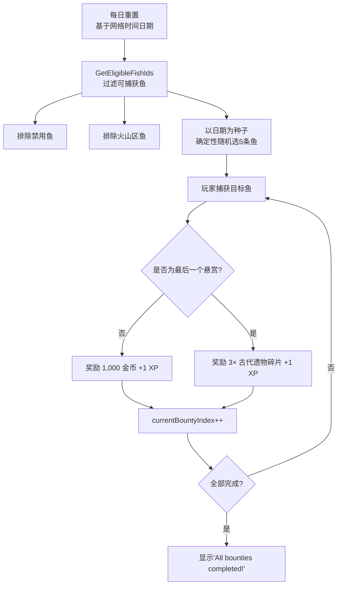

> **每日悬赏理论最大收入**：4 × 1,000 = 4,000 金币 + 3 个遗物碎片（可用于附魔祭坛）+ 5 XP

---

## 12. 物品与兑换码

### 12.1 物品系统

**来源：** `QuestInventoryManager`（19 种物品）

#### 消耗品

| ID  | 物品名                    | 效果类型         | 持续时间    | 堆叠上限 | 说明                 |
| --- | ------------------------- | ---------------- | ----------- | -------- | -------------------- |
| 1   | 烟花 Fireworks            | 无增益 (0)       | 30 分钟     | 64       | 射向天空欣赏烟花表演 |
| 15  | **速度药水** Speed Potion | **吸引增益 (2)** | **30 分钟** | 64       | 吸引速率加倍         |
| 16  | **幸运药水** Luck Potion  | **幸运增益 (1)** | **30 分钟** | 64       | 幸运值加倍           |

#### 遗物（用于附魔祭坛）

| ID  | 物品名                       | 遗物品质  | 堆叠 | 说明           |
| --- | ---------------------------- | --------- | ---- | -------------- |
| 2   | 古代遗物碎片 Old Relic Piece | 0（普通） | 64   | 微弱的魔法能量 |
| 3   | 苔藓遗物 Mossy Relic         | 2（稀有） | 64   | 清晰的能量渗出 |
| 4   | 强力遗物 Powerful Relic      | 3（史诗） | 64   | 非常强劲的能量 |
| 5   | 神圣遗物 Godly Relic         | 4（传说） | 64   | 强大的能量涌动 |

> 遗物品质决定附魔稀有度的概率分布，详见第 5 章。

#### 任务物品（NPC 对话需求）

| ID  | 物品名             | 用途                  | 可堆叠 | 可用于对话需求 |
| --- | ------------------ | --------------------- | ------ | -------------- |
| 6   | Paulie 的锯子      | 交给 NPC Paulie       | ✗      | ✓              |
| 7   | 神秘外星果汁       | NPC 任务链            | ✗      | ✓              |
| 8   | Glorpina 的照片    | 交给 NPC Glorpingo    | ✗      | ✓              |
| 9   | 幽灵头骨           | NPC 任务              | ✗      | ✓              |
| 10  | Celly 的钥匙       | 交给 NPC Celly        | ✗      | ✓              |
| 11  | 远古守护祝福       | 特殊保护效果          | ✗      | ✓              |
| 13  | 废金属 Scrap Metal | 交给 NPC Oga 兑换奖励 | ✓(64)  | ✓              |
| 14  | 一个囚犯？         | 需要帮助释放          | ✗      | ✓              |
| 17  | 神秘绿宝石         | 未知用途              | ✗      | ✗              |
| 18  | 神秘红宝石         | 未知用途              | ✗      | ✗              |
| 19  | 神秘蓝宝石         | 未知用途              | ✗      | ✗              |

#### 特殊货币

| ID  | 物品名          | 堆叠上限    | 说明           |
| --- | --------------- | ----------- | -------------- |
| 12  | **珍珠 Pearls** | **100,000** | 特殊高价值货币 |

### 12.2 兑换码系统

**来源：** `RedeemCodeDatabase`（哈希 `7b692`）+ `RedeemCodeManager`（哈希 `13af6`）

#### 已知兑换码

| 兑换码           | Code ID | 状态    | 过期时间 | 奖励                      |
| ---------------- | ------- | ------- | -------- | ------------------------- |
| **`FISHLAUNCH`** | 1       | ✅ 启用 | 永不过期 | 3× 速度药水 + 3× 幸运药水 |
| **`1MVISITS`**   | 2       | ✅ 启用 | 永不过期 | 5× 废金属                 |

#### 兑换码系统机制

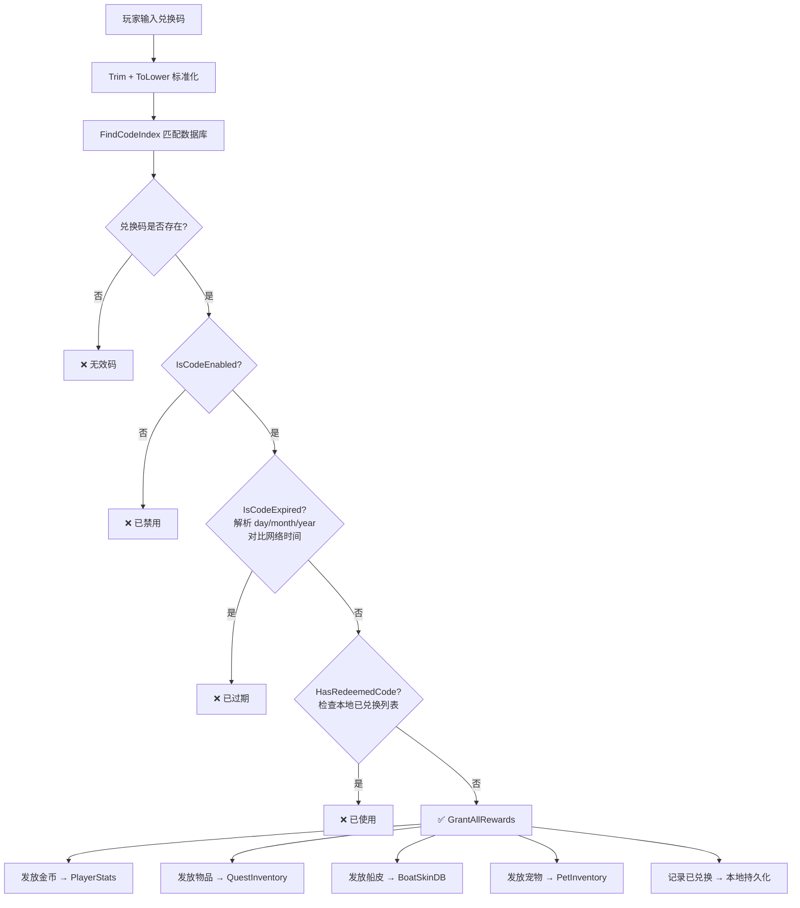

> **每个兑换码支持的奖励类型**：金币、至多 2 种任务物品（各带数量）、船只皮肤、宠物。过期时间格式为 `day/month/year`，空字符串表示永不过期。

---

## 13. NPC 与任务系统

**来源：** 程序反编译（`NPCController` / `DialogueSystem` / `DialogueRequirements`）

### 13.1 NPC 角色列表（42+ 个 NPC）

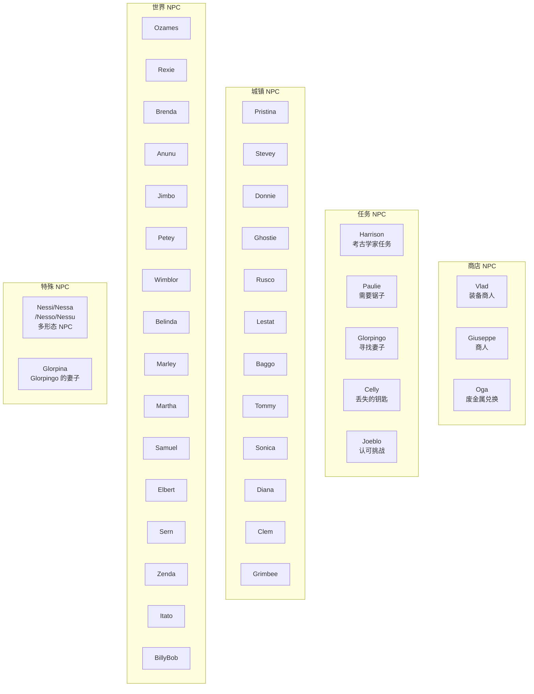

### 13.2 NPC 任务链

| 任务线       | 起始 NPC  | 需要物品                                     | 奖励称号                    | 经验奖励 |
| ------------ | --------- | -------------------------------------------- | --------------------------- | -------- |
| 考古学家之路 | Harrison  | 未知                                         | Archaeologist（考古学家）   | —        |
| 寻妻之旅     | Glorpingo | Picture of Glorpina（Glorpina 的照片，ID:8） | Honorary Glorpingus         | 300 XP   |
| 寻找钥匙     | Celly     | Celly's Keys（Celly 的钥匙，ID:10）          | Pastrami Enjoyer            | 300 XP   |
| 修理工具     | Paulie    | Paulie's Saw（Paulie 的锯子，ID:6）          | Paulie's Bobber（浮漂奖励） | —        |
| 勇者试炼     | Joeblo    | 未知                                         | Shield Hero（盾之勇者）     | 300 XP   |
| 废金属兑换   | Oga       | Scrap Metal（废金属，ID:13）× N              | 未知奖励                    | —        |
| 囚犯救援     | 未知      | A Prisoner?（一个囚犯？，ID:14）             | 未知                        | —        |
| 外星研究     | 未知      | Mysterious Alien Juice（神秘外星果汁，ID:7） | 解锁外星鱼竿？              | —        |

### 13.3 对话系统机制

| 参数       | 值   | 说明                             |
| ---------- | ---- | -------------------------------- |
| 打字机速度 | 可调 | 文字逐字显示效果                 |
| 快速跳过   | ✓    | 可跳过当前文字动画               |
| 多选分支   | ✓    | 对话可有多个选项                 |
| NPC 追踪   | ✓    | NPC 头部追踪玩家                 |
| 日程系统   | ✓    | NPC 按日程行动（行走/跑步/坐下） |
| 忙碌状态   | ✓    | NPC 对话时停止移动并面向玩家     |

---

## 14. 动态音乐系统

**来源：** `MusicSystem` + `MusicTrack`（24 首曲目）

| 曲目名           | 权重    | 冷却  | 音量 | 类型           |
| ---------------- | ------- | ----- | ---- | -------------- |
| **Church**       | **100** | 0 min | 0.7  | 区域专属       |
| **Glorpingo**    | **100** | 0 min | 0.5  | **入场曲**     |
| **Good Morning** | **100** | 5 min | 1.0  | **天气入场曲** |
| **New Dawn**     | **100** | 5 min | 1.0  | **天气入场曲** |
| **Lavatown**     | **100** | 2 min | 0.7  | 区域专属       |
| **Sleepy Town**  | **100** | 5 min | 0.5  | 高权重         |
| **Family**       | **50**  | 5 min | 0.7  | 高权重         |
| **Zen**          | **50**  | 5 min | 0.7  | 高权重         |
| Crescent Harbor  | 10      | 5 min | 0.5  | 入场曲         |
| Lookout Point    | 10      | 5 min | 0.7  | 入场曲         |
| Tun'Luxia        | 10      | 5 min | 0.7  | 入场曲         |
| Atlantis         | 10      | 5 min | 0.7  | 普通           |
| Backroads        | 10      | 5 min | 0.5  | 普通           |
| Crescent Town    | 10      | 5 min | 0.7  | 普通           |
| Dirty Swamp      | 10      | 5 min | 0.5  | 普通           |
| Fish Rancher     | 10      | 5 min | 0.5  | 普通           |
| Jermoids         | 10      | 5 min | 0.5  | 普通           |
| Monkey           | 10      | 5 min | 0.5  | 普通           |
| New Horizon      | 10      | 5 min | 0.7  | 普通           |
| Ocean Drift      | 10      | 5 min | 0.7  | 普通           |
| Panno            | 10      | 5 min | 0.5  | 普通           |
| Rocko Dongo      | 10      | 5 min | 0.5  | 普通           |
| Simpleton        | 10      | 5 min | 0.5  | 普通           |
| Spooky           | 10      | 5 min | 0.7  | 普通           |

> **天气入场曲**：Good Morning 和 New Dawn 在天气变化时以最高优先级(100)触发。**入场曲**在玩家进入区域时优先播放。

---

## 15. 技术系统

### 15.1 系统架构总览


### 15.2 数据持久化系统

**来源：** `PlayerStatsManager`（哈希 `2baf2`）+ `PlayerInventoryData`（哈希 `04a6d`）

#### 玩家统计存档键

使用 VRC PlayerData API 的整数键值存储：

| 存档键                   | 内容         | 类型 |
| ------------------------ | ------------ | ---- |
| `PS_PLAYER_XP`           | 累计总经验   | int  |
| `PS_PLAYER_MONEY`        | 货币余额     | int  |
| `PS_PLAYER_LEVEL`        | 当前等级     | int  |
| `PS_FISH_CAUGHT`         | 总捕鱼数     | int  |
| `PS_RARE_FISH_CAUGHT`    | 稀有鱼捕获数 | int  |
| `PS_FISH_SOLD`           | 总售鱼数     | int  |
| `PS_TUTORIALS_COMPLETED` | 教程进度     | int  |
| `PS_BOUNTIES_COMPLETED`  | 已完成悬赏数 | int  |
| `PS_TIME_PLAYED`         | 游戏时长(秒) | int  |

#### 库存数据存档

使用 JSON 序列化的 DataDictionary 存储：

| 存档键                | 内容            |
| --------------------- | --------------- |
| `INVENTORY_DATA`      | JSON 序列化字典 |
| `PID_EQUIPPED_ROD`    | 装备中的鱼竿 ID |
| `PID_EQUIPPED_LINE`   | 装备中的鱼线 ID |
| `PID_EQUIPPED_BOBBER` | 装备中的浮漂 ID |

**字典内部结构键：**
`unlockedRods`、`unlockedLines`、`unlockedBobbers`、`unlockedHandles`、`unlockedBoats`、`fishSlots`、`afkPets`、`questItems`、`nfid`（下一个鱼 ID 计数器）、`rodEnchants`、`lineEnchants`、`bobberEnchants`

#### 数据恢复流程

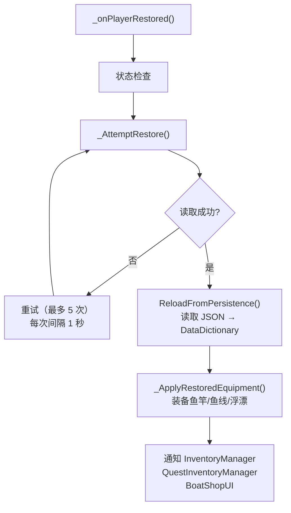

> **安全机制**：序列化失败时保留最后已知的正确数据并记录错误。`INVENTORY_WIPE_PENDING` 标志可触发强制重置。

#### 鱼类存储编码

每条鱼存储为 DataList 格式：

```text
[fishId, fishEntryId, fishWeight, combinedModifiers, isLocked]
```

**修饰器编码算法**：

```text
combinedModifiers = sizeModifier × 100 + shaderModifier
解码：
sizeModifier = combinedModifiers / 100   （整除）
shaderModifier = combinedModifiers % 100  （取余）
```

### 15.3 排行榜系统

**来源：** `LeaderboardManager`（哈希 `9234a`）

| 参数       | 值           | 说明              |
| ---------- | ------------ | ----------------- |
| 排序方式   | 等级降序     | 等级高者靠前      |
| 平分处理   | 按名字字母序 | 相同等级按名      |
| 前三名显示 | 金/银/铜色   | 特殊颜色标记      |
| 显示位数   | 8 名         | 前3 + 4~8名       |
| 刷新方式   | 定期轮询     | `refreshInterval` |
| 数据同步   | VRC 网络     | 同步数组          |

**同步数据结构：**

```text
syncedPlayerIds[]      — 玩家标识
syncedPlayerLevels[]   — 玩家等级
cachedDisplayNames[]   — 缓存显示名
sortedIndices[]        — 排序后索引（冒泡排序）
```

> 排行榜使用**冒泡排序**算法对 `sortedIndices` 排序，按等级降序排列。支持玩家加入/离开时动态更新。

### 15.4 Discord 角色权限系统

**来源：** `DiscordRoleManager`（加密数据解密后）

#### 角色标记系统

解密后的 JSON 数据格式：`"VRChat用户名": "角色标记"`

| 标记    | 含义                  | 游戏内特权                   |
| ------- | --------------------- | ---------------------------- |
| `p`     | **Patreon 支持者**    | Lucky Cat 宠物、Patreon 称号 |
| `n`     | **Nitro Booster**     | Nitro 钓鱼蛙、Nitro 称号     |
| `s`     | **Staff（工作人员）** | 特殊权限                     |
| `p,n`   | Patreon + Nitro       | 双重奖励                     |
| `p,s,n` | 全部角色              | 最高权限                     |
| （空）  | 普通 Discord 成员     | 基础 Discord 奖励            |

#### 加密传输流程

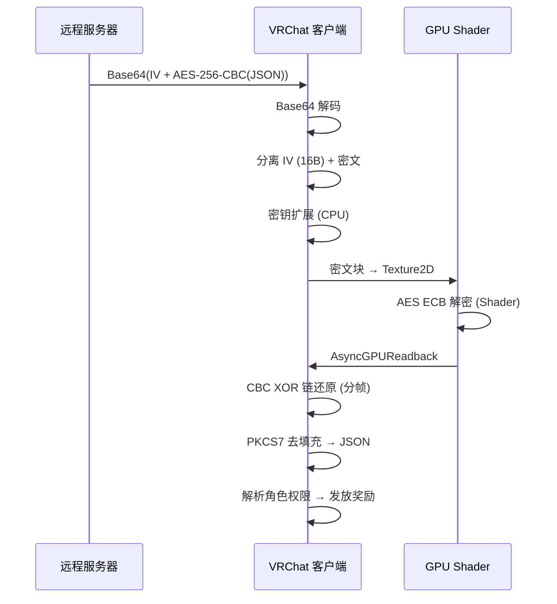

---

## 16. 理论最优装备组合

### 16.1 最大幸运组合

| 部位     | 装备                        | 幸运值   |
| -------- | --------------------------- | -------- |
| 鱼竿     | 法老之竿 Rod of the Pharaoh | +200     |
| 鱼线     | 幸运鱼线 Lucky Line         | +30      |
| 浮漂     | 幸运浮漂 Lucky Bobber       | +40      |
| 附魔     | 神之幸运 God's Own Luck     | +250     |
| 区域图鉴 | 全部 5 区域完成             | +75      |
| 宠物幸运 | 满级 150                    | +150     |
| **总计** |                             | **+745** |

**加上增益后的理论最大幸运倍率**：

```text
基础幸运倍率 = (745/100) + 1.0 = 8.45×
× 幸运药水(2.0) + 世界幸运T3(8.0) + 天气幸运(2.0) = +12.0
总幸运倍率 = 8.45 × 12.0 = 极限线性幸运加成
```

### 16.2 最大吸引速度组合

| 部位     | 装备                              | 吸引值   |
| -------- | --------------------------------- | -------- |
| 鱼竿     | 极速鱼竿 Speedy Rod               | +65      |
| 鱼线     | 堕神之发 Hair of a Fell God       | +50      |
| 浮漂     | 装饰浮漂 Ornamental Bobber        | +10      |
| 附魔     | 天国信使 Messenger of the Heavens | +100     |
| **总计** |                                   | **+225** |

### 16.3 最大出售价值组合

| 效果来源                        | 加成                            |
| ------------------------------- | ------------------------------- |
| 巨大体型修饰                    | ×1.5                            |
| 全息/静电着色器                 | ×5.0                            |
| 时间/天气偏好                   | ×2.0                            |
| 赚钱机器附魔 (Money Maker)      | +20%                            |
| 口袋观察者附魔 (Pocket Watcher) | +5%                             |
| 双钩附魔 (Double Up!!)          | 25% 概率翻倍                    |
| **理论最大单鱼价值**            | **基础价 × 15 × 1.25 = 18.75×** |

对于最贵的猫鱼皇帝：$45,000 × 15 × 1.25 = **$843,750**（不含双钩翻倍）

### 16.4 最大力量/专长组合（钓鱼小游戏最简单化）

| 部位     | 装备                      | 力量    | 专长    |
| -------- | ------------------------- | ------- | ------- |
| 鱼竿     | 永恒之竿                  | 30      | 30      |
| 鱼线     | 堕神之发                  | 50      | 50      |
| 浮漂     | 彩虹史莱姆浮漂            | 10      | 0       |
| 附魔     | 最强钓手 Strongest Angler | 85      | 85      |
| **总计** |                           | **175** | **165** |

---

## 17. 隐藏内容与未实装数据

### 17.1 未实装天气类型

| 天气类型 ID | 名称                 | 状态                                                    |
| ----------- | -------------------- | ------------------------------------------------------- |
| 0           | Clear（晴天）        | ✅ 已实装                                               |
| 1           | Rainy（雨天）        | ✅ 已实装                                               |
| 2           | Stormy（暴风）       | ✅ 已实装（鱼数据有 prefersStormy）                     |
| 3           | Foggy（雾天）        | ✅ 已实装                                               |
| 4           | Moonrain（月雨）     | ✅ 已实装（夜间 15% 概率）                              |
| 5           | **Starfog（星雾）**  | ❌ **未实装** — 鱼数据有 prefersStarfog 字段但无鱼使用  |
| 6           | **Skybloom（天花）** | ❌ **未实装** — 鱼数据有 prefersSkybloom 字段但无鱼使用 |

> 两种天气类型（星雾和天花）的字段已存在于鱼类数据结构中，但目前没有任何鱼设置了这些偏好，天气配置中也没有对应条目。这些很可能是为**未来更新预留**的内容。

### 17.2 已禁用/隐藏内容

| 内容                       | 状态       | 说明                                                 |
| -------------------------- | ---------- | ---------------------------------------------------- |
| Godly Relic（神圣遗物鱼）  | **已禁用** | ID:93，稀有度 8，但 enabled=false                    |
| DEBUG 鱼竿                 | 隐藏       | ID:5，所有属性为 0，最大重量仅 1 kg                  |
| DEBUG 浮漂                 | 隐藏       | ID:7，所有属性 50（开发测试用）                      |
| Prism 系列船皮             | **已禁用** | 冲浪板/划艇/快艇各有一款 Prism 皮肤被标记为 disabled |
| Beta Tester 独木舟皮肤     | **已禁用** | 仅 Beta 测试者可用                                   |
| 永恒之竿 Rod of Perpetuity | 等级锁     | 需要**等级 500** 且 `isUnlockedFromLevel=true`       |

### 17.3 隐藏称号

以下称号标记为 `isHidden: true`，不会出现在成就列表中直到满足条件：

| 称号              | 获取条件             |
| ----------------- | -------------------- |
| Beta Tester       | BETA_PLAYER 标记为 1 |
| Early Supporter   | 早期支持标记         |
| Supporter         | 支持标记             |
| Nitro Booster     | Discord Nitro        |
| Nitro Addict      | Discord Nitro        |
| Patreon Baller    | Patreon 支持         |
| Patreon Supporter | Patreon 支持         |

### 17.4 数据中的有趣发现

1. **猫鱼皇帝的名字** — "Catfish Emperor" 是一个双关语（Catfish = 鲶鱼，也指网络钓鱼/欺骗）
2. **"Decimated Fih"** — 极可能是 "Decimated Fish" 的**故意拼写错误**，作为彩蛋
3. **"Steve"** — 作为稀有度 9 的秘密鱼，名字极其普通，疑似是对某人的致敬
4. **法老之竿**的吸引率为 **−10** — 这是唯一一根**降低**吸引速度的高端鱼竿，设计为高幸运但慢速的权衡
5. **幼年巨齿鲨**最大重量 **120,000 kg** — 是游戏中最重的鱼之一，远超现实中的巨齿鲨
6. **永恒之竿**和**法老之竿**都要求**等级 500** 解锁，但并非通过等级自动解锁——法老之竿需要在商店以 750,000 金币购买
7. **月雨**是唯一有鱼偏好的特殊天气——**神秘红宝石**仅在月雨时可钓获且只能钓一次
