# Fish World 游戏数据手册

[English](gamedata-en.md) | 简体中文

> 所有数值均从反编译的 Udon IL 字节码中提取 — 这些是游戏内实际使用的常量和公式。

---

## 目录

1. [世界环境系统](#1-世界环境系统)
2. [鱼类系统](#2-鱼类系统)
3. [钓鱼机制](#3-钓鱼机制)
4. [装备系统](#4-装备系统)
5. [附魔系统](#5-附魔系统)
6. [增益系统](#6-增益系统)
7. [海域事件](#7-海域事件)
8. [船只系统](#8-船只系统)
9. [宠物系统](#9-宠物系统)
10. [玩家成长系统](#10-玩家成长系统)
11. [经济系统](#11-经济系统)
    - [11.6 废铁老虎机](#116-废铁老虎机)
    - [11.7 商店分布](#117-商店分布)
12. [物品与兑换码](#12-物品与兑换码)
    - [12.3 地面遗物拾取点](#123-地面遗物拾取点)
    - [12.4 地图导航系统](#124-地图导航系统)
    - [12.5 特殊水域](#125-特殊水域)
13. [NPC 与任务系统](#13-npc-与任务系统)
    - [13.2 任务链完整指南](#132-任务链完整指南)
    - [13.4 古代神殿系统](#134-古代神殿系统)
    - [13.5 Vlad 流浪商人](#135-vlad-流浪商人)
    - [13.6 幽灵目击系统](#136-幽灵目击系统spookysighting)
    - [13.7 HP 生命系统](#137-hp-生命系统)
    - [13.8 旅馆与出生点系统](#138-旅馆与出生点系统)
    - [13.9 回城石](#139-回城石hearthstone)
    - [13.10 特殊装备获取](#1310-特殊装备获取)
    - [13.11 NPC 提示数据库](#1311-npc-提示数据库)
    - [13.12 追溯任务检查器](#1312-追溯任务检查器)
14. [动态音乐系统](#14-动态音乐系统)
15. [技术系统](#15-技术系统)
    - [15.5 Supporter 粒子拖尾系统](#155-supporter-粒子拖尾系统)
    - [15.6 VRC Economy 商品奖励系统](#156-vrc-economy-商品奖励系统)
16. [理论最优装备组合](#16-理论最优装备组合)
17. [隐藏内容与未实装数据](#17-隐藏内容与未实装数据)

---

## 1. 世界环境系统

### 1.1 昼夜循环

**来源：** `DayNightCycle`

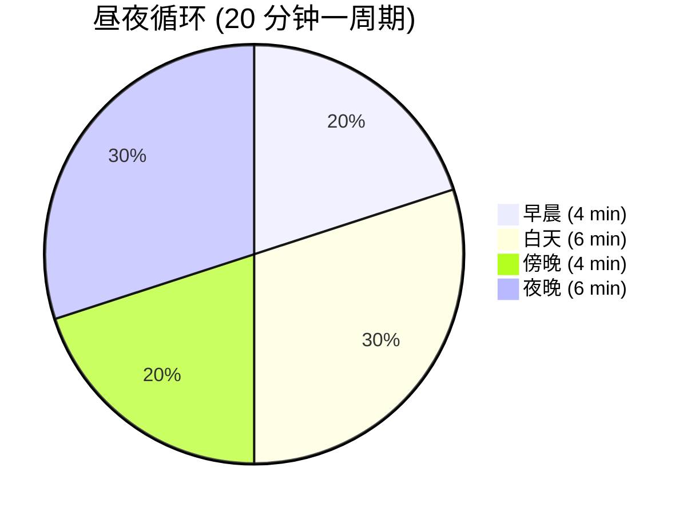

| 参数 | IL 变量名 | 值 |
| --- | --- | --- |
| 完整周期 | `cycleDurationSeconds` | **1200 s**（20 分钟） |
| 早晨占比 | `morningDuration` | 0.2 → **4 分钟** |
| 白天占比 | `dayDuration` | 0.3 → **6 分钟** |
| 傍晚占比 | `eveningDuration` | 0.2 → **4 分钟** |
| 夜晚占比 | `nightDuration` | 0.3 → **6 分钟** |
| 初始时刻 | `startTimeNormalized` | 0.25（从早晨开始） |
| 午夜角度 | `midnightAngle` | 90° |
| 光照曲线 | `lightIntensityCurve` | AnimationCurve (0,0)→(1,1) |

> **时段划分**：早晨+傍晚合计 8 分钟（40%），白天+夜晚合计 12 分钟（60%）。白天时段（早晨+白天）共 10 分钟，夜间时段（傍晚+夜晚）共 10 分钟。

### 1.2 天气与生态区

**来源：** `BiomeWeatherManager`

#### 全局天气参数

| 参数         | 值              |
| ------------ | --------------- |
| 天气更替间隔 | 120 s（2 分钟） |
| 月雨概率     | 15%（每个夜晚） |
| 大气过渡时间 | 10 s            |
| 音频过渡时间 | 5 s             |

#### 生态区定义

| 生态区 | 名称          | 半径   | 优先级 |
| ------ | ------------- | ------ | ------ |
| 0      | 沙漠 DESERT   | 426.5  | 50     |
| 1      | 热带 TROPICAL | 1296.0 | 0      |
| 2      | 沼泽 SWAMP    | 309.92 | 50     |

#### 各生态区天气权重

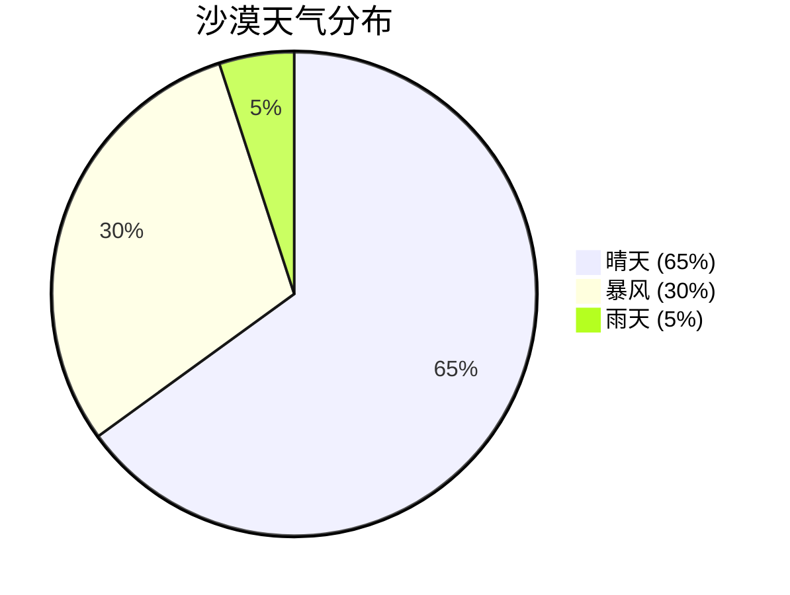

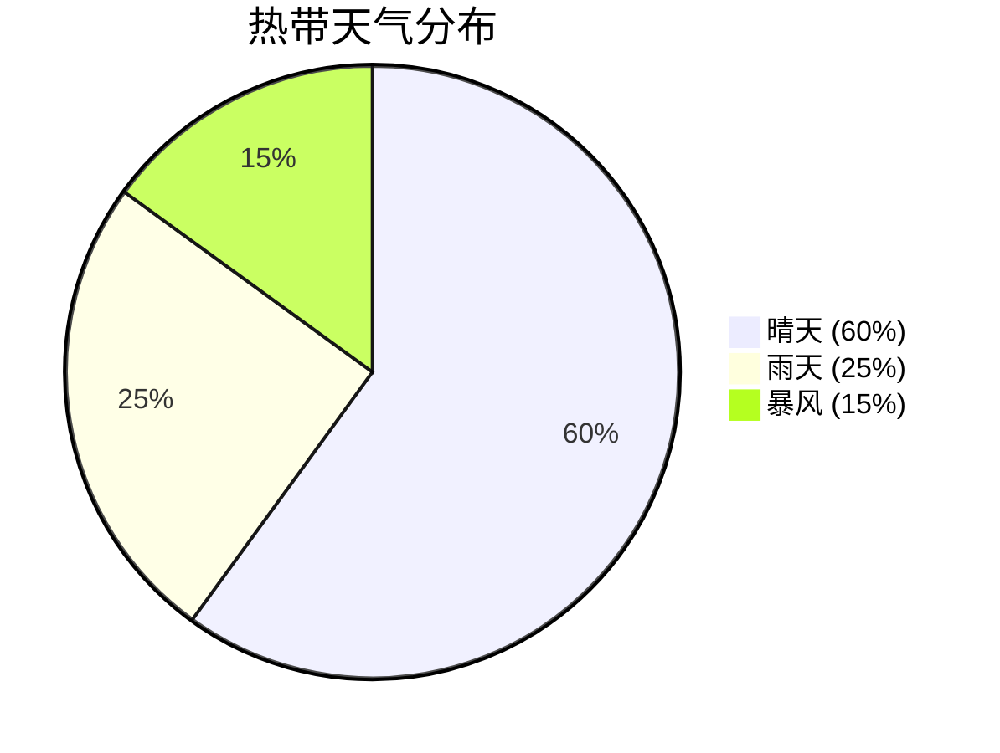

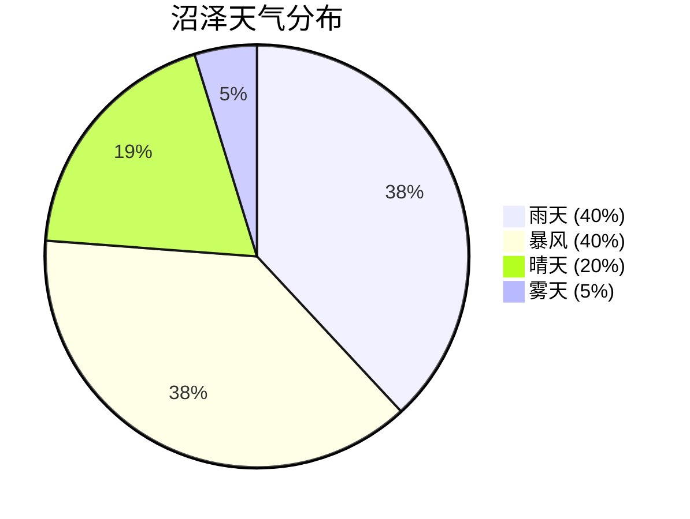

**默认天气**（生态区外）：晴天 50 / 暴风 25 / 雨天 25

### 1.3 钓鱼区域

**来源：** `ZoneManager`（11 个区域实例）

#### 区域层级关系

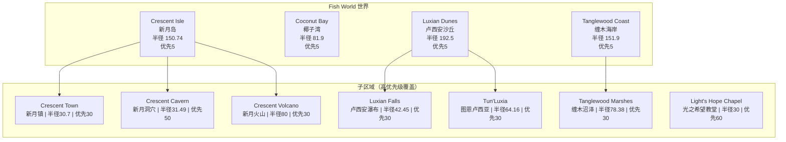

#### 区域水域类型

| 区域                        | 水域类型         | 鱼类            |
| --------------------------- | ---------------- | --------------- |
| Crescent Isle / Coconut Bay | 咸水             | 咸水鱼 + 通用鱼 |
| Crescent Cavern             | 淡水             | 淡水鱼          |
| **Crescent Volcano**        | **岩浆**         | **13 种岩浆鱼** |
| Luxian Dunes / Falls        | 淡水 + 咸水      | 混合鱼          |
| **Tanglewood Marshes**      | **沼泽**         | **12 种沼泽鱼** |
| Light's Hope Chapel         | 室内（隐藏天气） | 特殊            |

---

## 2. 鱼类系统

**来源：** `FishDatabase`（134 种鱼）

### 2.1 稀有度与生成概率

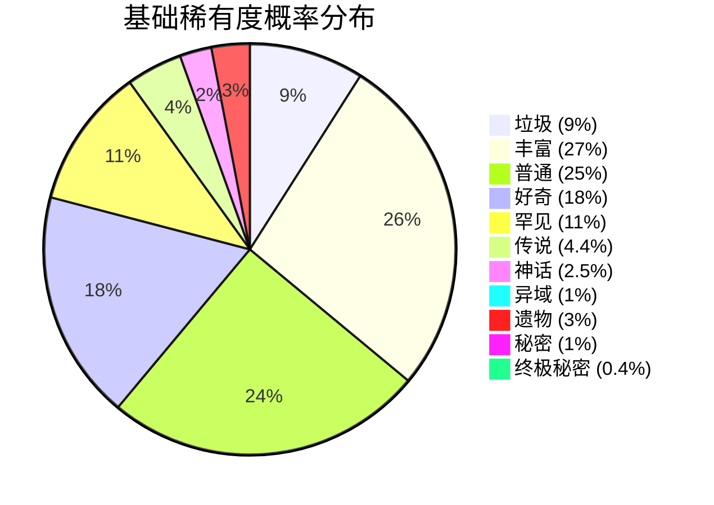

| 稀有度   | 基础概率 | 幸运力 | 说明               |
| -------- | -------- | ------ | ------------------ |
| 垃圾     | 9%       | −1.0   | 幸运越高越少       |
| 丰富     | 27%      | −0.8   | 最常见等级         |
| 普通     | 25%      | −0.1   |                    |
| 好奇     | 18%      | +0.35  |                    |
| 罕见     | 11%      | +0.6   |                    |
| 传说     | 4.4%     | +0.7   |                    |
| 神话     | 2.5%     | +0.6   |                    |
| 异域     | 1%       | +0.6   |                    |
| 遗物     | 3%       | +0.1   | 掉落附魔遗物       |
| 秘密     | 1%       | +2.0   | 强烈受幸运影响     |
| 终极秘密 | 0.4%     | +1.9   | 最受幸运影响的等级 |

**幸运力说明**：正值 = 幸运越高越容易出现；负值 = 幸运越高越少出现。使用**纯线性缩放**（无 sigmoid）。

> 📈 **稀有度概率 vs 幸运倍率曲线**（X 轴：幸运倍率 0~10×，Y 轴：归一化概率）
>
> 

#### 稀有度选择流程

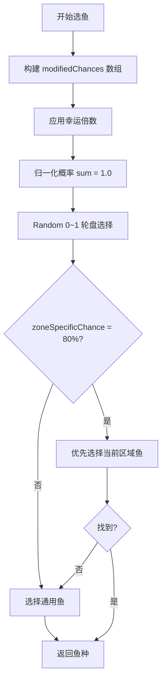

### 2.2 区域优先与生成条件

- **区域特定概率 = 80%** — 80% 的时间优先选择当前区域的鱼
- 选择顺序：区域鱼 → 通用鱼 → 外海鱼（兜底）

| 属性                    | 说明           |
| ----------------------- | -------------- |
| `canSpawnInFreshwater`  | 可在淡水区生成 |
| `canSpawnInSaltwater`   | 可在咸水区生成 |
| `canSpawnInSwampwater`  | 可在沼泽区生成 |
| `canSpawnInLava`        | 可在岩浆区生成 |
| `canSpawnInDay / Night` | 白天/夜晚限制  |
| `allowedZoneIDs[]`      | 区域白名单     |
| `forbiddenZoneIDs[]`    | 区域黑名单     |

### 2.3 时间/天气偏好（价值加成）

每条鱼可设定偏好时段和天气，匹配时获 **×2 价值加成**：

- 时段：`喜好早晨`、`喜好白天`、`喜好傍晚`、`喜好夜晚`
- 天气：`喜好晴天`、`喜好雨天`、`喜好暴风`、`喜好雾天`、`喜好月雨`、`喜好星雾`、`喜好天花`

### 2.4 鱼类变异修饰器

**来源：** `FishModifierManager`

#### 基础变异概率

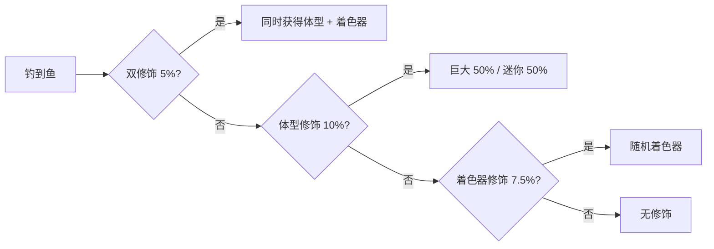

| 参数         | 概率  |
| ------------ | ----- |
| 体型修饰     | 10%   |
| 着色器修饰   | 7.5%  |
| 双重修饰     | 5%    |
| 巨大 vs 迷你 | 50:50 |

#### 着色器价值倍数

| ID  | 着色器名             | 价值倍数 |
| --- | -------------------- | -------- |
| 2   | 白化 Albino          | 1.5×     |
| 3   | 闪亮 Shiny           | 2.0×     |
| 4   | 金色 Golden          | 3.0×     |
| 5   | 幽灵 Ghastly         | 1.5×     |
| 6   | 神圣 Blessed         | 3.0×     |
| 7   | 诅咒 Cursed          | 1.1×     |
| 8   | 辐射 Radioactive     | 3.0×     |
| 9   | 消失 MissingShader   | 1.5×     |
| 10  | 沙化 Sandy           | 1.2×     |
| 11  | **全息 Holographic** | **5.0×** |
| 12  | 燃烧 Burning         | 4.0×     |
| 13  | 彩虹 Rainbow         | 3.0×     |
| 14  | 石化 Stone           | 1.3×     |
| 15  | 斑马 Zebra           | 1.3×     |
| 16  | 虎纹 Tiger           | 1.6×     |
| 17  | 迷彩 Camo            | 1.8×     |
| 18  | 电击 Electric        | 4.0×     |
| 19  | **静电 Static**      | **5.0×** |
| 20  | 虚空 Void            | 2.0×     |
| 21  | 冰冻 Frozen          | 2.0×     |
| 22  | 暗影 Shadow          | 2.0×     |
| 23  | 反色 Negative        | 1.5×     |
| 24  | 银河 Galaxy          | 3.0×     |

**巨大体型**倍数：1.5×。最终价值 = 体型倍数 × 着色器倍数（乘法叠加）。

### 2.5 稀有与特殊鱼类图鉴

#### 终极秘密鱼（稀有度 10 — 最高等级）

| 鱼名                         | ID  | 难度 | 价格范围          | 最大重量 | 水域   |
| ---------------------------- | --- | ---- | ----------------- | -------- | ------ |
| **猫鱼皇帝 Catfish Emperor** | 125 | 5    | $38,500 ~ $49,500 | 750 kg   | 全水域 |
| **二象蟹 Crab of Duality**   | 134 | 5    | $31,500 ~ $40,500 | 350 kg   | 全水域 |

#### 秘密鱼（稀有度 9）

| 鱼名                             | ID  | 价格范围          | 最大重量 | 水域   | 特殊条件 |
| -------------------------------- | --- | ----------------- | -------- | ------ | -------- |
| **瓦布布鱼 Wabubu Fish**         | 74  | $13,995 ~ $17,460 | 2 kg     | 全水域 | —        |
| **史蒂夫 Steve**                 | 116 | $13,995 ~ $17,460 | 3.5 kg   | 全水域 | —        |
| **拉格泰姆蛙 Ragtime Frog**      | 117 | $13,995 ~ $17,460 | 3.5 kg   | 沼泽   | 喜好雨天 |
| **毁灭之鱼 Decimated Fih**       | 121 | $13,995 ~ $17,460 | 4 kg     | 全水域 | —        |
| **卢西安骆鲨 Luxian Camelshark** | 128 | $17,105 ~ $21,340 | 9,000 kg | 咸水   | —        |

#### 异域鱼（稀有度 7 — Exotic）

| 鱼名                             | ID  | 价格范围          | 最大重量   | 水域      | 特殊       |
| -------------------------------- | --- | ----------------- | ---------- | --------- | ---------- |
| **地狱巨石斑 Hellmaw Grouper**   | 68  | $7,868 ~ $11,735  | 2,000 kg   | **岩浆**  | 岩浆最贵鱼 |
| **深渊蛇鱼 Abyssal Serpentfish** | 85  | $7,880 ~ $11,753  | 3,100 kg   | 咸水+沼泽 | **仅夜间** |
| **幼年巨齿鲨 Baby Megalodon**    | 86  | $9,587 ~ $14,300  | 120,000 kg | 咸水      | 最重鱼之一 |
| **天界白鳍 Celestial Whitefin**  | 87  | $7,862 ~ $11,726  | 1,500 kg   | 咸水      | —          |
| **海壳龙 Shellonodon**           | 88  | $8,472 ~ $12,636  | 40,000 kg  | 咸水      | —          |
| **棘背鳐 Spineback Ray**         | 89  | $7,914 ~ $11,804  | 6,000 kg   | 咸水      | —          |
| **恐壳巨像 Dreadshell Colossus** | 100 | $8,542 ~ $12,740  | 50,000 kg  | **沼泽**  | 沼泽最贵鱼 |
| **蜻蜓鱼 Dragonfly Fish**        | 126 | $7,845 ~ $11,701  | 70 kg      | 淡水      | —          |
| **皇家香蕉鱼 Royal Bananafish**  | 132 | $7,844 ~ $11,700  | 9 kg       | 淡水      | —          |
| **三头鲑鱼 Three-Headed Salmon** | 123 | $7,844 ~ $11,700  | 20 kg      | 咸水      | —          |

#### 传说鱼（稀有度 6 — Fabled）

| 鱼名                           | ID  | 价格范围         | 最大重量 | 水域     | 特殊       |
| ------------------------------ | --- | ---------------- | -------- | -------- | ---------- |
| 巨型鱿鱼 Giant Squid           | 33  | $3,837 ~ $8,634  | 512 kg   | 咸水     | —          |
| 大白鲨 Great White Shark       | 40  | $4,378 ~ $9,851  | 1,457 kg | 咸水     | —          |
| 远古战斗鱼 Ancient Warriorfish | 119 | $3,600 ~ $8,100  | 10 kg    | 淡水     | —          |
| 毒液观察者 Venomous Watcher    | 120 | $3,600 ~ $8,100  | 10 kg    | 沼泽     | **仅夜间** |
| 盲刃鱼 Blind Bladefish         | 122 | $3,600 ~ $8,100  | 10 kg    | 淡水     | **仅夜间** |
| 装甲暴鱼 Armored Brutefish     | 124 | $3,628 ~ $8,162  | 60 kg    | 咸水     | —          |
| 火成刺鳐 Igneous Stingray      | 129 | $4,400 ~ $9,900  | 1,500 kg | **岩浆** | —          |
| 红色恶魔鱼 Red Demonfish       | 130 | $3,767 ~ $8,475  | 400 kg   | **岩浆** | —          |
| 红色飞镖鳍 Red Dartfin         | 131 | $3,608 ~ $8,117  | 25 kg    | 咸水     | —          |
| 驼背雀鳝 Humpback Gar          | 133 | $3,660 ~ $8,235  | 110 kg   | 咸水     | —          |

#### 岩浆专属鱼类（13 种）

仅可在 **Crescent Volcano（新月火山）** 的岩浆中钓获：

| 鱼名                           | ID  | 稀有度 | 最高价格    | 最大重量 |
| ------------------------------ | --- | ------ | ----------- | -------- |
| 火焰孔雀鱼 Flame Guppy         | 67  | 1      | $21         | 0.3 kg   |
| 岩浆鲤 Magma Carp              | 70  | 1      | $21         | 3 kg     |
| 灰鳞鳟 Ashscale Trout          | 63  | 2      | $32         | 6 kg     |
| 玄武岩鳗 Basalt Eel            | 64  | 2      | $30         | 3 kg     |
| 煤鳍 Cinderfin                 | 65  | 3      | $63         | 2 kg     |
| 黑曜鱼 Obsidian Fish           | 72  | 3      | $65         | 2.5 kg   |
| 水晶梭鱼 Crystal Pike          | 66  | 4      | $166        | 10 kg    |
| 熔岩钓鱼者 Molten Angler       | 71  | 4      | $168        | 15 kg    |
| 伊弗利特梭鱼 Ifrit Barracuda   | 69  | 5      | $1,776      | 25 kg    |
| 黄铁矿鲷 Pyrite Snapper        | 73  | 5      | $1,792      | 20 kg    |
| 火成刺鳐 Igneous Stingray      | 129 | 6      | $9,900      | 1,500 kg |
| 红色恶魔鱼 Red Demonfish       | 130 | 6      | $8,475      | 400 kg   |
| **地狱巨石斑 Hellmaw Grouper** | 68  | **7**  | **$11,735** | 2,000 kg |

#### 沼泽专属鱼类（12 种）

仅可在 **Tanglewood（缠木海岸/缠木沼泽）** 区域钓获：

| 鱼名                             | ID  | 稀有度 | 最高价格    | 最大重量  | 特殊       |
| -------------------------------- | --- | ------ | ----------- | --------- | ---------- |
| 蓝鳃太阳鱼 Bluegill Sunfish      | 96  | 1      | $21         | 2 kg      | —          |
| 弹涂鱼 Mudskipper                | 103 | 1      | $150        | 1 kg      | —          |
| 弓鳍鱼 Bowfin                    | 97  | 2      | $32         | 3 kg      | —          |
| 沟鲶 Channel Catfish             | 98  | 2      | $34         | 10 kg     | —          |
| 铜头蛇 Cottonmouth Snake         | 99  | 3      | $64         | 3 kg      | —          |
| 青蛙 Frog                        | 101 | 3      | $63         | 1 kg      | —          |
| 鳄鱼龟 Alligator Snapping Turtle | 94  | 4      | $170        | 100 kg    | —          |
| 软壳龟 Soft Shelled Turtle       | 104 | 4      | $150        | 15 kg     | —          |
| 美洲鳄鱼 American Alligator      | 95  | 5      | $1,849      | 450 kg    | —          |
| 巨恒河鳄 Giant Gharial           | 102 | 5      | $1,942      | 100 kg    | —          |
| 毒液观察者 Venomous Watcher      | 120 | 6      | $8,100      | 10 kg     | **仅夜晚** |
| **恐壳巨像 Dreadshell Colossus** | 100 | **7**  | **$12,740** | 50,000 kg | —          |

#### 一次性捕获 & 任务鱼

| 鱼名                              | ID  | catchOnce | rewardsQuestItem | 掉落权重       | 特殊条件               |
| --------------------------------- | --- | --------- | ---------------- | -------------- | ---------------------- |
| 古代遗物碎片 Old Relic Piece      | 90  | ✗         | ✓                | **87**（最高） | 全水域                 |
| 苔藓遗物 Mossy Relic              | 91  | ✗         | ✓                | 10             | 全水域                 |
| 强力遗物 Powerful Relic           | 92  | ✗         | ✓                | 3              | 全水域                 |
| 神圣遗物 Godly Relic              | 93  | ✗         | ✓                | 1              | **已禁用**             |
| **神秘红宝石 Mysterious Red Gem** | 118 | **✓**     | ✓                | 10             | **仅月雨天气**，一次性 |

> 遗物鱼稀有度为 8，共享「遗物鱼」概率池（基础 3%）。其中古代遗物碎片掉落权重 87（占 87/101 ≈ 86%），神圣遗物已被禁用。**神秘红宝石**是唯一需要特定天气（月雨）且只能捕获一次的鱼。

### 2.6 最贵鱼类 Top 10（理论最大售价）

理论最大 = `最高价 × 巨大(1.5×) × 全息/静电(5.0×) × 天气/时段偏好(2.0×)`

| 排名 | 鱼名       | 基础最高价 | 理论最大售价 | 稀有度 |
| ---- | ---------- | ---------- | ------------ | ------ |
| 1    | 猫鱼皇帝   | $49,500    | **$742,500** | 10     |
| 2    | 二象蟹     | $40,500    | **$607,500** | 10     |
| 3    | 卢西安骆鲨 | $21,340    | **$320,100** | 9      |
| 4    | 瓦布布鱼   | $17,460    | **$261,900** | 9      |
| 5    | 史蒂夫     | $17,460    | **$261,900** | 9      |
| 6    | 拉格泰姆蛙 | $17,460    | **$261,900** | 9      |
| 7    | 毁灭之鱼   | $17,460    | **$261,900** | 9      |
| 8    | 幼年巨齿鲨 | $14,300    | **$214,500** | 7      |
| 9    | 恐壳巨像   | $12,740    | **$191,100** | 7      |
| 10   | 海壳龙     | $12,636    | **$189,540** | 7      |

---

## 3. 钓鱼机制

### 3.1 咬钩等待时间

**来源：** `RodController`（哈希 `6b9c3`）+ `EquipmentStatsManager`（哈希 `1fbef`）

```text
基础等待 = Random(13秒, 17秒)
吸引百分比 = Min(100, 装备吸引总值 / 100) → 范围 [0.0, 1.0]
实际等待 = (1.0 - 吸引百分比) × 基础等待
```

| 吸引值 | 吸引倍率 | 等待范围         | 平均等待 |
| ------ | -------- | ---------------- | -------- |
| 0      | 0%       | 13 ~ 17 秒       | 15 秒    |
| 50     | 50%      | 6.5 ~ 8.5 秒     | 7.5 秒   |
| 100    | 100%     | 0 ~ 0 秒（瞬咬） | 0 秒     |
| 220    | 100%上限 | 0 秒（硬上限）   | 0 秒     |

> **吸引增益（药水）效果**：将吸引原始值 ×2 后再除以 100，硬上限 100%。因此有效上限为 50 点原始吸引（×2 = 100%）。

> 📈 **咬钩等待时间 vs 吸引值曲线**（蓝色带：最大/最小等待时间范围，红线标注 100% 上限）
>
> 

#### 吸引率计算详细公式

```text
原始总值 = 鱼竿.吸引 + 鱼线.吸引 + 浮漂.吸引 + 附魔.吸引 + 成就.吸引

如果 吸引增益激活:
    增益值 = 2.0 × 原始总值 / 100.0
否则:
    增益值 = 原始总值（浮点数）

百分比 = Min(100.0, 增益值)
吸引率倍数 = Max(百分比 / 100, 0.0)    → 范围 [0.0, 1.0]
```

### 3.2 鱼重量分配曲线

```text
有效最大重量 = Min(玩家最大重量, 鱼种最大重量)
随机值 = Random(0, 1)

如果 大物率 > 阈值:
    曲线值 = Sin(随机值 × π/2)         ← 正弦曲线，偏向大鱼
否则:
    归一化率 = 大物率 / 100
    幂 = Lerp(归一化率, 常数A, 1.0)
    曲线值 = Pow(幂, 随机值)          ← 幂曲线分布

鱼重量 = Lerp(曲线值, 有效最大重量, 最小重量)
```

> 大物率越高，重量分布越偏向最大值。满大物率时使用正弦曲线，大幅提升获得大鱼的概率。

> 📈 **鱼重量分配曲线**（X 轴：随机掷骰 0~100%，Y 轴：最大重量占比。不同大物率下的分布）
>
> 

### 3.3 小游戏难度插值

**来源：** `FishingMinigameScript`

所有参数在「简单（difficulty=0）」和「困难（difficulty=1）」之间按鱼的难度值线性插值：

| 参数         | 简单  | 困难   | 说明           |
| ------------ | ----- | ------ | -------------- |
| 目标大小     | 1.2   | 0.7    | 命中条宽度     |
| 方向改变间隔 | 0.5 s | 0.4 s  | 鱼变向频率     |
| 鱼缓动时间   | 1.0 s | 0.19 s | 越小越灵活     |
| 钓获速度     | 0.2/s | 0.06/s | 进度条填充     |
| 丢失速度     | 0.1/s | 0.15/s | 进度条衰减     |
| 最大丢失倍数 | 1×    | 3×     | 长时间不中加速 |

- **丢失加速率** = 0.1（时间越久丢失越快）

> 📈 **小游戏难度插值曲线**（X 轴：鱼难度 0=简单 1=困难，Y 轴：各参数值）
>
> 

### 3.4 物理与控制

| 参数         | 值    |
| ------------ | ----- |
| 重力         | 1.25  |
| 玩家速度     | 3.75  |
| 鱼目标判定框 | 0.1   |
| 进度条高度   | 2.8   |
| 准备时间     | 1.0 s |

### 3.5 VR 专属调整与低帧率辅助

| 参数            | 值            |
| --------------- | ------------- |
| VR 丢失速度倍数 | 1.0（无惩罚） |
| VR 目标大小加成 | +0.04         |
| VR 扳机阈值     | 0.15          |

| 参数         | 值       | 说明             |
| ------------ | -------- | ---------------- |
| 触发帧率     | < 30 FPS | 低于此值开始辅助 |
| 最大受益帧率 | 15 FPS   | 最大辅助值       |
| 最大加成     | +0.05    | 给目标大小       |
| 鱼速下限     | 0.95×    | 低帧不会过分减速 |

### 3.6 装备属性对小游戏的影响

**力量**（降低丢失速度）：

```text
丢失速度倍数 = Clamp(原始力量值, 0.25, 1.0)
```

力量越高，丢失速度越低，钓鱼小游戏越简单。最大减免 75%。

**专长**（增大命中框）：

```text
命中框倍数 = Max(专长倍率, 0.5)
```

专长越高，命中框越大。最低保底 0.5× 原始大小。

### 3.7 新手保护机制

```text
如果 总捕鱼数 < 20：
    使用教程模式（更大命中框，更慢鱼移动，更低丢失速度）
```

> **前 20 条鱼**使用教程难度参数，之后切换到正常参数。不可重新触发。

### 3.8 鱼竿参数

| 参数                 | 值      | 说明          |
| -------------------- | ------- | ------------- |
| 最短咬钩等待         | 13 秒   | `minBiteTime` |
| 最长咬钩等待         | 17 秒   | `maxBiteTime` |
| 激活冷却             | 1 秒    | 连续抛竿间隔  |
| 收竿延迟             | 1 秒    | `pocketDelay` |
| 最大抛竿距离（显示） | 40      | UI 显示最大值 |
| 扩展距离             | 50      | 实际检测范围  |
| 溅水音高范围         | 0.9~1.1 | 随机音高变化  |

---

## 4. 装备系统

### 4.1 属性倍率统一公式

所有属性使用相同的归一化公式：

```text
倍率 = (原始总值 / 100.0) + 1.0
```

| 属性   | 原始值来源                       | 倍率范围         |
| ------ | -------------------------------- | ---------------- |
| 幸运   | 鱼竿 + 鱼线 + 浮漂 + 附魔 + 成就 | 0.5× ~ 8.67×     |
| 力量   | 鱼竿 + 鱼线 + 浮漂 + 附魔        | 1.0× ~ 2.75×     |
| 专长   | 鱼竿 + 鱼线 + 浮漂 + 附魔        | 1.0× ~ 2.65×     |
| 吸引   | 鱼竿 + 鱼线 + 浮漂 + 附魔 + 成就 | 0.0% ~ 100% 上限 |
| 大物率 | 鱼竿 + 鱼线 + 浮漂 + 附魔        | 1.0× ~ 无上限    |

### 4.2 鱼竿（16 个 ID，17 条数据 — ID 14 有两个条目）

| ID   | 名称                     | 幸运    | 力量   | 专长   | 吸引   | 大物率 | 最大重量       | 商店价格    |
| ---- | ------------------------ | ------- | ------ | ------ | ------ | ------ | -------------- | ----------- |
| 0    | 木棍钓竿                 | −50     | 0      | 0      | 0      | −100   | 5 kg           | —           |
| 1    | 坚固木竿                 | 15      | 0      | 5      | 20     | 0      | 30 kg          | 2,000       |
| 2    | 伸缩鱼竿                 | 10      | 15     | 15     | 10     | 5      | 2,005 kg       | 15,000      |
| 3    | 暗木鱼竿                 | 30      | 10     | 10     | 30     | 5      | 1,800 kg       | 25,000      |
| 4    | **符文钢竿**             | **90**  | 25     | 20     | 30     | 40     | **100,000 kg** | —           |
| 5    | DEBUG 鱼竿               | 0       | 0      | 0      | 0      | 0      | 1 kg           | 隐藏        |
| 6    | 阳叶鱼竿                 | 10      | 5      | 10     | 20     | 15     | 250 kg         | —           |
| 7    | 极速鱼竿                 | 1       | 5      | 5      | **60** | 0      | 1,500 kg       | 55,000      |
| 8    | 幸运鱼竿                 | **100** | 10     | 5      | 10     | 65     | 1,500 kg       | 75,000      |
| 9    | 玩具鱼竿                 | 0       | 0      | 0      | 0      | 0      | 15 kg          | 750         |
| 10   | 外星鱼竿                 | 55      | 10     | 10     | 45     | 30     | 32,000 kg      | —           |
| 11   | 永恒之竿                 | 150     | 30     | 30     | 50     | 10     | 500,000 kg     | 等级500解锁 |
| 12   | 法老之竿                 | **222** | 20     | 40     | −10    | 35     | 100,000 kg     | **750,000** |
| 13   | 细长鱼竿                 | 20      | 10     | 10     | 25     | 20     | 500 kg         | 10,000      |
| 14-A | 打磨木竿                 | 40      | 10     | 10     | 10     | 45     | 500 kg         | —           |
| 14-B | **金属鱼竿** ⚠️ ID 冲突 | 0       | **55** | **55** | 10     | 10     | 1,000 kg       | **15,000**  |
| 15   | 锈牙鱼竿                 | 70      | 20     | 20     | 25     | 35     | 35,000 kg      | 250,000     |

> ⚠️ **ID 冲突说明**：鱼竿 ID 14 在 IL 代码中存在两个条目——**打磨木竿 (Polished Wood Rod)** 和**金属鱼竿 (Metallic Rod)**。两者来自不同的变量源（分别为 `variablesjs_3883` 和 `variablesjs_4047`）。商店中以 15,000 金币出售的是**金属鱼竿**（专长55/力量55），它是游戏内力量与专长最高的可购买鱼竿。由于 ID 冲突，运行时加载顺序将决定哪个条目生效。

### 4.3 鱼线（9 种）

| ID  | 名称         | 幸运 | 力量   | 专长   | 吸引   | 大物率 | 商店价格 |
| --- | ------------ | ---- | ------ | ------ | ------ | ------ | -------- |
| 0   | 基础鱼线     | 0    | 0      | 0      | 0      | 0      | —        |
| 1   | 碳纤维线     | 0    | 7      | 7      | 0      | 0      | 1,000    |
| 2   | **堕神之发** | 0    | **50** | **50** | **50** | 0      | —        |
| 3   | 幸运鱼线     | 30   | 0      | 0      | 0      | 0      | 10,000   |
| 4   | 碧蓝鱼线     | 0    | 0      | 0      | 5      | 0      | 100      |
| 5   | 冥犬皮毛     | 25   | −5     | −15    | 20     | 10     | —        |
| 6   | 重型鱼线     | 0    | 10     | 10     | 0      | 10     | 4,000    |
| 7   | 钻石鱼线     | 25   | 15     | 15     | 10     | 0      | 25,000   |
| 8   | 调味鱼线     | 0    | 0      | 0      | 0      | 30     | 10,000   |

### 4.4 浮标（14 种）

| ID  | 名称               | 幸运   | 力量 | 专长 | 吸引 | 大物率 | 商店价格 |
| --- | ------------------ | ------ | ---- | ---- | ---- | ------ | -------- |
| 0   | 基础浮标           | 0      | 0    | 0    | 0    | 0      | —        |
| 1   | 蓝色浮标           | 5      | 0    | 0    | 0    | 0      | 100      |
| 2   | 猫形浮标           | 5      | 0    | 0    | 0    | 10     | 2,000    |
| 3   | **幸运浮标**       | **40** | 0    | 0    | 0    | 0      | 10,000   |
| 4   | 哑弹浮标           | 5      | 0    | 5    | 0    | 0      | 1,000    |
| 5   | Paulie 的浮标      | 0      | 0    | 5    | 5    | 0      | —        |
| 6   | 默认方块浮标       | 0      | 5    | 0    | 0    | 0      | —        |
| 7   | DEBUG 浮标         | 0      | 50   | 50   | 50   | 50     | 隐藏     |
| 8   | 波霸汉堡浮标       | 0      | 5    | 0    | 0    | 0      | —        |
| 9   | 汉堡浮标           | 0      | 5    | 0    | 0    | 0      | —        |
| 10  | 磁带浮标           | 0      | 5    | 0    | 0    | 0      | —        |
| 11  | 软盘浮标           | 0      | 5    | 0    | 0    | 0      | —        |
| 12  | 装饰浮标           | 10     | 5    | 0    | 10   | 0      | 10,000   |
| 13  | **彩虹史莱姆浮标** | **30** | 10   | 0    | 10   | 10     | —        |

> **Paulie 的浮标**（ID:5）为完成 Paulie 任务链的奖励。**默认方块浮标**（ID:6）为特殊获取。ID 8-11 的浮标（波霸汉堡、汉堡、磁带、软盘）均提供 +5 力量，为收藏/装饰向浮标。

### 4.5 特殊商品

| 商品名                              | 价格    | 类型     | 说明                 |
| ----------------------------------- | ------- | -------- | -------------------- |
| 神秘外星果汁 Mysterious Alien Juice | 200,000 | 任务物品 | 购买后**从商店消失** |
| 神秘蓝宝石 Mysterious Blue Gem      | 50,000  | 任务物品 | 购买后**从商店消失** |

---

## 5. 附魔系统

**来源：** `EnchantmentDatabase`（42 种附魔）

### 5.1 遗物品质 → 附魔稀有度概率

**来源：** `EnchantmentDatabase`（哈希 `5cb0b`）— `variablesjs_3422`

#### IL 原始权重值

| 遗物品质 | Common | Uncommon | Rare | Epic | Legendary | 权重总和 |
| --- | --- | --- | --- | --- | --- | --- |
| **Common Relic** | 75 | 18 | 5 | 1.5 | 0.1 | 99.6 |
| **Rare Relic** | 12.4 | 50.6 | 20 | 4 | 0.5 | 87.5 |
| **Epic Relic** | 0 | 14.2 | 39.8 | 6 | 1 | 61.0 |
| **Legendary Relic** | 4.7 | 15 | 30 | 35 | 5 | 89.7 |

#### 归一化概率百分比

| 遗物品质 | Common | Uncommon | Rare | Epic | **Legendary** |
| --- | --- | --- | --- | --- | --- |
| **Common Relic** | 75.3% | 18.1% | 5.0% | 1.5% | **0.10%** |
| **Rare Relic** | 14.2% | 57.8% | 22.9% | 4.6% | **0.57%** |
| **Epic Relic** | 0% | 23.3% | 65.2% | 9.8% | **1.64%** |
| **Legendary Relic** | 5.2% | 16.7% | 33.4% | 39.0% | **5.57%** |

> **注意**：IL 原始权重总和不等于 100，需归一化后计算实际概率。Epic Relic 的传说附魔概率约 1.64%（而非 1%），Rare Relic 约 0.57%。

#### Visual Roll 权重（开箱动画展示用）

| 稀有度 | 累积阈值 | 实际区间 | 展示概率 |
| --- | --- | --- | --- |
| Legendary | 11.2 | 0 ~ 11.2 | **11.2%** |
| Epic | 34.6 | 11.2 ~ 34.6 | 23.4% |
| Rare | 62.0 | 34.6 ~ 62.0 | 27.4% |
| Uncommon | 87.1 | 62.0 ~ 87.1 | 25.1% |
| Common | 100.0 | 87.1 ~ 100.0 | 12.9% |

> **设计意图**：视觉滚动动画中传说品质的展示概率（11.2%）远高于实际掉落概率（0.1%~5.6%），旨在增强开箱时的刺激感。玩家频繁看到高稀有度闪过，但最终停留的位置才是实际结果。

### 5.2 完整附魔数据表

#### 传说附魔（稀有度 4 — 极其稀有）

| ID  | 名称                                  | 幸运    | 力量   | 专长   | 吸引    | 大物率 | 最大重量       | 特殊效果 |
| --- | ------------------------------------- | ------- | ------ | ------ | ------- | ------ | -------------- | -------- |
| 7   | **神之幸运** God's Own Luck           | **250** | —      | —      | —       | —      | —              | 被动幸运 |
| 38  | **最强钓手** Strongest Angler         | 20      | **85** | **85** | 10      | 20     | **+1,000,000** | —        |
| 30  | **天国信使** Messenger of the Heavens | —       | —      | —      | **100** | —      | —              | —        |

#### 史诗附魔（稀有度 3）

| ID  | 名称                        | 幸运    | 力量 | 专长 | 吸引   | 大物率 | 最大重量 | 特殊效果            |
| --- | --------------------------- | ------- | ---- | ---- | ------ | ------ | -------- | ------------------- |
| 2   | 闪亮猎手 Shiny Hunter       | 80      | —    | —    | —      | —      | —        | +20% 闪亮着色器概率 |
| 6   | **赚钱机器** Money Maker    | —       | —    | —    | —      | 20     | —        | **+20% 出售价**     |
| 9   | 变异者 Mutator              | 30      | —    | —    | —      | —      | —        | **变异概率 ×2**     |
| 10  | 只要大家伙 BIG BOYS ONLY    | —       | —    | —    | —      | **65** | +100,000 | —                   |
| 11  | 均衡大师 Master of Balance  | 20      | 20   | 20   | 20     | 20     | +400     | —                   |
| 17  | **双钩!!** Double Up!!      | 20      | —    | —    | —      | —      | —        | **25% 双倍渔获**    |
| 24  | 天选之幸 Luck of the Chosen | **100** | —    | —    | —      | 10     | —        | —                   |
| 34  | **速度恶魔** Speed Demon    | —       | —    | —    | **60** | —      | —        | 速度恶魔加成        |
| 39  | 克里普坦之子 Son of Kriptan | 50      | 10   | 10   | 50     | 50     | +50,000  | 白天专属            |

#### 稀有附魔（稀有度 2）

| ID  | 名称                             | 幸运    | 力量 | 专长 | 吸引    | 大物率 | 最大重量 | 特殊效果          |
| --- | -------------------------------- | ------- | ---- | ---- | ------- | ------ | -------- | ----------------- |
| 1   | 垂涎欲滴 Mouth-Watering          | —       | —    | —    | 25      | 30     | —        | —                 |
| 4   | **开悟** Enlightened             | —       | —    | 10   | —       | —      | —        | **+35% 经验加成** |
| 5   | 恶魔猎人 Demon Hunter            | —       | 10   | —    | —       | —      | —        | +15 速度恶魔加成  |
| 8   | **次元线** Dimensional Line      | —       | —    | 10   | —       | —      | —        | **30% 无视区域**  |
| 12  | 全能者 All-Rounder               | 10      | 10   | 10   | 10      | 10     | +100     | —                 |
| 18  | 光速卷线 Light-Speed Reels       | —       | —    | —    | **40**  | —      | —        | —                 |
| 25  | 耐心 Patient                     | **100** | —    | —    | **−40** | —      | —        | 牺牲吸引换幸运    |
| 37  | 出了名的大 Notoriously Big       | —       | —    | —    | —       | 10     | +50,000  | —                 |
| 41  | 幸运献祭 Luck Sacrifice          | **−60** | —    | —    | **60**  | —      | —        | 牺牲幸运换吸引    |
| 42  | **夜间守望者** The Night Watcher | 30      | 10   | 10   | 30     | 30     | +25,000  | 夜间专属          |

#### 普通附魔（稀有度 1）

| ID  | 名称                    | 关键属性               | 特殊效果    |
| --- | ----------------------- | ---------------------- | ----------- |
| 3   | 强力握持 Power Grip     | 力量15/专长15          | —           |
| 13  | 雨之恋人 Rain Lover     | 幸运 50                | 下雨时激活  |
| 14  | 雾中行者 Fog Dweller    | 幸运 50                | 起雾时激活  |
| 15  | 白日行者 Day Walker     | 幸运 50                | 白天激活    |
| 16  | 夜行者 Night Stalker    | 吸引 35                | 夜间激活    |
| 26  | 急躁 Impatient          | 吸引30/幸运−30         | —           |
| 28  | 学生 Student            | 专长 5                 | +12% 经验   |
| 31  | 犹豫不决 Undecided      | 全属性 +5              | —           |
| 32  | 不稳定 Unstable         | 幸运10/力量−10/专长−10 | 变异 ×1.5   |
| 36  | 胖子追逐者 Tubby Chaser | 大物率 5               | +1,000 重量 |

#### 基础附魔（稀有度 0）

| ID  | 名称                      | 关键属性                  | 特殊效果       |
| --- | ------------------------- | ------------------------- | -------------- |
| 19  | 大物加成 Big Catch Boost  | 大物率 10                 | —              |
| 20  | 快速 Speedy               | 吸引 10                   | —              |
| 21  | 专家 Expert               | 专长 10                   | —              |
| 22  | 强力 Powerful             | 力量 10                   | —              |
| 23  | 幸运 Lucky                | 幸运 15                   | —              |
| 27  | 垃圾回收者 Trash Wrangler | 吸引20/幸运**−100**       | 大量垃圾鱼     |
| 29  | 好奇 Curious              | 专长 5                    | +5% 经验       |
| 33  | 口袋观察者 Pocket Watcher | —                         | **+5% 出售价** |
| 35  | 加固 Reinforced           | —                         | +400 重量      |
| 40  | 懒惰 Lazy                 | 专长75/吸引**−75**/幸运10 | 无体力消耗型   |

### 5.3 特殊效果触发机制

| 特殊效果         | 触发方式                               | 参数             |
| ---------------- | -------------------------------------- | ---------------- |
| 双钩 Double Hook | 每次钓鱼时掷骰 `Random(0,1) < 概率`    | 概率 = 25%       |
| 变异提升 Mutator | 乘以变异检测的基础概率                 | 倍数 = 2.0×      |
| 次元线           | 每次抛竿 `Random(0,1) < 概率` 无视区域 | 概率 = 30%       |
| 赚钱机器         | 售鱼时 `价格 × (1 + 百分比/100)`       | 百分比 = 20%     |
| 口袋观察者       | 售鱼时 `价格 × (1 + 百分比/100)`       | 百分比 = 5%      |
| 开悟             | 获取经验时 `XP × (1 + 百分比/100)`     | 百分比 = 35%     |
| 学生             | 获取经验时 `XP × (1 + 百分比/100)`     | 百分比 = 12%     |
| 好奇             | 获取经验时 `XP × (1 + 百分比/100)`     | 百分比 = 5%      |
| 恶魔猎人         | 强制着色器 = 恶魔着色器                | +15 速度恶魔加成 |
| 闪亮猎手         | 强制着色器 = 闪亮着色器                | +20% 闪亮概率    |
| 被动幸运         | 永久添加到幸运总值                     | +250 幸运        |
| 速度恶魔         | 增加吸引统计                           | +60 吸引         |

### 5.4 附魔数据模型

**来源：** `Enchantment`（哈希 `2d630`，383 行）— 18 个公共字段

| # | 字段 | 类型 | 说明 |
| --- | --- | --- | --- |
| 1 | enchantmentId | Int32 | 唯一标识符 |
| 2 | enchantmentName | String | 附魔名称 |
| 3 | description | String | 描述文本 |
| 4 | rarity | Int32 | 稀有度 (0-4) |
| 5 | equipmentType | Int32 | 0=鱼竿, 1=鱼线, 2=浮漂 |
| 6 | enabled | Boolean | 是否启用 |
| 7 | luckBonus | Int32 | 幸运加成 |
| 8 | strengthBonus | Int32 | 力量加成 |
| 9 | expertiseBonus | Int32 | 专精加成 |
| 10 | attractionRateBonus | Int32 | 吸引率加成（%格式） |
| 11 | bigCatchRateBonus | Int32 | 大鱼率加成 |
| 12 | maxWeightBonus | Single | 最大重量加成 (kg) |
| 13 | hasSpecialEffect | Boolean | 是否有特殊效果 |
| 14 | specialEffect | Int32 | 特殊效果类型 (0-11) |
| 15 | specialEffectValue | Single | 特殊效果数值 |
| 16 | enchantmentIcon | Sprite | 图标 |
| 17 | glowColor | Color | 发光颜色 |
| 18 | enchantVFXPrefab | GameObject | 特效预制体 |

#### 稀有度与颜色系统

| 稀有度 | 名称 | 颜色 (RGBA) | 显示 |
| --- | --- | --- | --- |
| 0 | Common（普通） | (0.2, 0.8, 0.2, 1) | 绿色 |
| 1 | Uncommon（优秀） | (0.2, 0.5, 1.0, 1) | 蓝色 |
| 2 | Rare（稀有） | (0.7, 0.2, 0.9, 1) | 紫色 |
| 3 | Epic（史诗） | (1.0, 0.85, 0.2, 1) | 金色 |
| 4 | Legendary（传说） | (1.0, 0.2, 0.2, 1) | 红色 |

#### 11 种特殊效果类型

| 类型 ID | 效果 | 描述格式 |
| --- | --- | --- |
| 1 | 双倍捕获 | `"{value}% chance to catch 2 fish at once"` |
| 2 | 变异倍率 | `"{value}x mutation chance"` |
| 3 | 全区域钩鱼 | `"{value}% chance to hook fish from any zone"` |
| 4 | 出售价值 | `"Earn {value}% of fish value on catch"` |
| 5 | 经验加成 | `"+{value}% bonus XP on catch"` |
| 6 | 仅夜间 | `"Stat bonuses only active at night"` |
| 7 | 仅白天 | `"Stat bonuses only active during daytime"` |
| 8 | 仅雾天 | `"Stat bonuses only active in foggy weather"` |
| 9 | 仅雨/暴风 | `"Stat bonuses only active in rain/storms"` |
| 10 | 诅咒转化 | `"{value}% chance to convert fish to cursed"` |
| 11 | 闪光转化 | `"{value}% chance to convert fish to shiny"` |

> **条件型附魔**（类型 6-9）：统计加成仅在满足时间/天气条件时生效。条件判定由 `EnchantmentManager`（哈希 `9fdb6`）实时检查。

### 5.5 附魔祭坛交互流程

**来源：** `EnchantmentAltarUI`（哈希 `9fba0`，1774 行）+ `EnchantmentDatabase`（哈希 `5cb0b`）+ `EnchantmentAltar`（哈希 `dfed1`）+ `EnchantmentAnimationController`（哈希 `7cc31`）

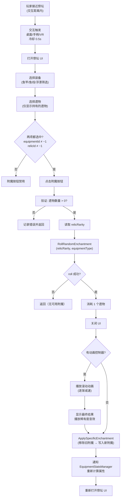

#### 遗物稀有度 → 附魔品质加权随机

**来源：** `EnchantmentDatabase.__0_RollEnchantmentRarity()`

遗物的 `relicRarity` 值决定附魔稀有度的权重分布。每种遗物稀有度对应一组 5 个可配置权重（`commonWeight / uncommonWeight / rareWeight / epicWeight / legendaryWeight`），通过加权随机算法选择附魔稀有度：

```text
total = Σ(各稀有度权重)
roll = Random(0, total)
累加判定: Common → Uncommon → Rare → Epic → Legendary
```

> **高品质遗物（如 Epic/Legendary Relic）会显著提高获得高稀有度附魔的概率。** 权重值在 Unity Editor 中配置，非硬编码。

#### 动画控制器

| 参数 | 说明 |
| --- | --- |
| rollingDuration | 滚动动画总时长 |
| startTicksPerSecond | 初始切换速率（快） |
| endTicksPerSecond | 结束切换速率（慢，减速效果） |
| resultDisplayDuration | 结果展示持续时间 |
| maxAttempts = 10 | 避免连续显示相同附魔的重试上限 |

#### 祭坛音效

| 事件 | 音效 |
| --- | --- |
| 打开祭坛 | altarOpenSound |
| 附魔成功 | enchantSuccessSound |
| 普通品质结果 | commonVictorySound |
| 优秀品质结果 | uncommonVictorySound |
| 稀有品质结果 | rareVictorySound |
| 史诗品质结果 | epicVictorySound |
| 传说品质结果 | legendaryVictorySound |

### 5.6 海域事件与附魔叠加

```text
最终变异概率 = 海域事件变异倍率 × 附魔变异倍率 × 基础变异概率
最终幸运 = 海域事件幸运倍率 × 装备幸运倍率 × buff倍率
强制着色器概率 = 海域事件强制概率（85%）
```

| 海域事件参数                       | 说明               |
| ---------------------------------- | ------------------ |
| `seaEventLuckMultiplier`           | 乘以综合幸运       |
| `seaEventModifierChanceMultiplier` | 乘以变异概率       |
| `seaEventForcedShaderModifier`     | 指定强制着色器     |
| `seaEventForceChance`              | 强制着色器应用概率 |

---

## 6. 增益系统

**来源：** `BuffManager`

### 6.1 增益类型

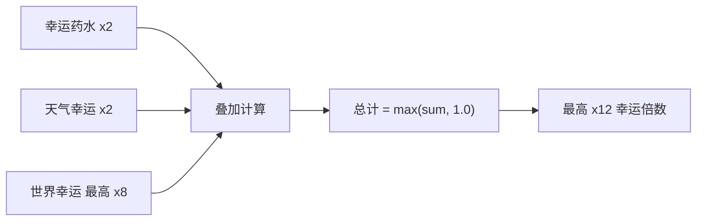

| 增益             | 倍数             | 持续时间     | 叠加方式 |
| ---------------- | ---------------- | ------------ | -------- |
| 幸运药水（个人） | 2.0×             | 累加计时     | 时间叠加 |
| 吸引增益         | 2.0×（冷却减半） | 累加计时     | 时间叠加 |
| 天气幸运         | 2.0×             | 天气持续时段 | 自动     |

### 6.2 世界幸运增益（全服共享，可购买）

**来源：** `BuffManager`（哈希 `fbccb`）+ `UdonProductRewardManager`（哈希 `6069f`）

| 等级   | 持续时间           | 幸运倍数 | 购买方式              |
| ------ | ------------------ | -------- | --------------------- |
| Tier 1 | 1800 秒（30 分钟） | 2.0×     | VRC Economy 实付产品  |
| Tier 2 | 2700 秒（45 分钟） | 4.0×     | VRC Economy 实付产品  |
| Tier 3 | 5400 秒（90 分钟） | 8.0×     | VRC Economy 实付产品  |

#### 购买与升级机制

- **VRC Economy**：通过 VRChat 内置经济系统付费购买，属于真金白银的消费项目
- **全服生效**：任何一位玩家购买后，**整个服务器所有玩家**均享受幸运加成
- **升级折损**：从低等级升到高等级时，剩余时间按 **50% 折损**转换到新等级
- **全服广播**：购买触发全服通知，所有玩家可见
- **UI 差异化**：3 个等级对应 3 个不同的图标和专属音效，用于视觉区分当前 Buff 等级

### 6.3 综合幸运最终公式

```text
装备幸运 = (鱼竿.luck + 鱼线.luck + 浮漂.luck + 附魔.luck + 成就.luck) / 100 + 1.0
宠物幸运 = (宠物幸运等级) / 100 + 1.0
buff总倍率 = 药水倍率(2.0) + 世界幸运倍率(2/4/8) + 天气幸运倍率(2.0)

最终幸运 = 装备幸运 × buff总倍率
理论最高 = 2 + 8 + 2 = 12× 幸运
```

> **注意**：幸运力（luckPower）用于调整稀有度概率分布，实际实现为**纯线性**计算，无 sigmoid 平滑曲线。

---

## 7. 海域事件

**来源：** `SeaEventSpawner` + 海域事件条目

### 7.1 生成参数

| 参数           | 值               |
| -------------- | ---------------- |
| 最大同时事件数 | 2                |
| 事件持续时间   | 600 s（10 分钟） |
| 事件半径       | 15               |
| 生成点数量     | 6                |
| 每点生成半径   | 136.24           |

### 7.2 事件列表

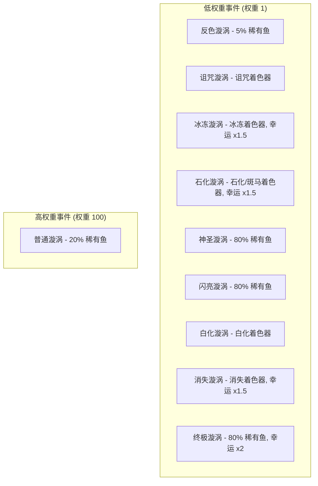

**低权重事件（9 种）**：权重均为 1，每种特定着色器 2× 变异概率，85% 获得指定着色器。其中 3 种提供 80% 稀有鱼概率。
**高权重事件（1 种）**：权重 100，无特殊着色器加成，20% 稀有鱼概率。绝大多数时候触发的是此事件。

---

## 8. 船只系统

**来源：** 船只条目 + `BoatController`

### 8.1 船只数据

| ID  | 名称         | 价格          | 速度   | 加速 | 减速 | 转向 | 船体大小 | 加速器                 |
| --- | ------------ | ------------- | ------ | ---- | ---- | ---- | -------- | ---------------------- |
| 0   | 冲浪板       | 800           | 5      | 2    | 6    | 70   | 0.50     | 无                     |
| 1   | 划艇         | 3,000         | 5      | 2    | 6    | 50   | 0.15     | 无                     |
| 2   | 小艇         | 30,000        | 10     | 4    | 4    | 65   | 0.10     | 无                     |
| 3   | **豪华快艇** | **1,000,000** | **25** | 5    | 4    | 65   | 0.50     | **2.0×/3s 持续/8s CD** |
| 4   | 小型游艇     | 200,000       | 20     | 3    | 4    | 55   | 0.40     | 1.2×/3s 持续/5s CD     |
| 5   | 爱好者船     | 15,000        | 8      | 3    | 4    | 80   | 0.10     | 无                     |
| 6   | 独木舟       | 2,000         | 5      | 2    | 6    | 50   | 0.15     | 无                     |

> **加速器参数说明**：仅豪华快艇（ID:3）和小型游艇（ID:4）拥有加速器功能。格式为 `倍率/持续时间/冷却时间`。豪华快艇加速 2.0× 持续 3 秒，冷却 8 秒；小型游艇加速 1.2× 持续 3 秒，冷却 5 秒。

### 8.2 船只物理引擎

**来源：** `BoatController`（哈希 `292a2`，4655 行）— 运动学刚体（Kinematic Rigidbody），**不使用 Unity 物理力**，全部基于 Transform 手动计算。

#### 核心速度公式

```text
targetSpeed = forwardInput × maxSpeed
若 isBoosting:     targetSpeed ×= boostMultiplier
若 isDrifting 且有转向且非Boost: targetSpeed ×= driftSpeedReduction

accelPerSecond = (maxSpeed × acceleration) / 10
decelPerSecond = (maxSpeed × deceleration) / 10

speedChangeRate = (加速中) accelPerSecond : decelPerSecond
若 isBoosting:     speedChangeRate ×= 2

currentSpeed = MoveTowards(currentSpeed, targetSpeed, speedChangeRate × Δt)
```

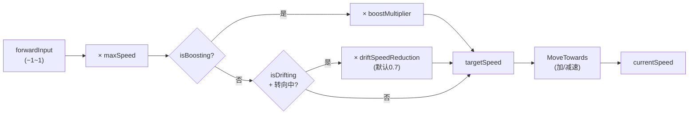

#### 默认船只参数（无数据库条目时）

| 参数 | 默认值 | 说明 |
| --- | --- | --- |
| maxSpeed | 5 | 最大速度 |
| acceleration | 1 | 加速率 |
| deceleration | 1 | 减速率 |
| turnSpeed | 55°/s | 转向速度 |
| turnTiltAmount | −10° | 转弯倾斜 |
| driftTurnMultiplier | 3× | 漂移转向增幅 |
| driftSpeedReduction | 0.7 | 漂移速度衰减 |
| driftTiltAmount | −15° | 漂移倾斜 |
| driftMomentumBlend | 0.8 | 漂移动量混合 |
| driftTransitionSpeed | 3 | 漂移过渡速率 |
| boostMultiplier | 2× | 加速倍率 |
| boostDuration | 3s | 加速持续 |
| boostCooldown | 5s | 加速冷却 |
| boostTiltAmount | 20° | 加速前倾 |

#### 转向系统

```text
effectiveTurnSpeed = turnSpeed × Lerp(1, driftTurnMultiplier, driftTransition)
turnAmount = turnInput × effectiveTurnSpeed × Δt
turnAmount ×= Clamp01(|currentSpeed| / maxSpeed)   // 低速转弯弱
若倒车: turnAmount ×= −1
currentYaw += turnAmount
```

#### 漂移系统

| 触发方式 | 条件 |
| --- | --- |
| 桌面 | 按住跳跃键（Space） |
| VR | 左扳机 ≥ vrTriggerThreshold |

```text
漂移激活时:
  · forwardInput 强制设为 1（自动全速，需 currentSpeed > 0.5）
  · 转向倍率逐渐过渡至 driftTurnMultiplier（默认3×）
  · 速度衰减至 driftSpeedReduction（默认0.7×）
  · 速度方向通过 Slerp 缓慢跟随船头（blend = 0.8 × Δt × 2）
普通状态:
  · 速度方向通过 Slerp 快速跟随船头（blend = Δt × 3）
最终移动:
  movementDir = Slerp(船头, 速度方向, driftTransition)
  newPos = pos + movementDir × currentSpeed × Δt
```

#### 加速系统（Boost）

```text
触发: enableBoost && cooldownTimer ≤ 0 && !isBoosting
      桌面: LeftShift | VR: 右摇杆纵轴 ≥ 0.99

激活: boostTimeRemaining = boostDuration (默认3s)
持续: targetSpeed ×= boostMultiplier (默认2×)
      speedChangeRate ×= 2
      漂移速度衰减不生效
结束: boostCooldownTimer = boostCooldown (默认5s)
视觉: 前倾 targetTiltX = −5 × (speed / maxSpeed)
```

#### 搁浅/地形检测

```text
sizeScale = Lerp(0.3, 1, boatSize)
射线: 从 pos + scaledRayStartHeight 向下，距离 = groundCheckDistance + scaledRayStartHeight
      layerMask = terrainLayerMask

搁浅判定: terrainHeight > waterYLevel + scaledBeachThreshold
脱离判定: terrainHeight < waterYLevel − scaledUnbeachThreshold
完全搁浅: 搁浅 + |speed| < 0.1 持续 2秒 → 速度清零、rigidbody Sleep

地形跟随:
  搁浅时 targetY = terrainHeight + scaledBottomOffset
  水上时 targetY = waterYLevel
  smoothedY = Lerp(currentY, targetY, terrainFollowSpeed × Δt)
  收敛阈值: |差值| < 0.02 时直接吸附

地形对齐旋转:
  targetPitch = Asin(Dot(法线, 船头)) × rad2deg
  targetRoll  = −Asin(Dot(法线, 船右)) × rad2deg
  平滑: LerpAngle(current, target, terrainAlignSpeed × Δt)
```

#### 碰撞处理

```text
前方碰撞检测:
  checkDist = scaledForwardCheckDistance × (1 + |speed| / maxSpeed)
  若坡度 > maxClimbableSlope:
    brakeFactor = Clamp01(distance / scaledForwardCheckDistance)
    brakeStrength = (1 − brakeFactor) × deceleration × 4
    紧急停止: distance < 0.5 → speed = 0

实体碰撞 (onCollisionEnter):
  1. speed 立即归零
  2. 停止 Boost → 启动冷却
  3. 停止漂移，重置所有转向/倾斜
  4. rigidbody velocity/angularVelocity 归零 + Sleep
```

#### 浮力摆动系统

```text
bobbingTimer += Δt × bobbingSpeed
bob = Sin(bobbingTimer) × bobbingAmount
targetPos.y += bob

// 微摆 roll (固定参数)
roll = Sin(bobbingTimer × 0.7) × 2°
```

#### 其他常量

| 参数 | 值 | 说明 |
| --- | --- | --- |
| IsMoving 阈值 | \|speed\| > 0.1 | 判定为移动中 |
| 无人船 Despawn | 60s | 无人认领自动消失 |
| 出生保护 | 2s | spawnGraceTimer（不会搁浅） |
| 隐藏位置 | (0, 10000, 0) | 船只停放/回收位置 |
| 速度归一化分母 | 10 | accel/decel 公式分母 |

### 8.3 船只皮肤

**来源：** `BoatSkinDatabase`（33 种皮肤）

#### 冲浪板皮肤（Boat ID: 0）

| 皮肤名                    | 价格 | 特殊                |
| ------------------------- | ---- | ------------------- |
| Default Surfboard（默认） | 免费 | 默认                |
| Sunset Surfboard（日落）  | 500  | —                   |
| Sakura Surfboard（樱花）  | 750  | —                   |
| Nice Rice Board（好米）   | 750  | —                   |
| Prism SurfBoard（棱镜）   | 500  | **已禁用/不可购买** |

#### 划艇皮肤（Boat ID: 1）

| 皮肤名                      | 价格  | 特殊                |
| --------------------------- | ----- | ------------------- |
| Default Skin（默认）        | 免费  | 默认                |
| Lifeguard Rowboat（救生员） | 750   | —                   |
| Gloomy Rowboat（阴郁）      | 750   | —                   |
| Luxury Rowboat（豪华）      | 1,000 | —                   |
| Prism Rowboat（棱镜）       | 1     | **已禁用/不可购买** |

#### 小艇皮肤（Boat ID: 2）

| 皮肤名                         | 价格  |
| ------------------------------ | ----- |
| Default Skin（默认）           | 500   |
| Aquatic Camo Dingy（水域迷彩） | 1,250 |
| Pink Tribal Dingy（粉红部落）  | 5,000 |
| Speedboat Dingy（快艇）        | 2,000 |

#### 豪华快艇皮肤（Boat ID: 3）

| 皮肤名                                  | 价格          | 特殊       |
| --------------------------------------- | ------------- | ---------- |
| Default Skin（默认）                    | 免费          | 默认       |
| Deep Blue Skin（深蓝）                  | 20,000        | —          |
| Gold and Blue（金蓝）                   | 25,000        | —          |
| Crusader Skin（十字军）                 | 35,000        | —          |
| Purple Menace Skin（紫色威胁）          | 35,000        | —          |
| Prism Luxury Speedboat（棱镜）          | 5             | **已禁用** |
| **Prism Luxury Speedboat v2**（棱镜v2） | **1,000,000** | 最贵皮肤   |

#### 小型游艇皮肤（Boat ID: 4）

| 皮肤名                     | 价格        |
| -------------------------- | ----------- |
| Clean（洁净，默认）        | 500         |
| Glacial（冰川）            | 2,500       |
| Bubblegum Pink（泡泡糖粉） | 5,000       |
| Hot Reels（热卷）          | 5,000       |
| Fundido（熔融）            | 8,000       |
| **24K**（24K金）           | **100,000** |

#### 爱好者船皮肤（Boat ID: 5）

| 皮肤名                     | 价格  |
| -------------------------- | ----- |
| Default Skin（默认）       | 500   |
| Stealth Skin（隐身）       | 1,000 |
| Purple Dragon Skin（紫龙） | 2,500 |
| Red Temple Skin（赤庙）    | 3,000 |

#### 独木舟皮肤（Boat ID: 6）

| 皮肤名                          | 价格 | 特殊                |
| ------------------------------- | ---- | ------------------- |
| Default Skin（默认）            | 免费 | 默认                |
| Beta Tester Skin（Beta 测试者） | 750  | **已禁用/不可购买** |

### 8.4 船只商店系统

**来源：** `BoatShopUIScript`（哈希 `b556f`）— 4 个实例

| 参数 | IL 变量名 | 值 |
| --- | --- | --- |
| 商店实例数 | — | **4 个**船只商店 |
| 可购买船只 | `availableBoatIds` | `[0,1,2,3,4,5,6]`（全部 7 种） |
| 生成冷却 | `spawnCooldown` | **1 秒** |
| 联网商店数 | `allBoatShops` | 4 个（全服共享状态） |

**各商店生成点数量：**

| 商店实例 | 生成点数 | 说明 |
| --- | --- | --- |
| 商店 #1 | 7 个 | — |
| 商店 #2 | 6 个 | 生成点较少 |
| 商店 #3 | 7 个 | — |
| 商店 #4 | 7 个 | — |

**UI 界面功能**：购买列表（含星级评价：TopSpeed/Acceleration/Sturdiness/Boost）→ 详情面板（价格+描述）→ 购买确认 → 已拥有船只列表 → 皮肤定制面板。

### 8.5 船只网络同步

**来源：** `SimpleBoatSyncManager`（哈希 `1e9b1`）

| 参数 | IL 变量名 | 值 | 说明 |
| --- | --- | --- | --- |
| 动态插槽数 | `dynamicSlotCount` | **100** | 最多 100 艘船同时存在 |
| 最大玩家数 | `maxPlayers` | **40** | 服务器上限 40 人 |
| 插值速度 | `interpolationSpeed` | **15** | 位置平滑过渡 |
| 同步频率 | `syncRate` | **5 Hz** | 每秒同步 5 次 |
| 玩家同步池 | `playerSyncPool` | 40 个槽位 | 每玩家一个同步对象 |

> **机制说明**：每位玩家的船只位置每秒同步 5 次，远端玩家看到的船只通过 `interpolationSpeed=15` 平滑插值渲染，避免卡顿。100 个动态插槽支持多船并存场景。

### 8.6 船只随处放置

**来源：** `BoatPlacerSpawnAnywhere`（哈希 `0d4fe`）

| 参数 | 值 |
| --- | --- |
| 生成冷却 | 1 秒 |

> 此系统允许已拥有的船只在任意水域放置，而非仅限商店码头。

---

## 9. 宠物系统

**来源：** `PetStats` + `AFKPet` + `PetDatabase`

### 9.1 宠物列表

| ID  | 宠物名                               | 稀有度        | 默认解锁 | 获取方式           |
| --- | ------------------------------------ | ------------- | -------- | ------------------ |
| 0   | Basic Pet（基础宠物）                | 0（普通）     | ✗        | 未知               |
| 1   | **Fishing Frog**（钓鱼蛙）           | 0（普通）     | **✓**    | 默认拥有           |
| 2   | **Bucket Capybara**（水桶水豚）      | 1（稀有）     | ✗        | 每日登录第1周第7天 |
| 3   | Fishing Frog Nitro（Nitro 钓鱼蛙）   | 0（普通）     | ✗        | Discord Nitro 奖励 |
| 4   | **Lucky Cat (Patreon)**（招财猫）    | **4（传说）** | ✗        | Patreon 支持者独占 |
| 5   | **Engineer Frog (Beta)**（工程师蛙） | 3（史诗）     | ✗        | Beta 测试者奖励    |

### 9.2 基础参数与升级系统

| 参数         | 基础值           |
| ------------ | ---------------- |
| 基础钓鱼间隔 | 600 s（10 分钟） |
| 基础容量     | 5 条鱼           |
| 基础最大重量 | 10 kg            |
| 可钓变异鱼   | 否               |

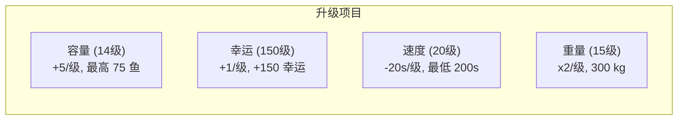

| 升级项   | 最大等级 | 每级加成   | 满级效果       |
| -------- | -------- | ---------- | -------------- |
| 容量     | 14       | +5 鱼/级   | 总计 75 鱼     |
| 幸运     | 150      | +1/级      | +150 幸运      |
| 钓鱼速度 | 20       | −20 s/级   | 最低 200s 间隔 |
| 最大重量 | 15       | ×2 重量/级 | 300 kg         |

### 9.3 升级成本分析

| 升级项 | 1级 → 满级      | 总升级点 | 满级效果                  |
| ------ | --------------- | -------- | ------------------------- |
| 容量   | 5 → 75 鱼       | 14 点    | 15× 基础容量              |
| 幸运   | 0 → +150        | 150 点   | 等同法老之竿（75%幸运值） |
| 速度   | 600s → 200s     | 20 点    | 3× 钓鱼频率               |
| 重量   | 10 → 327,680 kg | 15 点    | 2^15 × 10 kg              |

> **满级宠物每小时理论产出**：75 条鱼 × (3600/200) = **每小时最多 1,350 条鱼**（若容量允许且持续挂机）

> 📈 **宠物升级效果曲线**（各属性升级进度 vs 效果百分比，注意各属性最大等级不同）
>
> 

### 9.4 AFK 宠物行为

| 参数           | 值  |
| -------------- | --- |
| 徘徊半径       | 0.3 |
| 徘徊速度       | 0.5 |
| 浮动幅度       | 0.1 |
| 动画剔除距离   | 25  |
| DEBUG 钓鱼间隔 | 5 s |

### 9.5 宠物放置系统

**来源：** `PetScripts PLACER`（哈希 `89e20`）

| 参数 | IL 变量名 | 值 | 说明 |
| --- | --- | --- | --- |
| 最低等级要求 | `requiredLevel` | **5** | 5 级以下无法放置宠物 |
| 最大放置距离 | `maxPlacementDistance` | **10** | 10 米内可放置 |
| 放置键 | `placeKey` | **323（Mouse0/左键）** | 左键确认放置 |
| 预览切换键 | `togglePreviewKey` | **112（F1）** | F1 键显示/隐藏放置预览 |
| 有效颜色 | `validColor` | (0,1,0,1) 绿色 | 可放置区域显示绿色 |
| 无效颜色 | `invalidColor` | (1,0,0,1) 红色 | 不可放置区域显示红色 |
| 射线线宽 | `raycastLineWidth` | 0.01 | VR 射线可视化宽度 |
| 水面检测层 | `waterLayerMask` | 16 | 水面检测用层 |
| 障碍物检测层 | `obstacleLayerMask` | 2048 | 障碍物检测用层 |

> **放置流程**：按 F1 开启预览模式 → 射线指向水面（绿色=有效/红色=无效）→ 左键确认放置。宠物只能放置在水面上，且距离不超过 10 米。需达到 5 级才能使用此功能。

---

## 10. 玩家成长系统

### 10.1 等级与经验

**来源：** `PlayerStatsManager`（哈希 `2baf2`）

| 参数           | 值      |
| -------------- | ------- |
| 等级上限       | 1000    |
| 经验阈值数组   | 1001 个 |
| 升级特效范围   | 20 单位 |
| 经验条动画速度 | 0.2     |
| 保存间隔       | 3600 s  |

使用**二分搜索**在累计经验阈值数组中查找当前等级：

```text
当前等级起始经验 = GetTotalXPForLevel(当前等级)
所需经验 = GetXPRequiredForLevel(当前等级)
等级内经验 = 总经验 − 起始经验
进度 = Clamp01(等级内经验 / 所需经验)
```

### 10.2 经验阈值完整数据

#### 早期等级 XP 需求（1-10 级精确值）

| 等级 | 1   | 2   | 3   | 4   | 5   | 6   | 7   | 8   | 9   | 10  |
| ---- | --- | --- | --- | --- | --- | --- | --- | --- | --- | --- |
| XP   | 120 | 140 | 160 | 185 | 210 | 240 | 270 | 305 | 340 | 400 |

#### 分段 XP 阈值

| 等级范围    | 每级 XP 需求 | 说明         |
| ----------- | ------------ | ------------ |
| 1 ~ 10      | 120 ~ 400    | 独立数组查表 |
| 11 ~ 49     | **650**      | 固定值       |
| 50 ~ 499    | **1,000**    | 固定值       |
| 500 ~ 899   | **2,000**    | 固定值       |
| 900 ~ 1,000 | **4,000**    | 最高固定值   |

#### 累计 XP 里程碑

| 等级 | 累计总 XP     | 该级总花费 |
| ---- | ------------- | ---------- |
| 10   | 1,970         | 400        |
| 20   | 8,220         | 650        |
| 50   | 27,720        | 1,000      |
| 100  | 77,720        | 1,000      |
| 200  | 177,720       | 1,000      |
| 500  | 477,720       | 2,000      |
| 1000 | **1,677,720** | 4,000      |

> **满级（Lv1000）需要总计 1,677,720 XP**。以终极秘密鱼（40 XP/条）为基准，需要钓约 41,943 条终极秘密鱼。

> 📈 **XP 阈值曲线**（X 轴：等级 0~1000，Y 轴：累计经验。红色虚线标注各阶段分界）
>
> 

### 10.3 每种稀有度的 XP 奖励

| 稀有度                   | 每条鱼 XP |
| ------------------------ | --------- |
| 垃圾 Trash               | 10        |
| 丰富 Abundant            | 15        |
| 普通 Common              | 15        |
| 好奇 Curious             | 20        |
| 罕见 Elusive             | 20        |
| 遗物 Relic               | 20        |
| 传说 Fabled              | 25        |
| 神话 Mythic              | 25        |
| 异域 Exotic              | 30        |
| 秘密 Secret              | 35        |
| 终极秘密 Ultimate Secret | 40        |

### 10.4 追踪统计数据（均网络同步）

- `level` — 当前等级
- `xp` — 累计经验
- `money` — 当前货币
- `fishCaught` — 总钓鱼数
- `rareFishCaught` — 稀有鱼钓获数
- `fishSold` — 总出售数
- `timePlayed` — 游戏时长（秒）
- `bountiesCompleted` — 已完成赏金

### 10.5 称号与成就系统

**来源：** `AchievementSystem`（34 个称号/成就）

#### 等级里程碑称号

| 称号名                       | 要求          | 幸运奖励 | 经验奖励 | 金币奖励 |
| ---------------------------- | ------------- | -------- | -------- | -------- |
| 兴奋！Excited!               | 等级 10       | 0        | 0        | 0        |
| 专家 Expert                  | 等级 50       | 0        | 0        | 0        |
| 光环农民 Aura Farmer         | 等级 100      | 0        | 0        | 0        |
| 鱼惧我 Fish Fear Me          | 等级 200      | 0        | 0        | 0        |
| 草帽海贼！Straw Hat Pirate!  | 等级 500      | 0        | 0        | 0        |
| **水之神 God of the Waters** | **等级 1000** | 0        | 0        | 0        |

#### 钓鱼里程碑称号

| 称号名                       | 要求            | 经验奖励     |
| ---------------------------- | --------------- | ------------ |
| 学徒钓手 Apprentice Angler   | 捕鱼 10         | 100 XP       |
| 老练钓手 Seasoned Angler     | 捕鱼 100        | 400 XP       |
| 大师钓手 Master Angler       | 捕鱼 500        | 800 XP       |
| 卓越钓手 Ascendant Angler    | 捕鱼 2,000      | 1,600 XP     |
| 超越钓手 Transcendent Angler | 捕鱼 5,000      | 1,600 XP     |
| **神圣钓手 Divine Angler**   | **捕鱼 10,000** | **1,600 XP** |

#### 售鱼里程碑称号

| 称号名                       | 要求        | 金币奖励 | 经验奖励 |
| ---------------------------- | ----------- | -------- | -------- |
| 推销员 Salesman              | 卖鱼 10     | 25       | 25 XP    |
| 辛叶关联 Sunleaf Affiliate   | 卖鱼 100    | 1,000    | 1,000 XP |
| 商人 Business Man            | 卖鱼 1,000  | 0        | 0        |
| 辛叶股东 Sunleaf Shareholder | 卖鱼 3,000  | 0        | 0        |
| 首席执行官 CEO               | 卖鱼 10,000 | 0        | 0        |

#### 区域图鉴完成称号

完成各区域的鱼类图鉴可获得 **+15 幸运**加成！

| 称号名                                 | 区域                         | 幸运奖励 | 金币 | 经验  |
| -------------------------------------- | ---------------------------- | -------- | ---- | ----- |
| 阿努比斯的门徒 Anubis' Disciple        | Luxian Dunes（卢西安沙丘）   | **+15**  | 100  | 50 XP |
| 可可狂人！Nuts for Coconuts!           | Coconut Bay（椰子湾）        | **+15**  | 100  | 50 XP |
| 捉鬼敢死队 Ghostbuster                 | Tanglewood（缠木沼泽）       | **+15**  | 100  | 50 XP |
| 爱国研究者 Patriotic Researcher        | Crescent Isle（新月岛）      | **+15**  | 100  | 50 XP |
| 穿越火与焰 Through the Fire and Flames | Crescent Volcano（新月火山） | **+15**  | 100  | 50 XP |

> **总计**：完成全部 5 个区域图鉴可获得 **+75 永久幸运**，这是游戏中最重要的隐藏幸运来源之一。

#### 特殊称号

| 称号名                             | 条件                  | 奖励       | 隐藏  | Discord 独占 |
| ---------------------------------- | --------------------- | ---------- | ----- | ------------ |
| 赏金猎人 Bounty Hunter             | 完成 50 个悬赏        | 5,000 金币 | ✗     | ✗            |
| 荣誉格洛平古斯 Honorary Glorpingus | 帮 Glorpingo 找到妻子 | 300 XP     | ✗     | ✓            |
| 意面爱好者 Pastrami Enjoyer        | 帮 Celly 找到钥匙     | 300 XP     | ✗     | ✓            |
| 盾之勇者 Shield Hero               | 获得 Joeblo 认可      | 300 XP     | ✗     | ✓            |
| 考古学家 Archaeologist             | 帮助 Harrison         | 0          | ✗     | ✓            |
| Beta 测试员 Beta Tester            | BETA_PLAYER 标记      | 0          | **✓** | ✗            |
| 早期支持者 Early Supporter         | 早期支持标记          | 0          | **✓** | ✗            |
| 支持者 Supporter                   | 支持标记              | 0          | **✓** | ✗            |
| Nitro Booster                      | Discord Nitro         | 0          | **✓** | ✓            |
| Nitro Addict                       | Discord Nitro         | 0          | **✓** | ✓            |
| Patreon Baller                     | Patreon 支持          | 0          | **✓** | ✓            |
| Patreon Supporter                  | Patreon 支持          | 0          | **✓** | ✓            |

---

## 11. 经济系统

### 11.1 鱼价公式

```text
重量系数 = InverseLerp(重量, 最大重量, 最小重量)
基础价格 = Lerp(重量系数, 最高价, 最低价)
最终价值 = 基础价格 × 体型倍数 × 着色器倍数
```

### 11.2 价值乘数叠加


**理论最大价值倍数**：

- 全息/静电着色器：5.0×
- 巨大体型：1.5×
- 时间/天气偏好：2.0×
- **合计：最高 15× 基础价格**（附魔加成另算）

### 11.3 出售系统详解

**来源：** `ShopManager`（哈希 `762cb`，3594 行）

#### 卖鱼最终价格

```text
finalPrice = Max(1, RoundToInt(baseValue × sellValueMultiplier))
```

其中 `baseValue` 由 fishEntry（鱼种条目）的 `CalculateFishValue` 方法计算，接收 weight、sizeModifier、shaderModifier、fishModifier 四个参数。`sellValueMultiplier` 为 Unity Editor 中配置的公开属性。

> **注意**：附魔加成（moneyMaker、pocketWatcher、doubleUp）**不在 ShopManager 中计算**，而是由 fishEntry/fishModifier/playerStats 在 `baseValue` 计算阶段处理。

#### 出售队列机制

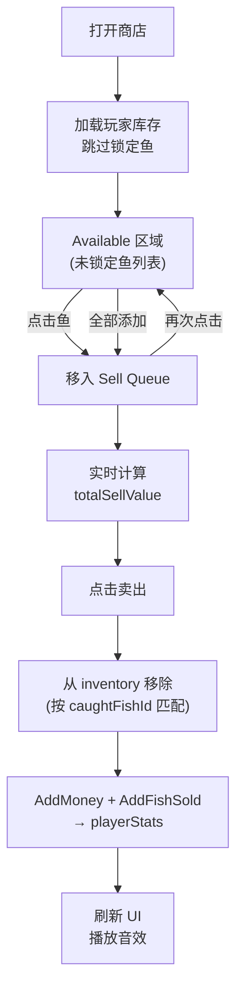

**两种出售模式**：

| 模式 | 函数 | 特点 |
| --- | --- | --- |
| 队列出售 | `_SellQueuedFish()` | 手动选择每条鱼，支持反悔移回 |
| 一键出售 | `_SellAllUnlockedFish()` | 直接操作 inventory data，不经过队列 |

- 队列最大容量：**100** 条鱼（数组预分配长度）
- 数组压缩：移除元素后，后续元素左移填充空位
- 防重入锁：`_isSelling` 标记防止重复出售

#### 体型修饰符映射

| 原始值 | 映射名称 | 效果 |
| --- | --- | --- |
| 0 | Normal（正常） | 无前缀显示 |
| 1 | Huge（巨大） | ×1.5 价值 |
| 2 | Tiny（微小） | 降低价值 |

#### 着色器修饰符映射（24种）

| ID | 名称 | 颜色标记 | ID | 名称 | 颜色标记 |
| --- | --- | --- | --- | --- | --- |
| 0 | Normal | #F5F5F5 | 12 | Rainbow | #808080 |
| 1 | Albino | #00FFFF | 13 | Stone | #000000 |
| 2 | Shiny | #FFD700 | 14 | Zebra | #FF8C00 |
| 3 | Golden | #6B8E8E | 15 | Tiger | #556B2F |
| 4 | Ghastly | #FFFFFF | 16 | Camo | #FFFF00 |
| 5 | Blessed | #FF0000 | 17 | Electric | #CCCCCC |
| 6 | Cursed | #39FF14 | 18 | Static | #4B0082 |
| 7 | Radioactive | #FF00FF | 19 | Void | #87CEEB |
| 8 | Glitched | #C2B280 | 20 | Frozen | #1A1A1A |
| 9 | Sandy | #88FFFF | 21 | Shadow | #FFFF00 |
| 10 | Holographic | #FF6600 | 22 | Negative | #9966FF |
| 11 | Burning | #FF6B6B | 23 | Galaxy | #00FFFF |

### 11.4 每日奖励

**来源：** `DailyRewardDatabase`

#### 每周前6天

| 天数    | 类型 | 奖励        |
| ------- | ---- | ----------- |
| 第 1 天 | 货币 | 250 金币    |
| 第 2 天 | 物品 | 2× 幸运药水 |
| 第 3 天 | 货币 | 500 金币    |
| 第 4 天 | 物品 | 2× 遗物     |
| 第 5 天 | 货币 | 5,000 金币  |
| 第 6 天 | 物品 | 2× 速度药水 |

#### 第 7 天（每周轮换）

| 周次    | 奖励               |
| ------- | ------------------ |
| 第 1 周 | 水桶水豚（宠物）   |
| 第 2 周 | 十字军快艇（船只） |
| 第 3 周 | 新皮肤             |
| 第 4 周 | 新皮肤             |
| 第 5 周 | 新皮肤             |
| 第 6 周 | 新皮肤             |

**兜底奖励**（所有唯一奖励领完后）：15 个额外碎片 + 750 金币

### 11.5 悬赏任务系统

**来源：** `BountyManager`（哈希 `60b1a`）

| 参数         | 值               | 说明                           |
| ------------ | ---------------- | ------------------------------ |
| 每日悬赏数   | **5**            | 每天 5 个悬赏                  |
| 普通悬赏奖励 | **1,000 金币**   | 前 4 个悬赏                    |
| 最后悬赏奖励 | **3× 遗物碎片**  | 第 5 个悬赏（Old Relic Piece） |
| 每次 XP 奖励 | 1 XP             | 每次提交均获得                 |
| 黑名单区域   | Crescent_Volcano | 火山鱼不参与悬赏选鱼           |

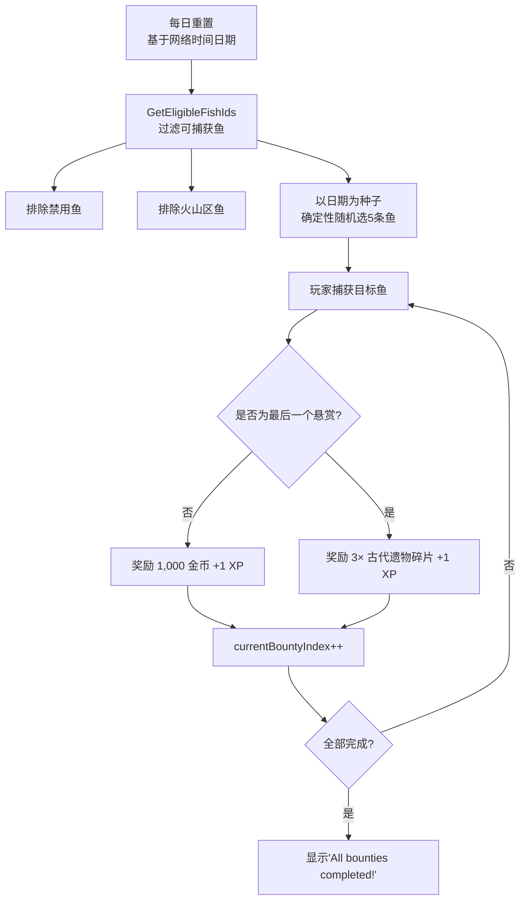

> **每日悬赏理论最大收入**：4 × 1,000 = 4,000 金币 + 3 个遗物碎片（可用于附魔祭坛）+ 5 XP

### 11.6 废铁（Scrap Metal）生成系统

**来源：** `ScrapMetalManager`（哈希 `d01ec`）

| 参数 | IL 变量名 | 值 | 说明 |
| --- | --- | --- | --- |
| 生成点总数 | `scrapObjects` | **46 个** | 地图上共 46 个废铁刷新点 |
| 激活比例 | `activeFraction` | **0.25** | 每次仅 25% 的点位激活（约 11~12 个） |
| 每次拾取量 | `scrapQuantity` | **1** | 每个点位拾取 1 个废铁 |
| 废铁物品 ID | `scrapQuestItemId` | **13** | 对应任务物品数据库 ID=13 |
| 调试模式 | `debugMode` | `false` | — |

> **刷新机制**：ScrapMetalManager 在每次刷新周期中，随机选取 46 个生成点中的 25%（约 11~12 个）激活。玩家拾取后该点位失效，等待下次刷新。废铁的用途：
> 1. **老虎机**（§11.7）：每次消耗 1 个废铁旋转
> 2. **Oga NPC**：废金属兑换商人
> 3. **地面散落**：46 个拾取实例（哈希 `18152`，含 `scrapIndex`/`pickupSound`/`pickupEffectPrefab`）

### 11.7 废铁老虎机系统

**来源：** `ScrapSlotMachineManager`（哈希 `a68c9`）

用废铁（Scrap Metal，itemId=13）驱动的老虎机赌博系统。每次消耗 **1 个 Scrap Metal** 旋转一次。

#### 机器参数

| 参数               | 值     | 说明               |
| ------------------ | ------ | ------------------ |
| `scrapCostPerSpin` | 1      | 每次消耗 1 个废铁  |
| `stripSlotCount`   | 60     | 滚轮格子数         |
| `winnerSlotIndex`  | 50     | 获胜判定在第 50 格 |
| `spinDuration`     | 4 秒   | 旋转持续时间       |
| `easingPower`      | 3      | 缓动指数（减速）   |
| `startTickInterval`| 0.05 s | 起始跳动间隔       |
| `endTickInterval`  | 0.3 s  | 结束跳动间隔       |

#### 完整奖品表（10 种，总权重 61.6）

| # | 奖品             | 类型   | 值          | 权重 | 概率       | 展示加速 |
| - | ---------------- | ------ | ----------- | ---- | ---------- | -------- |
| 0 | 500 金币         | 💰金币 | 500         | 10   | **16.2%**  | ×1       |
| 1 | 1,000 金币       | 💰金币 | 1,000       | 10   | **16.2%**  | ×1       |
| 2 | **10,000 金币**  | 💰金币 | 10,000      | 0.5  | **0.81%**  | ×10      |
| 3 | 古代遗物碎片     | 🎒物品 | itemId=2    | 10   | **16.2%**  | ×1       |
| 4 | 苔藓遗物         | 🎒物品 | itemId=3    | 1    | **1.62%**  | ×10      |
| 5 | **强力遗物**     | 🎒物品 | itemId=4    | 0.1  | **0.16%**  | ×20      |
| 6 | 速度药水         | 🎒物品 | itemId=15   | 5    | **8.1%**   | ×2       |
| 7 | 幸运药水         | 🎒物品 | itemId=16   | 5    | **8.1%**   | ×2       |
| 8 | 500 XP           | ⭐经验 | 500         | 10   | **16.2%**  | ×1       |
| 9 | 废铁（回本）     | 🎒物品 | itemId=13   | 10   | **16.2%**  | ×1       |

> **奖励类型编码**：0=XP, 1=金币, 2=物品

#### 奖励期望值分析

```text
每次旋转消耗: 1 × Scrap Metal
金币期望: 500×16.2% + 1000×16.2% + 10000×0.81% ≈ $324
遗物概率: 古代碎片 16.2% + 苔藓遗物 1.62% + 强力遗物 0.16%
药水概率: 速度药水 8.1% + 幸运药水 8.1%
回本概率(再获得废铁): 16.2%
```

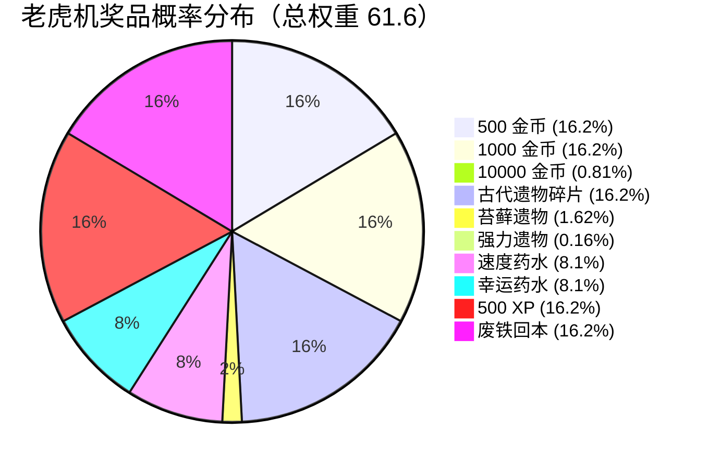

> **最稀有奖品**：强力遗物仅 **0.16%** 概率，平均需要旋转约 **625 次**才能获得一个。这是除钓鱼外获取高品质遗物的另一条途径。废铁可通过 NPC Oga 兑换、兑换码 `1MVISITS`（5 个）、以及地面拾取获得。

### 11.8 商店分布

**来源：** `ShopUIManager`（哈希 `efdec`）

| 商店名              | 位置             | 说明           |
| ------------------- | ---------------- | -------------- |
| Crescent Isle       | 新月岛主商店     | 基础装备       |
| Coconut Bay         | 椰子湾商店       | —              |
| Desert              | 沙漠商店         | —              |
| Swamp               | 沼泽商店         | —              |
| Lighthouse          | 灯塔商店         | —              |
| Enchanting Isle     | 附魔岛           | 附魔专用       |
| **GiuseppeShop**    | Giuseppe 的商店  | 特殊 NPC 商店  |

> NPC 提示数据库第 17 条证实：*"Different vendors actually sell different goods!"* — 各岛商店出售不同的物品。

---

## 12. 物品与兑换码

### 12.1 物品系统

**来源：** `QuestInventoryManager`（19 种物品）

#### 消耗品

| ID  | 物品名                    | 效果类型         | 持续时间    | 堆叠上限 | 说明                 |
| --- | ------------------------- | ---------------- | ----------- | -------- | -------------------- |
| 1   | 烟花 Fireworks            | 无增益 (0)       | 30 分钟     | 64       | 射向天空欣赏烟花表演 |
| 15  | **速度药水** Speed Potion | **吸引增益 (2)** | **30 分钟** | 64       | 吸引速率加倍         |
| 16  | **幸运药水** Luck Potion  | **幸运增益 (1)** | **30 分钟** | 64       | 幸运值加倍           |

#### 遗物（用于附魔祭坛）

| ID  | 物品名                       | 遗物品质  | 堆叠 | 说明           |
| --- | ---------------------------- | --------- | ---- | -------------- |
| 2   | 古代遗物碎片 Old Relic Piece | 0（普通） | 64   | 微弱的魔法能量 |
| 3   | 苔藓遗物 Mossy Relic         | 2（稀有） | 64   | 清晰的能量渗出 |
| 4   | 强力遗物 Powerful Relic      | 3（史诗） | 64   | 非常强劲的能量 |
| 5   | 神圣遗物 Godly Relic         | 4（传说） | 64   | 强大的能量涌动 |

> 遗物品质决定附魔稀有度的概率分布，详见第 5 章。

#### 任务物品（NPC 对话需求）

| ID  | 物品名             | 用途                            | 获取方式                                        | 堆叠 |
| --- | ------------------ | ------------------------------- | ----------------------------------------------- | ---- |
| 6   | Paulie 的锯子      | 交给 Paulie → 获得浮漂          | 地图特定位置拾取（`d45fd` spawner）              | ✗    |
| 7   | 神秘外星果汁       | 交给外星 NPC → 获得外星鱼竿     | **商店购买 $200,000**（购后消失）               | ✗    |
| 8   | Glorpina 的照片    | 交给 Glorpingo → 完成寻妻任务   | quest_glorpingo_picture 事件奖励（交付物品后得） | ✗    |
| 9   | 幽灵头骨           | NPC 任务物品                    | 地图特定位置拾取（`d45fd` spawner）              | ✗    |
| 10  | Celly 的钥匙       | 交给 Celly → 解锁成就#23        | 地图特定位置拾取（`d45fd` spawner）              | ✗    |
| 11  | 远古守护祝福       | Joeblo 任务需求 + 危险区域保护  | **古代神殿三石合成**（详见 §13.4）               | ✗    |
| 13  | 废金属 Scrap Metal | 老虎机货币 / NPC Oga 兑换       | 地面拾取（46个生成点）/ 兑换码 `1MVISITS`(×5)   | ✓(64)|
| 14  | 一个囚犯？         | 释放囚犯任务                    | 特定区域触发                                    | ✗    |
| 17  | 神秘绿宝石         | 古代神殿合成材料（详见 §13.4）  | 地图拾取（GemGreen spawner `d45fd`）             | ✗    |
| 18  | 神秘红宝石         | 古代神殿合成材料（详见 §13.4）  | **仅月雨夜钓取**（鱼 ID:118，一次性）           | ✗    |
| 19  | 神秘蓝宝石         | 古代神殿合成材料（详见 §13.4）  | **商店购买 $50,000**（购后消失）                | ✗    |

#### 特殊货币

| ID  | 物品名          | 堆叠上限    | 说明           |
| --- | --------------- | ----------- | -------------- |
| 12  | **珍珠 Pearls** | **100,000** | 特殊高价值货币 |

### 12.2 兑换码系统

**来源：** `RedeemCodeDatabase`（哈希 `7b692`）+ `RedeemCodeManager`（哈希 `13af6`）

#### 已知兑换码

| 兑换码           | Code ID | 状态    | 过期时间 | 奖励                      |
| ---------------- | ------- | ------- | -------- | ------------------------- |
| **`FISHLAUNCH`** | 1       | ✅ 启用 | 永不过期 | 3× 速度药水 + 3× 幸运药水 |
| **`1MVISITS`**   | 2       | ✅ 启用 | 永不过期 | 5× 废金属                 |

#### 兑换码系统机制

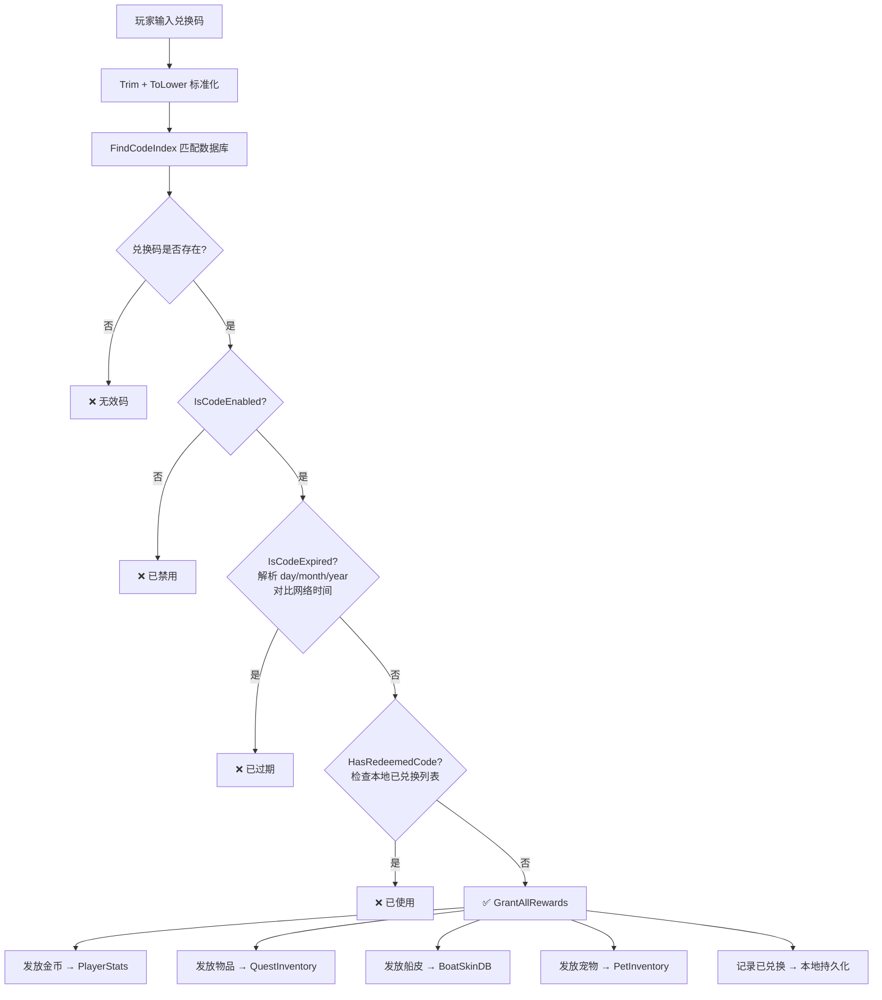

> **每个兑换码支持的奖励类型**：金币、至多 2 种任务物品（各带数量）、船只皮肤、宠物。过期时间格式为 `day/month/year`，空字符串表示永不过期。

### 12.3 地面遗物拾取点

**来源：** `GroundItem`（哈希 `31273`，8 个实例）

地图上分布有 **8 个固定遗物拾取点**，玩家可直接拾取：

| 名称                | 数量 | 遗物品质     | 说明                       |
| ------------------- | ---- | ------------ | -------------------------- |
| Broken Relic Piece  | 5 个 | 0（普通）    | 分布在地图各处             |
| Mossy Relic         | 2 个 | 2（稀有）    | 较隐蔽的位置               |
| **Powerful Relic**  | 1 个 | 3（史诗）    | **全图仅 1 个**，极难发现  |

> **Godly Relic 没有地面拾取点**（对应 Godly Relic 鱼已被禁用的设定）。目前获取遗物的途径：
> 1. **钓鱼**：遗物鱼（稀有度 8）— 基础 3% 概率池，古代碎片占 86%
> 2. **地面拾取**：上述 8 个固定点位
> 3. **悬赏系统**：每日最后悬赏奖励 3× 古代遗物碎片
> 4. **老虎机**：强力遗物 0.16% / 苔藓遗物 1.62% / 古代碎片 16.2%
> 5. **每日签到**：第 4 天奖励 2× 遗物

### 12.4 地图导航系统

**来源：** `MapUI`（哈希 `d6b32`）

| 目的地按钮         | 目的地名称       | 说明             |
| ------------------ | ---------------- | ---------------- |
| Crescent Isle      | 新月岛           | 主岛/出生点      |
| Coconut Bay        | 椰子湾           | —                |
| Luxian Dunes       | 卢西安沙丘       | —                |
| Volcanic Depths    | 火山深处         | —                |
| Tanglewood         | 缠木海岸         | 沼泽区           |
| **Alien Pyramid**  | **外星人金字塔** | 隐藏区域         |
| Open Sea           | 公海             | 海上航行         |

### 12.5 特殊水域钓鱼点

**来源：** `SpecialWaterZone`（哈希 `444b2`，5 个实例）

| 区域名                       | 水域类型 | 说明               |
| ---------------------------- | -------- | ------------------ |
| Coconut Bay Freshwater       | 淡水     | 椰子湾的淡水池     |
| Crescent Town Freshwater     | 淡水     | 新月镇的淡水区     |
| Luxian Dunes Freshwater      | 淡水     | 沙漠绿洲淡水       |
| Lights Hope Swampwater       | 沼泽水   | 教堂附近的沼泽     |
| Lava Zone Lavawater          | 岩浆     | 火山区域的岩浆     |

---

## 13. NPC 与任务系统

**来源：** 程序反编译（`NPCController` / `DialogueSystem` / `DialogueRequirements`）

### 13.1 NPC 角色列表（42+ 个 NPC）

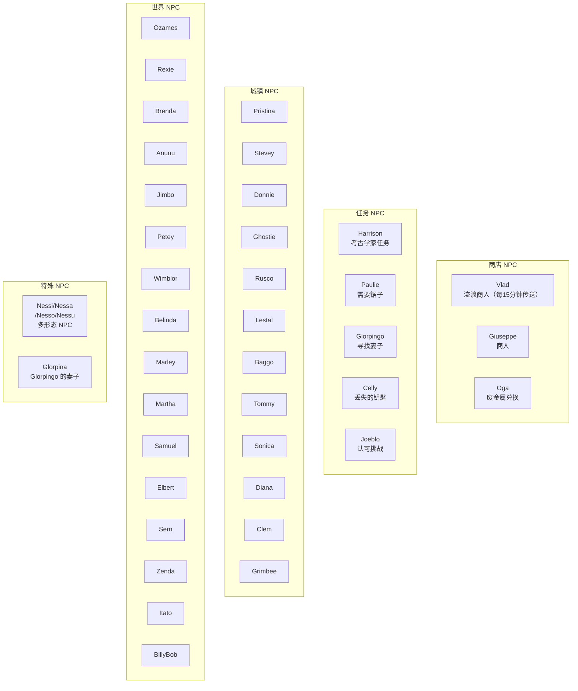

### 13.2 NPC 任务链详解

**来源：** `DialogueEventController`（哈希 `5ec35`，17 个 variablesjs 文件）

以下所有奖励均从 IL 代码 variablesjs 文件中精确提取确认。

#### 任务 1：外星人果汁 → 外星鱼竿

| 项目     | 详情                                                    |
| -------- | ------------------------------------------------------- |
| 事件 ID  | `quest_alien_rod`（variablesjs_3514）                   |
| 起始 NPC | 外星人金字塔区域的外星 NPC                               |
| 前置条件 | 拥有神秘外星果汁（itemId=7）                            |
| 物品获取 | **商店购买 $200,000**（购买后从商店消失，见 §4.5）       |
| 完成步骤 | 携带外星果汁 → 前往 Alien Pyramid → 与 NPC 对话交付     |
| **奖励** | **rewardRodIds=[10] → 外星鱼竿（Alien Rod）**           |

#### 任务 2：Sunleaf 商店 → 阳叶鱼竿

| 项目     | 详情                                                     |
| -------- | -------------------------------------------------------- |
| 事件 ID  | `quest_sunleaf_rod`（variablesjs_3906）                  |
| 起始 NPC | Sunleaf Exports 商店相关 NPC                             |
| 触发事件 | `DialogueEventSunleafShopOpen` — 首次开启 Sunleaf 商店  |
| **奖励** | **rewardRodIds=[6] → 阳叶鱼竿（Sunleaf Rod）**          |

#### 任务 3：Glorpingo 寻妻 → 荣誉 Glorpingus

| 项目     | 详情                                                                     |
| -------- | ------------------------------------------------------------------------ |
| 事件 ID  | `quest_glorpingo_picture`（variablesjs_4196）+ RewardEvent（variablesjs_1709） |
| 起始 NPC | Glorpingo                                                                |
| 任务目标 | 找到 Glorpingo 的妻子 Glorpina                                           |
| 完成步骤 | ① 与 Glorpingo 对话接取任务 → ② 在地图上找到 Glorpina → ③ 与 Glorpina 对话获得照片 → ④ 将照片交回 Glorpingo |
| 物品流转 | removeQuestItemIds=[1] → rewardQuestItemIds=[8]（交付后获得 Picture of Glorpina） |
| **奖励** | achievementIndicesToUnlock=[22] → **Honorary Glorpingus 称号 + 300 XP**  |

#### 任务 4：Paulie 修理 → Paulie 的浮漂

| 项目     | 详情                                                    |
| -------- | ------------------------------------------------------- |
| 事件 ID  | `quest_duck_bobber`（variablesjs_4301）                 |
| 起始 NPC | Paulie                                                  |
| 前置条件 | 拥有 Paulie 的锯子（itemId=6）                          |
| 物品获取 | 地图特定位置拾取（`d45fd` spawner）                      |
| 完成步骤 | 在地图找到锯子 → 交给 Paulie                             |
| **奖励** | **rewardBobberIds=[5] → Paulie's Bobber（浮漂 ID:5）**  |

#### 任务 5：Celly 寻钥匙 → 意面爱好者

| 项目     | 详情                                                          |
| -------- | ------------------------------------------------------------- |
| 事件文件 | variablesjs_3890                                              |
| 起始 NPC | Celly                                                         |
| 前置条件 | 拥有 Celly 的钥匙（itemId=10）                                |
| 物品获取 | 地图特定位置拾取（`d45fd` spawner）                            |
| 完成步骤 | 在地图找到钥匙 → 交给 Celly                                   |
| 物品流转 | removeQuestItemIds=[1]×10 → rewardQuestItemIds=[15]×13        |
| **奖励** | achievementIndicesToUnlock=[23] → **Pastrami Enjoyer 称号 + 300 XP** + 13× 速度药水 |

#### 任务 6：Joeblo 勇者试炼 → 盾之勇者

| 项目     | 详情                                                          |
| -------- | ------------------------------------------------------------- |
| 起始 NPC | Joeblo                                                        |
| 前置条件 | 拥有 Protective Blessing of the Ancients（itemId=11）         |
| 物品获取 | **古代神殿三石合成**（详见 §13.4）：收集三色宝石 → 神殿放置 → 获得祝福 |
| 宝石获取 | 💚绿宝石(17)=地面拾取 / ❤️红宝石(18)=月雨夜钓（一次性）/ 💙蓝宝石(19)=商店$50,000 |
| 完成步骤 | ① 收集三色宝石 → ② 前往 Shrine of the Ancients 合成祝福 → ③ 携带祝福前往 Joeblo（可能需通过 Shrine Kill Zone） → ④ 与 Joeblo 对话完成 |
| **奖励** | **Shield Hero（盾之勇者）称号 + 300 XP**                      |

> **重要提示**：Protective Blessing 的描述为"保护祝福，以防石头砸头"。神殿区域设有 **Shrine Kill Zone**（即死区域），暗示玩家需要此祝福才能安全通过前往 Joeblo 的区域。

#### 任务 7：Harrison 考古 → 考古学家

| 项目     | 详情                                                    |
| -------- | ------------------------------------------------------- |
| 起始 NPC | Harrison                                                |
| 任务目标 | 帮助 Harrison 完成考古调查                               |
| 完成步骤 | 与 Harrison 对话，完成其系列对话事件（`5ec35`）          |
| **奖励** | **Archaeologist（考古学家）称号**                        |

#### 任务 8：废金属兑换 → Oga 商人

| 项目     | 详情                                                    |
| -------- | ------------------------------------------------------- |
| NPC      | Oga                                                     |
| 机制     | 交付 Scrap Metal（itemId=13）兑换奖励                   |
| 废铁来源 | 地面拾取（46 个生成点）/ 兑换码 `1MVISITS` / 老虎机回本 |

#### 其他对话事件

| 事件名                           | 说明                                    |
| -------------------------------- | --------------------------------------- |
| `DialogueEventSunleafShopOpen`   | 打开 Sunleaf Exports 商店               |
| `DialogueEventCoconutBaySpawn`   | Coconut Bay 生成事件                    |
| `DialogueEventVlad`              | 触发 Vlad 相关事件                      |
| `ItatoTeleport`                  | Itato NPC 传送服务                      |
| `Purify Event`                   | 净化事件（可能在神殿或教堂）            |
| `WakeEvent`                      | 唤醒事件                                |
| `GiveRod`                        | 赠予钓竿事件                            |

### 13.3 对话系统机制

| 参数       | 值   | 说明                             |
| ---------- | ---- | -------------------------------- |
| 打字机速度 | 可调 | 文字逐字显示效果                 |
| 快速跳过   | ✓    | 可跳过当前文字动画               |
| 多选分支   | ✓    | 对话可有多个选项                 |
| NPC 追踪   | ✓    | NPC 头部追踪玩家                 |
| 日程系统   | ✓    | NPC 按日程行动（行走/跑步/坐下） |
| 忙碌状态   | ✓    | NPC 对话时停止移动并面向玩家     |

### 13.4 古代神殿系统（Shrine of the Ancients）

**来源：** `ShrineOfTheAncients`（哈希 `73c85`）+ `KillZone`（哈希 `77800`）

#### 三色宝石收集

| 宝石             | itemId | 获取方式                                     | 难度       |
| ---------------- | ------ | -------------------------------------------- | ---------- |
| 💚 神秘绿宝石   | 17     | 地图特定位置拾取（GemGreen spawner `d45fd`） | ★☆☆ 中等   |
| ❤️ 神秘红宝石   | 18     | 仅在月雨（Moonrain）夜晚钓取，**一次性获取** | ★★★ 极稀有 |
| 💙 神秘蓝宝石   | 19     | 商店购买 $50,000                             | ★☆☆ 花钱   |

#### 神殿机制参数

| 参数                   | 值                                            | 说明                 |
| ---------------------- | --------------------------------------------- | -------------------- |
| `gemItemIds`           | `[17, 18, 19]`                                | 需要的三颗宝石 ID   |
| `rewardItemId`         | 11                                            | 奖励：远古守护祝福   |
| `blendShapeIndices`    | `[0, 1, 2]`                                   | 三个宝石槽位形态键   |
| `blendShapeAnimDuration` | 0.2 秒                                      | 放置宝石动画时长     |
| `completionMessage`    | "The Ancients offer you a blessing..."         | 合成成功提示         |
| `noGemMessage`         | "You have nothing to offer the shrine."        | 无宝石时提示         |

#### 完整流程

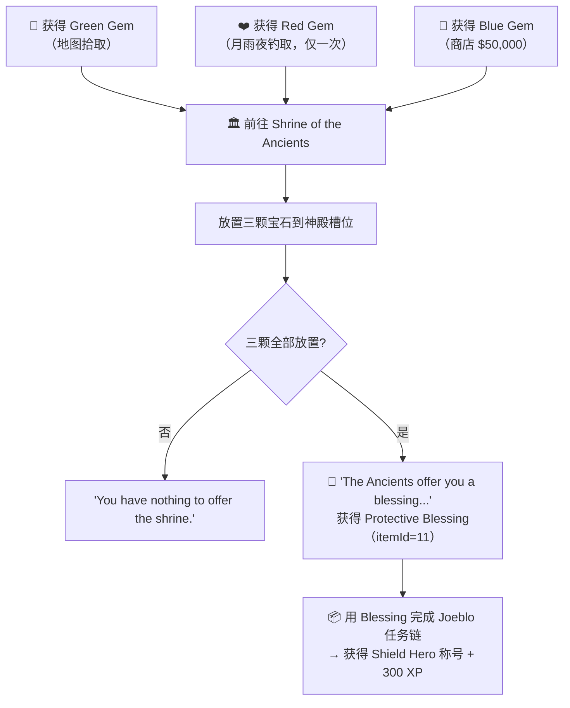

> **重要关联**：`Protective Blessing of the Ancients`（itemId=11）不是直接任务物品，而是通过神殿三石合成获得。玩家必须先收集三颗宝石、在神殿合成祝福后，才能进入 Joeblo 的勇者试炼任务线。  
> 神殿区域设有 **Shrine Kill Zone**（即死区域），可能需要该祝福才能安全通过——这与物品描述"保护祝福，以防石头砸头"相呼应。

### 13.5 Vlad 流浪商人系统

**来源：** `Vlad`（哈希 `f48b1`）+ `VladShopUIScript`（哈希 `75426`）+ `VladShopCanvas`（哈希 `6c29b`）

#### 核心机制

| 参数               | 值                 | 说明                          |
| ------------------ | ------------------ | ----------------------------- |
| `teleportInterval` | **900 秒（15 分钟）** | 每 15 分钟 Vlad 传送到新位置 |
| `teleportPoints`   | **8 个**           | 地图上 8 个可能的出现点       |
| NPC 引用           | → `NPCController`  | 具有标准 NPC 对话系统         |

#### Vlad 商店参数

| 参数                | 值                | 说明                           |
| ------------------- | ----------------- | ------------------------------ |
| `autoCloseDistance`  | 5 m               | 离开 5 米自动关闭商店          |
| `availableItems`    | **3 种**          | 同时出售 3 种物品              |
| 确认机制            | 双重确认          | "Are you sure?" → "Really sure?" |
| 已拥有显示          | "Owned"           | 已购买物品显示灰色             |
| 买不起显示          | "Can't Afford"    | 金币不足时的提示               |

#### 出售范围

Vlad 的商店引用了全部核心数据库：`rodDatabase`、`lineDatabase`、`bobberDatabase`、`boatDatabase`、`questItemDatabase`、`rodCustomizationManager`——意味着他可以出售**所有类型的装备和任务物品**，很可能出售特殊/限定物品如 Runesteel Rod 等。

```mermaid
flowchart LR
    Timer["⏱️ 15分钟计时器"] --> TP["随机选择8个传送点之一"]
    TP --> Vlad["🧙 Vlad 出现在新位置"]
    Vlad --> Player["玩家靠近交互"]
    Player --> Shop["🛒 打开 VladShop\n展示3种可购买物品"]
    Shop --> Confirm["第一次确认\n'Are you sure?'"]
    Confirm --> Confirm2["第二次确认\n'Really sure?'"]
    Confirm2 --> Buy["✅ 购买成功"]
    Player -->|"离开 5m"| Close["❌ 商店自动关闭"]
```

### 13.6 幽灵目击系统（SpookySighting）

**来源：** `SpookySighting`（哈希 `44fa2`）

这是一个**超稀有随机事件**——地图上会出现神秘的黑色幽灵身影。

#### 核心参数

| 参数              | 值                       | 说明                                |
| ----------------- | ------------------------ | ----------------------------------- |
| `checkInterval`   | **1200 秒（20 分钟）**   | 每 20 分钟检查一次是否触发          |
| `spawnChance`     | **0.01（1%）**           | 每次检查仅 1% 概率出现              |
| `lookThreshold`   | 0.95                     | 必须几乎正对才触发消失              |
| `despawnDistance`  | 45 m                     | 靠近 45 米内自动消失                |
| `spawnLocations`  | **13 个**                | 地图上 13 个可能的出现位置          |
| 音效              | spawn + despawn          | 出现和消失时各有专属音效            |

#### 概率分析

- 每次检查概率：1%
- 检查间隔：20 分钟
- **平均遇到一次所需时间**：1/0.01 × 20 分钟 = **2000 分钟 ≈ 33.3 小时**
- 这是游戏中最稀有的随机事件之一，属于彩蛋级别

> 对应了 NPC 提示数据库中的线索：*"There's been sightings of a mysterious black figure around the islands..."* 和 *"A ghost has been sighted recently, things are getting spooky..."*

### 13.7 HP 生命值系统

**来源：** `HealthSystem`（哈希 `16d22`）+ `KillZone`（哈希 `77800`）

游戏包含完整的生命值系统：

| 参数                   | 值         | 说明                    |
| ---------------------- | ---------- | ----------------------- |
| `maxHealth`            | **100**    | 最大生命值 100 点       |
| `healthRegenPerSecond` | **1**      | 每秒回复 1 点 HP        |
| `deathFadeDuration`    | 1 秒       | 死亡时屏幕渐黑时间      |
| `respawnDelay`         | **3 秒**   | 死亡后 3 秒重生         |
| 音效                   | damage + death | 受伤和死亡各有音效  |
| 重生点                 | → homePointManager | 在家传送点重生  |

#### 伤害来源

- **KillZone** — 普通即死区域（悬崖、深水等）
- **Shrine Kill Zone** — 神殿专属即死区域（可能需要 Protective Blessing 才能安全通过）

> 这解释了为什么 `Protective Blessing of the Ancients` 描述是"保护祝福，以防石头砸头"——玩家需要此祝福才能安全进入某些危险区域（如前往 Joeblo 的路径）。

### 13.8 旅馆传送系统（Inn / Home Point）

**来源：** `DialogueEventController`（哈希 `5ec35`）+ `HomePointManager`

游戏中有 **4 个旅馆**，分别位于 4 个主要区域。与旅馆 NPC 对话可设置复活/传送点。

| 事件文件          | 设置位置            | Home Point 索引 | NPC 类型               |
| ----------------- | ------------------- | --------------- | ---------------------- |
| variablesjs_3476  | Crescent Isle 新月岛 | 1               | CrescentInnDialogueEvent |
| variablesjs_3469  | Tanglewood 缠木     | 2               | SwampInnDialogueEvent    |
| variablesjs_3901  | Luxian Dunes 沙丘   | 3               | LuxianInnDialogueEvent   |
| variablesjs_4267  | Coconut Bay 椰子湾  | 0               | CoconutBayInnEvent       |

```mermaid
flowchart LR
    Inn["🏨 旅馆 NPC"] --> Dialog["对话选择\n'设为复活点'"]
    Dialog --> Set["设置 homePointIndex"]
    Set --> Msg["'Home point set to [区域名]!'"]
    Death["☠️ 死亡"] --> Respawn["在 homePointIndex\n对应位置重生"]
    HS["💎 回城石"] --> Respawn
```

### 13.9 回城石（HearthStone）

**来源：** `HearthStone`（哈希 `17d35`）

| 参数             | 值       | 说明                      |
| ---------------- | -------- | ------------------------- |
| 绑定事件         | dialogueEvent | 触发传送对话事件     |
| UI 面板          | ✓        | 有专属 UI 界面            |
| 传送动画         | 0.45 秒  | 传送回 Home Point 的动画  |

> 回城石可随时将玩家传送回当前设置的 Home Point（旅馆复活点）。

### 13.10 特殊装备获取

**来源：** `SpecialEquipmentReward`（哈希 `1eaf2`，3 个实例）

以下特殊装备通过特定程序获取，**不可在普通商店购买**：

| 装备               | 类型   | ID    | 推测获取方式                                     |
| ------------------ | ------ | ----- | ------------------------------------------------ |
| **符文钢竿**       | 鱼竿   | rodId=4    | 火山区域任务/NPC（"由 Crescent Volcano 最好的铁匠锻造"） |
| **冥犬皮毛**       | 鱼线   | lineId=5   | 击败地狱犬/特殊 Boss                             |
| **彩虹史莱姆浮漂** | 浮漂   | bobberId=13 | 击败/找到彩虹史莱姆                              |

> 这三件装备在 §4 中列出了完整属性。它们是游戏中最强力的非购买装备之一（符文钢竿幸运+90、冥犬皮毛力量/专长+50/50、彩虹浮漂幸运+30）。

### 13.11 NPC 提示数据库（35 条）

**来源：** `TipDatabase`（哈希 `34fcb`）

NPC 随机说出的对话提示，包含大量游戏线索：

| #  | 提示内容                                                                           | 隐含线索                     |
| -- | ---------------------------------------------------------------------------------- | ---------------------------- |
| 1  | "Did you know fishes actually have great memories?"                                | 纯趣味                       |
| 2  | "Did you know some fishes actually use rocks to open shellfish?"                   | 纯趣味                       |
| 3  | "Fishes have been around for over 450 million years!"                              | 纯趣味                       |
| 4  | **"There's been sightings of a mysterious black figure around the islands..."**    | → **SpookySighting 系统**    |
| 5  | "My friend told me they got scammed by a fat italian guy, be careful!"             | → **Giuseppe NPC**           |
| 6  | **"I hope the explorers that went into the portal in Crescent Isle are fine..."**  | → **新月岛传送门**           |
| 7  | **"The Luxian pyramid is said to hold many secrets..."**                           | → **Alien Pyramid 隐藏区域** |
| 8  | "My step-brother's dad's... caught Grombolitis, and DIED!"                         | 世界观                       |
| 9  | "Did you get your Cronkolitis vaccine?"                                            | 世界观                       |
| 10 | **"It never snows here... I wish we could have a snow island..."**                 | **暗示未来雪岛 DLC**        |
| 11 | "My friend is a 6 on the Norwood scale..."                                         | 纯幽默                       |
| 12 | **"Different fishes actually live in different locations!"**                        | → 区域系统                   |
| 13 | **"They say you might get more lucky if you fish during the moonrain!"**           | → **月雨钓鱼加成**           |
| 14 | "I wish I had a {positive} fishing pole..."                                        | 模板文本                     |
| 15 | "My favorite thing to say is : {oneliner}"                                         | 模板文本                     |
| 16 | "Apparently if you stare at the sun too long, you'll go blind!"                    | 纯趣味                       |
| 17 | **"Different vendors actually sell different goods!"**                              | → **各岛商店物品不同**       |
| 18 | "Raddit has actually been banned in all 4 countries."                               | 世界观：4 个国家              |
| 19 | "ALIENS ARE REAL!!"                                                                | → **外星人任务线**           |
| 20 | "THE EARTH IS FLAT!!"                                                              | 幽默                         |
| 21 | **"I heard you can use relics to infuse strange powers into equipment..."**         | → **遗物附魔系统**           |
| 22 | **"Did you know that Vlad mains Little Mac in Smash? That guy is straight EVIL!"** | → **Vlad NPC 性格线索**      |
| 23 | "If a little worm said hello to you, would you say hello back?"                    | 幽默                         |
| 24 | **"The Tanglewood Church has actually been asking for volunteers recently..."**     | → **教堂任务线索**           |
| 25 | **"A ghost has been sighted recently, things are getting spooky..."**               | → **SpookySighting**         |
| 26 | **"I heard someone got their head blown SMOOVE off in the tanglewood swamp!"**     | → **沼泽区危险区域**         |
| 27 | "Staying hydrated is good for you!"                                                | 纯趣味                       |
| 28 | **"They say a MEGALODON roams our waters!"**                                       | → **巨齿鲨稀有鱼**           |
| 29 | "They say the early worm catches the bird..."                                      | 幽默                         |
| 30 | "If you smash a fish's head in with a rock, they stop moving! Freaky."             | 暗黑幽默                     |
| 31 | "I really hope no one I know is on OnlyFish..."                                    | 幽默                         |
| 32 | **"Have you ever seen an Astrocetacean? Every night I stare at the sky hoping!"**  | → **太空鲸鱼彩蛋**           |
| 33 | **"There are super big space whales known as Astrocetaceans!"**                     | → **太空鲸鱼生物**           |
| 34 | **"Do you think there's life beyond Aqualon?"**                                    | 世界名称：**Aqualon**        |
| 35 | **"I wonder what's causing all these whirlpools!"**                                | → **海洋事件世界观**         |

> 加粗条目包含实际游戏线索，指向已确认的游戏系统（如 SpookySighting、Alien Pyramid、月雨机制、遗物附魔等）。世界名称确认为 **Aqualon**。

### 13.12 追溯任务检查器

**来源：** `RetroactiveQuestChecker`（哈希 `b27ff`）

| 参数                         | 值    | 说明                                         |
| ---------------------------- | ----- | -------------------------------------------- |
| `glorpingoAchievementIndex`  | 22    | 检查 Glorpingo 任务成就                      |
| `checkDelay`                 | 60 秒 | 每 60 秒检查一次                             |

> 此系统每 60 秒检查玩家是否已完成 Glorpingo 任务但未获得对应成就，用于修复老玩家的数据遗漏。

### 13.13 游泳与体力系统

**来源：** `SwimZone`（哈希 `72e01`）

```mermaid
flowchart TD
    A["进入水域"] --> B{速度 > 5?}
    B -->|是| C["快速入水特效\nfastEnterSound"]
    B -->|否| D["缓慢入水特效\nslowEnterSound"]
    C --> E["游泳状态"]
    D --> E
    E --> F["体力消耗\n15/秒"]
    F --> G{体力 > 0?}
    G -->|是| H["正常游泳\nswimSpeed=2"]
    G -->|否| I["体力耗尽\n溺水伤害 25 HP/秒"]
    H --> J["离开水域"]
    J --> K["体力恢复延迟 2s"]
    K --> L["体力恢复 15/秒"]
    I --> M{HP > 0?}
    M -->|否| N["死亡重生"]
```

#### 游泳参数

| 参数 | IL 变量名 | 值 | 说明 |
| --- | --- | --- | --- |
| 游泳速度 | `swimSpeed` | **2** | 基础移动速度 |
| 游泳加速度 | `swimAcceleration` | **5** | — |
| 水中阻力 | `swimDrag` | **6** | 高于加速度，确保不会无限加速 |
| 上浮速度 | `riseSpeed` | **2** | 向水面上浮 |
| 水面跳跃力 | `surfaceJumpForce` | **10** | 在水面可跳出水面 |
| 水面缓冲高度 | `surfaceBufferHeight` | **0.2** | — |
| 淡入速度 | `fadeSpeed` | **2** | 水下视觉效果过渡 |

#### 体力系统

| 参数 | IL 变量名 | 值 | 说明 |
| --- | --- | --- | --- |
| 最大体力 | `maxStamina` | **100** | — |
| 体力消耗速率 | `staminaDrainRate` | **15/秒** | 游泳时持续消耗 |
| 体力恢复速率 | `staminaRegenRate` | **15/秒** | 与消耗速率相同 |
| 恢复延迟 | `staminaRegenDelay` | **2 秒** | 离水后 2 秒开始恢复 |
| 溺水伤害 | `healthDamageRate` | **25 HP/秒** | 体力耗尽后的 HP 损失 |

> **体力时间窗**：满体力（100）÷ 消耗（15/秒）= 约 **6.67 秒**可持续游泳。体力耗尽后 4 秒内溺水致死（100 HP ÷ 25/秒）。

| 其他参数 | 值 | 说明 |
| --- | --- | --- |
| 安全区数量 | `swimSafeZones` = 6 个 | 不消耗体力的水域 |
| 额外游泳区 | `extraSwimZones` = 1 个 | 扩展游泳区域 |
| 溅水粒子寿命 | `splashParticleLifetime` = 3 秒 | — |
| 快速入水阈值 | `fastEntrySpeedThreshold` = 5 | 速度>5 触发大溅水 |

### 13.14 NPC 控制器详细参数

**来源：** `NPCController`（哈希 `7c242`）— 43 个实例

#### 通用参数

| 参数 | IL 变量名 | 默认值 |
| --- | --- | --- |
| 头部追踪速度 | `headTrackingSpeed` | **3** |
| 最大头部旋转角 | `maxHeadRotationAngle` | **60°** |
| 交互按键 | `interactionKey` | **101（E 键）** |
| 嘴巴变化间隔 | `mouthChangeInterval` | **0.15 秒** |
| 嘴巴闲置概率 | `mouthIdleChance` | **0.3**（30%） |

#### 部分 NPC 特殊参数

| NPC 名称 | 音调倍数 | 语音数 | 头部追踪 | 交互距离 |
| --- | --- | --- | --- | --- |
| **Itato** | 1.3× | 11 个 | ✓ | 2.5 |
| **Glorpingo** | 1.0× | 15 个 | ✗（禁用） | 2.5 |
| **Paulie** | 2.0×（高音） | 20 个 | ✓ | 2.5 |
| **Marley** | 1.0× | 11 个 | ✓ | 3.0 |

> 每个 NPC 实例包含 `characterName`、`useCustomPitch`、`characterPitchMultiplier`、`voiceSounds[]`、`enableHeadTracking` 等参数。Paulie 的 2.0× 音调使其语音明显高于其他角色。

### 13.15 NPC 对话数据系统

**来源：** `DialogueData`（哈希 `faedc`）— **93 个实例**（游戏内最大的单一数据源之一）

每个对话实例包含以下字段：

| 字段 | 类型 | 说明 |
| --- | --- | --- |
| `dialogueID` | Int32 | 对话唯一标识 |
| `isOneTimeDialogue` | Boolean | 是否一次性对话（完成后不再触发） |
| `oneLiner` | Boolean | 是否单行对话（无选项） |
| `nicknameForPlayer` | String | NPC 对玩家的称呼 |
| `positiveWord` / `negativeWord` | String | 肯定/否定回复的关键词 |
| `mainQuestion1` ~ `mainQuestion3` | String | NPC 的 3 个主要问题 |
| `answerOptions[]` | String[] | 玩家可选回答 |
| `response0Lines[]` ~ `response3Lines[]` | String[] | 各选项对应的 NPC 回复 |
| `tipAnswerIndices` | Int32[] | 触发提示的回答索引 |
| `eventAnswerIndices` | Int32[] | 触发事件的回答索引 |
| `consumeRequiredFish` | Boolean | 是否消耗指定鱼 |
| `requiredFishEntryIds` | Int32[] | 任务所需鱼种 ID |
| `consumeRequiredItems` | Boolean | 是否消耗指定物品 |
| `requiredItemIds` | Int32[] | 任务所需物品 ID |

> **93 个对话实例覆盖了所有 NPC 的完整对话树**，包括主线任务对话、支线对话、商店交互对话和闲聊。配合 `DialogueEventController`（哈希 `5ec35`，17 个实例）处理对话触发的事件和奖励发放。

### 13.16 NPC 实体网络同步

**来源：** `NPCEntity`（哈希 `d4f55`）— 42 个实例

| 参数 | 说明 |
| --- | --- |
| `sleepCheckInterval` | 休眠检测间隔 |
| `sleepDistance` | 超过此距离进入休眠 |
| `remoteRotationLerpSpeed` | 远程旋转插值速度 |
| `remotePositionLerpSpeed` | 远程位置插值速度 |
| `maxResyncRequestsBeforeClaim` | 重同步上限后抢占所有权 |
| `ownershipClaimDelay` | 所有权请求延迟 |

> NPC 实体使用距离检测优化：当玩家距离超过 `sleepDistance` 时 NPC 进入休眠状态减少网络开销。42 个 NPC 实例涵盖 BillyBob、Pristina 等所有角色。

### 13.17 教程系统

**来源：** `TutorialRoom`（哈希 `f624d`）+ `TutorialTips`（哈希 `bb589`）

#### 教程房间（新手引导）

| 参数 | IL 变量名 | 值 |
| --- | --- | --- |
| 强制启动 | `forceStartTutorial` | `true` |
| 自动推进延迟 | `autoAdvanceDelay` | **3 秒** |
| 黑屏时长 | `blackDuration` | **0.3 秒** |
| 淡入时长 | `fadeInDuration` | **0.5 秒** |
| 淡出时长 | `fadeOutDuration` | **0.5 秒** |

**教程 5 步骤：**

| 顺序 | 幻灯片名称 | 内容 |
| --- | --- | --- |
| 1 | `slideSummonRod` | 召唤鱼竿（按 T 键） |
| 2 | `slideCastLine` | 抛出鱼线 |
| 3 | `slideWaitBite` | 等待鱼咬钩 |
| 4 | `slideCatch` | 收线钓鱼 |
| 5 | `slidePocket` | 收入背包 |

#### 教程提示（持续提醒）

| 参数 | IL 变量名 | 值 | 说明 |
| --- | --- | --- | --- |
| 宠物弹窗自动消失 | `petPopupAutoDismissTime` | **120 秒** | 宠物解锁弹窗 2 分钟后自动消失 |
| 背包提醒间隔 | `backpackReminderInterval` | **900 秒**（15 分钟） | 定期提醒检查背包 |
| 背包首次延迟 | `backpackInitialDelay` | **300 秒**（5 分钟） | 进入世界 5 分钟后开始提醒 |
| 背包显示时长 | `backpackDisplayDuration` | **10 秒** | — |
| 提醒展示时长 | `reminderDisplayDuration` | **15 秒** | — |
| 最大提醒游戏时长 | `maxPlaytimeForReminders` | **3600 秒**（1 小时） | 游玩超 1 小时后停止提醒 |
| 钓竿附近距离 | `rodNearbyDistance` | **10** | 10 米内检测鱼竿 |
| 提醒间隔 | `reminderInterval` | **300 秒**（5 分钟） | 钓竿召唤提醒 |
| 图标切换间隔 | `iconCycleInterval` | **1 秒** | 图标动画切换 |
| 初始提醒延迟 | `initialReminderDelay` | **10 秒** | — |

> **新手保护设计**：游戏在前 1 小时内持续提醒新玩家使用背包和召唤钓竿。超过 1 小时游戏时长后，所有教程提醒自动关闭。

### 13.18 钓竿召唤/传送系统

**来源：** `RodTeleportSystem`（哈希 `8fac6`）

| 参数 | IL 变量名 | 值 | 说明 |
| --- | --- | --- | --- |
| 召唤按键 | `teleportKey` | **116（T 键）** | 长按 T 召唤钓竿 |
| 充能时长 | `fillDuration` | **1 秒** | 按住 1 秒完成充能 |
| 动画时长 | `animationDuration` | **0.5 秒** | 钓竿出现动画 |
| 传送距离 | `teleportDistance` | **1** | 钓竿出现在面前 1 米处 |
| 传送高度 | `teleportHeight` | **1.2** | 钓竿出现在 1.2 米高度 |
| 摇杆阈值 | `joystickThreshold` | **0.7** | VR 摇杆灵敏度 |
| VR 手部偏移 | `handCanvasOffset` | (0, 0.1, 0) | VR 充能进度条偏移 |

> **操作流程**：长按 T 键 → 充能进度条填满（1 秒）→ 钓竿传送到玩家面前（高度 1.2m，距离 1m）→ 出现动画（0.5 秒）。VR 模式下充能进度条显示在手部上方。

### 13.19 全服公告系统

**来源：** `AnnouncementManager`（哈希 `94b69`）

| 参数 | IL 变量名 | 值 |
| --- | --- | --- |
| 展示时长 | `displayDuration` | **5 秒** |
| 弹入动画 | `scaleInDuration` | **1 秒** |
| 弹出动画 | `scaleOutDuration` | **1 秒** |
| 抖动幅度 | `wobbleAmplitude` | **2.5** |
| 抖动速度 | `wobbleSpeed` | **4** |

#### 公告文本内容（IL 硬编码）

| 触发条件 | IL 变量名 | 公告文本 |
| --- | --- | --- |
| 月雨天气 | `weatherLuckText` | **"Moonrain is active! 2x Luck!"** |
| 世界 Buff 1 级 | `worldLuckTextTier1` | **"{PLAYER} Activated 2x Luck!"** |
| 世界 Buff 2 级 | `worldLuckTextTier2` | **"{PLAYER} Upgraded the lobby to 4x Luck!"** |
| 世界 Buff 3 级 | `worldLuckTextTier3` | **"{PLAYER} Maxed out the lobby to 8x Luck!"** |

> **`{PLAYER}` 占位符**会被替换为购买 World Buff 的玩家显示名。所有公告同时显示在桌面版和 VR 版的 TextMeshProUGUI 组件上。

---

## 14. 动态音乐系统

**来源：** `MusicSystem` + `MusicTrack`（24 首曲目）

| 曲目名           | 权重    | 冷却  | 音量 | 类型           |
| ---------------- | ------- | ----- | ---- | -------------- |
| **Church**       | **100** | 0 min | 0.7  | 区域专属       |
| **Glorpingo**    | **100** | 0 min | 0.5  | **入场曲**     |
| **Good Morning** | **100** | 5 min | 1.0  | **天气入场曲** |
| **New Dawn**     | **100** | 5 min | 1.0  | **天气入场曲** |
| **Lavatown**     | **100** | 2 min | 0.7  | 区域专属       |
| **Sleepy Town**  | **100** | 5 min | 0.5  | 高权重         |
| **Family**       | **50**  | 5 min | 0.7  | 高权重         |
| **Zen**          | **50**  | 5 min | 0.7  | 高权重         |
| Crescent Harbor  | 10      | 5 min | 0.5  | 入场曲         |
| Lookout Point    | 10      | 5 min | 0.7  | 入场曲         |
| Tun'Luxia        | 10      | 5 min | 0.7  | 入场曲         |
| Atlantis         | 10      | 5 min | 0.7  | 普通           |
| Backroads        | 10      | 5 min | 0.5  | 普通           |
| Crescent Town    | 10      | 5 min | 0.7  | 普通           |
| Dirty Swamp      | 10      | 5 min | 0.5  | 普通           |
| Fish Rancher     | 10      | 5 min | 0.5  | 普通           |
| Jermoids         | 10      | 5 min | 0.5  | 普通           |
| Monkey           | 10      | 5 min | 0.5  | 普通           |
| New Horizon      | 10      | 5 min | 0.7  | 普通           |
| Ocean Drift      | 10      | 5 min | 0.7  | 普通           |
| Panno            | 10      | 5 min | 0.5  | 普通           |
| Rocko Dongo      | 10      | 5 min | 0.5  | 普通           |
| Simpleton        | 10      | 5 min | 0.5  | 普通           |
| Spooky           | 10      | 5 min | 0.7  | 普通           |

> **天气入场曲**：Good Morning 和 New Dawn 在天气变化时以最高优先级(100)触发。**入场曲**在玩家进入区域时优先播放。

---

## 15. 技术系统

### 15.1 系统架构总览

```mermaid
flowchart TD
    FishDB["FishDatabase"] --> Select["SelectRarityTier()"]
    Select --> Fish["SelectFish()"]
    Fish --> Value["CalculateFishValue()"]

    Equip["EquipmentStatsManager\n鱼竿+鱼线+浮标+附魔"] --> |幸运倍数| Select
    Buff["BuffManager\n药水+世界+天气"] --> |增益倍数| Select

    Mod["FishModifierManager"] --> |体型 x 着色器| Value

    DNC["DayNightCycle\n20分钟周期"] --> |时段| FishDB
    Weather["BiomeWeatherManager\n3生态区"] --> |天气| FishDB
    Weather --> |月雨 15%| DNC

    Sea["SeaEventSpawner\n最多2事件/10min"] --> |特殊修饰| Mod

    Pet["AFKPet 系统"] --> |自动钓鱼| FishDB
    Pet --> PetStats["PetStats\n可升级4项"]

    Player["PlayerStatsManager"] --> |二分搜索等级| XP["经验/等级"]
    Player --> Money["货币系统"]

    Daily["DailyRewardDatabase\n7天轮换"] --> Player
```

### 15.2 数据持久化系统

**来源：** `PlayerStatsManager`（哈希 `2baf2`）+ `PlayerInventoryData`（哈希 `04a6d`）

#### 玩家统计存档键

使用 VRC PlayerData API 的整数键值存储：

| 存档键                   | 内容         | 类型 |
| ------------------------ | ------------ | ---- |
| `PS_PLAYER_XP`           | 累计总经验   | int  |
| `PS_PLAYER_MONEY`        | 货币余额     | int  |
| `PS_PLAYER_LEVEL`        | 当前等级     | int  |
| `PS_FISH_CAUGHT`         | 总捕鱼数     | int  |
| `PS_RARE_FISH_CAUGHT`    | 稀有鱼捕获数 | int  |
| `PS_FISH_SOLD`           | 总售鱼数     | int  |
| `PS_TUTORIALS_COMPLETED` | 教程进度     | int  |
| `PS_BOUNTIES_COMPLETED`  | 已完成悬赏数 | int  |
| `PS_TIME_PLAYED`         | 游戏时长(秒) | int  |

#### 库存数据存档

使用 JSON 序列化的 DataDictionary 存储：

| 存档键                | 内容            |
| --------------------- | --------------- |
| `INVENTORY_DATA`      | JSON 序列化字典 |
| `PID_EQUIPPED_ROD`    | 装备中的鱼竿 ID |
| `PID_EQUIPPED_LINE`   | 装备中的鱼线 ID |
| `PID_EQUIPPED_BOBBER` | 装备中的浮漂 ID |

**字典内部结构键：**
`unlockedRods`、`unlockedLines`、`unlockedBobbers`、`unlockedHandles`、`unlockedBoats`、`fishSlots`、`afkPets`、`questItems`、`nfid`（下一个鱼 ID 计数器）、`rodEnchants`、`lineEnchants`、`bobberEnchants`

#### 数据恢复流程

```mermaid
flowchart TD
    A["_onPlayerRestored()"] --> B["状态检查"]
    B --> C["_AttemptRestore()"]
    C --> D{读取成功?}
    D -->|否| E["重试（最多 5 次）\n每次间隔 1 秒"]
    E --> C
    D -->|是| F["ReloadFromPersistence()\n读取 JSON → DataDictionary"]
    F --> G["_ApplyRestoredEquipment()\n装备鱼竿/鱼线/浮漂"]
    G --> H["通知 InventoryManager\nQuestInventoryManager\nBoatShopUI"]
```

> **安全机制**：序列化失败时保留最后已知的正确数据并记录错误。`INVENTORY_WIPE_PENDING` 标志可触发强制重置。

#### 鱼类存储编码

每条鱼存储为 DataList 格式（**最少 6 个字段**）：

```text
[isLocked, caughtFishId, fishEntryId, weight, sizeModifierRaw, shaderModifierRaw]
```

| 索引 | 字段 | 类型 | 说明 |
| --- | --- | --- | --- |
| [0] | isLocked | Double→Int32 | 1=已锁定, 其他=未锁定 |
| [1] | caughtFishId | Double→Int32→String | 每条鱼的唯一捕获标识 |
| [2] | fishEntryId | Double→Int32 | 鱼种 ID（查询 fishDatabase） |
| [3] | weight | Double→Single | 鱼重量 (kg) |
| [4] | sizeModifierRaw | Double→Int32 | 体型修饰 (0=Normal, 1=Huge, 2=Tiny) |
| [5] | shaderModifierRaw | Double→Int32 | 着色器修饰 (0-23，详见 §11.3) |

> **来源确认**：此结构从 `ShopManager`（哈希 `762cb`）的 `UNDEF_762cb_9676()` 函数（行 1597-1711）中按字段读取顺序精确提取。字段计数判定：`slot.Count < 6` 则跳过该条目。

### 15.3 排行榜系统

**来源：** `LeaderboardManager`（哈希 `9234a`）

| 参数       | 值           | 说明              |
| ---------- | ------------ | ----------------- |
| 排序方式   | 等级降序     | 等级高者靠前      |
| 平分处理   | 按名字字母序 | 相同等级按名      |
| 前三名显示 | 金/银/铜色   | 特殊颜色标记      |
| 显示位数   | 8 名         | 前3 + 4~8名       |
| 刷新方式   | 定期轮询     | `refreshInterval` |
| 数据同步   | VRC 网络     | 同步数组          |

**同步数据结构：**

```text
syncedPlayerIds[]      — 玩家标识
syncedPlayerLevels[]   — 玩家等级
cachedDisplayNames[]   — 缓存显示名
sortedIndices[]        — 排序后索引（冒泡排序）
```

> 排行榜使用**冒泡排序**算法对 `sortedIndices` 排序，按等级降序排列。支持玩家加入/离开时动态更新。

### 15.4 Discord 角色权限系统

**来源：** `DiscordRoleManager`（加密数据解密后）

#### 角色标记系统

**来源：** `DiscordRewardGranter`（哈希 `f6f51`）

解密后的 JSON 数据格式：`"VRChat用户名": "角色标记"`

| 标记    | 含义                  | 游戏内精确奖励（IL确认）                   |
| ------- | --------------------- | ------------------------------------------ |
| `n`     | **Nitro Booster**     | achievementId=**20** + petId=**3**（Fishing Frog Nitro）、Nitro 称号 |
| `p`     | **Patreon 支持者**    | achievementId=**19** + petId=**4**（Lucky Cat）、Patreon 称号 |
| `s`     | **Staff（工作人员）** | staffAchievementName=**"GM"**、特殊权限     |
| `p,n`   | Patreon + Nitro       | 双重奖励（同时获得上述两套）                |
| `p,s,n` | 全部角色              | 最高权限（三套全部）                        |
| （空）  | 普通 Discord 成员     | 基础 Discord 奖励                           |

> **IL 来源确认**：`DiscordRewardGranter`（`f6f51`）中硬编码了标记→奖励映射。`"n"` 对应 Nitro Booster 奖励路径，`"p"` 对应 Patreon 支持者奖励路径，`"s"` 触发 `staffAchievementName="GM"` 的特殊成就。

#### 奖励发放流程

```mermaid
flowchart TD
    A["DiscordRewardGranter\n哈希 f6f51"] --> B["解密角色 JSON"]
    B --> C{匹配标记}
    C -->|"n"| D["achievementId=20\npetId=3\nFishing Frog Nitro"]
    C -->|"p"| E["achievementId=19\npetId=4\nLucky Cat"]
    C -->|"s"| F["staffAchievementName='GM'\n特殊Staff权限"]
    C -->|多标记| G["逐个处理\n叠加所有对应奖励"]
    D --> H["AchievementManager\n解锁对应成就/称号"]
    E --> H
    F --> H
    G --> H
```

#### 加密传输流程

```mermaid
sequenceDiagram
    participant Server as 远程服务器
    participant VRC as VRChat 客户端
    participant GPU as GPU Shader

    Server->>VRC: Base64(IV + AES-256-CBC(JSON))
    VRC->>VRC: Base64 解码
    VRC->>VRC: 分离 IV (16B) + 密文
    VRC->>VRC: 密钥扩展 (CPU)
    VRC->>GPU: 密文块 → Texture2D
    GPU->>GPU: AES ECB 解密 (Shader)
    GPU->>VRC: AsyncGPUReadback
    VRC->>VRC: CBC XOR 链还原 (分帧)
    VRC->>VRC: PKCS7 去填充 → JSON
    VRC->>VRC: 解析角色权限 → 发放奖励
```

### 15.5 Supporter 粒子拖尾系统

**来源：** `SupporterTrailManager`（哈希 `ca1f9`）— 21,310 行

| 参数 | 值 | 说明 |
| --- | --- | --- |
| 触发条件 | Patreon/Supporter 标记 | 通过 Discord 角色验证 |
| 效果类型 | 粒子拖尾特效 | 跟随玩家角色显示 |
| 渲染方式 | ParticleSystem | VRChat 兼容粒子系统 |
| 网络同步 | 全服可见 | 其他玩家可看到拖尾效果 |

> **功能说明**：当玩家被验证为 Patreon 支持者后，`SupporterTrailManager` 会在该玩家角色身后生成持续的粒子拖尾特效。该效果通过 VRC 网络同步，对服务器内所有玩家可见，作为支持者的视觉标识。

### 15.6 VRC Economy 商品奖励系统

**来源：** `UdonProductRewardManager`（哈希 `6069f`）— 8,780 行

| 参数 | 值 | 说明 |
| --- | --- | --- |
| 商品数量 | 1 | 单个 VRC Economy 商品 |
| oneTimePurchase | `true` | 仅可购买一次（不可重复购买） |
| rewardQuantities | `[5]` | 购买后获得 5 个奖励物品 |
| 触发方式 | VRC Economy API | 通过 VRChat 内置经济系统购买 |

> **机制说明**：`UdonProductRewardManager` 管理 VRChat 内置经济系统（VRC Economy）的付费商品。该商品标记为 `oneTimePurchase=true`，确保每位玩家只能购买一次。购买成功后立即发放 `rewardQuantities=[5]` 所定义的奖励数量。此系统与 §6.2 世界幸运 Buff 的 VRC Economy 购买共用底层 API。

### 15.7 VR 手腕 HUD

**来源：** `WristHUD`（哈希 `c6402`）— **仅限 VR 模式**

| 参数 | IL 变量名 | 值 | 说明 |
| --- | --- | --- | --- |
| 桌面模式 | `enableForDesktop` | `false` | **VR 专属功能** |
| 默认手 | `toggleRightHand` | `false` | 默认左手显示 |
| HUD 缩放 | `hudScale` | **0.01** | — |
| 手上方高度 | `heightAboveHand` | **0.15** | 15cm 偏移 |
| 位置平滑速度 | `positionSmoothSpeed` | **15** | — |
| 缩放动画速度 | `scaleAnimationSpeed` | **8** | — |
| 手掌朝头阈值 | `palmTowardHeadThreshold` | **0.5** | 手掌正对头部时显示 |
| 手掌朝上阈值 | `palmUpThreshold` | **0.3** | 手掌向上时显示 |
| 区域刷新间隔 | `zoneUpdateInterval` | **60 秒** | — |
| 时间天气刷新 | `timeWeatherUpdateInterval` | **30 秒** | — |

**显示内容：**

| 显示项 | UI 组件 |
| --- | --- |
| 💰 金币 | `moneyText` |
| ⭐ 等级 | `levelText` |
| 🕐 时间 | `timeOfDayText` |
| 🌤️ 天气 | `weatherText` |
| 📍 区域 | `zoneNameText` |
| 📊 经验条 | `xpBarFill` |

> **触发方式**：VR 玩家翻转手掌面向头部即可查看 HUD。桌面版玩家无法使用此功能，但可通过手机 UI（`PhoneUIManager`，哈希 `21d8c`）获取类似信息。

### 15.8 版本检查系统

**来源：** `VersionChecker`（哈希 `8bdb0`）

| 参数 | IL 变量名 | 值 |
| --- | --- | --- |
| 当前版本 | `currentVersion` | **"1.0.4"** |
| 可信 URL | `trustedVersionUrl` | `https://gamerexde.github.io/trickforge-public/version.txt` |
| 非可信 URL | `untrustedVersionUrl` | `https://api.trickforgestudios.com/api/v1/version/fish` |
| 检查间隔 | `checkInterval` | **200 秒** |
| 初始重试延迟 | `initialRetryDelay` | **10 秒** |
| 最大重试延迟 | `maxRetryDelay` | **120 秒** |
| 最大重试次数 | `maxRetries` | **5** |
| 大厅版本前缀 | `lobbyVersionPrefix` | `"Instance Version Number: "` |

> **双源验证**：系统同时从 GitHub Pages（可信源）和 TrickForge API（非可信源）获取最新版本号。若当前版本落后，桌面/VR 分别显示弹窗提醒更新。开发商：**TrickForge Studios**。

### 15.9 音频设置管理

**来源：** `AudioSettingsManager`（哈希 `d2ecf`）

| 参数 | IL 变量名 | 默认值 | 说明 |
| --- | --- | --- | --- |
| 持久化 | `enablePersistence` | `true` | 保存到玩家存档 |
| 音效音量 | `sfxVolume` | **0.76** | 76% |
| 环境音量 | `ambientVolume` | **1.0** | 100% |
| 音乐音量 | `musicVolume` | **0.5** | 50% |

**额外音源基础音量：**

| 类别 | 音源数 | 基础音量数组 |
| --- | --- | --- |
| 音效 (SFX) | 10 | `[1,1,1,1,1,1,1,0.3,0.3,0.3]` |
| 环境 (Ambient) | 9 | `[1,1,0.82,1,0.5,1,0.5,1,1]` |
| 音乐 (Music) | 4 | `[1,0.5,0.5,0.5]` |

> 后 3 个音效源基础音量仅 0.3（较安静），可能是 UI 提示音等次要音效。环境音源 #5 和 #7 基础音量 0.5，用于远处环境声。

### 15.10 室内音频区域

**来源：** `SyncZone`（哈希 `d95a3`）— 8 个实例

| 参数 | 说明 |
| --- | --- |
| `silenceDynamicMusic` | 是否静音动态音乐系统 |
| `indoorLowPassCutoff` | 室内低通滤波截止频率 |
| `isIndoorZone` | 是否为室内区域 |

> 当玩家进入室内区域时，`SyncZone` 应用 `indoorLowPassCutoff` 低通滤波（默认 3344 Hz），模拟室内声音效果——外部声音被墙壁隔绝后变得低沉。部分区域同时设置 `silenceDynamicMusic=true` 完全关闭背景音乐。8 个实例覆盖所有室内建筑。

### 15.11 出生房间管理

**来源：** `SpawnRoomManager`（哈希 `14c0b`）

负责玩家登录后的初始出生位置管理，与教程系统（§13.17）和旅馆系统（§13.8）联动。新玩家进入教程房间，老玩家传送到上次设定的出生点。

---

## 16. 理论最优装备组合

### 16.1 最大幸运组合

| 部位     | 装备                        | 幸运值   |
| -------- | --------------------------- | -------- |
| 鱼竿     | 法老之竿 Rod of the Pharaoh | +222     |
| 鱼线     | 幸运鱼线 Lucky Line         | +30      |
| 浮漂     | 幸运浮漂 Lucky Bobber       | +40      |
| 附魔     | 神之幸运 God's Own Luck     | +250     |
| 区域图鉴 | 全部 5 区域完成             | +75      |
| 宠物幸运 | 满级 150                    | +150     |
| **总计** |                             | **+767** |

**加上增益后的理论最大幸运倍率**：

```text
基础幸运倍率 = (767/100) + 1.0 = 8.67×
× 幸运药水(2.0) + 世界幸运T3(8.0) + 天气幸运(2.0) = +12.0
总幸运倍率 = 8.67 × 12.0 = 极限线性幸运加成
```

### 16.2 最大吸引速度组合

| 部位     | 装备                              | 吸引值   |
| -------- | --------------------------------- | -------- |
| 鱼竿     | 极速鱼竿 Speedy Rod               | +60      |
| 鱼线     | 堕神之发 Hair of a Fell God       | +50      |
| 浮漂     | 装饰浮漂 Ornamental Bobber        | +10      |
| 附魔     | 天国信使 Messenger of the Heavens | +100     |
| **总计** |                                   | **+220** |

### 16.3 最大出售价值组合

| 效果来源                        | 加成                            |
| ------------------------------- | ------------------------------- |
| 巨大体型修饰                    | ×1.5                            |
| 全息/静电着色器                 | ×5.0                            |
| 时间/天气偏好                   | ×2.0                            |
| 赚钱机器附魔 (Money Maker)      | +20%                            |
| 口袋观察者附魔 (Pocket Watcher) | +5%                             |
| 双钩附魔 (Double Up!!)          | 25% 概率翻倍                    |
| **理论最大单鱼价值**            | **基础价 × 15 × 1.25 = 18.75×** |

对于最贵的猫鱼皇帝：$49,500 × 15 × 1.25 = **$928,125**（不含双钩翻倍）

### 16.4 最大力量/专长组合（钓鱼小游戏最简单化）

| 部位     | 装备                      | 力量    | 专长    |
| -------- | ------------------------- | ------- | ------- |
| 鱼竿     | 永恒之竿                  | 30      | 30      |
| 鱼线     | 堕神之发                  | 50      | 50      |
| 浮漂     | 彩虹史莱姆浮漂            | 10      | 0       |
| 附魔     | 最强钓手 Strongest Angler | 85      | 85      |
| **总计** |                           | **175** | **165** |

---

## 17. 隐藏内容与未实装数据

### 17.1 未实装天气类型

| 天气类型 ID | 名称                 | 状态                                                    |
| ----------- | -------------------- | ------------------------------------------------------- |
| 0           | Clear（晴天）        | ✅ 已实装                                               |
| 1           | Rainy（雨天）        | ✅ 已实装                                               |
| 2           | Stormy（暴风）       | ✅ 已实装（鱼数据有 prefersStormy）                     |
| 3           | Foggy（雾天）        | ✅ 已实装                                               |
| 4           | Moonrain（月雨）     | ✅ 已实装（夜间 15% 概率）                              |
| 5           | **Starfog（星雾）**  | ❌ **未实装** — 鱼数据有 prefersStarfog 字段但无鱼使用  |
| 6           | **Skybloom（天花）** | ❌ **未实装** — 鱼数据有 prefersSkybloom 字段但无鱼使用 |

> 两种天气类型（星雾和天花）的字段已存在于鱼类数据结构中，但目前没有任何鱼设置了这些偏好，天气配置中也没有对应条目。这些很可能是为**未来更新预留**的内容。

### 17.2 已禁用/隐藏内容

| 内容                       | 状态       | 说明                                                 |
| -------------------------- | ---------- | ---------------------------------------------------- |
| Godly Relic（神圣遗物鱼）  | **已禁用** | ID:93，稀有度 8，但 enabled=false                    |
| DEBUG 鱼竿                 | 隐藏       | ID:5，所有属性为 0，最大重量仅 1 kg                  |
| DEBUG 浮漂                 | 隐藏       | ID:7，所有属性 50（开发测试用）                      |
| Prism 系列船皮             | **已禁用** | 冲浪板/划艇/快艇各有一款 Prism 皮肤被标记为 disabled |
| Beta Tester 独木舟皮肤     | **已禁用** | 仅 Beta 测试者可用                                   |
| 永恒之竿 Rod of Perpetuity | 等级锁     | 需要**等级 500** 且 `isUnlockedFromLevel=true`       |

### 17.3 隐藏称号

以下称号标记为 `isHidden: true`，不会出现在成就列表中直到满足条件：

| 称号              | 获取条件             |
| ----------------- | -------------------- |
| Beta Tester       | BETA_PLAYER 标记为 1 |
| Early Supporter   | 早期支持标记         |
| Supporter         | 支持标记             |
| Nitro Booster     | Discord Nitro        |
| Nitro Addict      | Discord Nitro        |
| Patreon Baller    | Patreon 支持         |
| Patreon Supporter | Patreon 支持         |

### 17.4 数据中的有趣发现

1. **猫鱼皇帝的名字** — "Catfish Emperor" 是一个双关语（Catfish = 鲶鱼，也指网络钓鱼/欺骗）
2. **"Decimated Fih"** — 极可能是 "Decimated Fish" 的**故意拼写错误**，作为彩蛋
3. **"Steve"** — 作为稀有度 9 的秘密鱼，名字极其普通，疑似是对某人的致敬
4. **法老之竿**的吸引率为 **−10** — 这是唯一一根**降低**吸引速度的高端鱼竿，设计为高幸运但慢速的权衡
5. **幼年巨齿鲨**最大重量 **120,000 kg** — 是游戏中最重的鱼之一，远超现实中的巨齿鲨
6. **永恒之竿**和**法老之竿**都要求**等级 500** 解锁，但并非通过等级自动解锁——法老之竿需要在商店以 750,000 金币购买
7. **月雨**是唯一有鱼偏好的特殊天气——**神秘红宝石**仅在月雨时可钓获且只能钓一次
